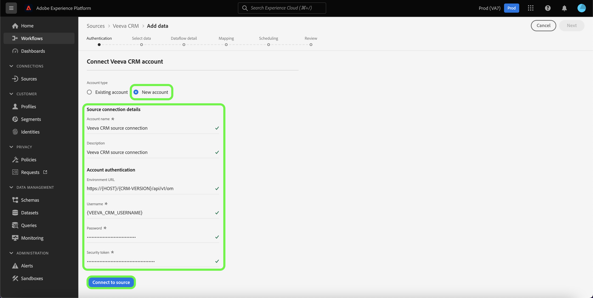

# Erstellen Sie eine [!DNL Veeva CRM] Quellverbindung in der Benutzeroberfläche

Quellschnittstellen in Adobe Experience Platform bieten die Möglichkeit, extern beschaffte CRM-Daten planmäßig zu erfassen. In diesem Tutorial werden Schritte zum Erstellen eines [!DNL Veeva CRM] Quellanschluss mit [!DNL Platform] Benutzeroberfläche.

## Erste Schritte

Dieses Tutorial setzt ein Grundverständnis der folgenden Komponenten von Adobe Experience Platform voraus:

* [[!DNL Experience Data Model (XDM)] System](../../../../../xdm/home.md): Der standardisierte Rahmen, nach dem [!DNL Experience Platform] organisiert Kundenerlebnisdaten.
   * [Grundlagen der Schemakomposition](../../../../../xdm/schema/composition.md): Machen Sie sich mit den Grundbausteinen von XDM-Schemas sowie den zentralen Konzepten und Best Practices rund um die Erstellung von Schemas vertraut.
   * [Schema-Editor-Tutorial](../../../../../xdm/tutorials/create-schema-ui.md): Erfahren Sie, wie Sie mit der Benutzeroberfläche des Schema-Editors benutzerdefinierte Schema erstellen.
* [[!DNL Real-time Customer Profile]](../../../../../profile/home.md): Bietet ein einheitliches Echtzeit-Kundenprofil, das auf aggregierten Daten aus verschiedenen Quellen basiert.

Wenn Sie bereits über eine gültige [!DNL Veeva CRM] , können Sie den Rest dieses Dokuments überspringen und mit dem Tutorial fortfahren auf [Konfigurieren eines Datenflusses](../../dataflow/crm.md).

### Erforderliche Anmeldedaten sammeln

| Anmeldedaten | Beschreibung |
| ---------- | ----------- |
| `environmentUrl` | Die URL der [!DNL Veeva CRM] Quellinstanz. |
| `username` | Der Benutzername für [!DNL Veeva CRM] Benutzerkonto. |
| `password` | Das Kennwort für die [!DNL Veeva CRM] Benutzerkonto. |
| `securityToken` | Das Sicherheits-Token für [!DNL Veeva CRM] Benutzerkonto. |

Weitere Informationen zu den ersten Schritten finden Sie in dieser [[!DNL Veeva CRM] Dokument](https://developer.veevacrm.com/api/#order-management-rest-api).

## Verbinden Sie [!DNL Veeva CRM] Konto

Nachdem Sie die erforderlichen Anmeldedaten erhalten haben, können Sie die folgenden Schritte ausführen, um Ihre [!DNL Veeva CRM] Konto für [!DNL Platform].

Wählen Sie in der Plattform-Benutzeroberfläche **[!UICONTROL Quellen]** von der linken Navigationsleiste aus, um auf [!UICONTROL Quellen] Arbeitsbereich. Die [!UICONTROL Katalog] zeigt eine Reihe von Quellen an, mit denen Sie ein Konto erstellen können.

Sie können die entsprechende Kategorie aus dem Katalog auf der linken Seite des Bildschirms auswählen. Alternativ können Sie die spezifische Quelle finden, mit der Sie arbeiten möchten, indem Sie die Suchoption verwenden.

Im Rahmen der [!UICONTROL CRM] Kategorie, auswählen **[!UICONTROL Veeva CRM]**, und wählen Sie dann **[!UICONTROL Daten Hinzufügen]**.

Die **[!UICONTROL Connect Veeva CRM-Konto]** angezeigt. Auf dieser Seite können Sie entweder neue oder vorhandene Anmeldedaten verwenden.

### Vorhandenes Konto

Um ein vorhandenes Konto zu verwenden, wählen Sie [!DNL Veeva CRM] Konto, mit dem Sie einen neuen Datenpfad erstellen möchten, wählen Sie **[!UICONTROL Weiter]** um fortzufahren.

### Neues Konto

Wenn Sie ein neues Konto erstellen, wählen Sie **[!UICONTROL Neues Konto]** und geben Sie einen Namen, eine optionale Beschreibung und Ihre [!DNL Veeva CRM] Anmeldedaten. Wählen Sie nach Beendigung **[!UICONTROL Mit Quelle verbinden]** und dann etwas Zeit für die Einrichtung der neuen Verbindung.

## Nächste Schritte

Durch Befolgen dieses Tutorials haben Sie eine Verbindung zu Ihrem [!DNL Veeva CRM] Konto. Sie können nun mit dem nächsten Tutorial fortfahren und [einen Datenpfad konfigurieren, um Daten in die Plattform zu bringen](../../dataflow/crm.md).
