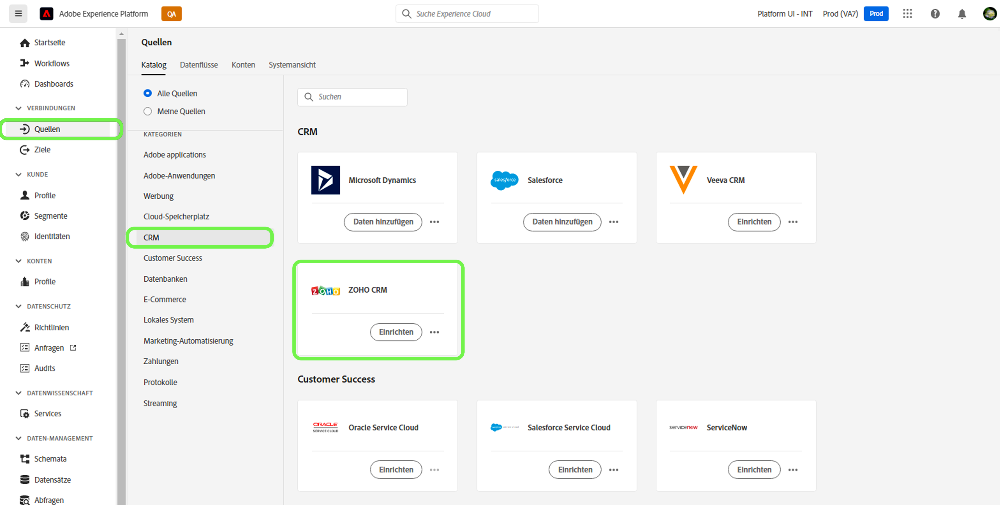
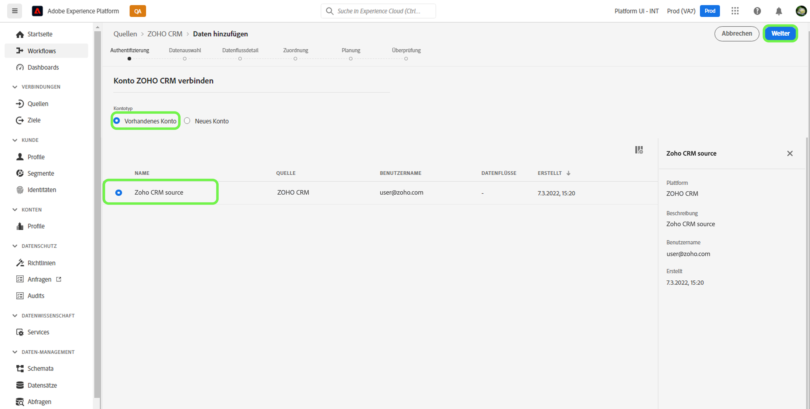
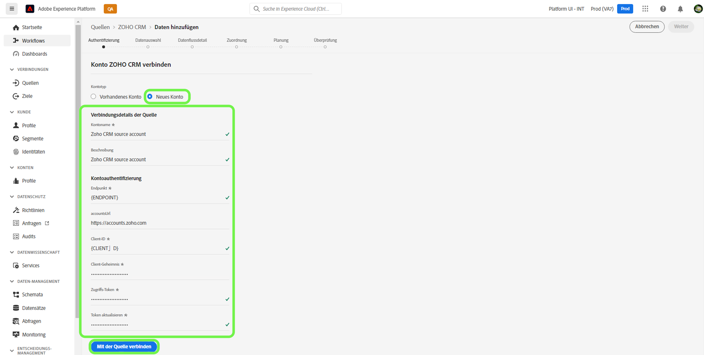

# Erstellen eines Quell-Connectors für [!DNL Zoho CRM] in der Benutzeroberfläche

Quell-Connectoren in Adobe Experience Platform bieten die Möglichkeit, CRM-Daten aus externen Quellen nach einem bestimmten Zeitplan aufzunehmen. In diesem Tutorial finden Sie die Schritte zum Erstellen eines [!DNL Zoho CRM]-Quell-Connectors mithilfe der [!DNL Platform]-Benutzeroberfläche.

## Erste Schritte

Dieses Tutorial setzt ein Grundverständnis der folgenden Komponenten von Adobe Experience Platform voraus:

* [[!DNL Experience Data Model (XDM)] System](../../../../../xdm/home.md): Das standardisierte Framework, mit dem [!DNL Experience Platform] Kundenerlebnisdaten organisiert.
   * [Grundlagen der Schemakomposition](../../../../../xdm/schema/composition.md): Machen Sie sich mit den grundlegenden Bausteinen von XDM-Schemas vertraut, einschließlich der wichtigsten Prinzipien und Best Practices bei der Schemaerstellung.
   * [Tutorial zum Schema-Editor](../../../../../xdm/tutorials/create-schema-ui.md): Erfahren Sie, wie Sie benutzerdefinierte Schemas mithilfe der Benutzeroberfläche des Schema-Editors erstellen können.
* [[!DNL Real-Time Customer Profile]](../../../../../profile/home.md): Bietet ein einheitliches Echtzeit-Kundenprofil, das auf aggregierten Daten aus verschiedenen Quellen basiert.

Wenn Sie bereits über ein gültiges [!DNL Zoho CRM]-Konto verfügen, können Sie den Rest dieses Dokuments überspringen und mit dem Tutorial zum [Konfigurieren eines Datenflusses](../../dataflow/crm.md) fortfahren.

### Sammeln erforderlicher Anmeldeinformationen

Um eine Verbindung zwischen [!DNL Zoho CRM] und Platform herzustellen, müssen Sie Werte für die folgenden Verbindungseigenschaften angeben:

| Anmeldedaten | Beschreibung |
| --- | --- |
| Endpunkt | Der Endpunkt des [!DNL Zoho CRM]-Servers, an den Sie Ihre Anforderung senden. |
| Konto-URL | Die Konto-URL wird verwendet, um Ihre Zugriffs- und Aktualisierungs-Token zu generieren. Die URL muss Domain-spezifisch sein. |
| Client-ID | Die Client-ID, die Ihrem [!DNL Zoho CRM]-Benutzerkonto entspricht. |
| Client-Geheimnis | Das Client-Geheimnis, das Ihrem [!DNL Zoho CRM]-Benutzerkonto entspricht. |
| Zugriffs-Token | Das Zugriffs-Token autorisiert Ihren sicheren und temporären Zugriff auf Ihr [!DNL Zoho CRM]-Konto. |
| Aktualisierungs-Token | Ein Aktualisierungs-Token ist ein Token, mit dem ein neues Zugriffs-Token generiert wird, sobald Ihr Zugriffs-Token abgelaufen ist. |

Weitere Informationen zu diesen Anmeldedaten finden Sie in der Dokumentation unter [[!DNL Zoho CRM] Authentifizierung](https://www.zoho.com/crm/developer/docs/api/v2/oauth-overview.html).

## Verbinden Ihres [!DNL Zoho CRM]-Kontos

Nachdem Sie die erforderlichen Anmeldedaten erfasst haben, können Sie die folgenden Schritte ausführen, um Ihr [!DNL Zoho CRM]-Konto mit [!DNL Platform] zu verknüpfen.

Wählen Sie in der Platform-Benutzeroberfläche die Option **[!UICONTROL Quellen]** in der linken Navigationsleiste, um auf den Arbeitsbereich [!UICONTROL Quellen] zuzugreifen. Die [!UICONTROL Katalog] zeigt eine Vielzahl von Quellen an, mit denen Sie ein Konto erstellen können.

Sie können die gewünschte Kategorie aus dem Katalog auf der linken Bildschirmseite auswählen. Alternativ können Sie die gewünschte Quelle mithilfe der Suchoption finden.

Wählen Sie unter der Kategorie [!UICONTROL CRM] die Option **[!UICONTROL Zoho CRM]** und anschließend **[!UICONTROL Daten hinzufügen]**.

Die Seite **[!UICONTROL Verbinden eines Zoho CRM-Kontos]** wird angezeigt. Auf dieser Seite können Sie entweder neue oder vorhandene Anmeldedaten verwenden.

### Vorhandenes Konto

Um ein vorhandenes Konto zu verwenden, wählen Sie das [!DNL Zoho CRM]-Konto, mit dem Sie einen neuen Datenfluss erstellen möchten, und klicken Sie dann auf **[!UICONTROL Weiter]**, um fortzufahren.

### Neues Konto

Wenn Sie ein neues Konto erstellen, wählen Sie **[!UICONTROL Neues Konto]** und geben Sie dann einen Namen, eine optionale Beschreibung und Ihre [!DNL Zoho CRM]-Anmeldedaten an. Wenn Sie fertig sind, wählen Sie **[!UICONTROL Mit der Quelle verbinden]** und warten Sie dann einige Zeit, bis die neue Verbindung hergestellt ist.

>[!TIP]
>
>Ihre Konto-URL-Domain muss mit Ihrem entsprechenden Domain-Speicherort übereinstimmen. Im Folgenden finden Sie die verschiedenen Domains und die zugehörigen Konto-URLs:<ul><li>Vereinigte Staaten: https://accounts.zoho.com</li><li>Australien: https://accounts.zoho.com.au</li><li>Europa: https://accounts.zoho.eu</li><li>Indien: https://accounts.zoho.in</li><li>China: https://accounts.zoho.com.cn</li></ul>

## Nächste Schritte

Mithilfe dieses Tutorials haben Sie eine Verbindung zu Ihrem [!DNL Zoho CRM]-Konto hergestellt. Sie können jetzt mit dem nächsten Tutorial fortfahren und einen [Datenfluss konfigurieren, um Daten in Platform zu importieren](../../dataflow/crm.md).
