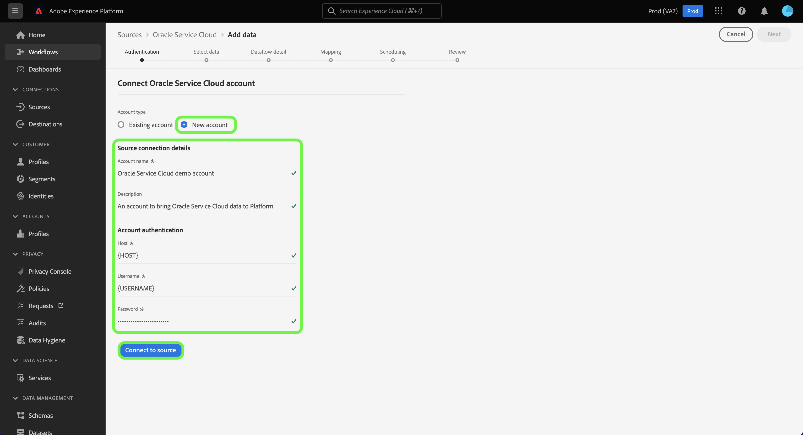

# (Beta) Erstellen einer Oracle Service Cloud-Quellverbindung in der Benutzeroberfläche

>[!NOTE]
>
>Die Oracle Service Cloud-Quelle befindet sich in der Beta-Phase. Siehe [Quellen – Übersicht](../../../../home.md#terms-and-conditions) für weitere Informationen zur Verwendung von Beta-gekennzeichneten Quellen.

In diesem Tutorial werden die Schritte zum Erstellen einer Oracle Service Cloud-Quellverbindung über die Adobe Experience Platform-Benutzeroberfläche beschrieben.

## Erste Schritte

Dieses Tutorial setzt ein Grundverständnis der folgenden Komponenten von Experience Platform voraus:

* [[!DNL Experience Data Model (XDM)] System](../../../../../xdm/home.md): Das standardisierte Framework, mit dem Experience Platform Kundenerlebnisdaten organisiert.
   * [Grundlagen der Schemakomposition](../../../../../xdm/schema/composition.md): Machen Sie sich mit den grundlegenden Bausteinen von XDM-Schemas vertraut, einschließlich der wichtigsten Prinzipien und Best Practices bei der Schemaerstellung.
   * [Tutorial zum Schema-Editor](../../../../../xdm/tutorials/create-schema-ui.md): Erfahren Sie, wie Sie benutzerdefinierte Schemas mithilfe der Benutzeroberfläche des Schema-Editors erstellen können.
* [[!DNL Real-time Customer Profile]](../../../../../profile/home.md): Bietet ein einheitliches Echtzeit-Kundenprofil, das auf aggregierten Daten aus verschiedenen Quellen basiert.

Wenn Sie bereits über eine gültige Oracle Service Cloud-Verbindung verfügen, können Sie den Rest dieses Dokuments überspringen und mit dem Tutorial [Konfigurieren eines Datenflusses](../../dataflow/customer-success.md) fortfahren

### Sammeln erforderlicher Anmeldeinformationen

Um auf Ihr Oracle Service Cloud-Konto in [!DNL Platform] zugreifen zu können, müssen Sie die folgenden Werte angeben:

| Anmeldedaten | Beschreibung |
| ---------- | ----------- |
| Host | Die Host-URL Ihrer Oracle Service Cloud-Instanz. |
| Benutzername | Der Benutzername für Ihr Oracle Service Cloud-Benutzerkonto. |
| Kennwort | Das Kennwort für Ihr Oracle Service Cloud-Konto. |

Weiterführende Informationen zur Authentifizierung Ihres Oracle Service Cloud-Kontos finden Sie im [[!DNL Oracle] Authentifizierungshandbuch](https://docs.oracle.com/en/cloud/saas/b2c-service/20c/cxska/OKCS_Authenticate_and_Authorize.html).

## Verbinden Ihres Oracle Service Cloud-Kontos

Wählen Sie in der Platform-Benutzeroberfläche in der linken Navigationsleiste die Option **[!UICONTROL Quellen]**, um auf den Arbeitsbereich [!UICONTROL Quellen] zuzugreifen. Der [!UICONTROL Katalog]-Bildschirm zeigt eine Vielzahl von Quellen an, die zum Erstellen eines Kontos verwendet werden können.

Sie können die gewünschte Kategorie aus dem Katalog auf der linken Bildschirmseite auswählen. Alternativ können Sie die gewünschte Quelle mithilfe der Suchleiste finden.

Wählen Sie unter der Kategorie [!UICONTROL Customer Success] die Option **[!UICONTROL Oracle Service Cloud]** aus und klicken Sie auf **[!UICONTROL Daten hinzufügen]**.

Die Seite **[!UICONTROL Verbindung zu Oracle Service Cloud herstellen]** wird angezeigt. Auf dieser Seite können Sie entweder neue oder vorhandene Anmeldedaten verwenden.

### Vorhandenes Konto

Um ein bestehendes Konto zu verbinden, wählen Sie das Oracle Service Cloud-Konto aus, mit dem Sie eine Verbindung herstellen möchten, und klicken Sie dann auf **[!UICONTROL Weiter]**, um fortzufahren.

### Neues Konto

Wenn Sie neue Anmeldeinformationen verwenden, wählen Sie **[!UICONTROL Neues Konto]** aus. Geben Sie im angezeigten Formular einen Namen, eine optionale Beschreibung und Ihre Oracle Service Cloud-Anmeldedaten ein. Wenn Sie fertig sind, wählen Sie **[!UICONTROL Mit Quelle verbinden]** und warten Sie, bis die neue Verbindung hergestellt ist.

## Nächste Schritte

Mithilfe dieses Tutorials haben Sie eine Verbindung zu Ihrem Oracle Service Cloud-Konto hergestellt. Sie können jetzt mit dem nächsten Tutorial fortfahren und [einen Datenfluss konfigurieren, um Customer Success-Daten in Platform zu importieren](../../dataflow/crm.md).
