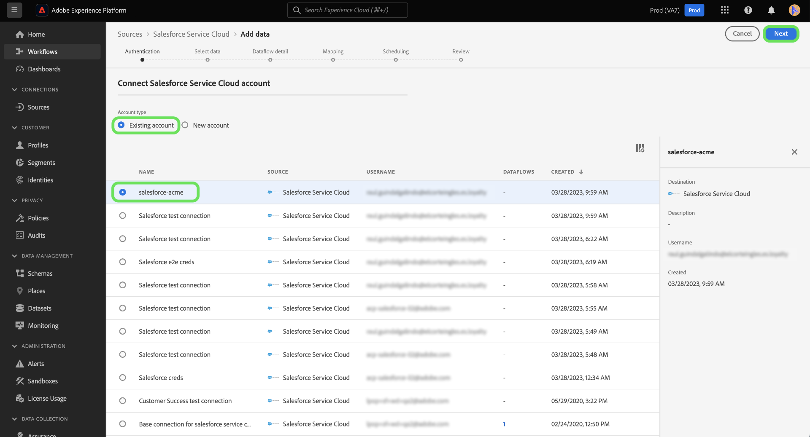

# Verbinden Sie [!DNL Salesforce Service Cloud] Konto für Experience Platform über die Benutzeroberfläche

In diesem Tutorial erfahren Sie, wie Sie Ihre [!DNL Salesforce Service Cloud] und bringen Sie Ihre Kundenerfolgsdaten über die Experience Platform-Benutzeroberfläche in Adobe Experience Platform mit.

## Erste Schritte

Dieses Tutorial setzt ein Grundverständnis der folgenden Komponenten von Experience Platform voraus:

* [[!DNL Experience Data Model (XDM)] System](../../../../../xdm/home.md): Das standardisierte Framework, mit dem Experience Platform Kundenerlebnisdaten organisiert.
   * [Grundlagen der Schemakomposition](../../../../../xdm/schema/composition.md): Machen Sie sich mit den grundlegenden Bausteinen von XDM-Schemas vertraut, einschließlich der wichtigsten Prinzipien und Best Practices bei der Schemaerstellung.
   * [Tutorial zum Schema-Editor](../../../../../xdm/tutorials/create-schema-ui.md): Erfahren Sie, wie Sie benutzerdefinierte Schemas mithilfe der Benutzeroberfläche des Schema-Editors erstellen können.
* [[!DNL Real-Time Customer Profile]](../../../../../profile/home.md): Bietet ein einheitliches Echtzeit-Kundenprofil, das auf aggregierten Daten aus verschiedenen Quellen basiert.

Wenn Sie bereits über eine gültige [!DNL Salesforce Service Cloud] Verbindung nutzen, können Sie den Rest dieses Dokuments überspringen und mit dem Tutorial zum [Datenfluss für einen Kundenerfolg konfigurieren](../../dataflow/customer-success.md)

### Sammeln erforderlicher Anmeldeinformationen

Um auf Ihre [!DNL Salesforce Service Cloud] -Konto auf Experience Platform angegeben haben, müssen Sie die folgenden Werte angeben:

| Anmeldedaten | Beschreibung |
| --- | --- |
| `environmentUrl` | Die URL der [!DNL Salesforce Service Cloud] Quellinstanz. |
| `username` | Der Benutzername für die [!DNL Salesforce Service Cloud] Benutzerkonto. |
| `password` | Das Kennwort für die [!DNL Salesforce Service Cloud] Benutzerkonto. |
| `securityToken` | Das Sicherheits-Token für [!DNL Salesforce Service Cloud] Benutzerkonto. |
| `apiVersion` | (Optional) Die REST-API-Version der [!DNL Salesforce Service Cloud] -Instanz, die Sie verwenden. Wenn dieses Feld leer gelassen wird, verwendet Experience Platform automatisch die neueste verfügbare Version. |

Weitere Informationen zur Authentifizierung finden Sie unter [this [!DNL Salesforce] Authentifizierungshandbuch](https://developer.salesforce.com/docs/atlas.en-us.api_rest.meta/api_rest/quickstart_oauth.htm).

## Verbinden Ihres [!DNL Salesforce Service Cloud]-Kontos

Nachdem Sie die erforderlichen Anmeldedaten gesammelt haben, können Sie die folgenden Schritte ausführen, um Ihre [!DNL Salesforce] -Konto auf Experience Platform.

Wählen Sie in der Platform-Benutzeroberfläche die Option **[!UICONTROL Quellen]** über das linke Navigationsmenü aus, um auf den Arbeitsbereich &quot;Quellen&quot;zuzugreifen. Die *[!UICONTROL Katalog]* zeigt eine Vielzahl von Quellen an, die im Experience Platform-Quellkatalog verfügbar sind.

Sie können die gewünschte Kategorie aus dem Katalog auf der linken Bildschirmseite auswählen. Alternativ können Sie eine bestimmte Quelle mithilfe der Suchoption finden.

Auswählen **[!UICONTROL Kundenerfolg]** aus der Liste der Quellkategorien und wählen Sie **[!UICONTROL Daten hinzufügen]** aus dem [!DNL Salesforce Service Cloud] Karte.

Die **[!UICONTROL Mit Salesforce Service Cloud verbinden]** angezeigt. Auf dieser Seite können Sie entweder neue oder vorhandene Anmeldedaten verwenden.

>[!BEGINTABS]

>[!TAB Vorhandenes Salesforce Service Cloud-Konto verwenden]

Um ein vorhandenes Konto zu verwenden, wählen Sie **[!UICONTROL Vorhandenes Konto]** und dann das Konto, das Sie verwenden möchten, aus der angezeigten Liste aus. Wählen Sie zum Abschluss **[!UICONTROL Nächste]** um fortzufahren.

>[!TAB Neues Salesforce Service Cloud-Konto erstellen]

Um ein neues Konto zu verwenden, wählen Sie **[!UICONTROL Neues Konto]** und geben Sie einen Namen, eine Beschreibung und Ihre [!DNL Salesforce Service Cloud] Authentifizierungsberechtigungen. Wählen Sie zum Abschluss **[!UICONTROL Verbindung mit Quelle herstellen]** und lassen einige Sekunden zu, bis die neue Verbindung hergestellt ist.

>[!ENDTABS]

## Nächste Schritte

Mithilfe dieses Tutorials haben Sie eine Verbindung zu Ihrem [!DNL Salesforce Service Cloud]-Konto hergestellt. Sie können jetzt mit dem nächsten Tutorial fortfahren und [einen Datenfluss konfigurieren, um Kundenerfolgsdaten in Experience Platform zu übertragen](../../dataflow/customer-success.md).
