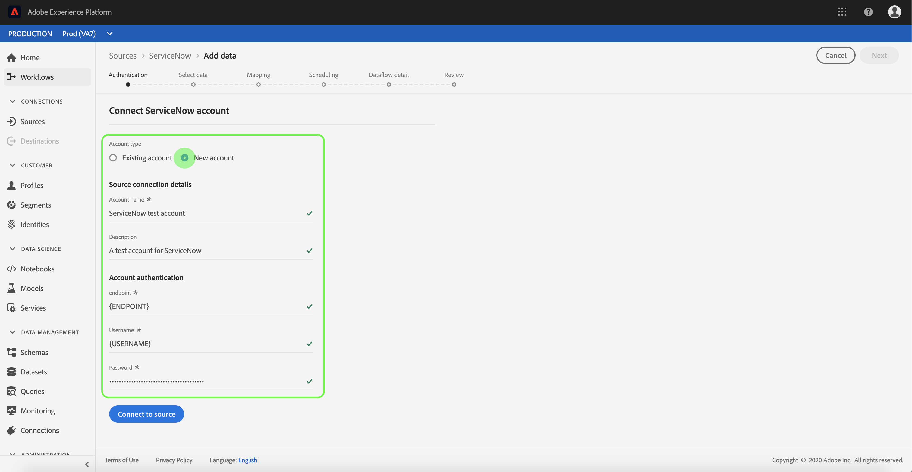

# Erstellen eines Quell-Connectors für [!DNL ServiceNow] in der Benutzeroberfläche

Quell-Connectoren in Adobe Experience Platform bieten die Möglichkeit, extern bezogene Daten auf geplanter Basis zu erfassen. In diesem Tutorial finden Sie die Schritte zum Erstellen eines [!DNL ServiceNow]-Quell-Connectors mithilfe der [!DNL Platform]-Benutzeroberfläche.

## Erste Schritte

Dieses Tutorial setzt ein Grundverständnis der folgenden Komponenten von Adobe Experience Platform voraus:

* [[!DNL Experience Data Model (XDM)] System](../../../../../xdm/home.md): Das standardisierte Framework, mit dem [!DNL Experience Platform] Kundenerlebnisdaten organisiert.
   * [Grundlagen der Schemakomposition](../../../../../xdm/schema/composition.md): Machen Sie sich mit den grundlegenden Bausteinen von XDM-Schemas vertraut, einschließlich der wichtigsten Prinzipien und Best Practices bei der Schemaerstellung.
   * [Tutorial zum Schema-Editor](../../../../../xdm/tutorials/create-schema-ui.md): Erfahren Sie, wie Sie benutzerdefinierte Schemas mithilfe der Benutzeroberfläche des Schema-Editors erstellen können.
* [[!DNL Real-Time Customer Profile]](../../../../../profile/home.md): Bietet ein einheitliches Echtzeit-Kundenprofil, das auf aggregierten Daten aus verschiedenen Quellen basiert.

Wenn Sie bereits über eine gültige [!DNL ServiceNow]-Verbindung verfügen, können Sie den Rest dieses Dokuments überspringen und mit dem Tutorial zum [Konfigurieren eines Datenflusses](../../dataflow/customer-success.md) fortfahren

### Sammeln erforderlicher Anmeldeinformationen

Um auf Ihr [!DNL ServiceNow]-Konto in zugreifen zu können, müssen Sie die folgenden Werte angeben:[!DNL Platform]

| Anmeldedaten | Beschreibung |
| ---------- | ----------- |
| `endpoint` | Der Endpunkt der [!DNL ServiceNow] Server. |
| `username` | Der Benutzername, mit dem die Verbindung zum [!DNL ServiceNow] -Server zur Authentifizierung. |
| `password` | Das Kennwort, mit dem eine Verbindung hergestellt werden soll [!DNL ServiceNow] -Server zur Authentifizierung. |

Weitere Informationen zu den ersten Schritten finden Sie unter [this [!DNL ServiceNow] Dokument](https://developer.servicenow.com/app.do#!/rest_api_doc?v=newyork&amp;id=r_TableAPI-GET).

## Verbinden Ihres [!DNL ServiceNow]-Kontos

Nachdem Sie die erforderlichen Anmeldedaten erfasst haben, können Sie die folgenden Schritte ausführen, um Ihr [!DNL ServiceNow]-Konto mit [!DNL Platform] zu verknüpfen.

Anmelden bei [Adobe Experience Platform](https://platform.adobe.com) und wählen Sie **[!UICONTROL Quellen]** über die linke Navigationsleiste, um auf die **[!UICONTROL Quellen]** Arbeitsbereich. Der Bildschirm **[!UICONTROL Katalog]** zeigt eine Vielzahl von Quellen an, mit denen Sie ein Konto erstellen können.

Sie können die gewünschte Kategorie aus dem Katalog auf der linken Bildschirmseite auswählen. Alternativ können Sie die gewünschte Quelle mithilfe der Suchoption finden.

Unter dem **[!UICONTROL Kundenerfolg]** category, select **[!UICONTROL ServiceNow]**. Wenn Sie diesen Connector zum ersten Mal verwenden, wählen Sie **[!UICONTROL Konfigurieren]**. Andernfalls wählen Sie **[!UICONTROL Quelle verbinden]** , um eine neue [!DNL ServiceNow] Connector.

Die **[!UICONTROL Mit ServiceNow verbinden]** angezeigt. Auf dieser Seite können Sie entweder neue oder vorhandene Anmeldedaten verwenden.

### Neues Konto

Wenn Sie neue Anmeldeinformationen verwenden, wählen Sie **[!UICONTROL Neues Konto]** aus. Geben Sie im angezeigten Formular einen Namen, eine optionale Beschreibung und Ihre [!DNL ServiceNow] Anmeldedaten. Wenn Sie fertig sind, wählen Sie **[!UICONTROL Verbinden]** und dann etwas Zeit für die Einrichtung der neuen Verbindung.

### Vorhandenes Konto

Um ein vorhandenes Konto zu verbinden, wählen Sie die [!DNL ServiceNow] Konto, mit dem Sie eine Verbindung herstellen möchten, wählen Sie **[!UICONTROL Nächste]** um fortzufahren.

## Nächste Schritte

Mithilfe dieses Tutorials haben Sie eine Verbindung zu Ihrem [!DNL ServiceNow]-Konto hergestellt. Sie können jetzt mit dem nächsten Tutorial fortfahren und einen [Datenfluss konfigurieren, um Daten in zu importieren [!DNL Platform]](../../dataflow/customer-success.md).
