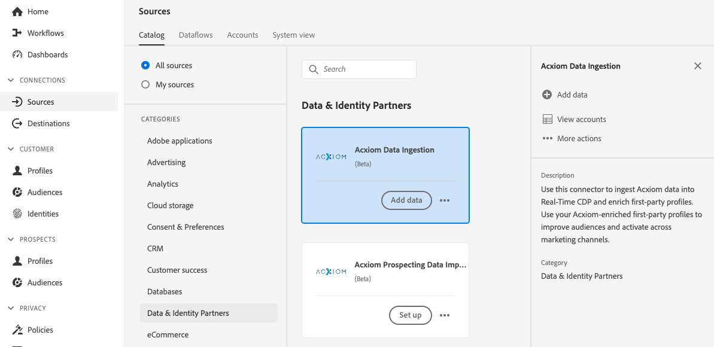

# Erstellen Sie eine [!DNL Acxiom Data Ingestion] Quellverbindung und Datenfluss in der Benutzeroberfläche

>[!NOTE]
>
>Die [!DNL Acxiom Data Ingestion]-Quelle befindet sich in der Beta-Phase. Lesen Sie die [Bedingungen](../../../../home.md#terms-and-conditions) in der Quellenübersicht für weitere Informationen zur Verwendung von Beta-beschrifteten Quellen.

Verwenden Sie die [!DNL Acxiom Data Ingestion] zu erfassende Quelle [!DNL Acxiom] Daten in Real-time Customer Data Platform einlesen und Erstanbieterprofile anreichern. Anschließend können Sie Ihre [!DNL Acxiom]-erweiterte Erstanbieterprofile zur Verbesserung von Zielgruppen und zur Aktivierung über Marketingkanäle hinweg.

In diesem Tutorial erfahren Sie, wie Sie eine [!DNL Acxiom Data Ingestion] Quellverbindung und Datenfluss über die Adobe Experience Platform-Benutzeroberfläche. Die [!DNL Acxiom Data Ingestion] -Quelle zum Abrufen und Zuordnen der Antwort von [!DNL Acxiom] Verbesserungsdienst mit Amazon S3 als Dropdown-Punkt.

## Voraussetzungen {#prerequisites}

Dieses Tutorial setzt ein Grundverständnis der folgenden Komponenten von Experience Platform voraus:

* [[!DNL Experience Data Model (XDM)] System](../../../../../xdm/home.md): Das standardisierte Framework, mit dem Experience Platform Kundenerlebnisdaten organisiert.
   * [Grundlagen der Schemakomposition](../../../../../xdm/schema/composition.md): Machen Sie sich mit den grundlegenden Bausteinen von XDM-Schemata vertraut, einschließlich der wichtigsten Prinzipien und Best Practices bei der Schemaerstellung.
   * [Tutorial zum Schema-Editor](../../../../../xdm/tutorials/create-schema-ui.md): Erfahren Sie, wie Sie benutzerdefinierte Schemata mithilfe der Benutzeroberfläche des Schema-Editors erstellen können.
* [[!DNL Real-Time Customer Profile]](../../../../../profile/home.md): Bietet ein einheitliches Echtzeit-Kundenprofil, das auf aggregierten Daten aus verschiedenen Quellen basiert.

### Sammeln erforderlicher Anmeldeinformationen

Um auf Ihren Bucket auf dem Experience Platform zuzugreifen, müssen Sie gültige Werte für die folgenden Anmeldedaten angeben:

| Anmeldedaten | Beschreibung |
| --- | --- |
| [!DNL Acxiom] Authentifizierungsschlüssel | Der Authentifizierungsschlüssel. Sie können diesen Wert aus dem [!DNL Acxiom] Team. |
| [!DNL Amazon S3] Zugriffsschlüssel | Die Zugriffsschlüssel-ID für Ihren Behälter. Sie können diesen Wert aus dem [!DNL Acxiom] Team. |
| Geheimer [!DNL Amazon S3]-Schlüssel | Die geheime Schlüssel-ID für Ihren Bucket. Sie können diesen Wert aus dem [!DNL Acxiom] Team. |
| Behältername | Dies ist Ihr Bucket, in dem Dateien freigegeben werden. Sie können diesen Wert aus dem [!DNL Acxiom] Team. |

>[!IMPORTANT]
>
>Sie müssen beide **[!UICONTROL Quellen anzeigen]** und **[!UICONTROL Quellen verwalten]** für Ihr Konto aktivierte Berechtigungen, um Ihre [!DNL Acxiom] -Konto auf Experience Platform. Wenden Sie sich an Ihren Produktadministrator, um die erforderlichen Berechtigungen zu erhalten. Weitere Informationen finden Sie im Abschnitt [UI-Handbuch zur Zugriffskontrolle](../../../../../access-control/ui/overview.md).

## Verbinden Ihres [!DNL Acxiom]-Kontos

Wählen Sie in der Platform-Benutzeroberfläche die Option **[!UICONTROL Quellen]** in der linken Navigationsleiste, um auf den Arbeitsbereich [!UICONTROL Quellen] zuzugreifen. Der Bildschirm [!UICONTROL Katalog] zeigt eine Vielzahl von Quellen an, mit denen Sie ein Konto erstellen können.

Sie können die gewünschte Kategorie aus dem Katalog auf der linken Bildschirmseite auswählen. Alternativ können Sie die gewünschte Quelle mithilfe der Suchoption finden.

Unter dem **[!UICONTROL Daten- und Identitätspartner]** category, select **[!UICONTROL Acxiom-Datenerfassung]** und wählen Sie **[!UICONTROL Einrichten]**.

>[!TIP]
>
>Eine Quellkarte, die **[!UICONTROL Daten hinzufügen]** bedeutet, dass die Quelle bereits über ein authentifiziertes Konto verfügt. Auf der anderen Seite eine Quellkarte, die **[!UICONTROL Einrichten]** bedeutet, dass Sie Anmeldeinformationen angeben und ein neues Konto erstellen müssen, um diese Quelle verwenden zu können.

### Neues Konto erstellen

Wenn Sie neue Anmeldeinformationen verwenden, wählen Sie **[!UICONTROL Neues Konto]** aus. Geben Sie im angezeigten Formular einen Namen, eine optionale Beschreibung und Ihre [!DNL Acxiom] Anmeldedaten. Wenn Sie fertig sind, wählen Sie **[!UICONTROL Mit Quelle verbinden]** und warten Sie, bis die neue Verbindung hergestellt ist.

| Anmeldeinformationen | Beschreibung |
| --- | --- |
| Kontoname | Der Name des Kontos. |
| Beschreibung | (Optional) Eine kurze Erläuterung des Kontozwecks. |
| [!DNL Acxiom] Authentifizierungsschlüssel | Die [!DNL Acxiom]-bereitgestellter Schlüssel, der für die Kontovalidierung erforderlich ist. Dieser Wert muss mit dem richtigen Wert übereinstimmen, bevor eine Verbindung zur Datenbank hergestellt werden kann.  Dieser Schlüssel muss aus 24 Zeichen bestehen und darf nur Folgendes enthalten: A-Z, a-z und 0-9. |
| S3-Zugriffsschlüssel | Der S3-Zugriffsschlüssel verweist auf den Amazon S3-Speicherort. Dies wird von Ihrem Administrator bereitgestellt, wenn S3-Rollenberechtigungen definiert sind. |
| S3-Geheimschlüssel | Der geheime S3-Schlüssel verweist auf den Speicherort von Amazon S3. Dies wird von Ihrem Administrator bereitgestellt, wenn S3-Rollenberechtigungen definiert sind. |
| s3SessionToken | (Optional) Der Authentifizierungstoken-Wert bei der Verbindung zu S3. |
| serviceUrl | (Optional) Der URL-Speicherort, der beim Herstellen einer Verbindung zu S3 an einem nicht standardmäßigen Speicherort verwendet wird. |
| Behältername | (Optional) Der Name des auf S3 eingerichteten S3-Buckets, der als Startpfad für die Datenauswahl dient. |
| Ordnerpfad | Wenn Unterverzeichnisse in einem Behälter verwendet werden, können Sie bei der Datenauswahl auch einen Pfad als Startpfad angeben. |

### Vorhandenes Konto verwenden

Um ein vorhandenes Konto zu verwenden, wählen Sie **[!UICONTROL Vorhandenes Konto]**.

Wählen Sie ein Konto aus der Liste aus, um Details zu diesem Konto anzuzeigen. Nachdem Sie ein Konto ausgewählt haben, wählen Sie **[!UICONTROL Nächste]** um fortzufahren.

## Auswählen von Daten

Wählen Sie die zu erfassende Datei aus dem gewünschten Behälter und Unterverzeichnis aus. Sobald Trennzeichen und Komprimierungstyp definiert sind, können Sie eine Vorschau der Daten anzeigen. Nachdem Sie die Datei ausgewählt haben, wählen Sie **[!UICONTROL Nächste]** um fortzufahren.

>[!NOTE]
>
>Während die JSON- und Parquet-Dateitypen aufgelistet sind, sind Sie während der [!DNL Acxiom] Ursprungs-Workflow.

## Bereitstellen von Datensatz- und Datenflussdetails

Als Nächstes müssen Sie Informationen zu Ihrem Datensatz und Ihrem Datenfluss angeben.

### Datensatzdetails

>[!BEGINTABS]

>[!TAB Verwenden eines neuen Datensatzes]

Ein Datensatz ist ein Konstrukt zur Datenspeicherung und -verwaltung, in dem Daten (in der Regel) in einer Tabelle erfasst werden, die ein Schema (Spalten) und Felder (Zeilen) beinhaltet. Daten, die erfolgreich in Experience Platform aufgenommen wurden, werden im Data Lake als Datensätze persistiert. Um einen neuen Datensatz zu verwenden, wählen Sie **[!UICONTROL Neuer Datensatz]**.

| Neue Datensatzdetails | Beschreibung |
| --- | --- |
| Name des Ausgabedatensatzes | Der Name des neuen Datensatzes. |
| Beschreibung | (Optional) Eine kurze Erklärung zum Zweck des Datensatzes. |
| Schema | Eine Dropdown-Liste mit Schemas, die in Ihrer Organisation vorhanden sind. Sie können auch ein eigenes Schema vor dem Quellkonfigurationsprozess erstellen. Weitere Informationen finden Sie im Handbuch unter [Erstellen von Schemas in der Benutzeroberfläche](../../../../../xdm/tutorials/create-schema-ui.md). |

>[!TAB Verwenden eines vorhandenen Datensatzes]

Um einen vorhandenen Datensatz zu verwenden, wählen Sie **[!UICONTROL Vorhandener Datensatz]**.

Sie können **[!UICONTROL Erweiterte Suche]** , um ein Fenster mit allen Datensätzen in Ihrer Organisation anzuzeigen, einschließlich der entsprechenden Details, z. B. ob sie für die Erfassung in Echtzeit-Kundenprofil aktiviert sind.

>[!ENDTABS]

++ + Wählen Sie Schritte aus, um die Profilaufnahme, Fehlerdiagnose und partielle Erfassung zu aktivieren.

Wenn Ihr Datensatz für das Echtzeit-Kundenprofil aktiviert ist, können Sie während dieses Schritts **[!UICONTROL Profildatensatz]** , um Ihre Daten für die Profilaufnahme zu aktivieren. Sie können diesen Schritt auch verwenden, um **[!UICONTROL Fehlerdiagnose]** und **[!UICONTROL Partielle Erfassung]**.

* **[!UICONTROL Fehlerdiagnose]**: Auswählen **[!UICONTROL Fehlerdiagnose]** , um die Quelle anzuweisen, eine Fehlerdiagnose zu erstellen, die Sie später bei der Überwachung Ihrer Datensatzaktivität und des Datenflussstatus referenzieren können.
* **[!UICONTROL Partielle Erfassung]**: Partielle Batch-Erfassung ist die Möglichkeit, Daten mit Fehlern bis zu einem bestimmten konfigurierbaren Schwellenwert zu erfassen. Mit dieser Funktion können Sie alle Ihre präzisen Daten erfolgreich in Experience Platform erfassen, während all Ihre falschen Daten separat mit Informationen darüber gestapelt werden, warum sie ungültig sind.

+++

### Datenflussdetails

Nachdem Ihr Datensatz konfiguriert wurde, müssen Sie Details zu Ihrem Datenfluss angeben, einschließlich eines Namens, einer optionalen Beschreibung und Warnhinweiskonfigurationen.

| Datenflusskonfigurationen | Beschreibung |
| --- | --- |
| Dataflow-Name | Der Name des Datenflusses.  Standardmäßig wird dabei der Name der Datei verwendet, die importiert wird. |
| Beschreibung | (Optional) Eine kurze Beschreibung Ihres Datenflusses. |
| Warnhinweise | Experience Platform kann ereignisbasierte Warnhinweise erstellen, die Benutzer abonnieren können. Diese Optionen enthalten alle einen laufenden Datenfluss, um diese zu Trigger zu führen.  Weitere Informationen finden Sie im Abschnitt [Warnungen - Übersicht](../../alerts.md) <ul><li>**Start des Datenflusses für Quellen**: Wählen Sie diesen Warnhinweis aus, um eine Benachrichtigung zu erhalten, wenn der Start des Datenflusses beginnt.</li><li>**Quellen-Datenfluss erfolgreich ausgeführt**: Wählen Sie diese Warnung aus, um eine Benachrichtigung zu erhalten, wenn Ihr Datenfluss ohne Fehler endet.</li><li>**Fehler beim Ausführen des Datenflusses für Quellen**: Wählen Sie diesen Warnhinweis aus, um eine Benachrichtigung zu erhalten, wenn Ihr Datenfluss mit Fehlern endet.</li></ul> |

## Zuordnung

Verwenden Sie die Zuordnungsschnittstelle, um Ihre Quelldaten den entsprechenden Schemafeldern zuzuordnen, bevor Sie Daten auf Experience Platform erfassen.  Weitere Informationen finden Sie im Abschnitt [Zuordnungshandbuch in der Benutzeroberfläche](../../../../../data-prep/ui/mapping.md)

## Dataflow-Erfassung planen

Definieren Sie dann über die Planungsschnittstelle den Aufnahmezeitplan Ihres Datenflusses.

| Planungskonfiguration | Beschreibung |
| --- | --- |
| Häufigkeit | Konfigurieren Sie die Häufigkeit, mit der der Datenfluss ausgeführt werden soll. Sie können die Häufigkeit wie folgt einstellen: <ul><li>**Einmal**: Setzen Sie Ihre Häufigkeit auf `once` , um eine einmalige Erfassung zu erstellen. Konfigurationen für Intervall und Aufstockung sind beim Erstellen eines einmaligen Erfassungsdataflods nicht verfügbar. Standardmäßig ist die Planung auf einmal eingestellt.</li><li>**Minute**: Setzen Sie Ihre Häufigkeit auf `minute` , um Ihren Datenfluss so zu planen, dass Daten pro Minute erfasst werden.</li><li>**Stunde**:Setzen Sie Ihre Häufigkeit auf `hour` , um den Datenfluss so zu planen, dass Daten pro Stunde erfasst werden.</li><li>**Tag**: Setzen Sie Ihre Häufigkeit auf `day` , um Ihren Datenfluss so zu planen, dass Daten täglich erfasst werden.</li><li>**Woche**: Setzen Sie Ihre Häufigkeit auf `week` , um Ihren Datenfluss so zu planen, dass Daten pro Woche erfasst werden.</li></ul> |
| Intervall | Nachdem Sie eine Frequenz ausgewählt haben, können Sie die Intervalleinstellung konfigurieren, um den Zeitrahmen zwischen jeder Aufnahme festzulegen. Wenn Sie beispielsweise Ihre Häufigkeit auf &quot;Tag&quot;festlegen und das Intervall auf 15 konfigurieren, wird Ihr Datenfluss alle 15 Tage ausgeführt. **Hinweis**: Sie können das Intervall nicht auf null festlegen. |
| Startzeit | Der Zeitstempel für die projizierte Ausführung, dargestellt in UTC-Zeitzone. |
| Aufstockung | Die Aufstockung bestimmt, welche Daten ursprünglich erfasst werden. Wenn die Aufstockung aktiviert ist, werden alle aktuellen Dateien im angegebenen Pfad während der ersten geplanten Erfassung erfasst. Wenn die Aufstockung deaktiviert ist, werden nur die Dateien erfasst, die zwischen der ersten Ausführung der Aufnahme und der Startzeit geladen werden. Dateien, die vor der Startzeit geladen wurden, werden nicht erfasst. |

## Überprüfen des Datenflusses

Verwenden Sie die Überprüfungsseite für eine Zusammenfassung Ihres Datenflusses vor der Erfassung. Details werden in die folgenden Kategorien eingeteilt:

* **Verbindung** - Zeigt den Quelltyp, den relevanten Pfad der ausgewählten Quelldatei und die Anzahl der Spalten in dieser Quelldatei an.
* **Datensatz- und Zuordnungsfelder zuweisen** - Zeigt, in welchen Datensatz die Quelldaten aufgenommen werden, einschließlich des Schemas, dem der Datensatz entspricht.
* **Planung** - Zeigt den aktiven Zeitraum, die Häufigkeit und das Intervall des Aufnahmezeitplans an.
Nachdem Sie Ihren Datenfluss überprüft haben, klicken Sie auf Beenden und lassen Sie die Erstellung des Datenflusses etwas Zeit.

## Nächste Schritte

In diesem Tutorial haben Sie erfolgreich einen Datenfluss erstellt, um Batch-Daten aus Ihrem [!DNL Acxiom] -Quelle zu Experience Platform. Weitere Ressourcen finden Sie in der unten beschriebenen Dokumentation.

### Überwachen Ihres Datenflusses

Nachdem Ihr Datenfluss erstellt wurde, können Sie die erfassten Daten überwachen, um Informationen zu Erfassungsraten, Erfolg und Fehlern anzuzeigen. Weitere Informationen zum Überwachen des Datenflusses finden Sie im Tutorial zu [Überwachen von Konten und Datenflüssen in der Benutzeroberfläche](../../../../../dataflows/ui/monitor-sources.md).

### Aktualisieren des Datenflusses

Um Konfigurationen für die Planung, Zuordnung und allgemeine Informationen Ihrer Datenflüsse zu aktualisieren, besuchen Sie das Tutorial zu [Aktualisieren von Datenflüssen für Quellen in der Benutzeroberfläche](../../update-dataflows.md).

### Löschen des Datenflusses

Datenflüsse, die nicht mehr erforderlich sind oder nicht korrekt erstellt wurden, können Sie löschen, indem Sie dazu die Funktion **[!UICONTROL Löschen]** im Arbeitsbereich **[!UICONTROL Datenflüsse]** verwenden. Weitere Informationen zum Löschen von Datenflüssen finden Sie im Tutorial zu [Löschen von Datenflüssen in der Benutzeroberfläche](../../delete.md).

## Zusätzliche Ressourcen {#additional-resources}

Weitere Informationen finden Sie im Abschnitt [[!DNL Acxiom] InfoBase](https://www.acxiom.com/wp-content/uploads/2022/02/fs-acxiom-infobase_AC-0268-22.pdf).
