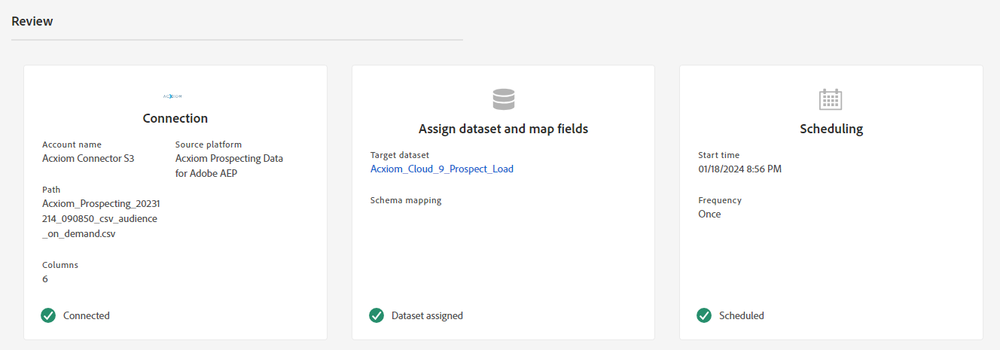

# Erstellen einer [!DNL Acxiom Prospecting Data Import]-Quellverbindung und eines Datenflusses in der Benutzeroberfläche

>[!NOTE]
>
>Die [!DNL Acxiom Prospecting Data Import]-Quelle befindet sich in der Beta-Phase. Weitere Informationen zur Verwendung von Beta-beschrifteten Quellen finden Sie in der [Quellenübersicht](../../../../home.md#terms-and-conditions) .

[!DNL Acxiom]&#39;s Prospecting Data Import for Adobe Real-time Customer Data Platform ist ein Prozess, der die produktivsten potenziellen Zielgruppen bereitstellt. [!DNL Acxiom] nutzt Erstanbieterdaten aus Real-Time CDP über einen sicheren Export und führt diese Daten über ein preisgekröntes Hygiene- und Identitätsauflösungssystem aus. Dadurch wird eine Datendatei erzeugt, die als Unterdrückungsliste verwendet werden soll. Diese Datendatei wird dann mit der Acxiom Global-Datenbank abgeglichen, wodurch die Interessenten-Listen für den Import angepasst werden können.

Sie können die [!DNL Acxiom]-Quelle verwenden, um Antworten von Acxiom Prospect-Dienst abzurufen und zuzuordnen, indem Sie Amazon S3 als Ablagepunkt verwenden.

In diesem Tutorial erfahren Sie, wie Sie eine [!DNL Acxiom Prospecting Data Import]-Quellverbindung und einen Datenfluss mithilfe der Adobe Experience Platform-Benutzeroberfläche erstellen.

## Voraussetzungen {#prerequisites}

Dieses Tutorial setzt ein Grundverständnis der folgenden Komponenten von Experience Platform voraus:

* [[!DNL Experience Data Model (XDM)] System](../../../../../xdm/home.md): Das standardisierte Framework, mit dem Experience Platform Kundenerlebnisdaten organisiert.
   * [Grundlagen der Schemakomposition](../../../../../xdm/schema/composition.md): Machen Sie sich mit den grundlegenden Bausteinen von XDM-Schemata vertraut, einschließlich der wichtigsten Prinzipien und Best Practices bei der Schemaerstellung.
   * [Tutorial zum Schema-Editor](../../../../../xdm/tutorials/create-schema-ui.md): Erfahren Sie, wie Sie benutzerdefinierte Schemata mithilfe der Benutzeroberfläche des Schema-Editors erstellen können.
* [[!DNL Real-Time Customer Profile]](../../../../../profile/home.md): Bietet ein einheitliches Echtzeit-Kundenprofil, das auf aggregierten Daten aus verschiedenen Quellen basiert.
* [[!DNL Prospect Profile]](../../../../../profile/ui/prospect-profile.md): Erfahren Sie, wie Sie mithilfe von Interessenten-Profilen Informationen über unbekannte Kunden mithilfe von Drittanbieterinformationen erfassen und verwenden.

### Sammeln erforderlicher Anmeldeinformationen

Um auf Ihren Bucket auf dem Experience Platform zuzugreifen, müssen Sie gültige Werte für die folgenden Anmeldedaten angeben:

| Anmeldedaten | Beschreibung |
| --- | --- |
| [!DNL Acxiom] Authentifizierungsschlüssel | Der Authentifizierungsschlüssel. Sie können diesen Wert vom [!DNL Acxiom]-Team abrufen. |
| [!DNL Amazon S3] Zugriffsschlüssel | Die Zugriffsschlüssel-ID für Ihren Behälter. Sie können diesen Wert vom [!DNL Acxiom]-Team abrufen. |
| Geheimer [!DNL Amazon S3]-Schlüssel | Die geheime Schlüssel-ID für Ihren Bucket. Sie können diesen Wert vom [!DNL Acxiom]-Team abrufen. |
| Behältername | Dies ist Ihr Bucket, in dem Dateien freigegeben werden. Sie können diesen Wert vom [!DNL Acxiom]-Team abrufen. |

>[!IMPORTANT]
>
>Sie müssen sowohl über die Berechtigung **[!UICONTROL Quellen anzeigen]** als auch über die Berechtigung **[!UICONTROL Quellen verwalten]** für Ihr Konto verfügen, um Ihr [!DNL Acxiom]-Konto mit Experience Platform zu verbinden. Wenden Sie sich an Ihren Produktadministrator, um die erforderlichen Berechtigungen zu erhalten. Weitere Informationen finden Sie im Benutzerhandbuch zur Zugriffskontrolle [.](../../../../../access-control/ui/overview.md)

## Verbinden Ihres [!DNL Acxiom]-Kontos

Wählen Sie in der Platform-Benutzeroberfläche die Option **[!UICONTROL Quellen]** in der linken Navigationsleiste, um auf den Arbeitsbereich [!UICONTROL Quellen] zuzugreifen. Der Bildschirm [!UICONTROL Katalog] zeigt eine Vielzahl von Quellen an, mit denen Sie ein Konto erstellen können.

Sie können die gewünschte Kategorie aus dem Katalog auf der linken Bildschirmseite auswählen. Alternativ können Sie die gewünschte Quelle mithilfe der Suchoption finden.

Wählen Sie unter der Kategorie **[!UICONTROL Daten- und Identitätspartner]** die Option **[!UICONTROL Datenimport mit Acxiom-Vorschau]** und klicken Sie dann auf **[!UICONTROL Einrichten]**.

>[!TIP]
>
>Eine Quellkarte, auf der **[!UICONTROL Daten hinzufügen]** angezeigt wird, bedeutet, dass die Quelle bereits über ein authentifiziertes Konto verfügt. Andererseits bedeutet eine Quellkarte, auf der **[!UICONTROL Einrichten]** angezeigt wird, dass Sie Anmeldeinformationen angeben und ein neues Konto erstellen müssen, um diese Quelle verwenden zu können.

### Neues Konto erstellen

Wenn Sie neue Anmeldedaten verwenden, wählen Sie **[!UICONTROL Neues Konto]** aus. Geben Sie im angezeigten Formular einen Namen, eine optionale Beschreibung und Ihre [!DNL Acxiom]-Anmeldedaten ein. Wenn Sie fertig sind, wählen Sie **[!UICONTROL Mit Quelle verbinden]** und lassen Sie dann etwas Zeit, bis die neue Verbindung hergestellt ist.

| Anmeldeinformationen | Beschreibung |
| --- | --- |
| Kontoname | Der Name des Kontos. |
| Beschreibung | (Optional) Eine kurze Erläuterung des Kontozwecks. |
| [!DNL Acxiom] Authentifizierungsschlüssel | Der Schlüssel [!DNL Acxiom], der für die Kontogenehmigung erforderlich ist. Dieser Wert muss mit dem richtigen Wert übereinstimmen, bevor eine Verbindung zur Datenbank hergestellt werden kann.  Dieser Schlüssel muss aus 24 Zeichen bestehen und darf nur Folgendes enthalten: A-Z, a-z und 0-9. |
| S3 – Zugriffsschlüssel | Der S3-Zugriffsschlüssel verweist auf den Amazon S3-Speicherort. Dies wird von Ihrem Administrator bereitgestellt, wenn S3-Rollenberechtigungen definiert sind. |
| S3 – Geheimer Schlüssel | Der geheime S3-Schlüssel verweist auf den Speicherort von Amazon S3. Dies wird von Ihrem Administrator bereitgestellt, wenn S3-Rollenberechtigungen definiert sind. |
| s3SessionToken | (Optional) Der Authentifizierungstoken-Wert bei der Verbindung zu S3. |
| serviceUrl | (Optional) Der URL-Speicherort, der beim Herstellen einer Verbindung zu S3 an einem nicht standardmäßigen Speicherort verwendet wird. |
| Behältername | (Optional) Der Name des auf S3 eingerichteten S3-Buckets, der als Startpfad für die Datenauswahl dient. |
| Ordnerpfad | Wenn Unterverzeichnisse in einem Behälter verwendet werden, können Sie bei der Datenauswahl auch einen Pfad als Startpfad angeben. |

### Vorhandenes Konto verwenden

Um ein vorhandenes Konto zu verwenden, wählen Sie **[!UICONTROL Vorhandenes Konto]** aus.

Wählen Sie ein Konto aus der Liste aus, um Details zu diesem Konto anzuzeigen. Nachdem Sie ein Konto ausgewählt haben, wählen Sie **[!UICONTROL Weiter]** aus, um fortzufahren.

## Auswählen von Daten

Wählen Sie die zu erfassende Datei aus dem gewünschten Behälter und Unterverzeichnis aus. Sobald Trennzeichen und Komprimierungstyp definiert sind, können Sie eine Vorschau der Daten anzeigen. Nachdem Sie die Datei ausgewählt haben, wählen Sie **[!UICONTROL Weiter]** aus, um fortzufahren.

>[!NOTE]
>
>Während JSON- und Parquet-Dateitypen aufgelistet sind, sind Sie während des Ursprungs-Workflows von [!DNL Acxiom] nicht zur Verwendung dieser Dateitypen erforderlich oder zu erwarten.

## Bereitstellen von Datensatz- und Datenflussdetails

Als Nächstes müssen Sie Informationen zu Ihrem Datensatz und Ihrem Datenfluss angeben.

### Datensatz-Details

>[!BEGINTABS]

>[!TAB Verwenden eines neuen Datensatzes]

Ein Datensatz ist ein Konstrukt zur Datenspeicherung und -verwaltung, in dem Daten (in der Regel) in einer Tabelle erfasst werden, die ein Schema (Spalten) und Felder (Zeilen) beinhaltet. Daten, die erfolgreich in Experience Platform aufgenommen wurden, werden im Data Lake als Datensätze persistiert. Um einen neuen Datensatz zu verwenden, wählen Sie **[!UICONTROL Neuer Datensatz]** aus.

| Neue Datensatzdetails | Beschreibung |
| --- | --- |
| Name des Ausgabe-Datensatzes | Der Name des neuen Datensatzes. |
| Beschreibung | (Optional) Eine kurze Erklärung zum Zweck des Datensatzes. |
| Schema | Eine Dropdown-Liste mit Schemas, die in Ihrer Organisation vorhanden sind. Sie können auch ein eigenes Schema vor dem Quellkonfigurationsprozess erstellen. Weitere Informationen finden Sie in der Anleitung zum Erstellen eines Schemas in der Benutzeroberfläche ](../../../../../xdm/tutorials/create-schema-ui.md).[ |

>[!TAB Verwenden eines vorhandenen Datensatzes]

Um einen vorhandenen Datensatz zu verwenden, wählen Sie **[!UICONTROL Vorhandenen Datensatz]** aus.

Sie können **[!UICONTROL Erweiterte Suche]** auswählen, um ein Fenster mit allen Datensätzen in Ihrer Organisation anzuzeigen, einschließlich der jeweiligen Details, z. B. ob sie für die Aufnahme in das Echtzeit-Kundenprofil aktiviert sind.

>[!ENDTABS]

### Datenflussdetails

Wenn Ihr Datensatz in diesem Schritt für Profil aktiviert ist, können Sie den Umschalter **[!UICONTROL Profildatensatz]** auswählen, um Ihre Daten für die Profilaufnahme zu aktivieren. Sie können auch die [!UICONTROL Fehlerdiagnose] und die [!UICONTROL partielle Erfassung] aktivieren.

* **Fehlerdiagnose** - Wählen Sie **Fehlerdiagnose** aus, um die Quelle anzuweisen, Fehlerdiagnosen zu erstellen, auf die Sie später mithilfe von APIs verweisen können. Weitere Informationen finden Sie in der [Übersicht über die Fehlerdiagnose](../../../../../ingestion/quality/error-diagnostics.md)
* **Partielle Erfassung aktivieren** - Partielle Batch-Erfassung ist die Möglichkeit, Daten mit Fehlern bis zu einem bestimmten Schwellenwert zu erfassen. Mit dieser Funktion können Benutzer alle korrekten Daten erfolgreich in Adobe Experience Platform erfassen, während alle fehlerhaften Daten separat in Batches verarbeitet werden, einschließlich Details dazu, warum sie ungültig sind.  Weitere Informationen finden Sie in der [Übersicht über die partielle Erfassung](../../../../../ingestion/batch-ingestion/partial.md) .

| Datenflusskonfigurationen | Beschreibung |
| --- | --- |
| Datenflussname | Der Name des Datenflusses.  Standardmäßig wird dabei der Name der Datei verwendet, die importiert wird. |
| Beschreibung | (Optional) Eine kurze Beschreibung Ihres Datenflusses. |
| Warnhinweise | Experience Platform kann ereignisbasierte Warnhinweise erstellen, die Benutzer abonnieren können. Diese Optionen enthalten alle einen laufenden Datenfluss, um diese zu Trigger zu führen.  Weitere Informationen finden Sie in der [Warnhinweise - Übersicht](../../alerts.md) <ul><li>**Start des Datenflusses für Quellen**: Wählen Sie diesen Warnhinweis aus, um eine Benachrichtigung zu erhalten, wenn der Datenfluss beginnt.</li><li>**Erfolg des Datenfluss-Workflows für Quellen**: Wählen Sie diesen Warnhinweis aus, um eine Benachrichtigung zu erhalten, wenn Ihr Datenfluss ohne Fehler beendet wird.</li><li>**Quellen für Fehler beim Ausführen des Datenflusses**: Wählen Sie diesen Warnhinweis aus, um eine Benachrichtigung zu erhalten, wenn die Ausführung des Datenflusses mit Fehlern endet.</li></ul> |

## Zuordnung

Verwenden Sie die Zuordnungsschnittstelle, um Ihre Quelldaten den entsprechenden Schemafeldern zuzuordnen, bevor Sie Daten auf Experience Platform erfassen.  Weitere Informationen finden Sie im Handbuch zur [Zuordnung in der Benutzeroberfläche](../../../../../data-prep/ui/mapping.md)

## Dataflow-Erfassung planen

Verwenden Sie die Planungsschnittstelle, um den Aufnahmezeitplan Ihres Datenflusses zu definieren.

* **Häufigkeit**: Konfigurieren Sie die Häufigkeit, mit der der Datenfluss ausgeführt werden soll. Sie können für die Häufigkeit Folgendes festlegen: einmal, Minute, Stunde, Tag oder Woche.
* **Intervall**: Nachdem Sie eine Frequenz ausgewählt haben, können Sie die Intervalleinstellung konfigurieren, um den Zeitrahmen zwischen jeder Aufnahme festzulegen. Wenn Sie beispielsweise Ihre Häufigkeit auf &quot;Tag&quot;festlegen und das Intervall auf 15 konfigurieren, wird Ihr Datenfluss alle 15 Tage ausgeführt. Das Intervall kann nicht auf null gesetzt werden und muss auf mindestens 15 festgelegt sein.
* **Startzeit** - Der Zeitstempel für die projizierte Ausführung, in UTC-Zeitzone dargestellt.
* **Aufstockung** - Aufstockung bestimmt, welche Daten ursprünglich erfasst werden. Wenn die Aufstockung aktiviert ist, werden alle aktuellen Dateien im angegebenen Pfad während der ersten geplanten Erfassung erfasst. Wenn die Aufstockung deaktiviert ist, werden nur die Dateien erfasst, die zwischen der ersten Ausführung der Aufnahme und der Startzeit geladen werden. Dateien, die vor der Startzeit geladen wurden, werden nicht erfasst.

## Überprüfen des Datenflusses

Verwenden Sie die Überprüfungsseite für eine Zusammenfassung Ihres Datenflusses vor der Erfassung. Details werden in die folgenden Kategorien eingeteilt:

* **Verbindung** - Zeigt den Quelltyp, den relevanten Pfad der ausgewählten Quelldatei und die Anzahl der Spalten in dieser Quelldatei an.
* **Datensatz- und Zuordnungsfelder zuweisen** - Zeigt an, in welchen Datensatz die Quelldaten aufgenommen werden, einschließlich des Schemas, dem der Datensatz entspricht.
* **Planung** - Zeigt den aktiven Zeitraum, die Häufigkeit und das Intervall des Aufnahmezeitplans an.
Nachdem Sie Ihren Datenfluss überprüft haben, klicken Sie auf Beenden und lassen Sie die Erstellung des Datenflusses etwas Zeit.

## Nächste Schritte

In diesem Tutorial haben Sie erfolgreich einen Datenfluss erstellt, um Batch-Daten aus Ihrer [!DNL Acxiom] -Quelle an Experience Platform zu übertragen. Weitere Ressourcen finden Sie in der unten beschriebenen Dokumentation.

### Überwachen Ihres Datenflusses

Nachdem Ihr Datenfluss erstellt wurde, können Sie die erfassten Daten überwachen, um Informationen zu Erfassungsraten, Erfolg und Fehlern anzuzeigen. Weitere Informationen zum Überwachen des Datenflusses finden Sie im Tutorial zum [Überwachen von Konten und Datenflüssen in der Benutzeroberfläche](../../monitor.md).

### Aktualisieren des Datenflusses

Um Konfigurationen für die Planung, Zuordnung und allgemeine Informationen Ihrer Datenflüsse zu aktualisieren, besuchen Sie das Tutorial zum Aktualisieren der Datenflüsse für Quellen in der Benutzeroberfläche ](../../update-dataflows.md) .[

### Löschen des Datenflusses

Datenflüsse, die nicht mehr erforderlich sind oder nicht korrekt erstellt wurden, können Sie löschen, indem Sie dazu die Funktion **[!UICONTROL Löschen]** im Arbeitsbereich **[!UICONTROL Datenflüsse]** verwenden. Weitere Informationen zum Löschen von Datenflüssen finden Sie im Tutorial zum Löschen von Datenflüssen in der Benutzeroberfläche ](../../delete.md).[

## Zusätzliche Ressourcen {#additional-resources}

[!DNL Acxiom] Zielgruppendaten und -verteilung: https://www.acxiom.com/customer-data/audience-data-distribution/
