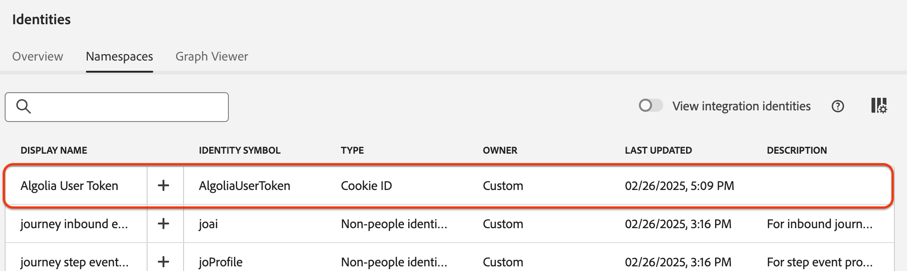

# [!DNL Algolia User Profiles] Daten über die Benutzeroberfläche in Experience Platform aufnehmen

Dieses Tutorial führt Sie mithilfe der -Benutzeroberfläche durch die Aufnahme von Daten aus Ihrem [!DNL Algolia User Profiles]-Konto in Adobe Experience Platform.

## Erste Schritte

>[!IMPORTANT]
>
>Bevor Sie beginnen, stellen Sie sicher, dass Sie die in der [[!DNL Algolia User Profiles]  beschriebenen Voraussetzungen erfüllt &#x200B;](../../../../connectors/data-partners/algolia-user-profiles.md#prerequisites).

In diesem Tutorial wird davon ausgegangen, dass Sie mit den folgenden Experience Platform-Komponenten vertraut sind:

* [[!DNL Experience Data Model (XDM)] System](../../../../../xdm/home.md): Das standardisierte Framework, das Experience Platform zum Organisieren von Kundenerlebnisdaten verwendet.

   * [Grundlagen der Schemakomposition](../../../../../xdm/schema/composition.md): Erfahren Sie mehr über die Schemakomposition, einschließlich der wichtigsten Prinzipien und Best Practices.
   * [Tutorial zum Schema-Editor](../../../../../xdm/tutorials/create-schema-ui.md): Erfahren Sie, wie Sie benutzerdefinierte Schemata mithilfe der Benutzeroberfläche des Schema-Editors erstellen können.
* [[!DNL Real-Time Customer Profile]](../../../../../profile/home.md): Ein einheitliches Echtzeit-Kundenprofil, das auf aggregierten Daten aus verschiedenen Quellen basiert.
* [Quellen](../../../../home.md): Nehmen Sie Daten aus verschiedenen Quellen auf und verwenden Sie Experience Platform-Services, um die Daten zu strukturieren, zu kennzeichnen und zu verbessern.

### Sammeln erforderlicher Anmeldedaten

Um [!DNL Algolia] mit Adobe Experience Platform zu verbinden, geben Sie die folgenden Anmeldeinformationen an:

| Anmeldedaten | Beschreibung |
| -------------- | ----------------------------------------------------------------------------------------- |
| Anwendungs-ID | Die Ihrem [!DNL Algolia]-Konto zugewiesene eindeutige Kennung. |
| API-Schlüssel | Die Berechtigung für die Authentifizierung und Autorisierung von API-Anfragen an die Services von [!DNL Algolia]. |

Weitere Informationen finden Sie in der [!DNL Algolia] [Authentifizierungsdokumentation](https://www.algolia.com/doc/tools/cli/get-started/authentication/).

## Verbinden Ihres [!DNL Algolia]-Kontos

Wählen Sie in der Experience Platform-Benutzeroberfläche **[!UICONTROL linken Navigationsbereich die Option]** Quellen“ aus, um den Arbeitsbereich *[!UICONTROL Quellen]* zu öffnen. Verwenden Sie das *[!UICONTROL Kategorien]*-Bedienfeld oder die Suchleiste, um Ihre gewünschte Quelle zu finden.

Um [!DNL Algolia] zu verbinden, wählen Sie die Quellkarte **[!UICONTROL Algolia]** unter *[!UICONTROL Daten- und Identitätspartner]* und wählen Sie **[!UICONTROL Einrichten]**.

>[!TIP]
>
> Wenn eine Quelle noch kein authentifiziertes Konto hat, wird die Option &quot;**[!UICONTROL &quot;]**. Nach der Authentifizierung ändert sich dies in **[!UICONTROL Daten hinzufügen]**.

## Authentifizierung

### Vorhandenes Konto verwenden

Um ein vorhandenes Konto zu verwenden, wählen Sie **[!UICONTROL Vorhandenes Konto]** und wählen Sie das [!DNL Algolia User Profiles] Konto aus, das Sie verwenden möchten. Wählen Sie dann **[!UICONTROL Weiter]** aus.

### Neues Konto erstellen

Um ein neues Konto zu erstellen, wählen Sie **[!UICONTROL Neues Konto]** und geben Sie dann einen Namen, eine optionale Beschreibung und Ihre [!DNL Algolia] Anmeldeinformationen ein. Wählen Sie **[!UICONTROL Mit Quelle verbinden]** und warten Sie, bis die Verbindung hergestellt ist.

## Daten hinzufügen

Nach der Erstellung Ihres [!DNL Algolia User Profiles]-Kontos wird der Schritt **[!UICONTROL Daten hinzufügen]** angezeigt. Verwenden Sie sie, um Benutzerprofildaten für die Aufnahme auszuwählen und in der Vorschau anzuzeigen.

* Geben Sie links optional **[!UICONTROL Indizes]** und **[!UICONTROL Affinität(en)]** ein.
* Zeigen Sie rechts eine Vorschau von bis zu 100 Zeilen mit Benutzerprofilen an.

Wählen Sie anschließend &quot;**[!UICONTROL &quot;]**.

## Angeben von Datenflussdetails

Wenn Sie einen vorhandenen Datensatz verwenden, wählen Sie einen aus, der mit einem Schema verknüpft ist, das die [!DNL Algolia Profile] Feldergruppe enthält. Stellen Sie sicher, dass das [!DNL Algolia User Token] den Identity-Namespace der [!DNL Algolia User Token] verwendet.  Wenn die [!DNL Algolia User Token] derzeit nicht erstellt oder zugewiesen ist, finden Sie unten Anweisungen.

Wenn Sie einen neuen Datensatz erstellen, wählen Sie ein Schema mithilfe der [!DNL Algolia Profile] Feldergruppe aus.

### Erstellen [!DNL Algolia User Token] Identity-Namespace

Sie müssen den [!DNL Algolia User Token] Identity-Namespace erstellen, falls er noch nicht in Ihrer Organisation vorhanden ist.

Verwenden Sie die linke Navigation und wählen Sie **[!UICONTROL Identitäten]** aus, um auf den Arbeitsbereich [Identity Service](../../../../../identity-service/home.md) der Benutzeroberfläche zuzugreifen, und wählen Sie dann **[!UICONTROL Identity-Namespace erstellen]** aus.

Geben Sie als Nächstes einen **[!UICONTROL Anzeigenamen]** und ein **[!UICONTROL Identitätssymbol]** für Ihren benutzerdefinierten Namespace an. In diesem Schritt müssen Sie auch den Typ Ihres Namespace konfigurieren. Klicken Sie abschließend auf **[!UICONTROL Erstellen]**.

| Benutzerdefinierte Namespace-Konfiguration | Wert |
| --- | --- |
| **[!UICONTROL Anzeigename]** | [!DNL Algolia User Token] |
| **[!UICONTROL Identitätssymbol]** | [!DNL AlgoliaUserToken] |
| **[!UICONTROL Typ auswählen]** | [!DNL Cookie ID] |

Nach dem Hinzufügen wird der Namespace in der Liste angezeigt. Sie können sie jetzt in Ihrem Schema anwenden.

### Anwenden eines Namespace auf Ihr Schema

Verwenden Sie die linke Navigation und wählen Sie **[!UICONTROL Schemata]** aus, um auf den Arbeitsbereich [Schemata](../../../../../xdm/ui/overview.md) der Benutzeroberfläche zuzugreifen. Verwenden Sie den Arbeitsbereich Schemata , um ein Schema mit der [!DNL Algolia Profile Details] Feldergruppe zu erstellen oder zu aktualisieren. Navigieren Sie dann zum Feld **[!UICONTROL Benutzer-Token]** und wählen Sie in der rechten Leiste das Feld **[!UICONTROL Identität]** aus. Verwenden Sie außerdem das Eingabefeld, um den [!DNL Algolia User Token] Identity-Namespace zu definieren. Klicken Sie abschließend auf **[!UICONTROL Speichern]**.

Nachdem dem Feld **[!UICONTROL Benutzer-]**) der [!DNL Algolia User Token] Identity-Namespace zugewiesen wurde, wird die Identität für jedes Profil im Benutzerprofil angezeigt.

## Zuordnen von Datenfeldern zu einem XDM-Schema

Verwenden Sie die Zuordnungsschnittstelle, um Ihre Quelldaten Schemafeldern zuzuordnen. Weitere Informationen finden Sie im [Zuordnungshandbuch](../../../../../data-prep/ui/mapping.md).

## Planen von Aufnahmedurchgängen

Verwenden Sie als Nächstes die Zeitplanungs-Schnittstelle, um den Aufnahmezeitplan Ihres Datenflusses zu definieren.

| Konfiguration planen | Beschreibung |
| --- | --- |
| Häufigkeit | Konfigurieren Sie die Häufigkeit , um anzugeben, wie oft der Datenfluss ausgeführt werden soll. Sie können Ihre Häufigkeit auf Folgendes festlegen: <ul><li>**Einmal**: Legen Sie für die Häufigkeit `once` fest, um eine einmalige Aufnahme zu erstellen. Konfigurationen für Intervall und Aufstockung sind beim Erstellen eines einmaligen Aufnahme-Datenflusses nicht verfügbar. Standardmäßig ist die Zeitplanfrequenz auf einmal festgelegt.</li><li>**Minute**: Legen Sie für die Häufigkeit `minute` fest, um Ihren Datenfluss so zu planen, dass Daten pro Minute aufgenommen werden.</li><li>**Stunde**: Legen Sie für die Häufigkeit `hour` fest, um den Datenfluss zu planen und Daten stündlich aufzunehmen.</li><li>**Tag**: Legen Sie für Ihre Häufigkeit `day` fest, um Ihren Datenfluss so zu planen, dass Daten täglich aufgenommen werden.</li><li>**Woche**: Legen Sie für Ihre Häufigkeit `week` fest, um Ihren Datenfluss zu planen und Daten pro Woche aufzunehmen.</li></ul> |
| Intervall | Nachdem Sie eine Häufigkeit ausgewählt haben, können Sie die Intervalleinstellung konfigurieren, um den Zeitrahmen zwischen jeder Aufnahme festzulegen. Wenn Sie beispielsweise Ihre Häufigkeit auf „Tag“ festlegen und das Intervall auf 15 konfigurieren, wird Ihr Datenfluss alle 15 Tage ausgeführt. Das Intervall kann nicht auf null festgelegt werden. Der akzeptierte Mindestintervallwert für jede Häufigkeit ist wie folgt:<ul><li>**Einmal**: nicht zutreffend</li><li>**Minute**: 15</li><li>**Stunde**: 1</li><li>**Tag**: 1</li><li>**Woche**: 1</li></ul> |
| Startzeit | Der Zeitstempel für die projizierte Ausführung, dargestellt in UTC-Zeitzone. |
| Aufstockung | Die Aufstockung bestimmt, welche Daten anfänglich aufgenommen werden. Wenn die Aufstockung aktiviert ist, werden alle aktuellen Dateien im angegebenen Pfad während der ersten geplanten Aufnahme aufgenommen. Wenn die Aufstockung deaktiviert ist, werden nur die Dateien aufgenommen, die zwischen der ersten Aufnahme-Ausführung und der Startzeit geladen werden. Dateien, die vor der Startzeit geladen wurden, werden nicht aufgenommen. |

## Überprüfen des Datenflusses

Verwenden Sie die Überprüfungsseite für eine Zusammenfassung Ihres Datenflusses vor der Aufnahme. Die Details sind in die folgenden Kategorien unterteilt:

* **Verbindung** - Zeigt den Quelltyp, den relevanten Pfad der ausgewählten Quelldatei und die Anzahl der Spalten innerhalb dieser Quelldatei an.
* **Datensatz- und Zuordnungsfelder zuweisen** - Zeigt an, in welchen Datensatz die Quelldaten aufgenommen werden, einschließlich des Schemas, dem der Datensatz entspricht.
* **Planung** - Zeigt den aktiven Zeitraum, die Häufigkeit und das Intervall der Aufnahme an.

Nachdem Sie Ihren Datenfluss überprüft haben, klicken Sie auf **[!UICONTROL Beenden]** und gewähren Sie etwas Zeit für die Erstellung des Datenflusses.

## Nächste Schritte

In diesem Tutorial haben Sie erfolgreich einen Datenfluss erstellt, um Intent-Daten aus Ihrer [!DNL Algolia] in Experience Platform zu übertragen. Weitere Ressourcen finden Sie in der unten beschriebenen Dokumentation.

### Überwachen Ihres Datenflusses

Nachdem Ihr Datenfluss erstellt wurde, können Sie die Daten überwachen, die über ihn aufgenommen werden, um Informationen zu Aufnahmegeschwindigkeiten, Erfolg und Fehlern anzuzeigen. Weitere Informationen zum Überwachen von Datenflüssen finden Sie im Tutorial [Überwachen von Konten und Datenflüssen in der Benutzeroberfläche](../../../../../dataflows/ui/monitor-sources.md).

### Aktualisieren des Datenflusses

Um Konfigurationen für die Planung, Zuordnung und allgemeine Informationen Ihrer Datenflüsse zu aktualisieren, besuchen Sie das Tutorial [Aktualisieren von Quelldatenflüssen in der Benutzeroberfläche](../../update-dataflows.md).

### Löschen des Datenflusses

Datenflüsse, die nicht mehr erforderlich sind oder nicht korrekt erstellt wurden, können Sie löschen, indem Sie dazu die Funktion **[!UICONTROL Löschen]** im Arbeitsbereich **[!UICONTROL Datenflüsse]** verwenden. Weitere Informationen zum Löschen von Datenflüssen finden Sie im Tutorial [Löschen von Datenflüssen in der Benutzeroberfläche](../../delete.md).
