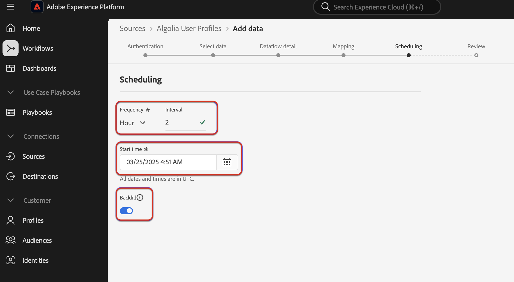
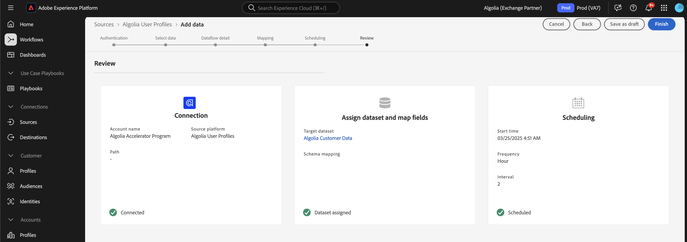

# Aufnehmen [!DNL Algolia User Profiles] Daten in Experience Platform über die Benutzeroberfläche

Lesen Sie dieses Tutorial, um zu erfahren, wie Sie mithilfe der Benutzeroberfläche Daten aus Ihrem [!DNL Algolia User Profiles]-Konto in Adobe Experience Platform aufnehmen.

## Erste Schritte

>[!IMPORTANT]
>
>Bevor Sie beginnen, stellen Sie sicher, dass Sie die in der [[!DNL Algolia User Profiles] Übersicht“ beschriebenen Schritte ](../../../../connectors/data-partners/algolia-user-profiles.md#prerequisites).

Dieses Tutorial setzt ein Grundverständnis der folgenden Komponenten von Experience Platform voraus:

* [[!DNL Experience Data Model (XDM)] System](../../../../../xdm/home.md): Das standardisierte Framework, mit dem Experience Platform Kundenerlebnisdaten organisiert.
   * [Grundlagen der Schemakomposition](../../../../../xdm/schema/composition.md): Machen Sie sich mit den grundlegenden Bausteinen von XDM-Schemata vertraut, einschließlich der wichtigsten Prinzipien und Best Practices bei der Schemaerstellung.
   * [Tutorial zum Schema-Editor](../../../../../xdm/tutorials/create-schema-ui.md): Erfahren Sie, wie Sie benutzerdefinierte Schemata mithilfe der Benutzeroberfläche des Schema-Editors erstellen können.
* [[!DNL Real-Time Customer Profile]](../../../../../profile/home.md): Bietet ein einheitliches Echtzeit-Kundenprofil, das auf aggregierten Daten aus verschiedenen Quellen basiert.
* [Quellen](../../../../home.md): Experience Platform ermöglicht die Aufnahme von Daten aus verschiedenen Quellen und bietet Ihnen die Möglichkeit, die eingehenden Daten mithilfe von Experience Platform-Services zu strukturieren, zu kennzeichnen und anzureichern.

### Sammeln erforderlicher Anmeldedaten

Um [!DNL Algolia] mit Experience Platform zu verbinden, müssen Sie Werte für die folgenden Anmeldeinformationen angeben:

| Anmeldedaten | Beschreibung |
| --- | --- |
| Anwendungs-ID | Die [!DNL Algolia]-Anwendungs-ID ist eine eindeutige Kennung, die Ihrem [!DNL Algolia]-Konto zugewiesen ist. |
| API-Schlüssel | Der [!DNL Algolia]-API-Schlüssel ist eine Berechtigung, die zum Authentifizieren und Autorisieren von API-Anfragen an die Such- und Indizierungs-Services von [!DNL Algolia] verwendet wird. |

Weitere Informationen zu diesen Anmeldeinformationen finden Sie unter [!DNL Algolia] [Authentifizierungsdokumentation](https://www.algolia.com/doc/tools/cli/get-started/authentication/).

## Verbinden Ihres [!DNL Algolia]-Kontos

Wählen Sie in der Experience Platform-Benutzeroberfläche **[!UICONTROL Quellen]** in der linken Navigationsleiste aus, um auf den Arbeitsbereich *[!UICONTROL Quellen]* zuzugreifen. Sie können die entsprechende Kategorie im Bedienfeld *[!UICONTROL Kategorien]* auswählen. Alternativ können Sie über die Suchleiste zu der spezifischen Quelle navigieren, die Sie verwenden möchten.

Um [!DNL Algolia] zu verwenden, wählen Sie die Quellkarte **[!UICONTROL Algolia]** unter *[!UICONTROL Daten- und Identitätspartner]* und dann **[!UICONTROL Einrichten]**.

>[!TIP]
>
>Quellen im Quellkatalog zeigen die Option **[!UICONTROL Einrichten]** an, wenn eine bestimmte Quelle noch kein authentifiziertes Konto hat. Sobald ein authentifiziertes Konto vorhanden ist, ändert sich diese Option in **[!UICONTROL Daten hinzufügen]**.

## Authentifizierung

### Vorhandenes Konto verwenden

Um ein vorhandenes Konto zu verwenden, wählen Sie **[!UICONTROL Vorhandenes Konto]** und dann das [!DNL Algolia User Profiles] Konto aus, das Sie verwenden möchten. Um fortzufahren, klicken Sie auf **[!UICONTROL Weiter]**.

### Neues Konto erstellen

Wenn Sie ein neues Konto erstellen, wählen Sie **[!UICONTROL Neues Konto]** und geben Sie dann einen Namen, eine optionale Beschreibung und [!DNL Algolia] Anmeldeinformationen an. Wenn Sie fertig sind, wählen Sie **[!UICONTROL Mit Quelle verbinden]** und warten Sie, bis die neue Verbindung hergestellt ist.

## Daten hinzufügen

Nach der Erstellung Ihres [!DNL Algolia User Profiles] Kontos wird der Schritt **[!UICONTROL Daten hinzufügen]** angezeigt, der Ihnen eine Oberfläche bietet, um Ihre [!DNL Algolia] Benutzerprofile zu untersuchen, die Sie an Experience Platform übermitteln möchten.

* Im linken Teil der Benutzeroberfläche können Sie optionale Felder **[!UICONTROL Indizes]** und **[!UICONTROL Affinität(en)]** eingeben.
* Im rechten Teil der Benutzeroberfläche können Sie eine Vorschau von bis zu 100 Zeilen mit Benutzerprofilen anzeigen.

Nachdem Sie Ihre Daten für die Aufnahme ausgewählt und in der Vorschau angezeigt haben, klicken Sie auf **[!UICONTROL Weiter]**.

## Angeben von Datenflussdetails

Wenn Sie einen vorhandenen Datensatz verwenden, wählen Sie einen Datensatz aus, der mit einem Schema verknüpft ist, das die [!DNL Algolia Profile] Feldergruppe verwendet.

Wenn Sie einen neuen Datensatz erstellen, wählen Sie ein Schema aus, das die [!DNL Algolia Profile] Feldergruppe verwendet, die im Zuordnungsschritt erforderlich ist.

## Zuordnen von Datenfeldern zu einem XDM-Schema

Verwenden Sie die Zuordnungsschnittstelle, um Ihre Quelldaten den entsprechenden Schemafeldern zuzuordnen, bevor Sie Daten in Experience Platform aufnehmen.  Weitere Informationen finden Sie im [Zuordnungshandbuch in der Benutzeroberfläche](../../../../../data-prep/ui/mapping.md).

## Planen von Aufnahmedurchgängen

Verwenden Sie als Nächstes die Zeitplanungs-Schnittstelle, um den Aufnahmezeitplan Ihres Datenflusses zu definieren.

<!-- The Scheduling step allows for configuration of the data/time to execute the [!DNL Algolia Uer Profiles] Source connector. There is configuration to backfill the data from [!DNL Algolia] which will pull all the profiles from the source system.  If the source is scheduled, then it will retrieve modified profiles from the [!DNL Algolia] based on the configured time interval. -->

| Konfiguration planen | Beschreibung |
| --- | --- |
| Häufigkeit | Konfigurieren Sie die Häufigkeit , um anzugeben, wie oft der Datenfluss ausgeführt werden soll. Sie können Ihre Häufigkeit auf Folgendes festlegen: <ul><li>**Einmal**: Legen Sie für die Häufigkeit `once` fest, um eine einmalige Aufnahme zu erstellen. Konfigurationen für Intervall und Aufstockung sind beim Erstellen eines einmaligen Aufnahme-Datenflusses nicht verfügbar. Standardmäßig ist die Zeitplanfrequenz auf einmal festgelegt.</li><li>**Minute**: Legen Sie für die Häufigkeit `minute` fest, um Ihren Datenfluss so zu planen, dass Daten pro Minute aufgenommen werden.</li><li>**Stunde**: Legen Sie für die Häufigkeit `hour` fest, um den Datenfluss zu planen und Daten stündlich aufzunehmen.</li><li>**Tag**: Legen Sie für Ihre Häufigkeit `day` fest, um Ihren Datenfluss so zu planen, dass Daten täglich aufgenommen werden.</li><li>**Woche**: Legen Sie für Ihre Häufigkeit `week` fest, um Ihren Datenfluss zu planen und Daten pro Woche aufzunehmen.</li></ul> |
| Intervall | Nachdem Sie eine Häufigkeit ausgewählt haben, können Sie die Intervalleinstellung konfigurieren, um den Zeitrahmen zwischen jeder Aufnahme festzulegen. Wenn Sie beispielsweise Ihre Häufigkeit auf „Tag“ festlegen und das Intervall auf 15 konfigurieren, wird Ihr Datenfluss alle 15 Tage ausgeführt. Das Intervall kann nicht auf null festgelegt werden. Der akzeptierte Mindestintervallwert für jede Häufigkeit ist wie folgt:<ul><li>**Einmal**: nicht zutreffend</li><li>**Minute**: 15</li><li>**Stunde**: 1</li><li>**Tag**: 1</li><li>**Woche**: 1</li></ul> |
| Startzeit | Der Zeitstempel für die projizierte Ausführung, dargestellt in UTC-Zeitzone. |
| Aufstockung | Die Aufstockung bestimmt, welche Daten anfänglich aufgenommen werden. Wenn die Aufstockung aktiviert ist, werden alle aktuellen Dateien im angegebenen Pfad während der ersten geplanten Aufnahme aufgenommen. Wenn die Aufstockung deaktiviert ist, werden nur die Dateien aufgenommen, die zwischen der ersten Aufnahme-Ausführung und der Startzeit geladen werden. Dateien, die vor der Startzeit geladen wurden, werden nicht aufgenommen. |

## Überprüfen des Datenflusses

Verwenden Sie die Überprüfungsseite für eine Zusammenfassung Ihres Datenflusses vor der Aufnahme. Die Details sind in die folgenden Kategorien unterteilt:

* **Verbindung** - Zeigt den Quelltyp, den relevanten Pfad der ausgewählten Quelldatei und die Anzahl der Spalten innerhalb dieser Quelldatei an.
* **Datensatz- und Zuordnungsfelder zuweisen** - Zeigt an, in welchen Datensatz die Quelldaten aufgenommen werden, einschließlich des Schemas, dem der Datensatz entspricht.
* **Planung** - Zeigt den aktiven Zeitraum, die Häufigkeit und das Intervall der Aufnahme an.

Nachdem Sie Ihren Datenfluss überprüft haben, klicken Sie auf **[!UICONTROL Beenden]** und gewähren Sie etwas Zeit für die Erstellung des Datenflusses.

## Nächste Schritte

In diesem Tutorial haben Sie erfolgreich einen Datenfluss erstellt, um Intent-Daten aus Ihrer [!DNL Algolia] in Experience Platform zu übertragen. Weitere Ressourcen finden Sie in der unten beschriebenen Dokumentation.

### Überwachen Ihres Datenflusses

Nachdem Ihr Datenfluss erstellt wurde, können Sie die Daten überwachen, die über ihn aufgenommen werden, um Informationen zu Aufnahmegeschwindigkeiten, Erfolg und Fehlern anzuzeigen. Weitere Informationen zum Überwachen von Datenflüssen finden Sie im Tutorial [Überwachen von Konten und Datenflüssen in der Benutzeroberfläche](../../../../../dataflows/ui/monitor-sources.md).

### Aktualisieren des Datenflusses

Um Konfigurationen für die Planung, Zuordnung und allgemeine Informationen Ihrer Datenflüsse zu aktualisieren, besuchen Sie das Tutorial [Aktualisieren von Quelldatenflüssen in der Benutzeroberfläche](../../update-dataflows.md).

### Löschen des Datenflusses

Datenflüsse, die nicht mehr erforderlich sind oder nicht korrekt erstellt wurden, können Sie löschen, indem Sie dazu die Funktion **[!UICONTROL Löschen]** im Arbeitsbereich **[!UICONTROL Datenflüsse]** verwenden. Weitere Informationen zum Löschen von Datenflüssen finden Sie im Tutorial [Löschen von Datenflüssen in der Benutzeroberfläche](../../delete.md).
