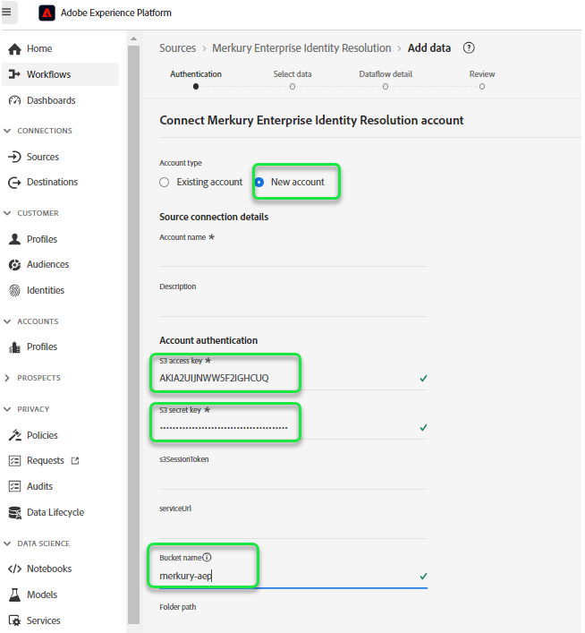

# Erstellen Sie eine [!DNL Merkury Enterprise Identity Resolution] Quellverbindung und Datenfluss in der Benutzeroberfläche

>[!NOTE]
>
>Die [!DNL Merkury Enterprise Identity Resolution]-Quelle befindet sich in der Beta-Phase. Bitte lesen Sie die [Quellen - Übersicht](../../../../home.md#terms-and-conditions) für weitere Informationen zur Verwendung von Beta-beschrifteten Quellen.

In diesem Tutorial werden Schritte zum Erstellen eines [!DNL Merkury Enterprise Identity Resolution] Quellverbindung und Datenfluss über die Adobe Experience Platform-Benutzeroberfläche.

## Erste Schritte

Dieses Tutorial setzt ein Grundverständnis der folgenden Komponenten von Experience Platform voraus:

* [[!DNL Experience Data Model (XDM)] System](../../../../../xdm/home.md): Das standardisierte Framework, mit dem Experience Platform Kundenerlebnisdaten organisiert.
   * [Grundlagen der Schemakomposition](../../../../../xdm/schema/composition.md): Machen Sie sich mit den grundlegenden Bausteinen von XDM-Schemas vertraut, einschließlich der wichtigsten Prinzipien und Best Practices bei der Schemaerstellung.
   * [Tutorial zum Schema-Editor](../../../../../xdm/tutorials/create-schema-ui.md): Erfahren Sie, wie Sie benutzerdefinierte Schemas mithilfe der Benutzeroberfläche des Schema-Editors erstellen können.
* [[!DNL Real-Time Customer Profile]](../../../../../profile/home.md): Bietet ein einheitliches Echtzeit-Kundenprofil, das auf aggregierten Daten aus verschiedenen Quellen basiert.

### Sammeln erforderlicher Anmeldeinformationen

Um auf Ihren Bucket auf dem Experience Platform zuzugreifen, müssen Sie gültige Werte für die folgenden Anmeldedaten angeben:

| Anmeldedaten | Beschreibung |
| --- | --- |
| Zugriffsschlüssel | Die Zugriffsschlüssel-ID für Ihren Behälter. Sie können diesen Wert aus Ihrem [!DNL Merkury] Team. |
| Geheimer Schlüssel | Die geheime Schlüssel-ID für Ihren Bucket. Sie können diesen Wert aus Ihrem [!DNL Merkury] Team. |
| Behältername | Dies ist Ihr Merkury-Bucket, in dem Dateien freigegeben werden. Sie können diesen Wert aus Ihrem [!DNL Merkury] Team. |

Weitere Informationen zur Einrichtung von [!DNL Merkury] und andere Voraussetzungen, lesen Sie die [[!DNL Merkury] Quellübersicht](../../../../connectors/data-partners/merkury.md).

## Ihr Merkur-Konto verbinden

Wählen Sie in der Platform-Benutzeroberfläche die Option **[!UICONTROL Quellen]** in der linken Navigationsleiste, um auf den Arbeitsbereich [!UICONTROL Quellen] zuzugreifen. Der Bildschirm [!UICONTROL Katalog] zeigt eine Vielzahl von Quellen an, mit denen Sie ein Konto erstellen können.

Sie können die gewünschte Kategorie aus dem Katalog auf der linken Bildschirmseite auswählen. Alternativ können Sie die gewünschte Quelle mithilfe der Suchoption finden.

Unter dem **[!UICONTROL Datenpartner]** category, select **[!UICONTROL Merkury]** und wählen Sie **[!UICONTROL Einrichten]**.

Die **[!UICONTROL Verbindung zu Merkury]** angezeigt. Auf dieser Seite können Sie entweder neue oder vorhandene Anmeldedaten verwenden.

### Neues Konto erstellen

Wenn Sie neue Anmeldeinformationen verwenden, wählen Sie **[!UICONTROL Neues Konto]**. Geben Sie im angezeigten Formular einen Namen, eine optionale Beschreibung und Ihre [!DNL Merkury] Anmeldedaten. Wählen Sie zum Abschluss **[!UICONTROL Verbindung mit Quelle herstellen]** und dann etwas Zeit für die Einrichtung der neuen Verbindung.

### Vorhandenes Konto verwenden

Um ein vorhandenes Konto zu verwenden, wählen Sie **[!UICONTROL Vorhandenes Konto]** und wählen Sie dann die [!DNL Merkury] -Konto, das Sie verwenden möchten. Klicken Sie auf **[!UICONTROL Weiter]**, um fortzufahren.

>[!BEGINSHADEBOX]

**Unterstützte Dateiformate**

Sie können die folgenden Dateiformate mit der [!DNL Merkury] source:

* Trennzeichen-Werte (DSV): Jeder einzelne Wert kann als Trennzeichen für DSV-formatierte Datendateien verwendet werden.
* [!DNL JavaScript Object Notation] (JSON): JSON-formatierte Datendateien müssen XDM-kompatibel sein.
* [!DNL Apache Parquet]: Parquet-formatierte Datendateien müssen XDM-konform sein.
* Komprimierte Dateien: JSON- und getrennte Dateien können wie folgt komprimiert werden: `bzip2`, `gzip`, `deflate`, `zipDeflate`, `tarGzip`, und `tar`.

>[!ENDSHADEBOX]

## Daten hinzufügen

Nach der Erstellung [!DNL Merkury] -Konto, **[!UICONTROL Daten hinzufügen]** angezeigt wird und eine Oberfläche bietet, über die Sie Ihre [!DNL Merkury] Dateihierarchie und wählen Sie den Ordner oder die Datei aus, die Sie auf Experience Platform bringen möchten.

* Der linke Teil der Benutzeroberfläche ist ein Verzeichnisbrowser, in dem Ihre [!DNL Merkury] Dateihierarchie.
* Im rechten Bereich der Benutzeroberfläche können Sie eine Vorschau von bis zu 100 Zeilen mit Daten aus einem kompatiblen Ordner oder einer kompatiblen Datei anzeigen.

Wählen Sie den Stammordner aus, um auf Ihre Ordnerhierarchie zuzugreifen. Von hier aus können Sie einen einzelnen Ordner auswählen, um alle Dateien rekursiv in den Ordner aufzunehmen. Beim Erfassen eines ganzen Ordners müssen Sie sicherstellen, dass alle Dateien in diesem Ordner dasselbe Datenformat und Schema aufweisen.

Nachdem Sie einen Ordner ausgewählt haben, wird die richtige Oberfläche aktualisiert, um eine Vorschau des Inhalts und der Struktur der ersten Datei im ausgewählten Ordner anzuzeigen.

Während dieses Schritts können Sie mehrere Konfigurationen an Ihren Daten vornehmen, bevor Sie fortfahren. Wählen Sie zuerst **[!UICONTROL Datenformat]** und wählen Sie dann das entsprechende Datenformat für Ihre Datei im angezeigten Dropdown-Bedienfeld aus.

In der folgenden Tabelle werden die entsprechenden Datenformate für die unterstützten Dateitypen angezeigt:

| Dateityp | Datenformat |
| --- | --- |
| CSV | [!UICONTROL Getrennt] |
| JSON | [!UICONTROL JSON] |
| Parquet | [!UICONTROL XDM Parquet] |

### Spaltentrennzeichen auswählen

+++Auswählen , um Schritte zum Festlegen eines Trennzeichens anzuzeigen

Nach der Konfiguration Ihres Datenformats können Sie beim Erfassen von durch Trennzeichen getrennten Dateien ein Spaltentrennzeichen festlegen. Wählen Sie die **[!UICONTROL Trennzeichen]** und wählen Sie dann ein Trennzeichen aus dem Dropdown-Menü aus. Im Menü werden die am häufigsten verwendeten Optionen für Trennzeichen angezeigt, darunter ein Komma (`,`), eine Registerkarte (`\t`) und einem senkrechten Strich (`|`).

Wenn Sie ein benutzerdefiniertes Trennzeichen bevorzugen, wählen Sie **[!UICONTROL Benutzerdefiniert]** und geben Sie in der Popup-Symbolleiste ein einzelnes Trennzeichen Ihrer Wahl ein.

+++

### Komprimierte Dateien erfassen

+++ Wählen Sie diese Option, um die Schritte zum Erfassen komprimierter Dateien anzuzeigen.

Sie können auch komprimierte JSON- oder durch Trennzeichen getrennte Dateien erfassen, indem Sie deren Komprimierungstyp angeben.

Im [!UICONTROL Daten auswählen] Schritt, wählen Sie eine komprimierte Datei für die Aufnahme aus und wählen Sie dann den entsprechenden Dateityp und ob sie XDM-kompatibel ist oder nicht. Wählen Sie als Nächstes **[!UICONTROL Komprimierungstyp]** und wählen Sie dann den entsprechenden komprimierten Dateityp für Ihre Quelldaten aus.

Um eine bestimmte Datei in Platform zu laden, wählen Sie einen Ordner aus und wählen Sie dann die Datei aus, die Sie aufnehmen möchten. Während dieses Schritts können Sie auch eine Vorschau des Dateiinhalts anderer Dateien in einem bestimmten Ordner anzeigen, indem Sie das Vorschausymbol neben einem Dateinamen verwenden.

Wenn Sie fertig sind, klicken Sie auf die Schaltfläche **[!UICONTROL Weiter]**.

+++

## Angeben von Datenflussdetails

Auf der Seite [!UICONTROL Datenflussdetails] können Sie auswählen, ob Sie einen vorhandenen Datensatz oder einen neuen Datensatz verwenden möchten. Während dieses Prozesses können Sie auch Ihre Daten für die Aufnahme in das Profil konfigurieren und Einstellungen wie [!UICONTROL Fehlerdiagnose], [!UICONTROL Partielle Erfassung], und [!UICONTROL Warnhinweise].

### Verwenden eines vorhandenen Datensatzes

Um Daten in einen vorhandenen Datensatz aufzunehmen, wählen Sie **[!UICONTROL Vorhandener Datensatz]**. Sie können einen vorhandenen Datensatz entweder über die Option [!UICONTROL Erweiterte Suche] oder durch Scrollen durch die Liste der vorhandenen Datensätze im Dropdown-Menü abrufen. Nachdem Sie einen Datensatz ausgewählt haben, geben Sie einen Namen und eine Beschreibung für Ihren Datenfluss ein.

### Verwenden eines neuen Datensatzes

Für ein Aufnehmen in einen neuen Datensatz wählen Sie **[!UICONTROL Neuer Datensatz]** aus und geben Sie einen Namen für den Ausgabedatensatz und eine optionale Beschreibung an. Wählen Sie als Nächstes mithilfe der Option [!UICONTROL Erweiterte Suche] oder durch Scrollen durch die Liste der vorhandenen Schemata im Dropdown-Menü ein Schema zum Zuordnen aus. Nachdem Sie ein Schema ausgewählt haben, geben Sie einen Namen und eine Beschreibung für Ihren Datenfluss ein.

### Profil- und Fehlerdiagnose aktivieren

++ + Auswählen, um Schritte zur Aktivierung der Fehlerdiagnose und Profilaufnahme anzuzeigen

Wählen Sie als Nächstes die **[!UICONTROL Profildatensatz]** aktivieren, um Ihren Datensatz für das Echtzeit-Kundenprofil zu aktivieren. Auf diese Weise können Sie eine ganzheitliche Ansicht der Attribute und Verhaltensweisen einer Entität erstellen. Daten aus allen profilaktivierten Datensätzen werden in das Profil aufgenommen und Änderungen werden angewendet, wenn Sie Ihren Datenfluss speichern.

[!UICONTROL Fehlerdiagnose] ermöglicht eine detaillierte Erstellung von Fehlermeldungen für alle fehlerhaften Datensätze, die in Ihrem Datenfluss auftreten, während [!UICONTROL Partielle Aufnahme] die Aufnahme von fehlerhaften Daten bis zu einem gewissen Schwellenwert, den Sie manuell definieren, ermöglicht. Weitere Informationen finden Sie in der [Übersicht zur partiellen Batch-Aufnahme](../../../../../ingestion/batch-ingestion/partial.md).

+++

### Aktivieren von Warnhinweisen

+++Auswählen, um Schritte zum Aktivieren von Warnhinweisen anzuzeigen

Sie können Warnhinweise aktivieren, um Benachrichtigungen zum Status Ihres Datenflusses zu erhalten. Wählen Sie einen Warnhinweis aus der zu abonnierenden Liste aus, um Benachrichtigungen über den Status Ihres Datenflusses zu erhalten. Weitere Informationen zu Warnhinweisen finden Sie im Handbuch zum [Abonnieren von Warnhinweisen zu Quellen über die Benutzeroberfläche](../../alerts.md).

Wenn Sie mit dem Eingeben der Details für Ihren Datenfluss fertig sind, klicken Sie auf **[!UICONTROL Weiter]**.

+++

## Zuordnen von Datenfeldern zu einem XDM-Schema

Es erfolgt der Schritt der [!UICONTROL Zuordnung], in dem Ihnen eine Schnittstelle zum Zuordnen der Quellfelder aus Ihrem Quellschema zu den entsprechenden XDM-Zielfeldern im Zielschema bereitgestellt wird.

Platform bietet intelligente Empfehlungen für automatisch zugeordnete Felder, die auf dem ausgewählten Zielschema oder Datensatz basieren. Sie können die Zuordnungsregeln manuell an Ihre Anwendungsfälle anpassen. Je nach Bedarf können Sie wahlweise Felder direkt zuordnen oder mithilfe von Datenvorbereitungsfunktionen Quelldaten transformieren, um berechnete oder anderweitig ermittelte Werte abzuleiten. Umfassende Schritte zur Verwendung der Mapper-Oberfläche und der berechneten Felder finden Sie im Abschnitt [Handbuch zur Datenvorbereitung-Benutzeroberfläche](../../../../../data-prep/ui/mapping.md).

Nachdem die Quelldaten erfolgreich zugeordnet wurden, wählen Sie **[!UICONTROL Nächste]**.

## Erfassungsläufe planen

Die [!UICONTROL Planung] angezeigt, sodass Sie einen Aufnahmezeitplan konfigurieren können, um die ausgewählten Quelldaten mithilfe der konfigurierten Zuordnungen automatisch zu erfassen. Standardmäßig ist die Planung auf `Once`. Um die Aufnahmefrequenz anzupassen, wählen Sie **[!UICONTROL Häufigkeit]** und wählen Sie dann eine Option aus dem Dropdown-Menü aus.

>[!TIP]
>
>Während einer einmaligen Erfassung sind Intervall und Aufstockung nicht sichtbar.

Wenn Sie die Aufnahmefrequenz auf `Minute`, `Hour`, `Day`oder `Week`, müssen Sie ein Intervall festlegen, um einen bestimmten Zeitrahmen zwischen jeder Aufnahme festzulegen. Eine Erfassungsfrequenz, die beispielsweise auf `Day` und ein Intervall festgelegt auf `15` bedeutet, dass Ihr Datenfluss alle 15 Tage Daten aufnehmen soll.

Während dieses Schritts können Sie auch **Aufstockung** und definieren eine Spalte für die inkrementelle Datenaufnahme. Die Aufstockung wird verwendet, um historische Daten zu erfassen, während die Spalte, die Sie für die inkrementelle Erfassung definieren, es ermöglicht, neue Daten von vorhandenen Daten zu unterscheiden.

Weitere Informationen zu Planungskonfigurationen finden Sie in der Tabelle unten.

| Feld | Beschreibung |
| --- | --- |
| Häufigkeit | Die Häufigkeit, mit der eine Aufnahme erfolgt. Selektive Häufigkeiten beinhalten `Once`, `Minute`, `Hour`, `Day`, und `Week`. |
| Intervall | Eine Ganzzahl, die das Intervall für die ausgewählte Häufigkeit festlegt. Der Wert des Intervalls sollte eine Ganzzahl ungleich null sein und auf größer oder gleich 15 gesetzt werden. |
| Startzeit | Ein UTC-Zeitstempel, der angibt, wann die erste Aufnahme erfolgen soll. Die Startzeit muss größer oder gleich der aktuellen UTC-Zeit sein. |
| Aufstockung | Ein boolean -Wert, der bestimmt, welche Daten ursprünglich erfasst werden. Wenn die Aufstockung aktiviert ist, werden alle aktuellen Dateien im angegebenen Pfad während der ersten geplanten Erfassung erfasst. Wenn die Aufstockung deaktiviert ist, werden nur die Dateien erfasst, die zwischen der ersten Ausführung der Aufnahme und der Startzeit geladen werden. Dateien, die vor der Startzeit geladen wurden, werden nicht erfasst. |

>[!NOTE]
>
>Bei der Batch-Aufnahme wählt jeder nachfolgende Datenfluss die aufzunehmenden Dateien aus Ihrer Quelle anhand ihres **zuletzt geänderten** Zeitstempels aus. Das bedeutet, dass Batch-Datenflüsse ausgewählte Dateien aus der Quelle auswählen, die neu sind oder seit der letzten Flussausführung geändert wurden. Darüber hinaus müssen Sie sicherstellen, dass zwischen dem Datei-Upload und einem geplanten Ablauf ausreichend Zeit ist, da Dateien, die nicht vollständig in Ihr Cloud-Speicherkonto hochgeladen wurden, bevor die geplante Flusslaufzeit möglicherweise nicht zur Aufnahme abgerufen wird.

Wählen Sie nach Abschluss der Konfiguration Ihres Aufnahmezeitplans **[!UICONTROL Nächste]**.

## Überprüfen des Datenflusses

Der Schritt **[!UICONTROL Überprüfung]** wird angezeigt, sodass Sie Ihren neuen Datenfluss überprüfen können, bevor er hergestellt wird. Die Details lassen sich wie folgt kategorisieren:

* **[!UICONTROL Verbindung]**: Zeigt den Quelltyp, den relevanten Pfad der ausgewählten Quelldatei und die Anzahl der Spalten innerhalb dieser Quelldatei an.
* **[!UICONTROL Datensatz- und Zuordnungsfelder zuweisen]**: Zeigt an, in welchen Datensatz die Quelldaten aufgenommen werden, einschließlich des Schemas, dem der Datensatz entspricht.
* **[!UICONTROL Planung]**: Zeigt den aktiven Zeitraum, die Häufigkeit und das Intervall des Aufnahmezeitplans an.

Nachdem Sie Ihren Datenfluss überprüft haben, klicken Sie auf **[!UICONTROL Beenden]** und lassen Sie etwas Zeit für die Erstellung des Datenflusses zu.

## Nächste Schritte

In diesem Tutorial haben Sie erfolgreich einen Datenfluss erstellt, um Batch-Daten aus Ihrem [!DNL Merkury] -Quelle zu Experience Platform. Weitere Ressourcen finden Sie in der unten beschriebenen Dokumentation.

### Überwachen Ihres Datenflusses

Nachdem Ihr Datenfluss erstellt wurde, können Sie die erfassten Daten überwachen, um Informationen zu Erfassungsraten, Erfolg und Fehlern anzuzeigen. Weitere Informationen zum Überwachen des Datenflusses finden Sie im Tutorial zu [Überwachen von Konten und Datenflüssen in der Benutzeroberfläche](../../monitor.md).

### Aktualisieren des Datenflusses

Um Konfigurationen für die Planung, Zuordnung und allgemeine Informationen Ihrer Datenflüsse zu aktualisieren, besuchen Sie das Tutorial zu [Aktualisieren von Datenflüssen für Quellen in der Benutzeroberfläche](../../update-dataflows.md)

### Löschen des Datenflusses

Datenflüsse, die nicht mehr erforderlich sind oder nicht korrekt erstellt wurden, können Sie löschen, indem Sie dazu die Funktion **[!UICONTROL Löschen]** im Arbeitsbereich **[!UICONTROL Datenflüsse]** verwenden. Weitere Informationen zum Löschen von Datenflüssen finden Sie im Tutorial zu [Löschen von Datenflüssen in der Benutzeroberfläche](../../delete.md).