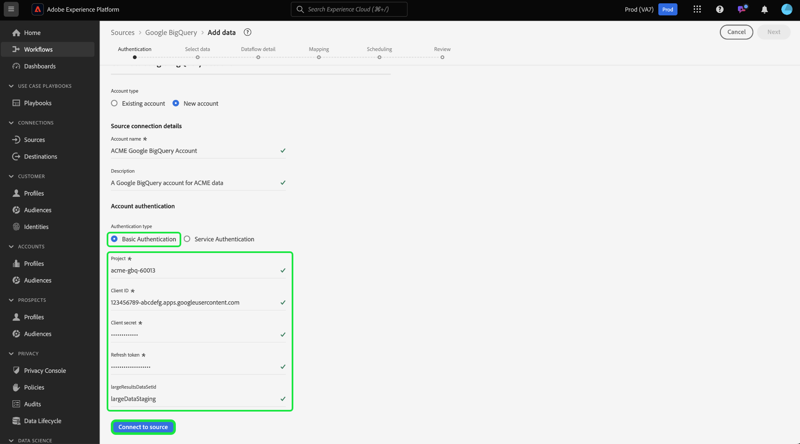

# Erstellen eines Quell-Connectors für [!DNL Google BigQuery] in der Benutzeroberfläche

>[!IMPORTANT]
>
>Die Quelle &quot;[!DNL Google BigQuery]&quot; steht Benutzern, die Real-time Customer Data Platform Ultimate erworben haben, im Quellkatalog zur Verfügung.

In diesem Tutorial erfahren Sie, wie Sie Ihr [!DNL Google BigQuery]-Konto über die Benutzeroberfläche mit Adobe Experience Platform verbinden.

## Erste Schritte

Dieses Tutorial setzt ein Grundverständnis der folgenden Komponenten von Experience Platform voraus:

* [[!DNL Experience Data Model (XDM)] System](../../../../../xdm/home.md): Das standardisierte Framework, mit dem Experience Platform Kundenerlebnisdaten organisiert.
   * [Grundlagen der Schemakomposition](../../../../../xdm/schema/composition.md): Machen Sie sich mit den grundlegenden Bausteinen von XDM-Schemata vertraut, einschließlich der wichtigsten Prinzipien und Best Practices bei der Schemaerstellung.
   * [Tutorial zum Schema-Editor](../../../../../xdm/tutorials/create-schema-ui.md): Erfahren Sie, wie Sie benutzerdefinierte Schemata mithilfe der Benutzeroberfläche des Schema-Editors erstellen können.
* [[!DNL Real-Time Customer Profile]](../../../../../profile/home.md): Bietet ein einheitliches Echtzeit-Kundenprofil, das auf aggregierten Daten aus verschiedenen Quellen basiert.

Wenn Sie bereits über eine gültige [!DNL Google BigQuery]-Verbindung verfügen, können Sie den Rest dieses Dokuments überspringen und mit dem Tutorial zum [Konfigurieren eines Datenflusses](../../dataflow/databases.md) fortfahren.

### Sammeln erforderlicher Anmeldedaten

Ausführliche Anweisungen zum Erfassen der erforderlichen Anmeldedaten finden Sie im [[!DNL Google BigQuery] Authentifizierungshandbuch](../../../../connectors/databases/bigquery.md#generate-your-google-bigquery-credentials) .

## Google BigQuery-Konto verbinden

Wählen Sie in der Platform-Benutzeroberfläche in der linken Navigationsleiste die Option **[!UICONTROL Quellen]**, um auf den Arbeitsbereich [!UICONTROL Quellen] zuzugreifen. Der Bildschirm [!UICONTROL Katalog] enthält verschiedene Quellen, mit denen Sie ein Konto erstellen können. Sie können die gewünschte Kategorie aus dem Katalog auf der linken Bildschirmseite auswählen. Alternativ können Sie die gewünschte Quelle mithilfe der Suchleiste finden.

Wählen Sie unter der Kategorie [!UICONTROL Datenbanken] die Option **[!UICONTROL Google BigQuery]** und dann **[!UICONTROL Daten hinzufügen]** aus.

>[!TIP]
>
>Quellen im Quellkatalog zeigen die Option **[!UICONTROL Einrichten]** an, wenn eine Quelle noch kein authentifiziertes Konto hat. Sobald ein authentifiziertes Konto vorhanden ist, wird diese Option in **[!UICONTROL Daten hinzufügen]** geändert.

Die Seite **[!UICONTROL Verbindung mit Google Big Query herstellen]** wird angezeigt. Auf dieser Seite können Sie entweder neue oder vorhandene Anmeldedaten verwenden.

### Vorhandenes Konto

Um ein vorhandenes Konto zu verbinden, wählen Sie das [!DNL Google BigQuery]-Konto aus, mit dem Sie eine Verbindung herstellen möchten, und klicken Sie dann auf **[!UICONTROL Weiter]** , um fortzufahren.

### Neues Konto

Wenn Sie ein neues Konto erstellen, wählen Sie **[!UICONTROL Neues Konto]** und geben Sie dann einen Namen und eine optionale Beschreibung für Ihr neues [!DNL Google BigQuery]-Konto ein.

>[!BEGINTABS]

>[!TAB Grundlegende Authentifizierung verwenden]

Um die einfache Authentifizierung zu verwenden, wählen Sie **[!UICONTROL Grundlegende Authentifizierung]** aus und geben Sie Werte für Ihr [Projekt, Ihre Client-ID, Ihr Client-Geheimnis, das Aktualisierungstoken und (optional) die Datensatz-ID für große Ergebnisse](../../../../connectors/databases/bigquery.md#generate-your-google-bigquery-credentials) an. Wenn Sie fertig sind, wählen Sie **[!UICONTROL Mit Quelle verbinden]** und warten Sie einige Augenblicke, bis die Verbindung hergestellt wird.

>[!TAB Dienstauthentifizierung verwenden]

Um die Dienstauthentifizierung zu verwenden, wählen Sie **[!UICONTROL Dienstauthentifizierung]** aus und geben Sie Werte für Ihre [Projekt-ID, den Inhalt der Schlüsseldatei und (optional) die Datensatz-ID des großen Ergebnisdatensatzes](../../../../connectors/databases/bigquery.md#generate-your-google-bigquery-credentials) an. Wenn Sie fertig sind, wählen Sie **[!UICONTROL Mit Quelle verbinden]** und warten Sie einige Augenblicke, bis die Verbindung hergestellt wird.

>[!ENDTABS]

### Vorschau der Beispieldaten überspringen {#skip-preview-of-sample-data}

Während des Datenauswahlschritts kann es bei der Aufnahme großer Tabellen oder Datendateien zu einer Zeitüberschreitung kommen. Sie können die Datenvorschau überspringen, um die Zeitüberschreitung zu umgehen und Ihr Schema weiterhin anzuzeigen, wenn auch ohne Beispieldaten. Um die Datenvorschau zu überspringen, aktivieren Sie den Umschalter **[!UICONTROL Vorschau der Beispieldaten überspringen]** .

Der Rest des Workflows bleibt unverändert. Der einzige Nachteil besteht darin, dass das Überspringen der Datenvorschau verhindern kann, dass berechnete und erforderliche Felder während des Zuordnungsschritts automatisch validiert werden. Anschließend müssen Sie diese Felder während der Zuordnung manuell validieren.

## Nächste Schritte

Mithilfe dieses Tutorials haben Sie eine Verbindung zu Ihrem [!DNL Google BigQuery]-Konto hergestellt. Sie können jetzt mit dem nächsten Tutorial fortfahren und einen [Datenfluss konfigurieren, um Daten in Platform zu importieren](../../dataflow/databases.md).
