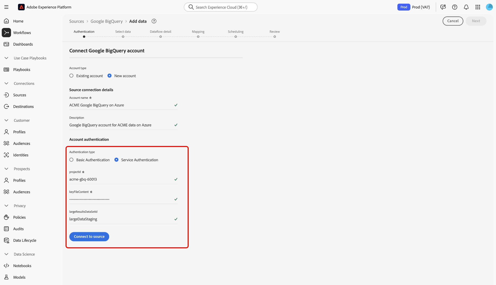

# Verbinden von [!DNL Google BigQuery] mit Experience Platform über die Benutzeroberfläche

>[!IMPORTANT]
>
>Die [!DNL Google BigQuery] ist im Quellkatalog für Benutzende verfügbar, die Real-Time Customer Data Platform Ultimate erworben haben.

Lesen Sie dieses Tutorial, um zu erfahren, wie Sie Ihr [!DNL Google BigQuery]-Konto über die Benutzeroberfläche mit Adobe Experience Platform verbinden.

## Erste Schritte

Dieses Tutorial setzt ein Grundverständnis der folgenden Komponenten von Experience Platform voraus:

* [[!DNL Experience Data Model (XDM)] System](../../../../../xdm/home.md): Das standardisierte Framework, mit dem Experience Platform Kundenerlebnisdaten organisiert.
   * [Grundlagen der Schemakomposition](../../../../../xdm/schema/composition.md): Machen Sie sich mit den grundlegenden Bausteinen von XDM-Schemata vertraut, einschließlich der wichtigsten Prinzipien und Best Practices bei der Schemaerstellung.
   * [Tutorial zum Schema-Editor](../../../../../xdm/tutorials/create-schema-ui.md): Erfahren Sie, wie Sie benutzerdefinierte Schemata mithilfe der Benutzeroberfläche des Schema-Editors erstellen können.
* [[!DNL Real-Time Customer Profile]](../../../../../profile/home.md): Bietet ein einheitliches Echtzeit-Kundenprofil, das auf aggregierten Daten aus verschiedenen Quellen basiert.

Wenn Sie bereits über eine gültige [!DNL Google BigQuery]-Verbindung verfügen, können Sie den Rest dieses Dokuments überspringen und mit dem Tutorial zum [Konfigurieren eines Datenflusses](../../dataflow/databases.md) fortfahren.

### Sammeln erforderlicher Anmeldedaten

Ausführliche Schritte zum Sammeln [[!DNL Google BigQuery]  erforderlichen Anmeldeinformationen finden Sie &#x200B;](../../../../connectors/databases/bigquery.md#prerequisites) Authentifizierungshandbuch .

## Navigieren im Quellkatalog {#navigate}

Wählen Sie in der Experience Platform-Benutzeroberfläche **[!UICONTROL Quellen]** in der linken Navigationsleiste aus, um auf den Arbeitsbereich *[!UICONTROL Quellen]* zuzugreifen. Sie können die entsprechende Kategorie im Bedienfeld *[!UICONTROL Kategorien]* auswählen. Alternativ können Sie die Suchleiste verwenden, um zur gewünschten Quelle zu navigieren.

Um [!DNL Google BigQuery] zu verwenden, wählen Sie die Quellkarte **[!UICONTROL Google BigQuery]** unter *[!UICONTROL Datenbanken]* und dann **[!UICONTROL Daten hinzufügen]** aus.

>[!TIP]
>
>Quellen im Quellkatalog zeigen die Option **[!UICONTROL Einrichten]** an, wenn eine bestimmte Quelle noch kein authentifiziertes Konto hat. Nachdem ein authentifiziertes Konto erstellt wurde, ändert sich diese Option in **[!UICONTROL Daten hinzufügen]**.

## Vorhandenes Konto verwenden {#existing}

Um ein vorhandenes Konto zu verwenden, wählen Sie das [!DNL Google BigQuery] Konto, mit dem Sie eine Verbindung herstellen möchten, und klicken Sie dann auf **[!UICONTROL Weiter]**, um fortzufahren.

## Neues Konto erstellen {#create}

Wenn Sie noch kein -Konto haben, müssen Sie ein neues Konto erstellen, indem Sie die Authentifizierungsdaten angeben, die Ihrer Quelle entsprechen.

Um ein neues Konto zu erstellen, wählen Sie **[!UICONTROL Neues Konto]** und geben Sie dann einen Namen an und fügen Sie optional eine Beschreibung für Ihr Konto hinzu.

### Verbindung zu Experience Platform auf Azure herstellen {#azure}

Sie können Ihr [!DNL Google BigQuery]-Konto mit Experience Platform auf Azure verbinden, indem Sie entweder die Standard- oder die Service-Authentifizierung verwenden.

>[!BEGINTABS]

>[!TAB Einfache Authentifizierung verwenden]

Um die Standardauthentifizierung zu verwenden, wählen Sie **[!UICONTROL Standardauthentifizierung]** aus und geben Sie Werte für Ihr [Projekt, Ihre Client-ID, Ihr Client-Geheimnis, Ihr Aktualisierungs-Token und (optional) die Datensatz-ID für große Ergebnisse](../../../../connectors/databases/bigquery.md#generate-your-google-bigquery-credentials) an. Wenn Sie fertig sind, wählen **[!UICONTROL Mit Quelle verbinden]** und warten Sie einige Augenblicke, bis die Verbindung hergestellt ist.

>[!TAB Service-Authentifizierung verwenden]

Um die Service-Authentifizierung zu verwenden **[!UICONTROL wählen Sie]** Service-Authentifizierung“ aus und geben Sie Werte für Ihre [Projekt-ID, den Inhalt der Schlüsseldatei und (optional) die Datensatz-ID für große Ergebnisse](../../../../connectors/databases/bigquery.md#generate-your-google-bigquery-credentials) an. Wenn Sie fertig sind, wählen **[!UICONTROL Mit Quelle verbinden]** und warten Sie einige Augenblicke, bis die Verbindung hergestellt ist.

>[!ENDTABS]

### Verbinden mit Experience Platform auf Amazon Web Services (AWS) {#aws}

>[!AVAILABILITY]
>
>Dieser Abschnitt gilt für Implementierungen von Experience Platform, die auf Amazon Web Services (AWS) ausgeführt werden. Experience Platform, das auf AWS ausgeführt wird, steht derzeit einer begrenzten Anzahl von Kunden zur Verfügung. Weitere Informationen zur unterstützten Experience Platform-Infrastruktur finden Sie in der Übersicht zur [Experience Platform Multi-Cloud](../../../../../landing/multi-cloud.md).

Um ein neues [!DNL Google BigQuery]-Konto zu erstellen und eine Verbindung zu Experience Platform auf AWS herzustellen, stellen Sie sicher, dass Sie sich in einer VA6-Sandbox befinden, und geben Sie dann die erforderlichen Anmeldeinformationen zur Authentifizierung an.

* **Projekt-ID**: Die Projekt-ID, die Ihrem [!DNL Google BigQuery]-Konto entspricht.
* **Schlüsseldateiinhalt**: Die Schlüsseldatei, die zum Authentifizieren des Service-Kontos verwendet wird. Sie können diesen Wert aus dem [[!DNL Google Cloud service accounts] Dashboard](https://console.cloud.google.com) abrufen. Der Inhalt der Schlüsseldatei liegt im JSON-Format vor. Sie müssen dies bei der Authentifizierung bei Experience Platform in [!DNL Base64] kodieren.
* **Datensatz-**: Die [!DNL Google BigQuery] Datensatz-ID. Diese ID stellt dar, wo sich Ihre Datentabellen befinden, und muss vorab erstellt werden, um die Unterstützung für große Ergebnismengen zu ermöglichen.

## Vorschau der Beispieldaten überspringen {#skip-preview-of-sample-data}

Während des Datenauswahlschritts kann es bei der Aufnahme großer Datentabellen oder -dateien zu einer Zeitüberschreitung kommen. Sie können die Datenvorschau überspringen, um die Zeitüberschreitung zu umgehen, und Ihr Schema dennoch anzeigen, wenn auch ohne Beispieldaten. Um die Datenvorschau zu überspringen, aktivieren Sie den Umschalter **[!UICONTROL Vorschau von Beispieldaten überspringen]**.

Der Rest des Workflows bleibt unverändert. Der einzige Nachteil besteht darin, dass das Überspringen der Datenvorschau verhindert, dass berechnete und erforderliche Felder während des Zuordnungsschritts automatisch validiert werden. Diese Felder müssen dann während der Zuordnung manuell validiert werden.

## Nächste Schritte

Mithilfe dieses Tutorials haben Sie eine Verbindung zu Ihrem [!DNL Google BigQuery]-Konto hergestellt. Sie können jetzt mit dem nächsten Tutorial fortfahren und [einen Datenfluss konfigurieren, um Daten in Experience Platform zu importieren](../../dataflow/databases.md).
