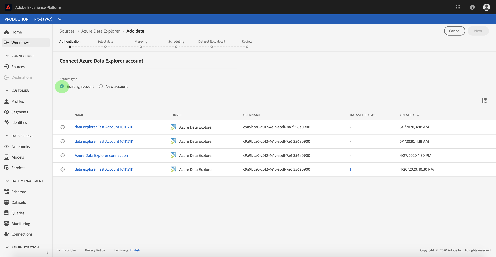

# Erstellen Sie eine [!DNL Azure Data Explorer] Quellverbindung in der Benutzeroberfläche

Quell-Connectoren in Adobe Experience Platform bieten die Möglichkeit, extern bezogene Daten auf geplanter Basis zu erfassen. In diesem Tutorial werden Schritte zum Erstellen eines [!DNL Azure Data Explorer] (nachstehend &quot;genannt)[!DNL Data Explorer]&quot;) Quell-Connector mit dem [!DNL Platform] -Benutzeroberfläche.

## Erste Schritte

Dieses Tutorial setzt ein Grundverständnis der folgenden Komponenten von Adobe Experience Platform voraus:

* [[!DNL Experience Data Model (XDM)] System](../../../../../xdm/home.md): Das standardisierte Framework, mit dem [!DNL Experience Platform] Kundenerlebnisdaten organisiert.
   * [Grundlagen der Schemakomposition](../../../../../xdm/schema/composition.md): Machen Sie sich mit den grundlegenden Bausteinen von XDM-Schemas vertraut, einschließlich der wichtigsten Prinzipien und Best Practices bei der Schemaerstellung.
   * [Tutorial zum Schema-Editor](../../../../../xdm/tutorials/create-schema-ui.md): Erfahren Sie, wie Sie benutzerdefinierte Schemas mithilfe der Benutzeroberfläche des Schema-Editors erstellen können.
* [[!DNL Real-Time Customer Profile]](../../../../../profile/home.md): Bietet ein einheitliches Echtzeit-Kundenprofil, das auf aggregierten Daten aus verschiedenen Quellen basiert.

Wenn Sie bereits über eine gültige [!DNL Data Explorer]-Verbindung verfügen, können Sie den Rest dieses Dokuments überspringen und mit dem Tutorial zum [Konfigurieren eines Datenflusses](../../dataflow/databases.md) fortfahren.

### Sammeln erforderlicher Anmeldeinformationen

Um auf Ihr [!DNL Data Explorer]-Konto in zugreifen zu können, müssen Sie die folgenden Werte angeben:[!DNL Platform]

| Anmeldedaten | Beschreibung |
| ---------- | ----------- |
| `endpoint` | Der Endpunkt des [!DNL Data Explorer]-Servers. |
| `database` | Der Name der [!DNL Data Explorer] Datenbank. |
| `tenant` | Die eindeutige Mandantenkennung, die für die Verbindung mit der [!DNL Data Explorer] Datenbank. |
| `servicePrincipalId` | Die eindeutige Dienstprinzipal-ID, die für die Verbindung mit dem [!DNL Data Explorer] Datenbank. |
| `servicePrincipalKey` | Der Hauptschlüssel des eindeutigen Dienstes, der für die Verbindung mit dem [!DNL Data Explorer] Datenbank. |

Weitere Informationen zu den ersten Schritten finden Sie unter [this [!DNL Data Explorer] Dokument](https://docs.microsoft.com/en-us/azure/data-explorer/kusto/management/access-control/how-to-authenticate-with-aad).

## Verbinden Ihres [!DNL Azure Data Explorer]-Kontos

Nachdem Sie die erforderlichen Anmeldedaten erfasst haben, können Sie die folgenden Schritte ausführen, um Ihr [!DNL Data Explorer]-Konto mit [!DNL Platform] zu verknüpfen.

Anmelden bei [Adobe Experience Platform](https://platform.adobe.com) und wählen Sie **[!UICONTROL Quellen]** über die linke Navigationsleiste, um auf die **[!UICONTROL Quellen]** Arbeitsbereich. Die **[!UICONTROL Katalog]** zeigt eine Vielzahl von Quellen an, für die Sie ein Konto erstellen können.

Sie können die gewünschte Kategorie aus dem Katalog auf der linken Bildschirmseite auswählen. Alternativ können Sie die gewünschte Quelle mithilfe der Suchoption finden.

Unter dem **[!UICONTROL Datenbanken]** category, select **[!UICONTROL Azure-Data Explorer]**. Wenn Sie diesen Connector zum ersten Mal verwenden, wählen Sie **[!UICONTROL Konfigurieren]**. Andernfalls wählen Sie **[!UICONTROL Daten hinzufügen]** , um einen neuen Data Explorer-Connector zu erstellen.

Die **[!UICONTROL Verbindung zu Azure Data Explorer herstellen]** angezeigt. Auf dieser Seite können Sie entweder neue oder vorhandene Anmeldedaten verwenden.

### Neues Konto

Wenn Sie neue Anmeldeinformationen verwenden, wählen Sie **[!UICONTROL Neues Konto]** aus. Geben Sie im angezeigten Formular einen Namen, eine optionale Beschreibung und Ihre [!DNL Data Explorer] Anmeldedaten. Wenn Sie fertig sind, wählen Sie **[!UICONTROL Verbinden]** und dann etwas Zeit für die Einrichtung der neuen Verbindung.

### Vorhandenes Konto

Um ein vorhandenes Konto zu verbinden, wählen Sie die [!DNL Data Explorer] Konto, mit dem Sie eine Verbindung herstellen möchten, wählen Sie **[!UICONTROL Nächste]** um fortzufahren.

## Nächste Schritte

Mithilfe dieses Tutorials haben Sie eine Verbindung zu Ihrem [!DNL Data Explorer]-Konto hergestellt. Sie können jetzt mit dem nächsten Tutorial fortfahren und einen [Datenfluss konfigurieren, um Daten in zu importieren [!DNL Platform]](../../dataflow/databases.md).
