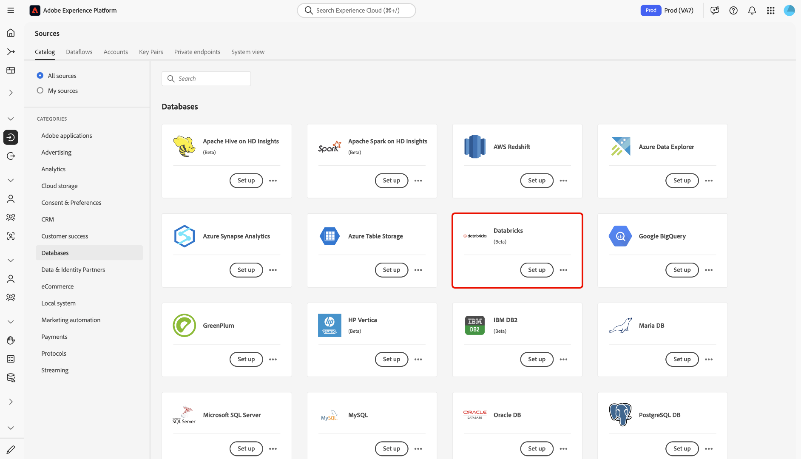
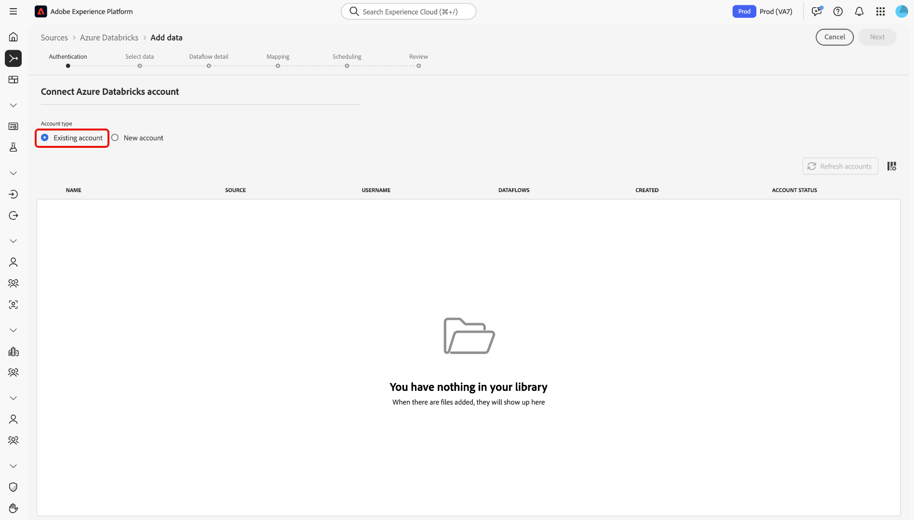
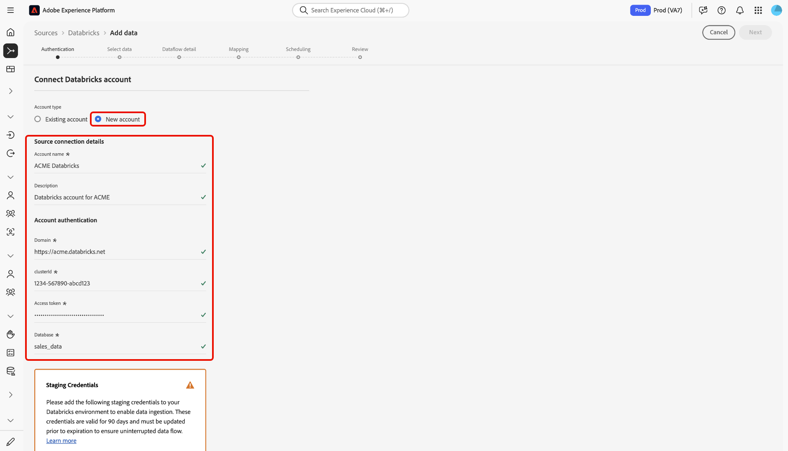
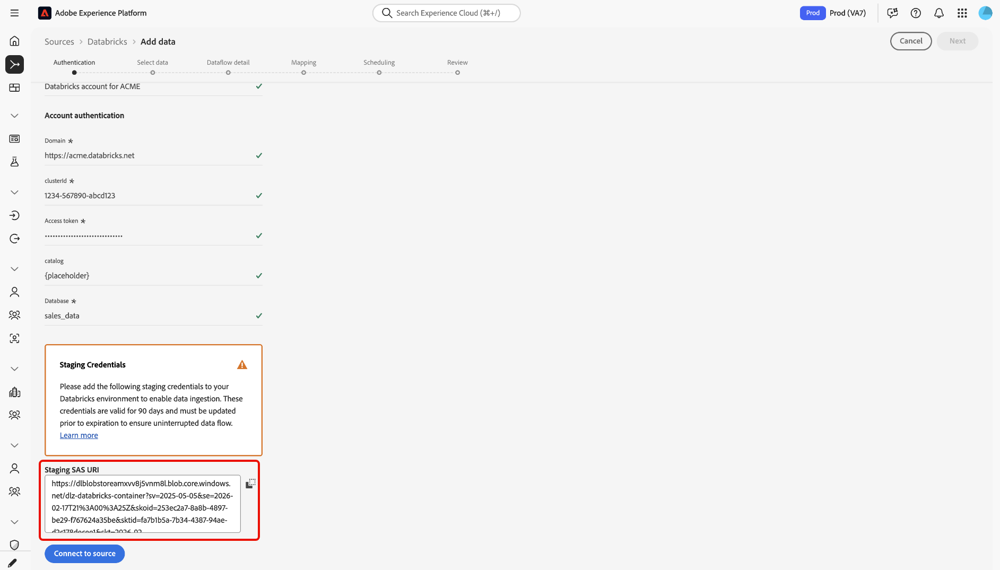

# Verbinden von [!DNL Databricks] mit Experience Platform über die Benutzeroberfläche

>[!AVAILABILITY]
>
>Die [!DNL Databricks] ist im Quellkatalog für Benutzende verfügbar, die Real-Time CDP Ultimate erworben haben.

Lesen Sie dieses Handbuch, um zu erfahren, wie Sie Ihr [!DNL Databricks]-Konto mithilfe des Quellarbeitsbereichs in der Benutzeroberfläche mit Adobe Experience Platform verbinden.

## Erste Schritte

Dieses Handbuch setzt ein Verständnis der folgenden Komponenten von Experience Platform voraus:

* [Quellen](../../../../home.md): Experience Platform ermöglicht die Aufnahme von Daten aus verschiedenen Quellen und bietet Ihnen die Möglichkeit, die eingehenden Daten mithilfe von Experience Platform-Services zu strukturieren, zu kennzeichnen und anzureichern.
* [Sandboxes](../../../../../sandboxes/home.md): Experience Platform bietet virtuelle Sandboxes, die eine einzelne Experience Platform-Instanz in separate virtuelle Umgebungen unterteilen, damit Sie Programme für digitale Erlebnisse besser entwickeln und weiterentwickeln können.

### Sammeln erforderlicher Anmeldedaten

Geben Sie Werte für die folgenden Anmeldeinformationen an, um [!DNL Databricks] mit Experience Platform zu verbinden.

| Anmeldedaten | Beschreibung |
| --- | --- |
| Domain | Die URL Ihres [!DNL Databricks]. Beispiel: `https://adb-1234567890123456.7.azuredatabricks.net`. |
| Cluster-ID | Die ID Ihres Clusters in [!DNL Databricks]. Dieser Cluster muss bereits ein vorhandener Cluster sein und sollte ein interaktiver Cluster sein. |
| Zugriffs-Token | Das Zugriffstoken, das Ihr [!DNL Databricks]-Konto authentifiziert. Sie können Ihr Zugriffs-Token mit dem [!DNL Databricks] Workspace generieren. |
| Datenbank | Der Name Ihrer Datenbank im Delta Lake. |

Weitere Informationen finden Sie in der [[!DNL Databricks] Übersicht](../../../../connectors/databases/databricks.md).

## Navigieren im Quellkatalog

Wählen Sie in der Benutzeroberfläche von Experience Platform in der linken Navigationsleiste die Option **[!UICONTROL Sources]** , um auf den *[!UICONTROL Sources]*-Arbeitsbereich zuzugreifen. Wählen Sie eine Kategorie aus oder verwenden Sie die Suchleiste, um Ihre Quelle zu finden.

Um eine Verbindung zu [!DNL Databricks] herzustellen, navigieren Sie zur Kategorie *[!UICONTROL Databases]*, wählen Sie die Karte **[!UICONTROL Azure Databricks]** und dann **[!UICONTROL Set up]** aus.

>[!TIP]
>
>Quellen im Quellkatalog zeigen die **[!UICONTROL Set up]** an, wenn eine bestimmte Quelle noch kein authentifiziertes Konto hat. Nachdem ein authentifiziertes Konto erstellt wurde, ändert sich diese Option in **[!UICONTROL Add data]**.

### Vorhandenes Konto verwenden

Um ein vorhandenes Konto zu verwenden, klicken Sie auf **[!UICONTROL Existing account]** und wählen Sie dann das [!DNL Azure Databricks] Konto aus, das Sie verwenden möchten.

### Neues Konto erstellen

Um ein neues Konto zu erstellen, wählen Sie **[!UICONTROL New account]** aus, geben Sie einen Namen an und fügen Sie optional eine Beschreibung für Ihr Konto hinzu. Geben Sie als Nächstes Werte für die folgenden Authentifizierungsberechtigungen an:

* Domain
* Cluster-ID
* Zugriffs-Token
* Datenbank
* Catalog

Darüber hinaus müssen Sie Ihre [!UICONTROL Staging SAS URI]-Anmeldeinformationen kopieren und in Ihre [!DNL Azure Databricks]-Umgebung einfügen. Wenn Sie fertig sind, wählen Sie **[!UICONTROL Connect to source]** aus und warten Sie einige Augenblicke, bis die Verbindung hergestellt ist.

## Erstellen eines Datenflusses für [!DNL Azure Databricks] Daten

Nachdem Sie Ihr [!DNL Azure Databricks]-Konto erfolgreich verbunden haben, können Sie jetzt [einen Datenfluss erstellen und Daten aus Ihrer Datenbank in Experience Platform aufnehmen](../../dataflow/databases.md).
