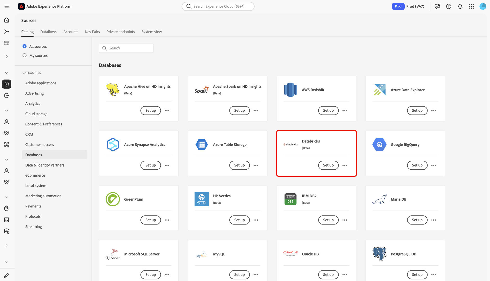

# Verbinden von [!DNL Azure Databricks] mit Experience Platform über die Benutzeroberfläche

>[!AVAILABILITY]
>
>* Die [!DNL Azure Databricks] ist im Quellkatalog für Benutzende verfügbar, die Real-Time CDP Ultimate erworben haben.
>
>* Die [!DNL Azure Databricks]-Quelle befindet sich in der Beta-Phase. Weitere Informationen zur Verwendung von Beta[gekennzeichneten Quellen finden Sie ](../../../../home.md#terms-and-conditions) den „Nutzungsbedingungen“ in der Quellenübersicht .

Lesen Sie dieses Handbuch, um zu erfahren, wie Sie Ihr [!DNL Azure Databricks]-Konto mithilfe des Quellarbeitsbereichs in der Benutzeroberfläche mit Adobe Experience Platform verbinden.

## Erste Schritte

Dieses Handbuch setzt ein Verständnis der folgenden Komponenten von Experience Platform voraus:

* [Quellen](../../../../home.md): Experience Platform ermöglicht die Aufnahme von Daten aus verschiedenen Quellen und bietet Ihnen die Möglichkeit, die eingehenden Daten mithilfe von Experience Platform-Services zu strukturieren, zu kennzeichnen und anzureichern.
* [Sandboxes](../../../../../sandboxes/home.md): Experience Platform bietet virtuelle Sandboxes, die eine einzelne Experience Platform-Instanz in separate virtuelle Umgebungen unterteilen, damit Sie Programme für digitale Erlebnisse besser entwickeln und weiterentwickeln können.

### Sammeln erforderlicher Anmeldedaten

Geben Sie Werte für die folgenden Anmeldeinformationen an, um [!DNL Azure Databricks] mit Experience Platform zu verbinden.

| Anmeldedaten | Beschreibung |
| --- | --- |
| Domain | Die URL Ihres [!DNL Azure Databricks]. Beispiel: `https://adb-1234567890123456.7.azuredatabricks.net`. |
| Cluster-ID | Die ID Ihres Clusters in [!DNL Azure Databricks]. Dieser Cluster muss bereits ein vorhandener Cluster sein und sollte ein interaktiver Cluster sein. |
| Zugriffs-Token | Das Zugriffstoken, das Ihr [!DNL Azure Databricks]-Konto authentifiziert. Sie können Ihr Zugriffs-Token mit dem [!DNL Azure Databricks] Workspace generieren. |
| Datenbank | Der Name Ihrer Datenbank im Delta Lake. |

Weitere Informationen finden Sie in der [[!DNL Azure Databricks] Übersicht](../../../../connectors/databases/databricks.md).

## Navigieren im Quellkatalog

Wählen Sie in der Experience Platform-Benutzeroberfläche **[!UICONTROL Quellen]** in der linken Navigationsleiste aus, um auf den Arbeitsbereich *[!UICONTROL Quellen]* zuzugreifen. Wählen Sie eine Kategorie aus oder verwenden Sie die Suchleiste, um Ihre Quelle zu finden.

Um eine Verbindung zu [!DNL Azure Databricks] herzustellen, gehen Sie zur Kategorie *[!UICONTROL Datenbanken]*, wählen Sie die Quellkarte **[!UICONTROL Azure]** Datenblöcke) aus und klicken Sie dann auf **[!UICONTROL Einrichten]**.

>[!TIP]
>
>Quellen im Quellkatalog zeigen die Option **[!UICONTROL Einrichten]** an, wenn eine bestimmte Quelle noch kein authentifiziertes Konto hat. Nachdem ein authentifiziertes Konto erstellt wurde, ändert sich diese Option in **[!UICONTROL Daten hinzufügen]**.

### Vorhandenes Konto verwenden

Um ein vorhandenes Konto zu verwenden, wählen Sie **[!UICONTROL Vorhandenes Konto]** und dann das [!DNL Azure Databricks] Konto aus, das Sie verwenden möchten.

### Neues Konto erstellen

Um ein neues Konto zu erstellen, wählen Sie **[!UICONTROL Neues Konto]** und geben Sie einen Namen ein und fügen Sie optional eine Beschreibung für Ihr Konto hinzu. Geben Sie als Nächstes Werte für die folgenden Authentifizierungsberechtigungen an:

* Domain
* Cluster-ID
* Zugriffs-Token
* Datenbank

Darüber hinaus müssen Sie Ihre [!UICONTROL Staging SAS URI]-Anmeldeinformationen kopieren und in Ihre [!DNL Azure Databricks]-Umgebung einfügen. Wenn Sie fertig sind, wählen **[!UICONTROL Mit Quelle verbinden]** und warten Sie einige Augenblicke, bis die Verbindung hergestellt ist.

## Erstellen eines Datenflusses für [!DNL Azure Databricks] Daten

Nachdem Sie Ihr [!DNL Azure Databricks]-Konto erfolgreich verbunden haben, können Sie jetzt [einen Datenfluss erstellen und Daten aus Ihrer Datenbank in Experience Platform aufnehmen](../../dataflow/databases.md).
