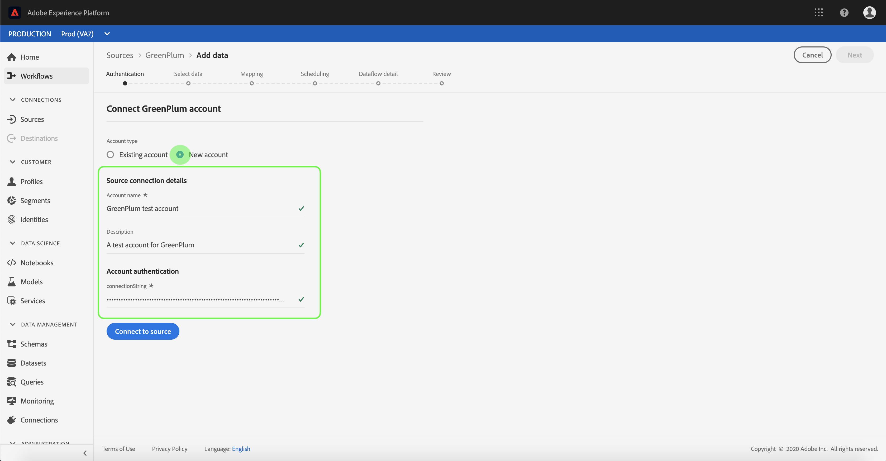

# Erstellen eines GreenPlum-Quellconnectors in der Benutzeroberfläche

> [!NOTE]
> Der GreenPlum-Anschluss befindet sich in der Betaphase. Weitere Informationen zur Verwendung von Beta-gekennzeichneten Connectors finden Sie in der Übersicht [zu den](../../../../home.md#terms-and-conditions) Quellen.

Quellschnittstellen in Adobe Experience Platform bieten die Möglichkeit, extern beschaffte Daten planmäßig zu erfassen. In diesem Lernprogramm werden die Schritte zum Erstellen eines GreenPlum-Quell-Connectors mithilfe der Benutzeroberfläche &quot;Platform&quot;beschrieben.

## Erste Schritte

Dieses Lernprogramm erfordert ein Verständnis der folgenden Komponenten der Adobe Experience Platform:

* [Erlebnis-Datenmodell (XDM)-System](../../../../../xdm/home.md): Das standardisierte Framework, mit dem Experience Platform Kundenerlebnisdaten organisiert.
   * [Grundlagen der Zusammensetzung](../../../../../xdm/schema/composition.md)des Schemas: Erfahren Sie mehr über die grundlegenden Bausteine von XDM-Schemas, einschließlich der wichtigsten Grundsätze und Best Practices bei der Schema-Komposition.
   * [Schema-Editor-Lernprogramm](../../../../../xdm/tutorials/create-schema-ui.md): Erfahren Sie, wie Sie mit der Benutzeroberfläche des Schema-Editors benutzerdefinierte Schema erstellen.
* [Echtzeit-Profil](../../../../../profile/home.md): Bietet ein einheitliches, Echtzeit-Profil für Kunden, das auf aggregierten Daten aus mehreren Quellen basiert.

Wenn Sie bereits über eine gültige GreenPlum-Verbindung verfügen, können Sie den Rest dieses Dokuments überspringen und mit dem Tutorial zur [Konfiguration eines Datenflusses](../../dataflow/databases.md)fortfahren.

### Erforderliche Berechtigungen erfassen

Die folgenden Abschnitte enthalten zusätzliche Informationen, die Sie benötigen, um mithilfe der Flow Service API eine Verbindung zu GreenPlum herstellen zu können.

| Berechtigung | Beschreibung |
| ---------- | ----------- |
| `connectionString` | Die Verbindungszeichenfolge, mit der eine Verbindung zu Ihrer GreenPlum-Instanz hergestellt wird. Das Verbindungszeichenfolgen-Muster für GreenPlum ist `Server={SERVER};Port={PORT};Database={DATABASE};UID={USERNAME};PWD={PASSWORD}` |

Weitere Informationen zum Einstieg finden Sie in [diesem GreenPlum Dokument](https://gpdb.docs.pivotal.io/580/security-guide/topics/Authenticate.html#topic_fzv_wb2_jr__config_ssl_client_conn).

## Verbinden Sie Ihr GreenPlum-Konto

Nachdem Sie die erforderlichen Anmeldeinformationen gesammelt haben, können Sie die folgenden Schritte ausführen, um ein neues GreenPlum-Konto zu erstellen, um eine Verbindung zur Platform herzustellen.

Melden Sie sich bei [Adobe Experience Platform](https://platform.adobe.com) an und wählen Sie dann in der linken Navigationsleiste **[!UICONTROL Quellen]** , um auf den *[!UICONTROL Quellarbeitsbereich]* zuzugreifen. Im Anzeigebereich &quot; *[!UICONTROL Katalog]* &quot;werden eine Reihe von Quellen angezeigt, mit denen Sie ein eingehendes Konto erstellen können. Jede Quelle zeigt die Anzahl der vorhandenen Konten und Datenflüsse an, die ihnen zugeordnet sind.

Sie können die entsprechende Kategorie im Katalog auf der linken Seite des Bildschirms auswählen. Alternativ können Sie die gewünschte Quelle mit der Suchoption finden.

Wählen Sie unter der Kategorie &quot; *[!UICONTROL Datenbanken]* &quot;die Option **[!UICONTROL GreenPlum]** durch Klicken **auf das Pluszeichen (+)** , um einen neuen GreenPlum-Anschluss zu erstellen.

Die Seite &quot; *[!UICONTROL Verbindung zu GreenPlum]* herstellen&quot;wird angezeigt. Auf dieser Seite können Sie entweder neue oder vorhandene Anmeldeinformationen verwenden.

### Neues Konto

Wenn Sie neue Anmeldeinformationen verwenden, wählen Sie &quot; **[!UICONTROL Neues Konto]**&quot;aus. Geben Sie im eingeblendeten Eingabeformular einen Namen, eine optionale Beschreibung und Ihre GreenPlum-Anmeldedaten für die Verbindung ein. Wenn Sie fertig sind, wählen Sie &quot; **[!UICONTROL Verbinden]** &quot;und lassen Sie dann etwas Zeit, bis das neue Konto eingerichtet ist.

### Vorhandenes Konto

Um ein vorhandenes Konto zu verknüpfen, wählen Sie das GreenPlum-Konto, mit dem Sie eine Verbindung herstellen möchten, und wählen Sie dann in der rechten oberen Ecke die Option **[!UICONTROL Weiter]** , um fortzufahren.

## Nächste Schritte

Mit diesem Tutorial haben Sie eine Verbindung zu Ihrem GreenPlum-Konto hergestellt. Sie können jetzt mit dem nächsten Lernprogramm fortfahren und einen Datendurchlauf [konfigurieren, um Daten in die Platform](../../dataflow/databases.md)zu bringen.