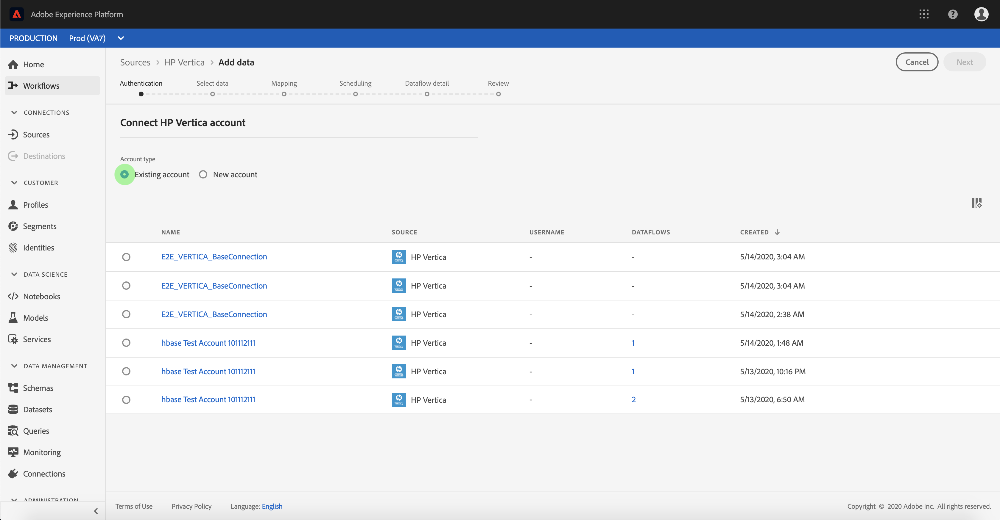

# Create an HP [!DNL Vertica] source connector in the UI

>[!NOTE]
> Der HP [!DNL Vertica] -Anschluss befindet sich in der Betaphase. Weitere Informationen zur Verwendung von Beta-gekennzeichneten Connectors finden Sie in der Übersicht [zu den](../../../../home.md#terms-and-conditions) Quellen.

Quellschnittstellen in Adobe Experience Platform bieten die Möglichkeit, extern beschaffte Daten planmäßig zu erfassen. In diesem Lernprogramm werden Schritte zum Erstellen eines HP [!DNL Vertica] Source Connectors mithilfe der [!DNL Platform] Benutzeroberfläche beschrieben.

## Erste Schritte

Dieses Tutorial setzt ein Grundverständnis der folgenden Komponenten von Adobe Experience Platform voraus:

* [Experience-Datenmodell (XDM)-System](../../../../../xdm/home.md)[!DNL Experience Platform]: Das standardisierte Framework, mit dem Kundenerlebnisdaten organisiert.
   * [Grundlagen der Schemakomposition](../../../../../xdm/schema/composition.md): Machen Sie sich mit den Grundbausteinen von XDM-Schemas sowie den zentralen Konzepten und Best Practices rund um die Erstellung von Schemas vertraut.
   * [Schema-Editor-Lernprogramm](../../../../../xdm/tutorials/create-schema-ui.md): Erfahren Sie, wie Sie mit der Benutzeroberfläche des Schema-Editors benutzerdefinierte Schema erstellen.
* [Echtzeit-Kundenprofil](../../../../../profile/home.md): Bietet ein einheitliches Echtzeit-Kundenprofil, das auf aggregierten Daten aus verschiedenen Quellen basiert.

Wenn Sie bereits über eine gültige HP- [!DNL Vertica] Verbindung verfügen, können Sie den Rest dieses Dokuments überspringen und mit dem Lernprogramm zur [Konfiguration eines Datenflusses](../../dataflow/databases.md)fortfahren.

### Erforderliche Anmeldedaten sammeln

The following sections provide additional information that you will need to know in order to successfully connect to HP [!DNL Vertica] using the [!DNL Flow Service] API.

| Berechtigung | Beschreibung |
| ---------- | ----------- |
| `connectionString` | Die Verbindungszeichenfolge, mit der eine Verbindung zu Ihrer HP- [!DNL Vertica] Instanz hergestellt wird. Das Verbindungszeichenfolgen-Muster für HP [!DNL Vertica] ist `Server={SERVER};Port={PORT};Database={DATABASE};UID={USERNAME};PWD={PASSWORD}` |

Weitere Informationen zum Einstieg finden Sie in [diesem HP Vertica Dokument](https://www.vertica.com/docs/9.2.x/HTML/Content/Authoring/ConnectingToVertica/ClientJDBC/CreatingAndConfiguringAConnection.htm).

## Verbinden Sie Ihr HP- [!DNL Vertica] Konto

Nachdem Sie die erforderlichen Anmeldeinformationen gesammelt haben, können Sie die folgenden Schritte ausführen, um ein neues HP- [!DNL Vertica] Konto für die Verbindung zu erstellen [!DNL Platform].

Melden Sie sich bei [Adobe Experience Platform](https://platform.adobe.com) an und wählen Sie dann in der linken Navigationsleiste **[!UICONTROL Quellen]** , um auf den *[!UICONTROL Quellarbeitsbereich]* zuzugreifen. Im Anzeigebereich &quot; *[!UICONTROL Katalog]* &quot;werden eine Reihe von Quellen angezeigt, mit denen Sie ein eingehendes Konto erstellen können. Jede Quelle zeigt die Anzahl der vorhandenen Konten und Datenflüsse an, die ihnen zugeordnet sind.

Sie können die entsprechende Kategorie im Katalog auf der linken Seite des Bildschirms auswählen. Alternativ können Sie die gewünschte Quelle mit der Suchoption finden.

Wählen Sie unter der Kategorie &quot; *[!UICONTROL Datenbanken]* &quot;die Option **[!UICONTROL HP Vertica]** durch Klicken **auf das Pluszeichen (+)** , um einen neuen HP Vertica Connector zu erstellen.

Die Seite *[!UICONTROL Verbindung mit HP Vertica]* herstellen wird angezeigt. Auf dieser Seite können Sie entweder neue oder vorhandene Anmeldeinformationen verwenden.

### Neues Konto

Wenn Sie neue Anmeldeinformationen verwenden, wählen Sie &quot; **[!UICONTROL Neues Konto]**&quot;aus. Geben Sie im angezeigten Eingabedatum einen Namen, eine optionale Beschreibung und Ihre HP- [!DNL Vertica] Anmeldeinformationen für die Verbindung ein. Wenn Sie fertig sind, wählen Sie &quot; **[!UICONTROL Verbinden]** &quot;und lassen Sie dann etwas Zeit, bis das neue Konto eingerichtet ist.

### Vorhandenes Konto

Um ein vorhandenes Konto zu verbinden, wählen Sie das HP- [!DNL Vertica] Konto, mit dem Sie eine Verbindung herstellen möchten, und wählen Sie dann in der rechten oberen Ecke die Option **[!UICONTROL Weiter]** , um fortzufahren.

## Nächste Schritte

Mit diesem Tutorial haben Sie eine Verbindung zu Ihrem HP- [!DNL Vertica] Konto hergestellt. Sie können jetzt mit dem nächsten Lernprogramm fortfahren und einen Datendurchlauf [konfigurieren, um Daten in Plattform](../../dataflow/databases.md)zu übertragen.