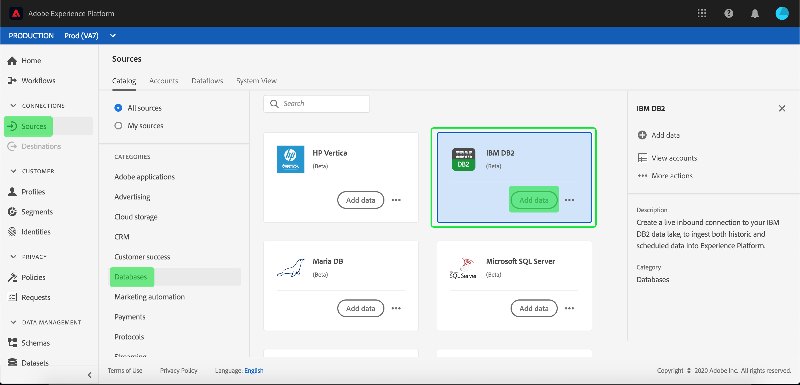

# Erstellen einer IBM DB2-Quellverbindung in der Benutzeroberfläche

>[!NOTE]
>
> Der IBM DB2 Connector befindet sich in der Betaphase. Weitere Informationen zur Verwendung von Beta-gekennzeichneten Connectors finden Sie unter [Sources overview](../../../../home.md#terms-and-conditions).

Die Source Connectors in Adobe Experience Platform bieten die Möglichkeit, extern beschaffte Daten planmäßig zu erfassen. Dieses Lernprogramm enthält Schritte zum Erstellen eines IBM DB2-Quellconnectors (im Folgenden &quot;DB2&quot; genannt) mithilfe der [!DNL Platform]-Benutzeroberfläche.

## Erste Schritte

Dieses Tutorial setzt ein Grundverständnis der folgenden Komponenten von Adobe Experience Platform voraus:

* [[!DNL Experience Data Model (XDM)] System](../../../../../xdm/home.md): Das standardisierte Framework, mit dem Kundenerlebnisdaten  [!DNL Experience Platform] organisiert werden.
   * [Grundlagen der Schemakomposition](../../../../../xdm/schema/composition.md): Machen Sie sich mit den Grundbausteinen von XDM-Schemas sowie den zentralen Konzepten und Best Practices rund um die Erstellung von Schemas vertraut.
   * [Schema-Editor-Lernprogramm](../../../../../xdm/tutorials/create-schema-ui.md): Erfahren Sie, wie Sie mit der Benutzeroberfläche des Schema-Editors benutzerdefinierte Schema erstellen.
* [[!DNL Real-time Customer Profile]](../../../../../profile/home.md): Bietet ein einheitliches, Echtzeit-Profil für Kunden, das auf aggregierten Daten aus mehreren Quellen basiert.

Wenn Sie bereits über eine gültige DB2-Verbindung verfügen, können Sie den Rest dieses Dokuments überspringen und mit dem Lernprogramm [Konfigurieren eines Datenflusses](../../dataflow/databases.md) fortfahren.

### Erforderliche Anmeldedaten sammeln

Die folgenden Abschnitte enthalten zusätzliche Informationen, die Sie benötigen, um mit der [!DNL Flow Service]-API eine erfolgreiche Verbindung zu DB2 herzustellen.

| Berechtigung | Beschreibung |
| ---------- | ----------- |
| `server` | Der Name des DB2-Servers. Sie können die Anschlussnummer nach dem durch einen Doppelpunkt getrennten Servernamen angeben. Beispiel: server:port. |
| `database` | Der Name der DB2-Datenbank. |
| `username` | Der Benutzername, mit dem eine Verbindung zur DB2-Datenbank hergestellt wird. |
| `password` | Das Kennwort für das Benutzerkonto, das Sie für den Benutzernamen angegeben haben. |

Weitere Informationen zum Einstieg finden Sie in [diesem DB2-Dokument](https://www.ibm.com/support/knowledgecenter/SSFMBX/com.ibm.swg.im.dashdb.doc/connecting/connect_credentials.html).

## IBM DB2-Konto anschließen

Nachdem Sie die erforderlichen Anmeldeinformationen gesammelt haben, führen Sie die folgenden Schritte aus, um Ihr DB2-Konto mit [!DNL Platform] zu verknüpfen.

Melden Sie sich bei [Adobe Experience Platform](https://platform.adobe.com) an und wählen Sie dann **[!UICONTROL Quellen]** in der linken Navigationsleiste aus, um auf den Arbeitsbereich **[!UICONTROL Quellen]** zuzugreifen. Der Bildschirm **[!UICONTROL Katalog]** zeigt eine Reihe von Quellen an, für die Sie ein Konto erstellen können.

Sie können die entsprechende Kategorie im Katalog auf der linken Seite des Bildschirms auswählen. Alternativ können Sie die gewünschte Quelle mit der Suchoption finden.

Wählen Sie unter der Kategorie **[!UICONTROL Datenbanken]** **[!UICONTROL IBM DB2]**. Wenn Sie diesen Connector zum ersten Mal verwenden, wählen Sie **[!UICONTROL Konfigurieren]**. Andernfalls wählen Sie **[!UICONTROL Hinzufügen Daten]** aus, um einen neuen DB2-Connector zu erstellen.

Die Seite **[!UICONTROL Verbindung mit IBM DB2]** herstellen wird angezeigt. Auf dieser Seite können Sie entweder neue oder vorhandene Anmeldeinformationen verwenden.

### Neues Konto

Wenn Sie neue Anmeldeinformationen verwenden, wählen Sie **[!UICONTROL Neues Konto]**. Geben Sie im eingeblendeten Eingabefeld einen Namen, eine optionale Beschreibung und Ihre DB2-Anmeldeinformationen ein. Wenn Sie fertig sind, wählen Sie **[!UICONTROL Verbinden]** und lassen Sie dann etwas Zeit, bis die neue Verbindung hergestellt ist.

### Vorhandenes Konto

Um ein vorhandenes Konto zu verbinden, wählen Sie das DB2-Konto, mit dem Sie eine Verbindung herstellen möchten, und klicken Sie dann auf **[!UICONTROL Weiter]**, um fortzufahren.

## Nächste Schritte

Mit diesem Tutorial haben Sie eine Verbindung zu Ihrem DB2-Konto hergestellt. Sie können nun mit dem nächsten Lernprogramm fortfahren und [einen Datendurchlauf konfigurieren, um Daten in [!DNL Platform]](../../dataflow/databases.md) zu übertragen.
