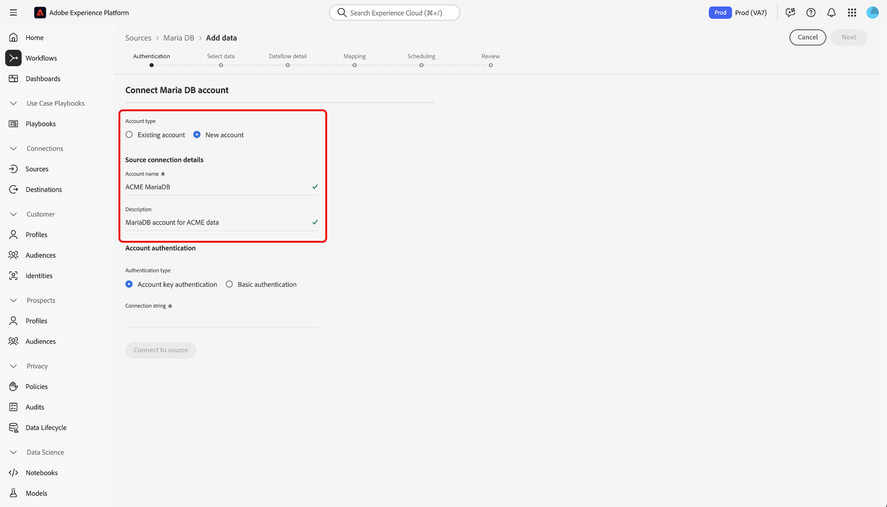

# Erstellen eines Quell-Connectors für [!DNL MariaDB] in der Benutzeroberfläche

Quell-Connectoren in Adobe Experience Platform bieten die Möglichkeit, extern bezogene Daten auf geplanter Basis zu erfassen. In diesem Tutorial werden die Schritte zum Erstellen eines Quell-Connectors für Maria DB mit dem [!DNL Platform] -Benutzeroberfläche.

## Erste Schritte

Dieses Tutorial setzt ein Grundverständnis der folgenden Komponenten von Adobe Experience Platform voraus:

* [[!DNL Experience Data Model (XDM)] System](../../../../../xdm/home.md): Das standardisierte Framework, mit dem [!DNL Experience Platform] Kundenerlebnisdaten organisiert.
   * [Grundlagen der Schemakomposition](../../../../../xdm/schema/composition.md): Machen Sie sich mit den grundlegenden Bausteinen von XDM-Schemas vertraut, einschließlich der wichtigsten Prinzipien und Best Practices bei der Schemaerstellung.
   * [Tutorial zum Schema-Editor](../../../../../xdm/tutorials/create-schema-ui.md): Erfahren Sie, wie Sie benutzerdefinierte Schemas mithilfe der Benutzeroberfläche des Schema-Editors erstellen können.
* [Echtzeit-Kundenprofil](../../../../../profile/home.md): Bietet ein einheitliches Echtzeit-Kundenprofil, das auf aggregierten Daten aus verschiedenen Quellen basiert.

Wenn Sie bereits über eine [!DNL MariaDB] Verbindung nutzen, können Sie den Rest dieses Dokuments überspringen und mit dem Tutorial zum [Datenfluss konfigurieren](../../dataflow/databases.md).

### Sammeln erforderlicher Anmeldeinformationen

Um auf Ihre [!DNL MariaDB] Konto auf [!DNL Platform]müssen Sie den folgenden Wert angeben:

| Anmeldedaten | Beschreibung |
| ---------- | ----------- |
| `connectionString` | Die mit Ihrer MariaDB-Authentifizierung verknüpfte Verbindungszeichenfolge. Die [!DNL MariaDB] Verbindungszeichenfolgenmuster ist: `Server={HOST};Port={PORT};Database={DATABASE};UID={USERNAME};PWD={PASSWORD}`. |

Weiterführende Informationen zu den ersten Schritten finden Sie in diesem Abschnitt [[!DNL MariaDB] Dokument](https://mariadb.com/kb/en/about-mariadb-connector-odbc/).

## Verbinden Ihres [!DNL Maria DB]-Kontos

Nachdem Sie die erforderlichen Anmeldedaten erfasst haben, können Sie die folgenden Schritte ausführen, um Ihr [!DNL Maria DB]-Konto mit [!DNL Platform] zu verknüpfen.

Anmelden bei [Adobe Experience Platform](https://platform.adobe.com) und wählen Sie **[!UICONTROL Quellen]** über die linke Navigationsleiste, um auf die **[!UICONTROL Quellen]** Arbeitsbereich. Der Bildschirm **[!UICONTROL Katalog]** zeigt eine Vielzahl von Quellen an, mit denen Sie ein Konto erstellen können.

Unter dem **[!UICONTROL Datenbanken]** category, select **[!UICONTROL Maria DB]**. Wenn Sie diesen Connector zum ersten Mal verwenden, wählen Sie **[!UICONTROL Konfigurieren]**. Andernfalls wählen Sie **[!UICONTROL Daten hinzufügen]** , um eine neue [!DNL Maria DB] Connector.

Die **[!UICONTROL Verbindung zu Maria DB herstellen]** angezeigt. Auf dieser Seite können Sie entweder neue oder vorhandene Anmeldedaten verwenden.

### Neues Konto

Wenn Sie neue Anmeldeinformationen verwenden, wählen Sie **[!UICONTROL Neues Konto]** aus. Geben Sie im angezeigten Formular einen Namen, eine optionale Beschreibung und Ihre [!DNL MariaDB] Anmeldedaten. Wenn Sie fertig sind, wählen Sie **[!UICONTROL Verbinden]** und dann etwas Zeit für die Einrichtung der neuen Verbindung.

### Vorhandenes Konto

Um ein vorhandenes Konto zu verbinden, wählen Sie die [!DNL MariaDB] Konto, mit dem Sie eine Verbindung herstellen möchten, wählen Sie **[!UICONTROL Nächste]** um fortzufahren.

## Nächste Schritte

Mithilfe dieses Tutorials haben Sie eine Verbindung zu Ihrem [!DNL MariaDB]-Konto hergestellt. Sie können jetzt mit dem nächsten Tutorial fortfahren und einen [Datenfluss konfigurieren, um Daten in zu importieren [!DNL Platform]](../../dataflow/databases.md).
