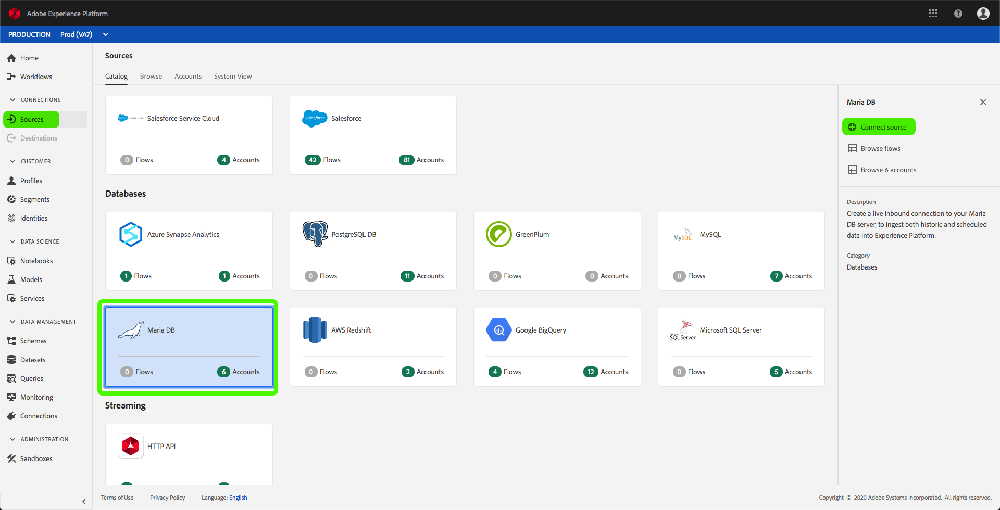
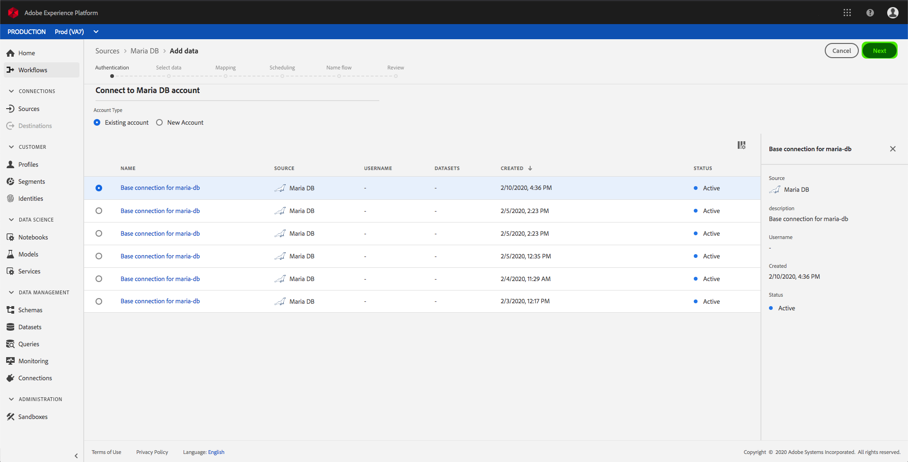

# Erstellen eines MariaDB-Quellconnectors in der Benutzeroberfläche

> [!NOTE]
> Der MariaDB-Anschluss befindet sich in der Betaphase. Die Funktionen und Dokumentation können sich ändern.

Source Connectors in Adobe Experience Platform bieten die Möglichkeit, Daten aus externen Quellen planmäßig zu erfassen. In diesem Lernprogramm werden Schritte zum Erstellen eines Maria DB-Quell-Connectors mithilfe der Plattform-Benutzeroberfläche beschrieben.

## Erste Schritte

Dieses Lernprogramm erfordert ein Verständnis der folgenden Komponenten der Adobe Experience Platform:

* [Erlebnis-Datenmodell (XDM)-System](../../../../../xdm/home.md): Das standardisierte Framework, mit dem Experience Platform Kundenerlebnisdaten organisiert.
   * [Grundlagen der Zusammensetzung](../../../../../xdm/schema/composition.md)des Schemas: Erfahren Sie mehr über die grundlegenden Bausteine von XDM-Schemas, einschließlich der wichtigsten Grundsätze und Best Practices bei der Schema-Komposition.
   * [Schema-Editor-Lernprogramm](../../../../../xdm/tutorials/create-schema-ui.md): Erfahren Sie, wie Sie mit der Benutzeroberfläche des Schema-Editors benutzerdefinierte Schema erstellen.
* [Echtzeit-Profil](../../../../../profile/home.md): Bietet ein einheitliches, Echtzeit-Profil für Kunden, das auf aggregierten Daten aus mehreren Quellen basiert.

Wenn Sie bereits über eine Maria DB-Basisverbindung verfügen, können Sie den Rest dieses Dokuments überspringen und mit dem Lernprogramm zur [Konfiguration eines Datenflusses](../../dataflow/databases.md)fortfahren.

### Erforderliche Berechtigungen erfassen

Um auf Ihr Maria DB-Konto auf der Plattform zuzugreifen, müssen Sie den folgenden Wert angeben:

| Berechtigung | Beschreibung |
| ---------- | ----------- |
| `connectionString` | Die mit Ihrer MariaDB-Authentifizierung verknüpfte Verbindungszeichenfolge. Das Muster für die MariaDB-Verbindungszeichenfolge lautet: `Server={HOST};Port={PORT};Database={DATABASE};UID={USERNAME};PWD={PASSWORD}`. |

Weitere Informationen zu den ersten Schritten mit MariaDB finden Sie in [diesem Dokument](https://mariadb.com/kb/en/about-mariadb-connector-odbc/) .

## Verbinden Sie Ihr Maria DB-Konto

Nachdem Sie die erforderlichen Anmeldeinformationen gesammelt haben, können Sie die folgenden Schritte ausführen, um eine neue eingehende Basisverbindung zu erstellen, um Ihr Maria DB-Konto mit der Plattform zu verknüpfen.

Melden Sie sich bei <a href="https://platform.adobe.com" target="_blank">Adobe Experience Platform</a> an und wählen Sie dann in der linken Navigationsleiste die Option &quot; **Quellen** &quot;, um auf den *Quellenarbeitsbereich* zuzugreifen. Im Anzeigebereich &quot; *Katalog* &quot;werden eine Vielzahl von Quellen angezeigt, mit denen Sie eingehende Basisverbindungen erstellen können. Jede Quelle zeigt die Anzahl der vorhandenen Basisverbindungen an, die mit ihnen verbunden sind.

Wählen Sie unter der Kategorie &quot; *Datenbanken* &quot;die Option &quot; **Maria DB** &quot;, um eine Informationsleiste auf der rechten Seite Ihres Bildschirms anzuzeigen. Die Informationsleiste enthält eine kurze Beschreibung der ausgewählten Quelle sowie Optionen zum Herstellen einer Verbindung zur Quelle oder Ansicht der zugehörigen Dokumentation. Um eine neue eingehende Basisverbindung zu erstellen, wählen Sie &quot; **Connect source**&quot;aus.

Die Seite &quot; *Verbindung mit Maria DB* herstellen&quot;wird angezeigt. Auf dieser Seite können Sie entweder neue oder vorhandene Anmeldeinformationen verwenden.

### Neues Konto

Wenn Sie neue Anmeldeinformationen verwenden, wählen Sie &quot; **Neues Konto**&quot;aus. Geben Sie im eingeblendeten Eingabebild einen Namen, eine optionale Beschreibung und Ihre Maria DB-Anmeldeinformationen für die Basisverbindung ein. Wenn Sie fertig sind, wählen Sie &quot; **Verbinden** &quot;und lassen Sie dann etwas Zeit, bis die neue Basisverbindung hergestellt ist.

### Vorhandenes Konto

Um ein bestehendes Konto zu verbinden, wählen Sie das Maria DB-Konto, mit dem Sie eine Verbindung herstellen möchten, und wählen Sie dann **Weiter** , um fortzufahren.

## Nächste Schritte

Mit diesem Tutorial haben Sie eine Basisverbindung zu Ihrem Maria DB Konto aufgebaut. Sie können jetzt mit dem nächsten Lernprogramm fortfahren und einen Datendurchlauf [konfigurieren, um Daten in Plattform](../../dataflow/databases.md)zu übertragen.