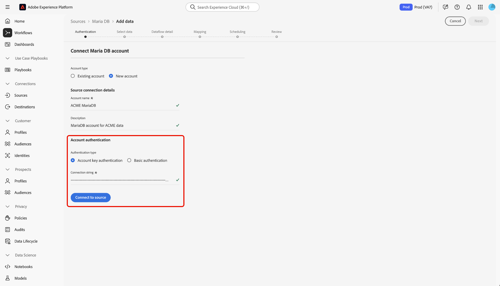

# Verbinden von [!DNL MariaDB] mit Experience Platform über die Benutzeroberfläche

Lesen Sie dieses Handbuch, um zu erfahren, wie Sie Ihr [!DNL MariaDB]-Konto mithilfe des Arbeitsbereichs „Quellen“ in der Benutzeroberfläche von Experience Platform mit Adobe Experience Platform verbinden.

## Erste Schritte

Dieses Tutorial setzt ein Grundverständnis der folgenden Komponenten von Experience Platform voraus:

* [[!DNL Experience Data Model (XDM)] System](../../../../../xdm/home.md): Das standardisierte Framework, mit dem Experience Platform Kundenerlebnisdaten organisiert.
   * [Grundlagen der Schemakomposition](../../../../../xdm/schema/composition.md): Machen Sie sich mit den grundlegenden Bausteinen von XDM-Schemata vertraut, einschließlich der wichtigsten Prinzipien und Best Practices bei der Schemaerstellung.
   * [Tutorial zum Schema-Editor](../../../../../xdm/tutorials/create-schema-ui.md): Erfahren Sie, wie Sie benutzerdefinierte Schemata mithilfe der Benutzeroberfläche des Schema-Editors erstellen können.
* [Echtzeit-Kundenprofil](../../../../../profile/home.md): Bietet ein einheitliches Echtzeit-Kundenprofil, das auf aggregierten Daten aus verschiedenen Quellen basiert.

Wenn Sie bereits über eine [!DNL MariaDB] Verbindung verfügen, können Sie den Rest dieses Dokuments überspringen und mit dem Tutorial zum [ eines Datenflusses ](../../dataflow/databases.md).

### Sammeln erforderlicher Anmeldedaten

Informationen zur Authentifizierung [[!DNL MariaDB]  Sie in ](../../../../connectors/databases/mariadb.md#prerequisites)Übersicht“.

## Navigieren im Quellkatalog

Wählen Sie in der Experience Platform-Benutzeroberfläche **[!UICONTROL Quellen]** in der linken Navigationsleiste aus, um auf den Arbeitsbereich *[!UICONTROL Quellen]* zuzugreifen. Wählen Sie die entsprechende Kategorie im Bedienfeld *[!UICONTROL Kategorien]* aus Alternativ können Sie die Suchleiste verwenden, um zur gewünschten Quelle zu navigieren.

Um [!DNL MariaDB] zu verwenden, wählen Sie die Quellkarte **[!UICONTROL MariaDB]** unter *[!UICONTROL Datenbanken]* und dann **[!UICONTROL Einrichten]**.

>[!TIP]
>
>Quellen im Quellkatalog zeigen die Option **[!UICONTROL Einrichten]** an, wenn eine bestimmte Quelle noch kein authentifiziertes Konto hat. Nachdem ein authentifiziertes Konto erstellt wurde, ändert sich diese Option in **[!UICONTROL Daten hinzufügen]**.

## Vorhandenes Konto verwenden {#existing}

Um ein vorhandenes Konto zu verwenden, wählen Sie **[!UICONTROL Vorhandenes Konto]** und dann das [!DNL MariaDB] Konto aus, das Sie verwenden möchten.

## Neues Konto erstellen {#create}

Wenn Sie noch kein -Konto haben, müssen Sie ein neues Konto erstellen, indem Sie die Authentifizierungsdaten angeben, die Ihrer Quelle entsprechen.

Um ein neues Konto zu erstellen, wählen Sie **[!UICONTROL Neues Konto]** und geben Sie dann einen Namen an und fügen Sie optional eine Beschreibung für Ihr Konto hinzu.

### Verbindung zu Experience Platform auf Azure herstellen {#azure}

Sie können Ihr [!DNL MariaDB]-Konto mit Experience Platform auf Azure verbinden, indem Sie entweder den Kontoschlüssel oder die Standardauthentifizierung verwenden.

>[!BEGINTABS]

>[!TAB Authentifizierung mit Kontoschlüssel]

Um die Kontoschlüsselauthentifizierung zu verwenden, wählen Sie **[!UICONTROL Kontoschlüsselauthentifizierung]**, geben Sie Ihre [Verbindungszeichenfolge](../../../../connectors/databases/mariadb.md#azure) an und wählen Sie dann **[!UICONTROL Mit Quelle verbinden]**.

>[!TAB Einfache Authentifizierung]

Um die Standardauthentifizierung zu verwenden, wählen Sie **[!UICONTROL Standardauthentifizierung]** aus, geben Sie Werte für Ihre [Authentifizierungsdaten](../../../../connectors/databases/mariadb.md#azure) ein und wählen Sie dann **[!UICONTROL Mit Quelle verbinden]** aus.

>[!ENDTABS]

### Verbinden mit Experience Platform auf Amazon Web Services (AWS) {#aws}

>[!AVAILABILITY]
>
>Dieser Abschnitt gilt für Implementierungen von Experience Platform, die auf Amazon Web Services (AWS) ausgeführt werden. Experience Platform, das auf AWS ausgeführt wird, steht derzeit einer begrenzten Anzahl von Kunden zur Verfügung. Weitere Informationen zur unterstützten Experience Platform-Infrastruktur finden Sie in der Übersicht zur [Experience Platform Multi-Cloud](../../../../../landing/multi-cloud.md).

Um ein neues [!DNL MariaDB]-Konto zu erstellen und eine Verbindung zu Experience Platform auf AWS herzustellen, stellen Sie sicher, dass Sie sich in einer VA6-Sandbox befinden, und geben Sie dann die erforderlichen [ (Anmeldeinformationen für die Authentifizierung) ](../../../../connectors/databases/mariadb.md#aws).

## Nächste Schritte

Mithilfe dieses Tutorials haben Sie eine Verbindung zu Ihrem [!DNL MariaDB]-Konto hergestellt. Sie können jetzt mit dem nächsten Tutorial fortfahren und [einen Datenfluss konfigurieren, um Daten in Experience Platform zu importieren](../../dataflow/databases.md).
