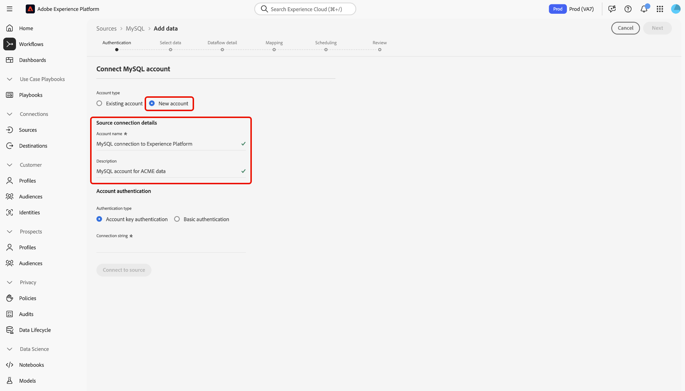

# Erstellen eines Quell-Connectors für [!DNL MySQL] in der Benutzeroberfläche

Quell-Connectoren in Adobe Experience Platform bieten die Möglichkeit, extern bezogene Daten auf geplanter Basis zu erfassen. In diesem Tutorial werden Schritte zum Erstellen eines [!DNL MySQL] Quellverbindung über die Adobe Experience Platform-Benutzeroberfläche.

## Erste Schritte

Dieses Tutorial setzt ein Grundverständnis der folgenden Komponenten von Adobe Experience Platform voraus:

* [[!DNL Experience Data Model (XDM)] System](../../../../../xdm/home.md): Das standardisierte Framework, mit dem Experience Platform Kundenerlebnisdaten organisiert.
   * [Grundlagen der Schemakomposition](../../../../../xdm/schema/composition.md): Machen Sie sich mit den grundlegenden Bausteinen von XDM-Schemas vertraut, einschließlich der wichtigsten Prinzipien und Best Practices bei der Schemaerstellung.
   * [Tutorial zum Schema-Editor](../../../../../xdm/tutorials/create-schema-ui.md): Erfahren Sie, wie Sie benutzerdefinierte Schemas mithilfe der Benutzeroberfläche des Schema-Editors erstellen können.
* [[!DNL Real-Time Customer Profile]](../../../../../profile/home.md): Bietet ein einheitliches Echtzeit-Kundenprofil, das auf aggregierten Daten aus verschiedenen Quellen basiert.

Wenn Sie bereits über eine [!DNL MySQL] Verbindung nutzen, können Sie den Rest dieses Dokuments überspringen und mit dem Tutorial zum [Datenfluss konfigurieren](../../dataflow/databases.md).

### Sammeln erforderlicher Anmeldeinformationen

Um auf Ihre [!DNL MySQL] Konto auf [!DNL Platform]müssen Sie den folgenden Wert angeben:

| Anmeldedaten | Beschreibung |
| ---------- | ----------- |
| `connectionString` | Die [!DNL MySQL] Verbindungszeichenfolge, die mit Ihrem Konto verknüpft ist. Die [!DNL MySQL] Verbindungszeichenfolgenmuster ist: `Server={SERVER};Port={PORT};Database={DATABASE};UID={USERNAME};PWD={PASSWORD}`. Weitere Informationen zu Verbindungszeichenfolgen und dazu, wie Sie sie abrufen können, finden Sie im Abschnitt [[!DNL MySQL] Dokument](https://dev.mysql.com/doc/connector-net/en/connector-net-connections-string.html). |

## Verbinden Ihres [!DNL MySQL]-Kontos

Nachdem Sie die erforderlichen Anmeldedaten erfasst haben, können Sie die folgenden Schritte ausführen, um Ihr [!DNL MySQL]-Konto mit [!DNL Platform] zu verknüpfen.

Anmelden bei [Adobe Experience Platform](https://platform.adobe.com) und wählen Sie **[!UICONTROL Quellen]** über die linke Navigationsleiste, um auf die **[!UICONTROL Quellen]** Arbeitsbereich. Der Bildschirm **[!UICONTROL Katalog]** zeigt eine Vielzahl von Quellen an, mit denen Sie ein Konto erstellen können.

Unter dem **[!UICONTROL Datenbanken]** category, select **[!UICONTROL MySQL]**. Wenn Sie diesen Connector zum ersten Mal verwenden, wählen Sie **[!UICONTROL Konfigurieren]**. Andernfalls wählen Sie **[!UICONTROL Daten hinzufügen]** , um eine neue [!DNL MySQL] Connector.

Die **[!UICONTROL Verbindung zu MySQL herstellen]** angezeigt. Auf dieser Seite können Sie entweder neue oder vorhandene Anmeldedaten verwenden.

### Neues Konto

Wenn Sie neue Anmeldeinformationen verwenden, wählen Sie **[!UICONTROL Neues Konto]** aus. Geben Sie im angezeigten Formular einen Namen, eine optionale Beschreibung und Ihre [!DNL MySQL] Anmeldedaten. Wenn Sie fertig sind, wählen Sie **[!UICONTROL Verbinden]** und dann etwas Zeit für die Einrichtung der neuen Verbindung.

### Vorhandenes Konto

Um ein vorhandenes Konto zu verbinden, wählen Sie die [!DNL MySQL] Konto, mit dem Sie eine Verbindung herstellen möchten, wählen Sie **[!UICONTROL Nächste]** um fortzufahren.

## Nächste Schritte

In diesem Tutorial haben Sie eine Verbindung zu Ihrem MySQL-Konto hergestellt. Sie können jetzt mit dem nächsten Tutorial fortfahren und einen [Datenfluss konfigurieren, um Daten in zu importieren [!DNL Platform]](../../dataflow/databases.md).
