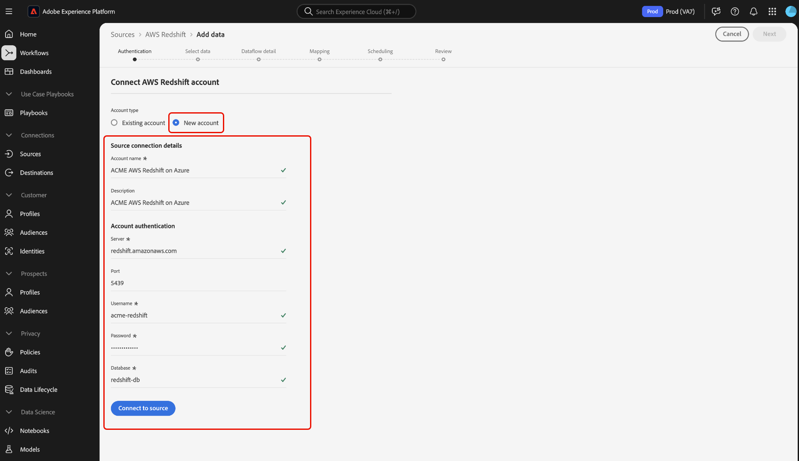

# Create an [!DNL Amazon Redshift] source connector in the UI

>Die Menüauswahlmöglichkeiten für die [!NOTE]
>Der [!DNL Amazon Redshift] Anschluss befindet sich in der Betaphase. Weitere Informationen zur Verwendung von Beta-gekennzeichneten Connectors finden Sie in der Übersicht [zu den](../../../../home.md#terms-and-conditions) Quellen.

Die Source Connectors in Adobe Experience Platform bieten die Möglichkeit, extern beschaffte Daten planmäßig zu erfassen. In diesem Lernprogramm werden Schritte zum Erstellen eines [!DNL Amazon Redshift] (im Folgenden &quot;[!DNL Redshift]&quot;) Quell-Connectors mithilfe der [!DNL Platform] Benutzeroberfläche beschrieben.

## Erste Schritte

Dieses Tutorial setzt ein Grundverständnis der folgenden Komponenten von Adobe Experience Platform voraus:

- [Experience-Datenmodell (XDM)-System](../../../../../xdm/home.md)[!DNL Experience Platform]: Das standardisierte Framework, mit dem Kundenerlebnisdaten organisiert.
   - [Grundlagen der Schemakomposition](../../../../../xdm/schema/composition.md): Machen Sie sich mit den Grundbausteinen von XDM-Schemas sowie den zentralen Konzepten und Best Practices rund um die Erstellung von Schemas vertraut.
   - [Schema-Editor-Lernprogramm](../../../../../xdm/tutorials/create-schema-ui.md): Erfahren Sie, wie Sie mit der Benutzeroberfläche des Schema-Editors benutzerdefinierte Schema erstellen.
- [Echtzeit-Kundenprofil](../../../../../profile/home.md): Bietet ein einheitliches Echtzeit-Kundenprofil, das auf aggregierten Daten aus verschiedenen Quellen basiert.

Wenn Sie bereits über eine [!DNL Redshift] Basisverbindung verfügen, können Sie den Rest dieses Dokuments überspringen und mit dem Tutorial zur [Konfiguration eines Datenflusses](../../dataflow/databases.md)fortfahren.

### Erforderliche Anmeldedaten sammeln

In order to access your [!DNL Redshift] account on [!DNL Platform], you must provide the following values:

| **Credential** | **Beschreibung** |
| -------------- | --------------- |
| `server` | The server associated with your [!DNL Redshift] account. |
| `username` | Der mit Ihrem [!DNL Redshift] Konto verknüpfte Benutzername. |
| `password` | Das Ihrem [!DNL Redshift] Konto zugeordnete Kennwort. |
| `database` | Die [!DNL Redshift] Datenbank, auf die Sie zugreifen. |

Weitere Informationen zu den ersten Schritten finden Sie in [diesem Redshift-Dokument](https://docs.aws.amazon.com/redshift/latest/gsg/getting-started.html).

## Verbinden Sie Ihr [!DNL Redshift] Konto

Nachdem Sie die erforderlichen Anmeldeinformationen gesammelt haben, können Sie die folgenden Schritte ausführen, um eine neue eingehende Basisverbindung zu erstellen, mit der Sie Ihr [!DNL Redshift] Konto verknüpfen [!DNL Platform].

Melden Sie sich bei [Adobe Experience Platform](https://platform.adobe.com) an und wählen Sie dann in der linken Navigationsleiste die Option &quot; **[!UICONTROL Quellen]** &quot;, um auf den *[!UICONTROL Quellarbeitsbereich]* zuzugreifen. Im Anzeigebereich &quot; *[!UICONTROL Katalog]* &quot;werden eine Vielzahl von Quellen angezeigt, mit denen Sie eingehende Basisverbindungen erstellen können. Jede Quelle zeigt die Anzahl der vorhandenen Basisverbindungen an, die mit ihnen verbunden sind.

Wählen Sie unter der Kategorie *[!UICONTROL Datenbanken]* die Option **[!UICONTROL Amazon Redshift]** , um eine Informationsleiste auf der rechten Seite Ihres Bildschirms anzuzeigen. Die Informationsleiste enthält eine kurze Beschreibung der ausgewählten Quelle sowie Optionen zum Herstellen einer Verbindung zur Quelle oder Ansicht der zugehörigen Dokumentation. Um eine neue eingehende Basisverbindung zu erstellen, wählen Sie **[!UICONTROL Hinzufügen Daten]**.

Die Seite *[!UICONTROL Verbindung mit Amazon Redshift]* wird angezeigt. Auf dieser Seite können Sie entweder neue oder vorhandene Anmeldeinformationen verwenden.

### Neues Konto

Wenn Sie neue Anmeldeinformationen verwenden, wählen Sie &quot; **[!UICONTROL Neues Konto]**&quot;aus. Geben Sie im eingeblendeten Eingabebild einen Namen, eine optionale Beschreibung und Ihre [!DNL Redshift] Anmeldeinformationen für die Basisverbindung ein. Wenn Sie fertig sind, wählen Sie &quot; **[!UICONTROL Verbinden]** &quot;und lassen Sie dann etwas Zeit, bis die neue Basisverbindung hergestellt ist.

### Existing account

Um ein vorhandenes Konto zu verbinden, wählen Sie das [!DNL Redshift] Konto, mit dem Sie eine Verbindung herstellen möchten, und wählen Sie dann **[!UICONTROL Weiter]** , um fortzufahren.

## Nächste Schritte

Mit diesem Tutorial haben Sie eine Basisverbindung zu Ihrem [!DNL Redshift] Konto aufgebaut. Sie können jetzt mit dem nächsten Lernprogramm fortfahren und einen Datendurchlauf [konfigurieren, um Daten in Plattform](../../dataflow/databases.md)zu übertragen.