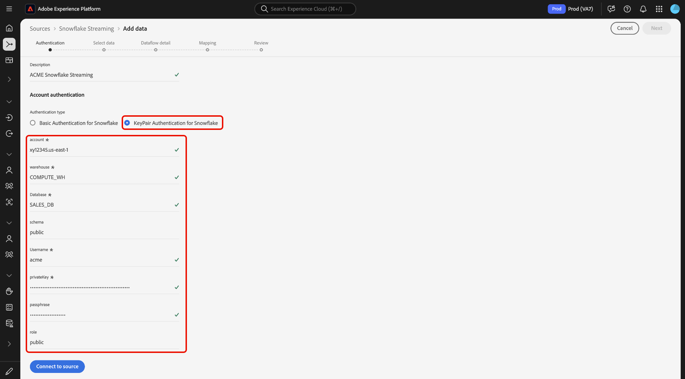

# Streamen von Daten aus Ihrer [!DNL Snowflake]-Datenbank an Experience Platform mithilfe der Benutzeroberfläche

Lesen Sie dieses Handbuch, um zu erfahren, wie Sie Daten aus Ihrer [!DNL Snowflake]-Datenbank mithilfe des Arbeitsbereichs „Quellen“ in der Benutzeroberfläche an Experience Platform streamen.

## Erste Schritte

Dieses Tutorial setzt ein Grundverständnis der folgenden Komponenten von Experience Platform voraus:

* [[!DNL Experience Data Model (XDM)] System](../../../../../xdm/home.md): Das standardisierte Framework, mit dem [!DNL Experience Platform] Kundenerlebnisdaten organisiert.
   * [Grundlagen der Schemakomposition](../../../../../xdm/schema/composition.md): Machen Sie sich mit den grundlegenden Bausteinen von XDM-Schemata vertraut, einschließlich der wichtigsten Prinzipien und Best Practices bei der Schemaerstellung.
   * [Tutorial zum Schema-Editor](../../../../../xdm/tutorials/create-schema-ui.md): Erfahren Sie, wie Sie benutzerdefinierte Schemata mithilfe der Benutzeroberfläche des Schema-Editors erstellen können.
* [[!DNL Real-Time Customer Profile]](../../../../../profile/home.md): Bietet ein einheitliches Echtzeit-Kundenprofil, das auf aggregierten Daten aus verschiedenen Quellen basiert.

### Authentifizierung

Lesen Sie das Handbuch unter [Vorausgesetzte Einrichtung für  [!DNL Snowflake] -Streaming](../../../../connectors/databases/snowflake-streaming.md), um Informationen zu den Schritten zu erhalten, die Sie durchführen müssen, bevor Sie Streaming-Daten von [!DNL Snowflake] in Experience Platform aufnehmen können.

## Verwenden der [!DNL Snowflake Streaming] zum Streamen [!DNL Snowflake] Daten an Experience Platform

Wählen Sie in der Experience Platform-Benutzeroberfläche **[!UICONTROL Quellen]** in der linken Navigationsleiste aus, um auf den Arbeitsbereich [!UICONTROL Quellen] zuzugreifen. Sie können die gewünschte Kategorie aus dem Katalog auf der linken Bildschirmseite auswählen. Alternativ können Sie die gewünschte Quelle mithilfe der Suchoption finden.

Wählen Sie unter *Kategorie* die Option **[!DNL Snowflake Streaming]** und dann **[!UICONTROL Einrichten]** aus.

>[!TIP]
>
>Für Quellen, die im Quellkatalog kein authentifiziertes Konto haben, wird die Option **[!UICONTROL Einrichten]** angezeigt. Sobald ein authentifiziertes Konto vorhanden ist, ändert sich diese Option in **[!UICONTROL Daten hinzufügen]**.

Die **[!UICONTROL Snowflake Streaming-Konto verbinden]** wird angezeigt. Auf dieser Seite können Sie entweder neue oder vorhandene Anmeldeinformationen verwenden.

### Neues Konto erstellen

Um ein neues Konto zu erstellen, wählen Sie **[!UICONTROL Neues Konto]** und geben Sie einen Namen und eine optionale Beschreibung für Ihr Konto an.

>[!BEGINTABS]

>[!TAB Einfache Authentifizierung]

Um die [!UICONTROL Standardauthentifizierung] zu verwenden, wählen Sie **[!UICONTROL Standardauthentifizierung für Snowflake]** aus und geben Sie Anmeldeinformationen für Ihr [!DNL Snowflake] an. Wenn Sie fertig sind, wählen **[!UICONTROL Mit Quelle verbinden]** und warten Sie einige Augenblicke, bis die Verbindung hergestellt ist.

[!DNL Snowflake Streaming] Weiterführende Informationen dazu, wie Sie die erforderlichen Anmeldeinformationen [, finden Sie in der Übersicht zu ](../../../../connectors/databases/snowflake-streaming.md#gather-required-credentials).

>[!TAB KeyPair-Authentifizierung]

Um die [!UICONTROL KeyPair-Authentifizierung] zu verwenden, wählen Sie **[!UICONTROL KeyPair-Authentifizierung für Snowflake]** aus und geben Sie Anmeldeinformationen für Ihr [!DNL Snowflake] an. Wenn Sie fertig sind, wählen **[!UICONTROL Mit Quelle verbinden]** und warten Sie einige Augenblicke, bis die Verbindung hergestellt ist.

[!DNL Snowflake Streaming] Weiterführende Informationen dazu, wie Sie die erforderlichen Anmeldeinformationen [, finden Sie in der Übersicht zu ](../../../../connectors/databases/snowflake-streaming.md#gather-required-credentials).

>[!ENDTABS]

Um ein vorhandenes Konto zu verwenden, wählen Sie **[!UICONTROL Vorhandenes Konto]**, wählen Sie Ihr Konto aus der Liste aus und klicken Sie auf **[!UICONTROL Weiter]**.

## Daten auswählen {#select-data}

>[!IMPORTANT]
>
>* Eine Zeitstempelspalte muss in Ihrer Quelltabelle vorhanden sein, damit ein Streaming-Datenfluss erstellt werden kann. Der Zeitstempel ist erforderlich, damit Experience Platform weiß, wann Daten aufgenommen werden und wann inkrementelle Daten gestreamt werden. Sie können nachträglich eine Zeitstempelspalte für eine bestehende Verbindung hinzufügen und einen neuen Datenfluss erstellen.
>
>* Stellen Sie sicher, dass die Groß-/Kleinschreibung der Datenfelder in Ihrer Beispiel-Quelldatendatei mit der Anleitung von [!DNL Snowflake] zur Groß-/Kleinschreibung für Kennungen übereinstimmt. Weitere Informationen finden [[!DNL Snowflake]  im Dokument zur Groß](https://docs.snowflake.com/en/sql-reference/identifiers-syntax#label-identifier-casing) und Kleinschreibung von Bezeichnern .

Der Schritt [!UICONTROL Daten auswählen] wird angezeigt. In diesem Schritt müssen Sie die Daten auswählen, die Sie in Experience Platform importieren möchten, Zeitstempel und Zeitzonen konfigurieren und eine Beispieldatendatei für die Aufnahme von Rohdaten bereitstellen.

Verwenden Sie das Datenbankverzeichnis auf der linken Bildschirmseite und wählen Sie die Tabelle aus, die Sie in Experience Platform importieren möchten.

Wählen Sie als Nächstes den Zeitstempel-Spaltentyp Ihrer Tabelle aus. Sie können zwischen zwei Arten von Zeitstempelspalten wählen: `TIMESTAMP_NTZ` oder `TIMESTAMP_LTZ`. Wenn Sie den Spaltentyp `TIMESTAMP_NTZ` auswählen, müssen Sie auch eine Zeitzone angeben. Die Spalten sollten eine NOT NULL-Einschränkung aufweisen. Weitere Informationen finden Sie im Abschnitt zu [Einschränkungen und häufig gestellte Fragen](../../../../connectors/databases/snowflake-streaming.md#limitations-and-frequently-asked-questions).

In diesem Schritt können Sie auch Aufstockungseinstellungen konfigurieren. Die Aufstockung bestimmt, welche Daten anfänglich aufgenommen werden. Wenn die Aufstockung aktiviert ist, werden alle aktuellen Dateien im angegebenen Pfad während der ersten geplanten Aufnahme aufgenommen. Andernfalls werden nur die Dateien aufgenommen, die zwischen dem ersten Aufnahmevorgang und der Startzeit geladen werden. Dateien, die vor der Startzeit geladen wurden, werden nicht aufgenommen.

Wählen Sie den Umschalter **[!UICONTROL Aufstockung]** aus, um die Aufstockung zu aktivieren.

Wählen Sie abschließend **[!UICONTROL Datei auswählen]** aus, um ein Beispiel für Quelldaten hochzuladen und so den Zuordnungssatz zu erstellen. Dieser wird in einem späteren Schritt verwendet, um Ihre Originaldaten dem Experience-Datenmodell (XDM) zuzuordnen.

Wenn Sie fertig sind, wählen Sie **[!UICONTROL Weiter]** aus, um fortzufahren.

## Datensatz- und Datenflussdetails angeben {#provide-dataset-and-dataflow-details}

Als Nächstes müssen Sie Informationen zu Ihrem Datensatz und Ihrem Datenfluss angeben.

### Datensatz-Details {#dataset-details}

Ein Datensatz ist ein Konstrukt zur Speicherung und Verwaltung einer Sammlung von Daten, in der Regel eine Tabelle, die ein Schema (Spalten) und Felder (Zeilen) enthält. Daten, die erfolgreich in Experience Platform aufgenommen werden, bleiben als Datensätze im Data Lake erhalten. In diesem Schritt können Sie einen neuen Datensatz erstellen oder einen vorhandenen Datensatz verwenden.

Wenn Sie über einen vorhandenen Datensatz verfügen, wählen Sie **[!UICONTROL Vorhandener Datensatz]** und verwenden Sie dann die Option **[!UICONTROL Erweiterte Suche]**, um ein Fenster aller Datensätze in Ihrer Organisation anzuzeigen, einschließlich der entsprechenden Details, z. B. ob sie für die Aufnahme in das Echtzeit-Kundenprofil aktiviert sind.

Um einen neuen Datensatz zu verwenden, wählen **[!UICONTROL Neuer Datensatz]** und geben Sie dann einen Namen und eine optionale Beschreibung für Ihren Datensatz an. Sie müssen auch ein Experience-Datenmodell-Schema (XDM) auswählen, dem Ihr Datensatz entspricht.

| Neue Datensatzdetails | Beschreibung |
| --- | --- |
| Name des Ausgabe-Datensatzes | Der Name Ihres neuen Datensatzes. |
| Beschreibung | (Optional) Ein kurzer Überblick über den neuen Datensatz. |
| Schema | Eine Dropdown-Liste mit Schemata, die in Ihrer Organisation vorhanden sind. Sie können auch vor dem Prozess der Quellkonfiguration Ihr eigenes Schema erstellen. Weitere Informationen finden Sie im Handbuch unter [Erstellen eines XDM-Schemas in der Benutzeroberfläche](../../../../../xdm/tutorials/create-schema-ui.md). |

### Datenflussdetails {#dataflow-details}

Nachdem Ihr Datensatz konfiguriert wurde, müssen Sie Details zu Ihrem Datenfluss angeben, einschließlich eines Namens, einer optionalen Beschreibung und Warnhinweiskonfigurationen.

| Datenflusskonfigurationen | Beschreibung |
| --- | --- |
| Datenflussname | Der Name des Datenflusses.  Standardmäßig wird dabei der Name der zu importierenden Datei verwendet. |
| Beschreibung | (Optional) Eine kurze Beschreibung Ihres Datenflusses. |
| Warnhinweise | Experience Platform kann ereignisbasierte Warnhinweise erstellen, die Benutzende abonnieren können. Für diese Optionen ist ein laufender Datenfluss erforderlich, um sie im Trigger zu halten. Weitere Informationen finden Sie unter [Warnhinweise - Übersicht](../../alerts.md) <ul><li>**Start der Ausführung des Quelldatenflusses**: Wählen Sie diesen Warnhinweis aus, um eine Benachrichtigung zu erhalten, wenn die Ausführung des Datenflusses beginnt.</li><li>**Erfolgreiche Ausführung des Quelldatenflusses**: Wählen Sie diesen Warnhinweis aus, um eine Benachrichtigung zu erhalten, wenn Ihr Datenfluss fehlerfrei endet.</li><li>**Fehler bei der Ausführung des Datenflusses an Quellen**: Wählen Sie diesen Warnhinweis aus, um eine Benachrichtigung zu erhalten, wenn die Ausführung des Datenflusses mit Fehlern endet.</li></ul> |

Wenn Sie fertig sind, wählen Sie **[!UICONTROL Weiter]** aus, um fortzufahren.

## Zuordnen von Feldern zu einem XDM-Schema {#mapping}

Der Schritt [!UICONTROL Zuordnung] wird angezeigt. Verwenden Sie die Zuordnungsschnittstelle, um Ihre Quelldaten den entsprechenden Schemafeldern zuzuordnen, bevor Sie diese Daten in Experience Platform aufnehmen, und wählen Sie dann **[!UICONTROL Weiter]**. Eine ausführliche Anleitung zur Verwendung der Zuordnungsschnittstelle finden Sie im [Handbuch zur Datenvorbereitungs-](../../../../../data-prep/ui/mapping.md)).

## Überprüfen des Datenflusses {#review}

Der letzte Schritt im Prozess zur Erstellung eines Datenflusses besteht darin, Ihren Datenfluss zu überprüfen, bevor er ausgeführt wird. Verwenden Sie den **[!UICONTROL Überprüfen]** Schritt, um die Details Ihres neuen Datenflusses zu überprüfen, bevor er ausgeführt wird. Die Details sind in die folgenden Kategorien unterteilt:

* **Verbindung**: Zeigt den Quelltyp, den relevanten Pfad der ausgewählten Quelldatei und die Anzahl der Spalten innerhalb dieser Quelldatei an.
* **Datensatz- und Zuordnungsfelder zuweisen**: Zeigt an, in welchen Datensatz die Quelldaten aufgenommen werden, einschließlich des Schemas, dem der Datensatz entspricht.

Nachdem Sie Ihren Datenfluss überprüft haben, klicken Sie auf **[!UICONTROL Beenden]** und gewähren Sie etwas Zeit für die Erstellung des Datenflusses.

## Nächste Schritte

In diesem Tutorial haben Sie erfolgreich einen Streaming-Datenfluss für [!DNL Snowflake] erstellt. Weitere Ressourcen finden Sie in der Dokumentation unten.

### Überwachen Ihres Datenflusses

Nachdem Ihr Datenfluss erstellt wurde, können Sie die Daten überwachen, die über ihn aufgenommen werden, um Informationen zu Aufnahmegeschwindigkeiten, Erfolg und Fehlern anzuzeigen. Weitere Informationen zum Überwachen von Streaming-Datenflüssen finden Sie im Tutorial [Überwachen von Streaming-Datenflüssen in der Benutzeroberfläche](../../monitor-streaming.md).

### Aktualisieren des Datenflusses

Um Konfigurationen für die Planung, Zuordnung und allgemeine Informationen Ihrer Datenflüsse zu aktualisieren, besuchen Sie das Tutorial [Aktualisieren von Quelldatenflüssen in der Benutzeroberfläche](../../update-dataflows.md).

### Löschen des Datenflusses

Datenflüsse, die nicht mehr erforderlich sind oder nicht korrekt erstellt wurden, können Sie löschen, indem Sie dazu die Funktion **[!UICONTROL Löschen]** im Arbeitsbereich **[!UICONTROL Datenflüsse]** verwenden. Weitere Informationen zum Löschen von Datenflüssen finden Sie im Tutorial [Löschen von Datenflüssen in der Benutzeroberfläche](../../delete.md).
