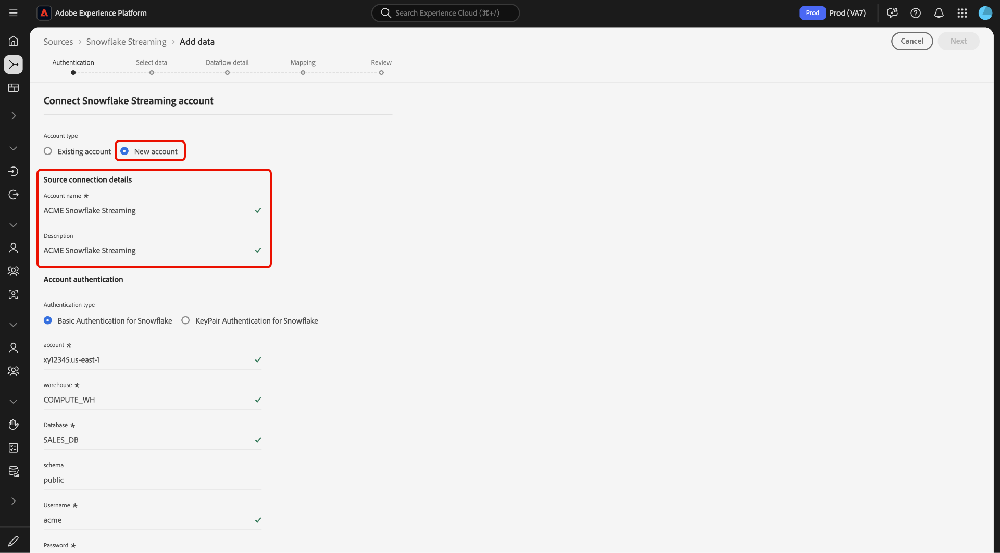

# Streamen von Daten aus Ihrem [!DNL Snowflake] Datenbank zum Experience Platform über die Benutzeroberfläche

Erfahren Sie, wie Sie mit der Benutzeroberfläche Daten von Ihrer [!DNL Snowflake] Datenbank zu Adobe Experience Platform hinzugefügt werden, indem Sie diesem Handbuch folgen.

## Erste Schritte

Dieses Tutorial setzt ein Grundverständnis der folgenden Komponenten von Experience Platform voraus:

* [[!DNL Experience Data Model (XDM)] System](../../../../../xdm/home.md): Das standardisierte Framework, mit dem [!DNL Experience Platform] Kundenerlebnisdaten organisiert.
   * [Grundlagen der Schemakomposition](../../../../../xdm/schema/composition.md): Machen Sie sich mit den grundlegenden Bausteinen von XDM-Schemata vertraut, einschließlich der wichtigsten Prinzipien und Best Practices bei der Schemaerstellung.
   * [Tutorial zum Schema-Editor](../../../../../xdm/tutorials/create-schema-ui.md): Erfahren Sie, wie Sie benutzerdefinierte Schemata mithilfe der Benutzeroberfläche des Schema-Editors erstellen können.
* [[!DNL Real-Time Customer Profile]](../../../../../profile/home.md): Bietet ein einheitliches Echtzeit-Kundenprofil, das auf aggregierten Daten aus verschiedenen Quellen basiert.

### Authentifizierung

Lesen Sie das Handbuch unter [Voraussetzungen für Einrichtung [!DNL Snowflake] Streaming-Daten](../../../../connectors/databases/snowflake-streaming.md) Informationen zu den Schritten, die Sie durchführen müssen, bevor Sie Streaming-Daten von erfassen können [!DNL Snowflake] auf Experience Platform.

## Verwenden Sie die [!DNL Snowflake Streaming] Quelle zu streamen [!DNL Snowflake] Daten an Experience Platform

Wählen Sie in der Platform-Benutzeroberfläche in der linken Navigationsleiste die Option **[!UICONTROL Quellen]**, um auf den Arbeitsbereich [!UICONTROL Quellen] zuzugreifen. Sie können die gewünschte Kategorie aus dem Katalog auf der linken Bildschirmseite auswählen. Alternativ können Sie die gewünschte Quelle mithilfe der Suchoption finden.

Unter dem *Datenbanken* category, select **[!DNL Snowflake Streaming]** und wählen Sie **[!UICONTROL Daten hinzufügen]**.

>[!TIP]
>
>Quellen ohne authentifiziertes Konto im Quellkatalog zeigen die **[!UICONTROL Einrichten]** -Option. Sobald ein authentifiziertes Konto existiert, wird diese Option in **[!UICONTROL Daten hinzufügen]**.

Die **[!UICONTROL Snowflake-Streaming-Konto verbinden]** angezeigt. Auf dieser Seite können Sie entweder neue oder vorhandene Anmeldedaten verwenden.

>[!BEGINTABS]

>[!TAB Neues Konto erstellen]

Um ein neues Konto zu erstellen, wählen Sie **[!UICONTROL Neues Konto]** und geben Sie einen Namen, eine optionale Beschreibung und Ihre Anmeldeinformationen ein.

Wenn Sie fertig sind, wählen Sie **[!UICONTROL Mit Quelle verbinden]** und warten Sie, bis die neue Verbindung hergestellt ist.

| Anmeldedaten | Beschreibung |
| --- | --- |
| Konto | Der Name Ihres [!DNL Snowflake] -Konto. |
| Warehouse | Der Name Ihres [!DNL Snowflake] Warehouse. Warehouse verwaltet die Ausführung von Abfragen in [!DNL Snowflake]. Jeder [!DNL Snowflake] Warehouse ist unabhängig voneinander und muss einzeln aufgerufen werden, um Daten an Experience Platform zu bringen. |
| Datenbank | Der Name Ihres [!DNL Snowflake] Datenbank. Die Datenbank enthält die Daten, die Sie zum Experience Platform mitbringen möchten. |
| Schema | (Optional) Das Datenbankschema, das Ihrer [!DNL Snowflake] -Konto. |
| Benutzername | Der Benutzername Ihres [!DNL Snowflake] -Konto. |
| Kennwort | Das Kennwort für Ihre [!DNL Snowflake] -Konto. |
| Rolle | (Optional) Eine benutzerdefinierte Rolle, die einem Benutzer für eine bestimmte Verbindung bereitgestellt werden kann. Wenn dieser Wert nicht angegeben wird, wird standardmäßig `public`. |

Weitere Informationen zur Kontoerstellung finden Sie im Abschnitt unter [Konfigurieren von Rolleneinstellungen](../../../../connectors/databases/snowflake-streaming.md#configure-role-settings) im [!DNL Snowflake Streaming] Übersicht.

>[!TAB Vorhandenes Konto verwenden]

Um ein vorhandenes Konto zu verwenden, wählen Sie **[!UICONTROL Vorhandenes Konto]** und wählen Sie dann das gewünschte Konto aus dem vorhandenen Kontokatalog aus.

Klicken Sie auf **[!UICONTROL Weiter]**, um fortzufahren.

>[!ENDTABS]

## Daten auswählen {#select-data}

>[!IMPORTANT]
>
>In der Quelltabelle muss eine Spalte mit Zeitstempel vorhanden sein, damit ein Streaming-Datenfluss erstellt werden kann. Der Zeitstempel ist erforderlich, damit Experience Platform weiß, wann Daten erfasst und wann inkrementelle Daten gestreamt werden. Sie können rückwirkend eine Zeitstempelspalte für eine bestehende Verbindung hinzufügen und einen neuen Datenfluss erstellen.

Der Schritt [!UICONTROL Daten auswählen] wird angezeigt. In diesem Schritt müssen Sie die Daten auswählen, die Sie in Experience Platform importieren möchten, Zeitstempel und Zeitzonen konfigurieren und eine Beispieldatendatei für die Aufnahme von Rohdaten bereitstellen.

Verwenden Sie das Datenbankverzeichnis auf der linken Bildschirmseite und wählen Sie die Tabelle aus, die Sie in Experience Platform importieren möchten.

Wählen Sie als Nächstes den Zeitstempelspaltentyp Ihrer Tabelle aus. Sie können zwischen zwei Arten von Zeitstempelspalten wählen: `TIMESTAMP_NTZ` oder  `TIMESTAMP_LTZ`. Wenn Sie einen Spaltentyp von `TIMESTAMP_NTZ`, müssen Sie auch eine Zeitzone angeben. Ihre Spalten sollten eine Nicht-Null-Einschränkung aufweisen. Weitere Informationen finden Sie im Abschnitt unter [Einschränkungen und häufig gestellte Fragen]

Sie können während dieses Schritts auch die Einstellungen für die Aufstockung konfigurieren. Die Aufstockung bestimmt, welche Daten ursprünglich erfasst werden. Wenn die Aufstockung aktiviert ist, werden alle aktuellen Dateien im angegebenen Pfad während der ersten geplanten Erfassung erfasst. Andernfalls werden nur die Dateien erfasst, die zwischen der ersten Ausführung der Aufnahme und der Startzeit geladen wurden. Dateien, die vor der Startzeit geladen wurden, werden nicht erfasst.

Wählen Sie die **[!UICONTROL Aufstockung]** Umschalten, um die Aufstockung zu aktivieren.

Wählen Sie abschließend **[!UICONTROL Datei auswählen]** , um Beispielquelldaten hochzuladen und so den Zuordnungssatz zu erstellen, der in einem späteren Schritt verwendet wird, um Ihre Originaldaten dem Experience-Datenmodell (XDM) zuzuordnen.

Wählen Sie zum Abschluss **[!UICONTROL Nächste]** um fortzufahren.

## Bereitstellen von Datensatz- und Datenflussdetails {#provide-dataset-and-dataflow-details}

Als Nächstes müssen Sie Informationen zu Ihrem Datensatz und Ihrem Datenfluss angeben.

### Datensatzdetails {#dataset-details}

Ein Datensatz ist ein Konstrukt zur Datenspeicherung und -verwaltung, in dem Daten (in der Regel) in einer Tabelle erfasst werden, die ein Schema (Spalten) und Felder (Zeilen) beinhaltet. Daten, die erfolgreich in Experience Platform aufgenommen wurden, werden im Data Lake als Datensätze persistiert. In diesem Schritt können Sie einen neuen Datensatz erstellen oder einen vorhandenen Datensatz verwenden.

>[!BEGINTABS]

>[!TAB Verwenden eines neuen Datensatzes]

Um einen neuen Datensatz zu verwenden, wählen Sie **[!UICONTROL Neuer Datensatz]** und geben Sie dann einen Namen und eine optionale Beschreibung für Ihren Datensatz an. Sie müssen auch ein Experience-Datenmodell (XDM)-Schema auswählen, dem Ihr Datensatz entspricht.

| Neue Datensatzdetails | Beschreibung |
| --- | --- |
| Name des Ausgabedatensatzes | Der Name Ihres neuen Datensatzes. |
| Beschreibung | (Optional) Eine kurze Übersicht über den neuen Datensatz. |
| Schema | Eine Dropdown-Liste mit Schemas, die in Ihrer Organisation vorhanden sind. Sie können auch ein eigenes Schema vor dem Quellkonfigurationsprozess erstellen. Weitere Informationen finden Sie im Handbuch unter [Erstellen eines XDM-Schemas in der Benutzeroberfläche](../../../../../xdm/tutorials/create-schema-ui.md). |

>[!TAB Verwenden eines vorhandenen Datensatzes]

Wenn Sie bereits über einen vorhandenen Datensatz verfügen, wählen Sie **[!UICONTROL Vorhandener Datensatz]** und verwenden Sie dann **[!UICONTROL Erweiterte Suche]** -Option, um ein Fenster aller Datensätze in Ihrer Organisation anzuzeigen, einschließlich der entsprechenden Details, z. B. ob sie für die Aufnahme in das Echtzeit-Kundenprofil aktiviert sind.

>[!ENDTABS]

++ + Wählen Sie Schritte aus, um die Profilaufnahme, Fehlerdiagnose und partielle Erfassung zu aktivieren.

Wenn Ihr Datensatz für das Echtzeit-Kundenprofil aktiviert ist, können Sie während dieses Schritts **[!UICONTROL Profildatensatz]** , um Ihre Daten für die Profilaufnahme zu aktivieren. Sie können diesen Schritt auch verwenden, um **[!UICONTROL Fehlerdiagnose]** und **[!UICONTROL Partielle Erfassung]**.

* **[!UICONTROL Fehlerdiagnose]**: Auswählen **[!UICONTROL Fehlerdiagnose]** , um die Quelle anzuweisen, eine Fehlerdiagnose zu erstellen, die Sie später bei der Überwachung Ihrer Datensatzaktivität und des Datenflussstatus referenzieren können.
* **[!UICONTROL Partielle Erfassung]**: Partielle Batch-Erfassung ist die Möglichkeit, Daten mit Fehlern bis zu einem bestimmten konfigurierbaren Schwellenwert zu erfassen. Mit dieser Funktion können Sie alle Ihre präzisen Daten erfolgreich in Experience Platform erfassen, während all Ihre falschen Daten separat mit Informationen darüber gestapelt werden, warum sie ungültig sind.

+++

### Datenflussdetails {#dataflow-details}

Nachdem Ihr Datensatz konfiguriert wurde, müssen Sie Details zu Ihrem Datenfluss angeben, einschließlich eines Namens, einer optionalen Beschreibung und Warnhinweiskonfigurationen.

| Datenflusskonfigurationen | Beschreibung |
| --- | --- |
| Dataflow-Name | Der Name des Datenflusses.  Standardmäßig wird dabei der Name der Datei verwendet, die importiert wird. |
| Beschreibung | (Optional) Eine kurze Beschreibung Ihres Datenflusses. |
| Warnhinweise | Experience Platform kann ereignisbasierte Warnhinweise erstellen, die Benutzer abonnieren können. Diese Optionen erfordern einen laufenden Datenfluss, um sie Trigger. Weitere Informationen finden Sie im Abschnitt [Warnungen - Übersicht](../../alerts.md) <ul><li>**Start des Datenflusses für Quellen**: Wählen Sie diesen Warnhinweis aus, um eine Benachrichtigung zu erhalten, wenn der Start des Datenflusses beginnt.</li><li>**Quellen-Datenfluss erfolgreich ausgeführt**: Wählen Sie diese Warnung aus, um eine Benachrichtigung zu erhalten, wenn Ihr Datenfluss ohne Fehler endet.</li><li>**Fehler beim Ausführen des Datenflusses für Quellen**: Wählen Sie diesen Warnhinweis aus, um eine Benachrichtigung zu erhalten, wenn Ihr Datenfluss mit Fehlern endet.</li></ul> |

Wählen Sie zum Abschluss **[!UICONTROL Nächste]** um fortzufahren.

## Felder einem XDM-Schema zuordnen {#mapping}

Der Schritt [!UICONTROL Zuordnung] wird angezeigt. Verwenden Sie die Zuordnungsschnittstelle, um Ihre Quelldaten den entsprechenden Schemafeldern zuzuordnen, bevor Sie diese Daten in Experience Platform erfassen. Wählen Sie dann **[!UICONTROL Nächste]**. Eine ausführliche Anleitung zur Verwendung der Zuordnungsschnittstelle finden Sie im [Handbuch zur Datenvorbereitung-Benutzeroberfläche](../../../../../data-prep/ui/mapping.md) für weitere Informationen.

## Überprüfen des Datenflusses {#review}

Der letzte Schritt im Erstellungsprozess des Datenflusses besteht darin, Ihren Datenfluss zu überprüfen, bevor er ausgeführt wird. Verwenden Sie die **[!UICONTROL Überprüfen]** Schritt , um die Details Ihres neuen Datenflusses zu überprüfen, bevor er ausgeführt wird. Details werden in die folgenden Kategorien eingeteilt:

* **Verbindung**: Zeigt den Quelltyp, den relevanten Pfad der ausgewählten Quelldatei und die Anzahl der Spalten in dieser Quelldatei an.
* **Datensatz- und Zuordnungsfelder zuweisen**: Zeigt an, in welchen Datensatz die Quelldaten aufgenommen werden, einschließlich des Schemas, dem der Datensatz entspricht.

Nachdem Sie Ihren Datenfluss überprüft haben, klicken Sie auf **[!UICONTROL Beenden]** und gewähren Sie etwas Zeit für die Erstellung des Datenflusses.

## Nächste Schritte

In diesem Tutorial haben Sie erfolgreich einen Streaming-Datenfluss für [!DNL Snowflake] Daten. Weitere Ressourcen finden Sie in der folgenden Dokumentation.

### Überwachen Ihres Datenflusses

Nachdem Ihr Datenfluss erstellt wurde, können Sie die erfassten Daten überwachen, um Informationen zu Erfassungsraten, Erfolg und Fehlern anzuzeigen. Weitere Informationen zum Überwachen von Streaming-Datenflüssen finden Sie im Tutorial zu [Überwachen von Streaming-Datenflüssen in der Benutzeroberfläche](../../monitor-streaming.md).

### Aktualisieren des Datenflusses

Um Konfigurationen für die Planung, Zuordnung und allgemeine Informationen Ihrer Datenflüsse zu aktualisieren, besuchen Sie das Tutorial zu [Aktualisieren von Datenflüssen für Quellen in der Benutzeroberfläche](../../update-dataflows.md).

### Löschen des Datenflusses

Datenflüsse, die nicht mehr erforderlich sind oder nicht korrekt erstellt wurden, können Sie löschen, indem Sie dazu die Funktion **[!UICONTROL Löschen]** im Arbeitsbereich **[!UICONTROL Datenflüsse]** verwenden. Weitere Informationen zum Löschen von Datenflüssen finden Sie im Tutorial zu [Löschen von Datenflüssen in der Benutzeroberfläche](../../delete.md).