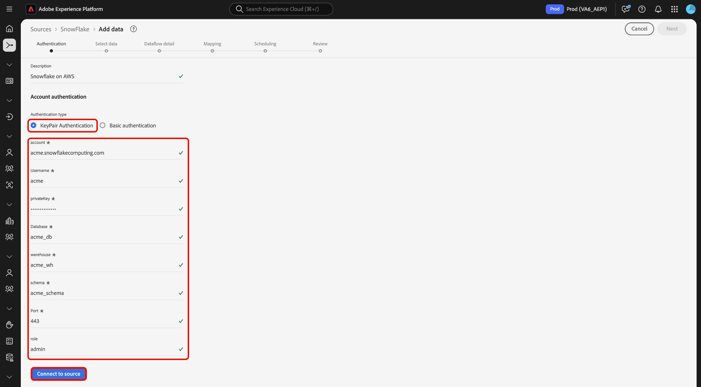

# Verbinden von [!DNL Snowflake] mit Experience Platform über die Benutzeroberfläche

>[!IMPORTANT]
>
>Die [!DNL Snowflake] ist im Quellkatalog für Benutzende verfügbar, die Real-Time Customer Data Platform Ultimate erworben haben.

Lesen Sie dieses Handbuch, um zu erfahren, wie Sie Ihr [!DNL Snowflake]-Konto über die Benutzeroberfläche mit Adobe Experience Platform verbinden.

## Erste Schritte

>[!WARNING]
>
>Die Standardauthentifizierung (oder Kontoschlüsselauthentifizierung) für die [!DNL Snowflake] wird ab November 2025 eingestellt. Sie müssen zur schlüsselpaarbasierten Authentifizierung wechseln, um weiterhin die -Quelle verwenden und Daten aus Ihrer -Datenbank in Experience Platform aufnehmen zu können. Weitere Informationen zur Einstellung finden Sie im [[!DNL Snowflake] Handbuch mit Best Practices zum Minimieren der Risiken durch das Kompromittieren von Anmeldeinformationen](https://www.snowflake.com/en/resources/white-paper/best-practices-to-mitigate-the-risk-of-credential-compromise/).

Dieses Tutorial setzt ein Grundverständnis der folgenden Komponenten von Experience Platform voraus:

* [Quellen](../../../../home.md): Experience Platform ermöglicht die Aufnahme von Daten aus verschiedenen Quellen und bietet Ihnen die Möglichkeit, die eingehenden Daten mithilfe von [!DNL Experience Platform]-Services zu strukturieren, zu kennzeichnen und anzureichern.
* [Sandboxes](../../../../../sandboxes/home.md): Experience Platform bietet virtuelle Sandboxes, die eine einzelne Experience Platform-Instanz in separate virtuelle Umgebungen unterteilen, damit Sie Programme für digitale Erlebnisse besser entwickeln und weiterentwickeln können.

>[!NOTE]
>
>Sie müssen das `PREVENT_UNLOAD_TO_INLINE_URL`-Flag auf `FALSE` setzen, um das Entladen von Daten aus Ihrer [!DNL Snowflake] in Experience Platform zu ermöglichen.

## Navigieren im Quellkatalog {#navigate}

Wählen Sie in der Experience Platform-Benutzeroberfläche **[!UICONTROL Quellen]** in der linken Navigationsleiste aus, um auf den Arbeitsbereich [!UICONTROL Quellen] zuzugreifen. Sie können die gewünschte Kategorie aus dem Katalog auf der linken Bildschirmseite auswählen. Alternativ können Sie die gewünschte Quelle mithilfe der Suchoption finden.

Wählen Sie **[!DNL Snowflake]** unter der Kategorie *[!UICONTROL Datenbanken]* und dann **[!UICONTROL Einrichten]**.

>[!TIP]
>
>Quellen im Quellkatalog zeigen die Option **[!UICONTROL Einrichten]** an, wenn eine bestimmte Quelle noch kein authentifiziertes Konto hat. Sobald ein authentifiziertes Konto vorhanden ist, ändert sich diese Option in **[!UICONTROL Daten hinzufügen]**.

## Vorhandenes Konto verwenden {#existing}

Anschließend werden Sie zum Authentifizierungsschritt des Quell-Workflows weitergeleitet. Hier können Sie entweder ein vorhandenes Konto verwenden oder ein neues Konto erstellen.

Um ein vorhandenes Konto zu verwenden, wählen Sie das [!DNL Snowflake] Konto, mit dem Sie eine Verbindung herstellen möchten, und klicken Sie dann auf **[!UICONTROL Weiter]**, um fortzufahren.

## Neues Konto erstellen {#create}

Wenn Sie noch kein -Konto haben, müssen Sie ein neues Konto erstellen, indem Sie die Authentifizierungsdaten angeben, die Ihrer Quelle entsprechen.

Um ein neues Konto zu erstellen, wählen Sie **[!UICONTROL Neues Konto]** und geben Sie dann einen Namen an und fügen Sie optional eine Beschreibung für Ihr Konto hinzu.

### Verbindung zu Experience Platform auf Azure herstellen {#azure}

Sie können Ihr [!DNL Snowflake]-Konto mit Experience Platform auf Azure verbinden, indem Sie entweder die Authentifizierung mit dem Kontoschlüssel oder die Schlüsselpaar-Authentifizierung verwenden.

>[!BEGINTABS]

>[!TAB Authentifizierung mit Kontoschlüssel]

Um die Kontoschlüsselauthentifizierung zu verwenden, wählen Sie **[!UICONTROL Kontoschlüsselauthentifizierung]**, geben Sie Ihre Verbindungszeichenfolge im Eingabeformular ein und wählen Sie dann **[!UICONTROL Mit Quelle verbinden]**.

| Anmeldedaten | Beschreibung |
| --- | --- |
| Konto | Ein Kontoname identifiziert ein Konto innerhalb Ihrer Organisation eindeutig. In diesem Fall müssen Sie ein Konto über verschiedene [!DNL Snowflake] hinweg eindeutig identifizieren. Dazu müssen Sie dem Kontonamen den Namen Ihres Unternehmens voranstellen. Beispiel: `orgname-account_name`. Weitere Anleitungen finden Sie im Handbuch [Abrufen  [!DNL Snowflake]  Kontokennung](../../../../connectors/databases/snowflake.md#retrieve-your-account-identifier) . Weiterführende Informationen dazu finden Sie im [[!DNL Snowflake] entsprechenden Handbuch](https://docs.snowflake.com/en/user-guide/admin-account-identifier#format-1-preferred-account-name-in-your-organization). |
| Warehouse | Das [!DNL Snowflake] Warehouse verwaltet den Abfrageausführungsprozess für das Programm. Jedes [!DNL Snowflake] Warehouse ist unabhängig voneinander und muss beim Übermitteln von Daten an Experience Platform einzeln aufgerufen werden. |
| Datenbank | Die [!DNL Snowflake]-Datenbank enthält die Daten, die Sie mit der Experience Platform verknüpfen möchten. |
| Benutzername | Der Benutzername für das [!DNL Snowflake]. |
| Passwort | Das Kennwort für das [!DNL Snowflake] Benutzerkonto. |
| Rolle | Die in der [!DNL Snowflake]-Sitzung zu verwendende standardmäßige Zugriffssteuerungsrolle. Die Rolle sollte eine vorhandene sein, die dem angegebenen Benutzer bereits zugewiesen wurde. Die Standardrolle ist `PUBLIC`. |
| Verbindungszeichenfolge | Die Verbindungszeichenfolge, die für die Verbindung mit Ihrer [!DNL Snowflake]-Instanz verwendet wird. Das Verbindungszeichenfolgenmuster für [!DNL Snowflake] ist `jdbc:snowflake://{ACCOUNT_NAME}.snowflakecomputing.com/?user={USERNAME}&password={PASSWORD}&db={DATABASE}&warehouse={WAREHOUSE}` |

>[!TAB Schlüsselpaar-Authentifizierung]

Um die Schlüsselpaar-Authentifizierung zu verwenden, wählen Sie **[!UICONTROL Schlüsselpaar-Authentifizierung]** aus, geben Sie Werte für Ihr Konto, Ihren Benutzernamen, Ihren privaten Schlüssel, die Passphrase für den privaten Schlüssel, Ihre Datenbank und Ihr Warehouse ein und wählen Sie dann **[!UICONTROL Mit Quelle verbinden]** aus.

Bei der Schlüsselpaar-Authentifizierung müssen Sie ein 2048-Bit-RSA-Schlüsselpaar generieren und dann die folgenden Werte angeben, wenn Sie ein Konto für Ihre [!DNL Snowflake] erstellen.

| Anmeldedaten | Beschreibung |
| --- | --- |
| Konto | Ein Kontoname identifiziert ein Konto innerhalb Ihrer Organisation eindeutig. In diesem Fall müssen Sie ein Konto über verschiedene [!DNL Snowflake] hinweg eindeutig identifizieren. Dazu müssen Sie dem Kontonamen den Namen Ihres Unternehmens voranstellen. Beispiel: `orgname-account_name`. Weitere Anleitungen finden Sie im Handbuch [Abrufen  [!DNL Snowflake]  Kontokennung](../../../../connectors/databases/snowflake.md#retrieve-your-account-identifier) . Weiterführende Informationen dazu finden Sie im [[!DNL Snowflake] entsprechenden Handbuch](https://docs.snowflake.com/en/user-guide/admin-account-identifier#format-1-preferred-account-name-in-your-organization). |
| Benutzername | Der Benutzername Ihres [!DNL Snowflake]. |
| Privater Schlüssel | Der [!DNL Base64-]kodierte private Schlüssel Ihres [!DNL Snowflake]. Sie können entweder verschlüsselte oder unverschlüsselte private Schlüssel generieren. Wenn Sie einen verschlüsselten privaten Schlüssel verwenden, müssen Sie auch eine Passphrase für den privaten Schlüssel angeben, wenn Sie sich bei Experience Platform authentifizieren. Weitere Informationen finden Sie im Handbuch unter [Abrufen  [!DNL Snowflake]  privaten ](../../../../connectors/databases/snowflake.md)Schlüssels). |
| Passphrase für privaten Schlüssel | Die Passphrase für den privaten Schlüssel ist eine zusätzliche Sicherheitsebene, die Sie bei der Authentifizierung mit einem verschlüsselten privaten Schlüssel verwenden müssen. Sie müssen die Passphrase nicht angeben, wenn Sie einen unverschlüsselten privaten Schlüssel verwenden. |
| Datenbank | Die [!DNL Snowflake], die die Daten enthält, die in Experience Platform aufgenommen werden sollen. |
| Warehouse | Das [!DNL Snowflake] Warehouse verwaltet den Abfrageausführungsprozess für das Programm. Jedes [!DNL Snowflake] Warehouse ist unabhängig voneinander und muss beim Übermitteln von Daten an Experience Platform einzeln aufgerufen werden. |

Weitere Informationen zu diesen Werten finden Sie in [diesem Snowflake-Dokument](https://docs.snowflake.com/en/user-guide/key-pair-auth.html).

>[!ENDTABS]

### Verbinden mit Experience Platform auf AWS {#aws}

>[!AVAILABILITY]
>
>Dieser Abschnitt gilt für Implementierungen von Experience Platform, die auf Amazon Web Services (AWS) ausgeführt werden. Experience Platform, das auf AWS ausgeführt wird, steht derzeit einer begrenzten Anzahl von Kunden zur Verfügung. Weitere Informationen zur unterstützten Experience Platform-Infrastruktur finden Sie in der Übersicht zur [Experience Platform Multi-Cloud](../../../../../landing/multi-cloud.md).

Um ein neues [!DNL Snowflake]-Konto zu erstellen und eine Verbindung zu Experience Platform auf AWS herzustellen, stellen Sie sicher, dass Sie sich in einer VA6-Sandbox befinden, und geben Sie dann die erforderlichen Anmeldeinformationen zur Authentifizierung an.

>[!BEGINTABS]

>[!TAB Schlüsselpaar-Authentifizierung]

Um eine Verbindung mithilfe von Schlüsselpaaren herzustellen, wählen Sie **[!UICONTROL Schlüsselpaar-Authentifizierung]**, geben Sie Ihre Authentifizierungsdaten ein und wählen Sie dann **[!UICONTROL Mit Quelle verbinden]**. Weitere Informationen zu diesen Anmeldeinformationen finden Sie unter [[!DNL Snowflake] Batch-Übersicht](../../../../connectors/databases/snowflake.md#gather-required-credentials).

>[!TAB Einfache Authentifizierung]

>[!WARNING]
>
>Die Standardauthentifizierung (oder Kontoschlüsselauthentifizierung) für die [!DNL Snowflake] wird ab November 2025 eingestellt. Sie müssen zur schlüsselpaarbasierten Authentifizierung wechseln, um weiterhin die -Quelle verwenden und Daten aus Ihrer -Datenbank in Experience Platform aufnehmen zu können. Weitere Informationen zur Einstellung finden Sie im [[!DNL Snowflake] Handbuch mit Best Practices zum Minimieren der Risiken durch das Kompromittieren von Anmeldeinformationen](https://www.snowflake.com/en/resources/white-paper/best-practices-to-mitigate-the-risk-of-credential-compromise/).

Um eine Verbindung mit einer Kombination aus Benutzername und Kennwort herzustellen, wählen Sie **[!UICONTROL Standardauthentifizierung]**, geben Sie Ihre Authentifizierungsdaten ein und wählen Sie **[!UICONTROL Mit Quelle verbinden]**. Weitere Informationen zu diesen Anmeldeinformationen finden Sie unter [[!DNL Snowflake] Batch-Übersicht](../../../../connectors/databases/snowflake.md#gather-required-credentials).

>[!ENDTABS]

### Vorschau der Beispieldaten überspringen {#skip-preview-of-sample-data}

Während des Datenauswahlschritts kann es bei der Aufnahme großer Datentabellen oder -dateien zu einer Zeitüberschreitung kommen. Sie können die Datenvorschau überspringen, um die Zeitüberschreitung zu umgehen, und Ihr Schema dennoch anzeigen, wenn auch ohne Beispieldaten. Um die Datenvorschau zu überspringen, aktivieren Sie den Umschalter **[!UICONTROL Vorschau von Beispieldaten überspringen]**.

Der Rest des Workflows bleibt unverändert. Der einzige Nachteil besteht darin, dass das Überspringen der Datenvorschau verhindert, dass berechnete und erforderliche Felder während des Zuordnungsschritts automatisch validiert werden. Diese Felder müssen dann während der Zuordnung manuell validiert werden.

## Nächste Schritte

In diesem Tutorial haben Sie eine Verbindung zu Ihrem Snowflake-Konto hergestellt. Sie können jetzt mit dem nächsten Tutorial fortfahren und [einen Datenfluss konfigurieren, um Daten in zu importieren [!DNL Experience Platform]](../../dataflow/databases.md).
