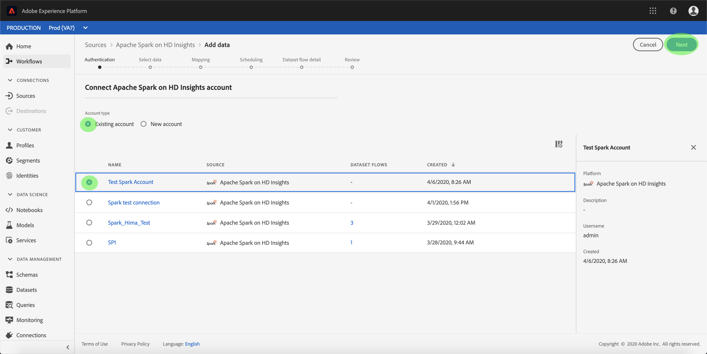

# Erstellen einer [!DNL Apache Spark]-Quellverbindung in der Benutzeroberfläche[!DNL Azure HDInsights]

>[!NOTE]
>
> Der [!DNL Apache Spark] auf [!DNL Azure HDInsights] Connector befindet sich in der Beta-Version. Weitere Informationen zur Verwendung von Beta-gekennzeichneten Connectors finden Sie unter [Sources overview](../../../../home.md#terms-and-conditions).

Die Source Connectors in Adobe Experience Platform bieten die Möglichkeit, extern beschaffte Daten planmäßig zu erfassen. Dieses Lernprogramm enthält Schritte zum Erstellen eines [!DNL Apache Spark] auf [!DNL Azure HDInsights]-Quellanschluss mithilfe der [!DNL Platform]-Benutzeroberfläche.

## Erste Schritte

Dieses Tutorial setzt ein Grundverständnis der folgenden Komponenten von Adobe Experience Platform voraus:

* [Experience-Datenmodell (XDM)-System](../../../../../xdm/home.md): Das standardisierte Framework, mit dem Experience Platform Kundenerlebnisdaten organisiert.
   * [Grundlagen der Schemakomposition](../../../../../xdm/schema/composition.md): Machen Sie sich mit den Grundbausteinen von XDM-Schemas sowie den zentralen Konzepten und Best Practices rund um die Erstellung von Schemas vertraut.
   * [Schema-Editor-Lernprogramm](../../../../../xdm/tutorials/create-schema-ui.md): Erfahren Sie, wie Sie mit der Benutzeroberfläche des Schema-Editors benutzerdefinierte Schema erstellen.
* [Echtzeit-Kundenprofil](../../../../../profile/home.md): Bietet ein einheitliches Echtzeit-Kundenprofil, das auf aggregierten Daten aus verschiedenen Quellen basiert.

Wenn Sie bereits über eine gültige [!DNL Spark]-Verbindung verfügen, können Sie den Rest dieses Dokuments überspringen und mit dem Tutorial [Konfigurieren eines Datenflusses](../../dataflow/databases.md) fortfahren

### Erforderliche Anmeldedaten sammeln

Um auf Ihr [!DNL Spark]-Konto bei [!DNL Platform] zuzugreifen, müssen Sie die folgenden Werte angeben:

| Berechtigung | Beschreibung |
| ---------- | ----------- |
| `host` | Die IP-Adresse oder der Hostname des [!DNL Spark]-Servers. |
| `username` | Der Benutzername, mit dem Sie auf den [!DNL Spark]-Server zugreifen. |
| `password` | Das dem Benutzer zugeordnete Kennwort. |

Weitere Informationen zu den ersten Schritten finden Sie in [diesem Spark-Dokument](https://docs.microsoft.com/en-us/azure/hdinsight/spark/apache-spark-overview).

## Verbinden Sie Ihr [!DNL Spark]-Konto

Nachdem Sie die erforderlichen Anmeldeinformationen gesammelt haben, führen Sie die folgenden Schritte aus, um Ihr [!DNL Spark]-Konto für die Verbindung mit [!DNL Platform] zu verknüpfen.

Melden Sie sich bei [Adobe Experience Platform](https://platform.adobe.com) an und wählen Sie dann **[!UICONTROL Quellen]** in der linken Navigationsleiste aus, um auf den Arbeitsbereich **[!UICONTROL Quellen]** zuzugreifen. Der Bildschirm **[!UICONTROL Katalog]** zeigt eine Reihe von Quellen an, für die Sie ein Konto erstellen können.

Sie können die entsprechende Kategorie im Katalog auf der linken Seite des Bildschirms auswählen. Alternativ können Sie die gewünschte Quelle mit der Suchoption finden.

Wählen Sie unter der Kategorie **[!UICONTROL Datenbanken]** **[!UICONTROL Spark]**. Wenn Sie diesen Connector zum ersten Mal verwenden, wählen Sie **[!UICONTROL Konfigurieren]**. Andernfalls wählen Sie **[!UICONTROL Hinzufügen Daten]** aus, um einen neuen [!DNL Spark]-Connector zu erstellen.

Die Seite **[!UICONTROL Verbindung mit Spark]** wird angezeigt. Auf dieser Seite können Sie entweder neue oder vorhandene Anmeldeinformationen verwenden.

### Neues Konto

Wenn Sie neue Anmeldeinformationen verwenden, wählen Sie **[!UICONTROL Neues Konto]**. Geben Sie im eingeblendeten Eingabeformular einen Namen, eine optionale Beschreibung und Ihre [!DNL Spark]-Anmeldedaten ein. Wenn Sie fertig sind, wählen Sie **[!UICONTROL Verbinden]** und lassen Sie dann etwas Zeit, bis die neue Verbindung hergestellt ist.

### Vorhandenes Konto

Um ein vorhandenes Konto zu verbinden, wählen Sie das [!DNL Spark]-Konto, mit dem Sie eine Verbindung herstellen möchten, und klicken Sie dann auf **[!UICONTROL Weiter]**, um fortzufahren.

## Nächste Schritte

Mit diesem Tutorial haben Sie eine Verbindung zu Ihrem [!DNL Spark]-Konto hergestellt. Sie können nun mit dem nächsten Lernprogramm fortfahren und [einen Datendurchlauf konfigurieren, um Daten in [!DNL Platform]](../../dataflow/databases.md) zu übertragen.
