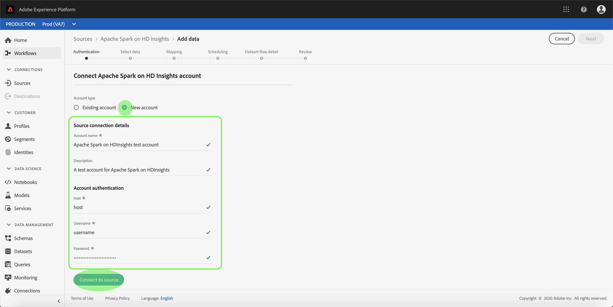

# Erstellen eines [!DNL Apache Spark] über [!DNL Azure HDInsights] Quellverbindung in der Benutzeroberfläche

>[!NOTE]
>
> Der [!DNL Apache Spark] auf [!DNL Azure HDInsights] Connector befindet sich in der Beta-Phase. Weitere Informationen zur Verwendung von Beta[gekennzeichneten Connectoren finden Sie ](../../../../home.md#terms-and-conditions) „Quellen - Übersicht“ .

Source-Connectoren in Adobe Experience Platform bieten die Möglichkeit, Daten aus externen Quellen nach einem bestimmten Zeitplan aufzunehmen. In diesem Tutorial finden Sie die Schritte zum Erstellen eines [!DNL Apache Spark] auf [!DNL Azure HDInsights] Quell-Connector mithilfe der [!DNL Experience Platform]-Benutzeroberfläche.

## Erste Schritte

Dieses Tutorial setzt ein Grundverständnis der folgenden Komponenten von Adobe Experience Platform voraus:

* [Experience-Datenmodell (XDM)-System](../../../../../xdm/home.md): Das standardisierte Framework, mit dem Experience Platform Kundenerlebnisdaten organisiert.
   * [Grundlagen der Schemakomposition](../../../../../xdm/schema/composition.md): Machen Sie sich mit den grundlegenden Bausteinen von XDM-Schemata vertraut, einschließlich der wichtigsten Prinzipien und Best Practices bei der Schemaerstellung.
   * [Tutorial zum Schema-Editor](../../../../../xdm/tutorials/create-schema-ui.md): Erfahren Sie, wie Sie benutzerdefinierte Schemata mithilfe der Benutzeroberfläche des Schema-Editors erstellen können.
* [Echtzeit-Kundenprofil](../../../../../profile/home.md): Bietet ein einheitliches Echtzeit-Kundenprofil, das auf aggregierten Daten aus verschiedenen Quellen basiert.

Wenn Sie bereits über eine gültige [!DNL Spark]-Verbindung verfügen, können Sie den Rest dieses Dokuments überspringen und mit dem Tutorial zum [ eines Datenflusses fortfahren](../../dataflow/databases.md)

### Sammeln erforderlicher Anmeldedaten

Um auf Ihr [!DNL Spark]-Konto in [!DNL Experience Platform] zugreifen zu können, müssen Sie die folgenden Werte angeben:

| Anmeldedaten | Beschreibung |
| ---------- | ----------- |
| `host` | Die IP-Adresse oder der Hostname des [!DNL Spark]. |
| `username` | Der Benutzername, mit dem Sie auf den [!DNL Spark] zugreifen. |
| `password` | Das Kennwort, das dem Benutzer entspricht. |

Weitere Informationen zu den ersten Schritten finden Sie in [diesem Spark-Dokument](https://docs.microsoft.com/en-us/azure/hdinsight/spark/apache-spark-overview).

## Verbinden Ihres [!DNL Spark]-Kontos

Nachdem Sie die erforderlichen Anmeldeinformationen gesammelt haben, können Sie die folgenden Schritte ausführen, um Ihr [!DNL Spark]-Konto mit [!DNL Experience Platform] zu verknüpfen.

Melden Sie sich bei [Adobe Experience Platform](https://platform.adobe.com) an und wählen Sie **[!UICONTROL Quellen]** in der linken Navigationsleiste aus, um auf den Arbeitsbereich **[!UICONTROL Quellen]** zuzugreifen. Der Bildschirm **[!UICONTROL Katalog]** zeigt eine Vielzahl von Quellen an, mit denen Sie ein Konto erstellen können.

Sie können die gewünschte Kategorie aus dem Katalog auf der linken Bildschirmseite auswählen. Alternativ können Sie die gewünschte Quelle mithilfe der Suchoption finden.

Wählen Sie unter **[!UICONTROL Kategorie]** die Option **[!UICONTROL Spark]** aus. Wenn Sie diesen Connector zum ersten Mal verwenden, wählen Sie **[!UICONTROL Konfigurieren]** aus. Wählen Sie andernfalls **[!UICONTROL Daten hinzufügen]** aus, um einen neuen [!DNL Spark]-Connector zu erstellen.

Die **[!UICONTROL „Mit Spark verbinden]** wird angezeigt. Auf dieser Seite können Sie entweder neue oder vorhandene Anmeldedaten verwenden.

### Neues Konto

Wenn Sie neue Anmeldedaten verwenden, wählen Sie **[!UICONTROL Neues Konto]** aus. Geben Sie im angezeigten Eingabeformular einen Namen, eine optionale Beschreibung und Ihre [!DNL Spark] Anmeldeinformationen ein. Wenn Sie fertig sind, wählen **[!UICONTROL Verbinden]** und warten Sie dann einige Zeit, bis die neue Verbindung hergestellt ist.

### Vorhandenes Konto

Um ein vorhandenes Konto zu verbinden, wählen Sie das [!DNL Spark] Konto, mit dem Sie eine Verbindung herstellen möchten, und klicken Sie dann auf **[!UICONTROL Weiter]**, um fortzufahren.

## Nächste Schritte

Mithilfe dieses Tutorials haben Sie eine Verbindung zu Ihrem [!DNL Spark]-Konto hergestellt. Sie können jetzt mit dem nächsten Tutorial fortfahren und [einen Datenfluss konfigurieren, um Daten in zu importieren [!DNL Experience Platform]](../../dataflow/databases.md).
