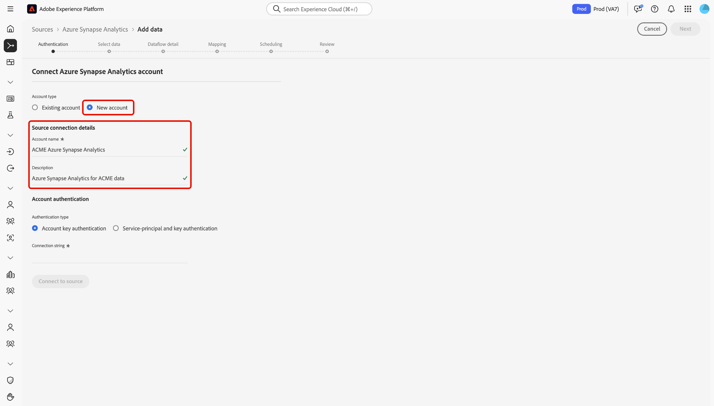

# Erstellen Sie eine [!DNL Azure Synapse Analytics] Quellverbindung in der Benutzeroberfläche

>[!IMPORTANT]
>
>Die [!DNL Azure Synapse Analytics] -Quelle ist im Quellkatalog für Benutzer verfügbar, die Real-time Customer Data Platform Ultimate erworben haben.

In diesem Tutorial werden Schritte zum Erstellen eines [!DNL Azure Synapse Analytics] (nachstehend &quot;genannt)[!DNL Synapse]&quot;) Quell-Connector mit dem [!DNL Platform] -Benutzeroberfläche.

## Erste Schritte

Dieses Tutorial setzt ein Grundverständnis der folgenden Komponenten von Adobe Experience Platform voraus:

* [[!DNL Experience Data Model (XDM)] System](../../../../../xdm/home.md): Das standardisierte Framework, mit dem [!DNL Experience Platform] Kundenerlebnisdaten organisiert.
   * [Grundlagen der Schemakomposition](../../../../../xdm/schema/composition.md): Machen Sie sich mit den grundlegenden Bausteinen von XDM-Schemas vertraut, einschließlich der wichtigsten Prinzipien und Best Practices bei der Schemaerstellung.
   * [Tutorial zum Schema-Editor](../../../../../xdm/tutorials/create-schema-ui.md): Erfahren Sie, wie Sie benutzerdefinierte Schemas mithilfe der Benutzeroberfläche des Schema-Editors erstellen können.
* [[!DNL Real-Time Customer Profile]](../../../../../profile/home.md): Bietet ein einheitliches Echtzeit-Kundenprofil, das auf aggregierten Daten aus verschiedenen Quellen basiert.

Wenn Sie bereits über eine gültige [!DNL Synapse]-Verbindung verfügen, können Sie den Rest dieses Dokuments überspringen und mit dem Tutorial zum [Konfigurieren eines Datenflusses](../../dataflow/databases.md) fortfahren.

### Sammeln erforderlicher Anmeldeinformationen

Um auf Ihr [!DNL Synapse]-Konto in zugreifen zu können, müssen Sie die folgenden Werte angeben:[!DNL Platform]

| Anmeldedaten | Beschreibung |
| ---------- | ----------- |
| `connectionString` | Die Verbindungszeichenfolge, die mit Ihrer [!DNL Synapse] Authentifizierung. Die [!DNL Synapse] Verbindungszeichenfolgenmuster ist `Server=tcp:{SERVER_NAME}.database.windows.net,1433;Database={DATABASE};User ID={USERNAME}@{SERVER_NAME};Password={PASSWORD};Trusted_Connection=False;Encrypt=True;Connection Timeout=30`. |

Weitere Informationen zu diesem Wert finden Sie unter [this [!DNL Synapse] Dokument](https://docs.microsoft.com/en-us/azure/data-factory/connector-azure-sql-data-warehouse).

## Verbinden Ihres [!DNL Synapse]-Kontos

Nachdem Sie die erforderlichen Anmeldedaten erfasst haben, können Sie die folgenden Schritte ausführen, um Ihr [!DNL Synapse]-Konto mit [!DNL Platform] zu verknüpfen.

Anmelden bei [Adobe Experience Platform](https://platform.adobe.com) und wählen Sie **[!UICONTROL Quellen]** über die linke Navigationsleiste, um auf die **[!UICONTROL Quellen]** Arbeitsbereich. Der Bildschirm **[!UICONTROL Katalog]** zeigt eine Vielzahl von Quellen an, mit denen Sie ein Konto erstellen können.

Sie können die gewünschte Kategorie aus dem Katalog auf der linken Bildschirmseite auswählen. Alternativ können Sie die gewünschte Quelle mithilfe der Suchoption finden.

Unter dem **[!UICONTROL Datenbanken]** category, select **[!UICONTROL azure synapse Analytics]**. Wenn Sie diesen Connector zum ersten Mal verwenden, wählen Sie **[!UICONTROL Konfigurieren]**. Andernfalls wählen Sie **[!UICONTROL Daten hinzufügen]** , um eine neue [!DNL Synapse] Connector.

Die **[!UICONTROL Verbindung zu Azure synapse Analytics herstellen]** angezeigt. Auf dieser Seite können Sie entweder neue oder vorhandene Anmeldedaten verwenden.

### Neues Konto

Wenn Sie neue Anmeldeinformationen verwenden, wählen Sie **[!UICONTROL Neues Konto]** aus. Geben Sie im angezeigten Formular einen Namen, eine optionale Beschreibung und Ihre [!DNL Synapse] Anmeldedaten. Wenn Sie fertig sind, wählen Sie **[!UICONTROL Verbinden]** und dann etwas Zeit für die Einrichtung der neuen Verbindung.

### Vorhandenes Konto

Um ein vorhandenes Konto zu verbinden, wählen Sie die [!DNL Synapse] Konto, mit dem Sie eine Verbindung herstellen möchten, wählen Sie **[!UICONTROL Nächste]** um fortzufahren.

## Nächste Schritte

Mithilfe dieses Tutorials haben Sie eine Verbindung zu Ihrem [!DNL Synapse]-Konto hergestellt. Sie können jetzt mit dem nächsten Tutorial fortfahren und einen [Datenfluss konfigurieren, um Daten in zu importieren [!DNL Platform]](../../dataflow/databases.md).
