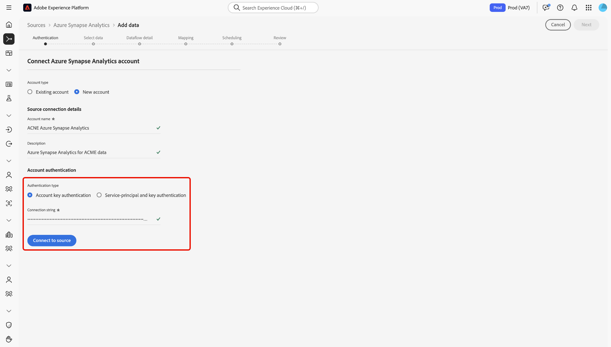

# Erstellen einer [!DNL Azure Synapse Analytics]-Quellverbindung über die Benutzeroberfläche

>[!IMPORTANT]
>
>Die [!DNL Azure Synapse Analytics] ist im Quellkatalog für Benutzende verfügbar, die Real-Time Customer Data Platform Ultimate erworben haben.

Lesen Sie dieses Handbuch, um zu erfahren, wie Sie Ihr [!DNL Azure Synapse Analytics]-Konto mithilfe des Quellarbeitsbereichs in der Benutzeroberfläche mit Adobe Experience Platform verbinden.

## Erste Schritte

Dieses Tutorial setzt ein Grundverständnis der folgenden Komponenten von Experience Platform voraus:

* [[!DNL Experience Data Model (XDM)] System](../../../../../xdm/home.md): Das standardisierte Framework, mit dem [!DNL Experience Platform] Kundenerlebnisdaten organisiert.
   * [Grundlagen der Schemakomposition](../../../../../xdm/schema/composition.md): Machen Sie sich mit den grundlegenden Bausteinen von XDM-Schemata vertraut, einschließlich der wichtigsten Prinzipien und Best Practices bei der Schemaerstellung.
   * [Tutorial zum Schema-Editor](../../../../../xdm/tutorials/create-schema-ui.md): Erfahren Sie, wie Sie benutzerdefinierte Schemata mithilfe der Benutzeroberfläche des Schema-Editors erstellen können.
* [[!DNL Real-Time Customer Profile]](../../../../../profile/home.md): Bietet ein einheitliches Echtzeit-Kundenprofil, das auf aggregierten Daten aus verschiedenen Quellen basiert.

Wenn Sie bereits über eine gültige [!DNL Azure Synapse Analytics]-Verbindung verfügen, können Sie den Rest dieses Dokuments überspringen und mit dem Tutorial zum [Konfigurieren eines Datenflusses](../../dataflow/databases.md) fortfahren.

### Sammeln erforderlicher Anmeldedaten

Informationen zur Authentifizierung [[!DNL Azure Synapse Analytics]  Sie in &#x200B;](../../../../connectors/databases/synapse-analytics.md#prerequisites)Übersicht“.

## Navigieren im Quellkatalog

Wählen Sie in der Experience Platform-Benutzeroberfläche **[!UICONTROL Quellen]** in der linken Navigationsleiste aus, um auf den Arbeitsbereich *[!UICONTROL Quellen]* zuzugreifen. Wählen Sie eine Kategorie aus oder verwenden Sie die Suchleiste, um Ihre Quelle zu finden.

Um eine Verbindung zu [!DNL Azure Synapse Analytics] herzustellen, wechseln Sie zur Kategorie *[!UICONTROL Datenbanken]*, wählen Sie die Quellkarte **[!UICONTROL Azure Synapse Analytics]** aus und klicken Sie dann auf **[!UICONTROL Einrichten]**.

>[!TIP]
>
>Quellen im Quellkatalog zeigen die Option **[!UICONTROL Einrichten]** an, wenn eine bestimmte Quelle noch kein authentifiziertes Konto hat. Nachdem ein authentifiziertes Konto erstellt wurde, ändert sich diese Option in **[!UICONTROL Daten hinzufügen]**.

## Vorhandenes Konto verwenden {#existing}

Um ein vorhandenes Konto zu verwenden, wählen Sie **[!UICONTROL Vorhandenes Konto]** und dann das [!DNL Azure Synapse Analytics] Konto aus, das Sie verwenden möchten.

## Neues Konto erstellen {#new}

Um ein neues Konto zu erstellen, wählen Sie **[!UICONTROL Neues Konto]** und geben Sie dann einen Namen an und fügen Sie optional eine Beschreibung für Ihr Konto hinzu.

### Verbindung mit Experience Platform herstellen

Sie können Ihr [!DNL Azure Synapse Analytics] mit Experience Platform verbinden, indem Sie entweder die Authentifizierung mit dem Kontoschlüssel oder die Authentifizierung mit dem Service-Prinzipal und dem Schlüssel verwenden.

>[!BEGINTABS]

>[!TAB Authentifizierung mit Kontoschlüssel]

Um die Kontoschlüsselauthentifizierung zu verwenden, wählen Sie **[!UICONTROL Kontoschlüsselauthentifizierung]**, geben Sie Ihre [Verbindungszeichenfolge](../../../../connectors/databases/synapse-analytics.md#prerequisites) an und wählen Sie dann **[!UICONTROL Mit Quelle verbinden]**.

>[!TAB Authentifizierung von Service-Prinzipalen und -Schlüsseln]

Wählen Sie alternativ **[!UICONTROL Service-Prinzipal- und Schlüsselauthentifizierung]**, geben Sie Werte für Ihre [Authentifizierungsberechtigungen](../../../../connectors/databases/synapse-analytics.md#prerequisites) ein und wählen Sie dann **[!UICONTROL Mit Quelle verbinden]**.

>[!ENDTABS]

## Erstellen eines Datenflusses für [!DNL Azure Synapse Analytics] Daten

Nachdem Sie Ihre [!DNL Azure Synapse Analytics] erfolgreich verbunden haben, können Sie jetzt [einen Datenfluss erstellen und Daten aus Ihrer Datenbank in Experience Platform aufnehmen](../../dataflow/databases.md).
