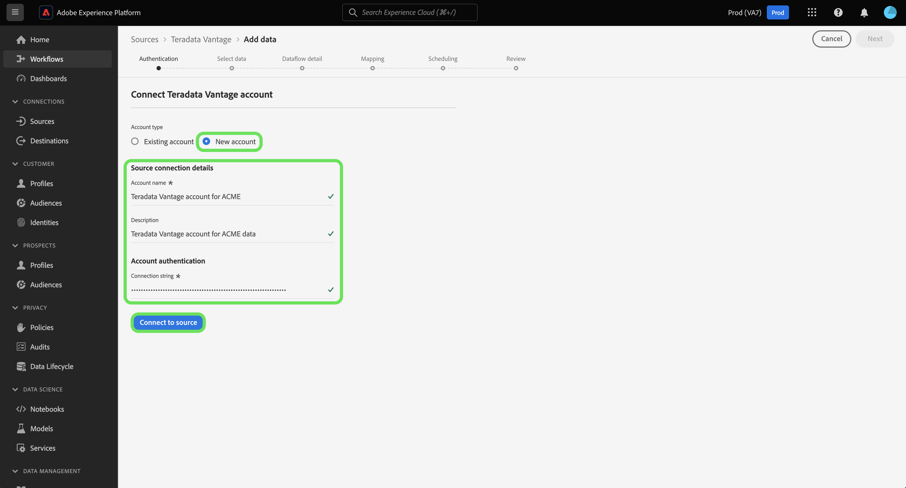

# Erstellen eines Quell-Connectors für [!DNL Teradata Vantage] in der Benutzeroberfläche

In diesem Tutorial finden Sie die Schritte zum Erstellen eines [!DNL Teradata Vantage]-Quell-Connectors mithilfe der Benutzeroberfläche von Adobe Experience Platform.

## Erste Schritte

Dieses Tutorial setzt ein Grundverständnis der folgenden Komponenten von Experience Platform voraus:

* [Quellen](../../../../home.md): Experience Platform ermöglicht die Aufnahme von Daten aus verschiedenen Quellen und bietet Ihnen die Möglichkeit, die eingehenden Daten mithilfe von Experience Platform-Services zu strukturieren, zu kennzeichnen und anzureichern.
* [Sandboxes](../../../../../sandboxes/home.md): Experience Platform bietet virtuelle Sandboxes, die eine einzelne Experience Platform-Instanz in separate virtuelle Umgebungen unterteilen, damit Sie Programme für digitale Erlebnisse besser entwickeln und weiterentwickeln können.

### Sammeln erforderlicher Anmeldedaten

Um auf Ihr [!DNL Teradata Vantage]-Konto in Experience Platform zugreifen zu können, müssen Sie den folgenden Authentifizierungswert angeben:

| Anmeldedaten | Beschreibung |
| ---------- | ----------- |
| Verbindungszeichenfolge | Eine Verbindungszeichenfolge ist eine Zeichenfolge, die Informationen über eine Datenquelle und darüber bereitstellt, wie Sie eine Verbindung mit ihr herstellen können. Das Verbindungszeichenfolgenmuster für [!DNL Teradata Vantage] ist `DBCName={SERVER};Uid={USERNAME};Pwd={PASSWORD}`. |

Weitere Informationen zu den ersten Schritten finden Sie in diesem [[!DNL Teradata Vantage] Dokument](https://docs.teradata.com/r/Teradata-VantageTM-Advanced-SQL-Engine-Security-Administration/July-2021/Setting-Up-the-Administrative-Infrastructure/Controlling-Access-to-the-Operating-System/Working-with-OS-Level-Security-Options).

## Verbinden Ihres [!DNL Teradata Vantage]-Kontos

Wählen Sie in der Benutzeroberfläche von Experience Platform in der linken Navigationsleiste die Option **[!UICONTROL Sources]** , um auf den [!UICONTROL Sources]-Arbeitsbereich zuzugreifen. Sie können die gewünschte Kategorie aus dem Katalog auf der linken Bildschirmseite auswählen. Alternativ können Sie die gewünschte Quelle mithilfe der Suchoption finden.

Wählen Sie unter der Kategorie [!UICONTROL Databases] die Option **[!UICONTROL Teradata Vantage]** und dann **[!UICONTROL Set up]** aus.

>[!TIP]
>
>Quellen im Quellkatalog zeigen die **[!UICONTROL Set up]** an, wenn eine bestimmte Quelle noch kein authentifiziertes Konto hat. Sobald ein authentifiziertes Konto vorhanden ist, ändert sich diese Option in **[!UICONTROL Add data]**.

Die Seite **[!UICONTROL Connect to Teradata Vantage]** wird angezeigt. Auf dieser Seite können Sie entweder neue oder vorhandene Anmeldedaten verwenden.

### Vorhandenes Konto

Um ein vorhandenes Konto zu verbinden, wählen Sie das [!DNL Teradata Vantage] Konto, mit dem Sie eine Verbindung herstellen möchten, und klicken Sie dann auf **[!UICONTROL Next]** , um fortzufahren.

### Neues Konto

Wenn Sie neue Anmeldeinformationen verwenden, wählen Sie **[!UICONTROL New account]** aus. Geben Sie im angezeigten Eingabeformular einen Namen, eine optionale Beschreibung und Ihre [!DNL Teradata Vantage] Anmeldeinformationen ein. Wenn Sie fertig sind, wählen Sie **[!UICONTROL Connect]** aus und warten Sie dann einige Zeit, bis die neue Verbindung hergestellt ist.

## Nächste Schritte

In diesem Tutorial haben Sie eine Verbindung zu Ihrem Teradata Vantage-Konto hergestellt. Sie können jetzt mit dem nächsten Tutorial fortfahren und [einen Datenfluss konfigurieren, um Daten in Experience Platform zu importieren](../../dataflow/databases.md).
