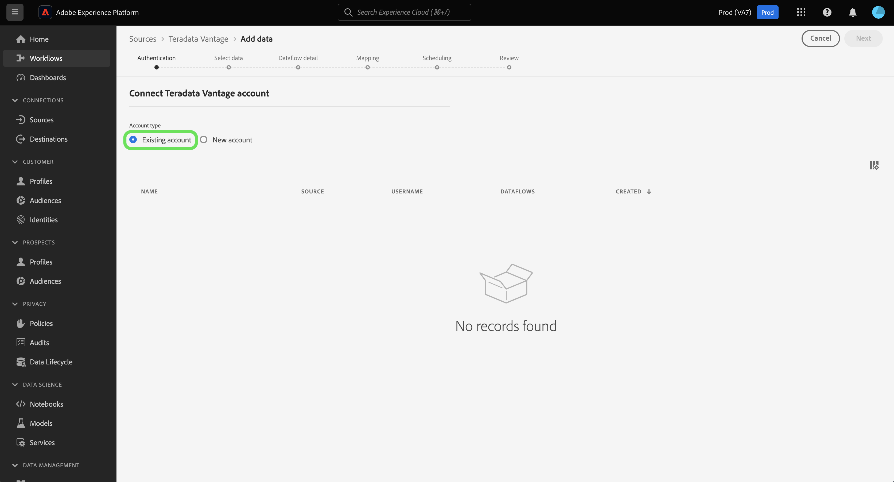

# Erstellen eines Quell-Connectors für [!DNL Teradata Vantage] in der Benutzeroberfläche

In diesem Tutorial werden Schritte zum Erstellen eines [!DNL Teradata Vantage] Quell-Connector über die Adobe Experience Platform-Benutzeroberfläche.

## Erste Schritte

Dieses Tutorial setzt ein Verständnis der folgenden Komponenten von Platform voraus:

* [Quellen](../../../../home.md): Experience Platform ermöglicht die Erfassung von Daten aus verschiedenen Quellen und bietet Ihnen gleichzeitig die Möglichkeit, eingehende Daten mithilfe von Experience Platform-Diensten zu strukturieren, zu beschriften und zu erweitern.
* [Sandboxes](../../../../../sandboxes/home.md): Experience Platform bietet virtuelle Sandboxes, die eine einzelne Platform-Instanz in separate virtuelle Umgebungen unterteilen, damit Sie Programme für digitale Erlebnisse entwickeln und weiterentwickeln können.

### Sammeln erforderlicher Anmeldeinformationen

Um auf Ihre [!DNL Teradata Vantage] -Konto auf Platform angeben, müssen Sie den folgenden Authentifizierungswert angeben:

| Anmeldedaten | Beschreibung |
| ---------- | ----------- |
| Verbindungszeichenfolge | Eine Verbindungszeichenfolge ist eine Zeichenfolge, die Informationen über eine Datenquelle und darüber bereitstellt, wie Sie eine Verbindung mit ihr herstellen können. Das Verbindungszeichenfolgenmuster für [!DNL Teradata Vantage] is `DBCName={SERVER};Uid={USERNAME};Pwd={PASSWORD}`. |

Weiterführende Informationen zu den ersten Schritten finden Sie in diesem Abschnitt [[!DNL Teradata Vantage] Dokument](https://docs.teradata.com/r/Teradata-VantageTM-Advanced-SQL-Engine-Security-Administration/July-2021/Setting-Up-the-Administrative-Infrastructure/Controlling-Access-to-the-Operating-System/Working-with-OS-Level-Security-Options).

## Verbinden Ihres [!DNL Teradata Vantage]-Kontos

Wählen Sie in der Platform-Benutzeroberfläche in der linken Navigationsleiste die Option **[!UICONTROL Quellen]**, um auf den Arbeitsbereich [!UICONTROL Quellen] zuzugreifen. Sie können die gewünschte Kategorie aus dem Katalog auf der linken Bildschirmseite auswählen. Alternativ können Sie die gewünschte Quelle mithilfe der Suchoption finden.

Unter dem [!UICONTROL Datenbanken] category, select **[!UICONTROL Teradata Vantage]** und wählen Sie **[!UICONTROL Einrichten]**.

>[!TIP]
>
>Quellen im Quellkatalog zeigen die **[!UICONTROL Einrichten]** -Option, wenn eine bestimmte Quelle noch kein authentifiziertes Konto hat. Sobald ein authentifiziertes Konto existiert, wird diese Option in **[!UICONTROL Daten hinzufügen]**.

Die **[!UICONTROL Mit Teradata Vantage verbinden]** angezeigt. Auf dieser Seite können Sie entweder neue oder vorhandene Anmeldedaten verwenden.

### Vorhandenes Konto

Um ein vorhandenes Konto zu verbinden, wählen Sie die [!DNL Teradata Vantage] Konto, mit dem Sie eine Verbindung herstellen möchten, wählen Sie **[!UICONTROL Nächste]** um fortzufahren.

### Neues Konto

Wenn Sie neue Anmeldeinformationen verwenden, wählen Sie **[!UICONTROL Neues Konto]** aus. Geben Sie im angezeigten Formular einen Namen, eine optionale Beschreibung und Ihre [!DNL Teradata Vantage] Anmeldedaten. Wählen Sie zum Abschluss **[!UICONTROL Verbinden]** und dann etwas Zeit für die Einrichtung der neuen Verbindung.

## Nächste Schritte

In diesem Tutorial haben Sie eine Verbindung zu Ihrem Teradata Vantage-Konto hergestellt. Sie können jetzt mit dem nächsten Tutorial fortfahren und einen [Datenfluss konfigurieren, um Daten in Platform zu importieren](../../dataflow/databases.md).
