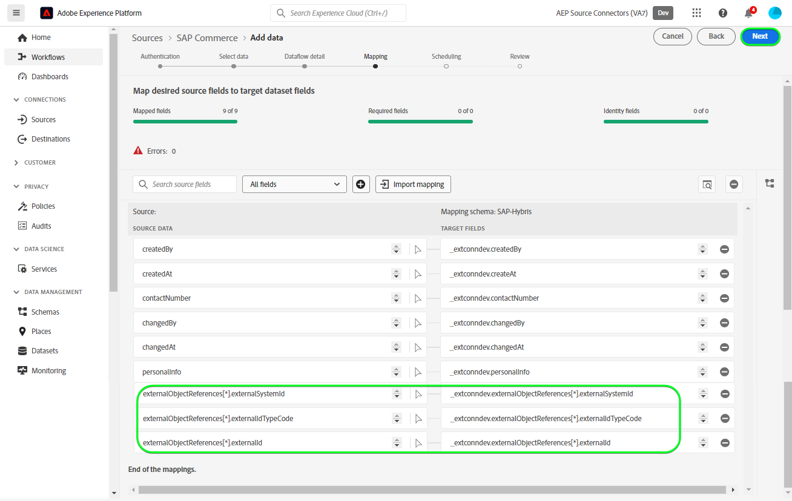

# Erstellen eines Quell-Connectors für [!DNL SAP Commerce] in der Benutzeroberfläche

>[!NOTE]
>
>Die [!DNL SAP Commerce]-Quelle befindet sich in der Beta-Phase. Siehe [Quellen - Übersicht](../../../../home.md#terms-and-conditions) für weitere Informationen zur Verwendung von Beta-beschrifteten Quellen.

Das folgende Tutorial führt Sie durch die Schritte zum Erstellen einer [!DNL SAP Commerce] Quellverbindung zu [[!DNL SAP] Abrechnung von Abonnements](https://www.sap.com/products/financial-management/subscription-billing.html) Kontakte und Kundendaten über die Benutzeroberfläche von Adobe Experience Platform.

## Erste Schritte {#getting-started}

Dieses Tutorial setzt ein Grundverständnis der folgenden Komponenten von Experience Platform voraus:

* [[!DNL Experience Data Model (XDM)] System](../../../../../xdm/home.md): Das standardisierte Framework, mit dem [!DNL Experience Platform] Kundenerlebnisdaten organisiert.
   * [Grundlagen der Schemakomposition](../../../../../xdm/schema/composition.md): Machen Sie sich mit den grundlegenden Bausteinen von XDM-Schemas vertraut, einschließlich der wichtigsten Prinzipien und Best Practices bei der Schemaerstellung.
   * [Tutorial zum Schema-Editor](../../../../../xdm/tutorials/create-schema-ui.md): Erfahren Sie, wie Sie benutzerdefinierte Schemas mithilfe der Benutzeroberfläche des Schema-Editors erstellen können.
* [[!DNL Real-Time Customer Profile]](../../../../../profile/home.md): Bietet ein einheitliches Echtzeit-Kundenprofil, das auf aggregierten Daten aus verschiedenen Quellen basiert.

Wenn Sie bereits über ein gültiges [!DNL SAP Commerce]-Konto verfügen, können Sie den Rest dieses Dokuments überspringen und mit dem Tutorial zum [Konfigurieren eines Datenflusses](../../dataflow/ecommerce.md) fortfahren.

### Sammeln erforderlicher Anmeldeinformationen {#gather-credentials}

Um eine Verbindung herzustellen [!DNL SAP Commerce] zur Experience Platform hinzufügen, müssen Sie Werte für die folgenden Verbindungseigenschaften angeben:

| Anmeldedaten | Beschreibung |
| --- | --- |
| Client-ID | Der Wert von `clientId` aus dem Dienstschlüssel. |
| Client-Geheimnis | Der Wert von `clientSecret` aus dem Dienstschlüssel. |
| Token-Endpunkt | Der Wert von `url` aus dem Dienstschlüssel, wird er dem `https://subscriptionbilling.authentication.eu10.hana.ondemand.com`. |
| Region | Ihr Rechenzentrumsstandort. Die Region ist in der Region `url` und weist einen Wert auf, der `eu10` oder `us10`. Beispiel: `url` is `https://eu10.revenue.cloud.sap/api` benötigen Sie `eu10`. |

Weitere Informationen finden Sie im Abschnitt [[!DNL SAP Commerce] Dokumentation](https://help.sap.com/docs/CLOUD_TO_CASH_OD/987aec876092428f88162e438acf80d6/c5fcaf96daff4c7a8520188e4d8a1843.html).

### Erstellen eines Platform-Schemas {#create-platform-schema}

Vor der Erstellung [!DNL SAP Commerce] -Quellverbindung erstellen, müssen Sie außerdem sicherstellen, dass Sie zunächst ein Quellschema für Ihre Experience Platform erstellen. Siehe Tutorial zu [Erstellen eines Platform-Schemas](../../../../../xdm/schema/composition.md) für umfassende Schritte zum Erstellen eines Schemas.

Erweitern Sie den folgenden Abschnitt, um ein Beispielschema anzuzeigen.

+++ Schema-Beispiel anzeigen

```
{
  "_extconndev": {
    "addresses": [
      {
        "addressUUID": "{ADDRESS_UUID}",
        "city": "Burnaby",
        "country": "Canada",
        "email": "chandni@acme.com",
        "houseNumber": "27",
        "isDefault": false,
        "phone": "123-456-7890",
        "postalCode": "V3J 1X9",
        "state": "British Columbia",
        "street": "Beresford"
      }
    ],
    "changedAt": "1687204041",
    "changedBy": "vero@acme.com",
    "contactNumber": "123-456-7980",
    "corporateInfo": {
      "company": "acme"
    },
    "createAt": "1687204041",
    "createdBy": "vero@acme.com",
    "customReferences": [
      {
        "id": "Sample value",
        "typeCode": "Sample value"
      }
    ],
    "customerNumber": "Sample value",
    "customerType": "Sample value",
    "defaultAddress": {
      "addressUUID": "Sample value",
      "city": "North Vancouver",
      "country": "Canada",
      "email": "chandni@acme.come",
      "houseNumber": "34",
      "isDefault": false,
      "phone": "123-456-7890",
      "postalCode": "V7H 2P1",
      "state": "British Columbia",
      "street": "Maple"
    },
    "externalObjectReferences": [
      {
        "externalId": "{EXTERNAL_ID}",
        "externalIdTypeCode": "{EXTERNAL_ID_TYPE_CODE}",
        "externalSystemId": "{EXTERNAL_SYSTEM_ID}"
      }
    ],
    "markets": [
      {
        "active": false,
        "country": "USA",
        "currency": "USD",
        "marketId": "Sample value",
        "priceinfo": {
          "incoterms": "{INCO_TERMS}",
          "incotermsLocation": "{INCO_TERMS_LOCATION}",
          "priceGroup": "{PRICE_GROUP}",
          "priceListType": "{PRICE_LIST_TYPE}"
        },
        "salesArea": {
          "distributionChannel": "{DISTRIBUTION_CHANNEL}",
          "division": "{DIVISION}",
          "salesOrganization": "{SALES_ORGANIZATION}"
        }
      }
    ],
    "personalInfo": {
      "firstName": "Chandni",
      "lastName": "Kaur"
    }
  },
  "_id": "/uri-reference",
  "_repo": {
    "createDate": "2004-10-23T12:00:00-06:00",
    "modifyDate": "2004-10-23T12:00:00-06:00"
  },
  "createdByBatchID": "/uri-reference",
  "modifiedByBatchID": "/uri-reference",
  "personID": "{PERSON_ID}",
  "repositoryCreatedBy": "kevin@acme.com",
  "repositoryLastModifiedBy": "kevin@acme.com"
}
```

+++

## Verbinden Ihres [!DNL SAP Commerce]-Kontos {#connect-account}

Wählen Sie in der Platform-Benutzeroberfläche die Option **[!UICONTROL Quellen]** in der linken Navigationsleiste, um auf den Arbeitsbereich [!UICONTROL Quellen] zuzugreifen. Die [!UICONTROL Katalog] zeigt eine Vielzahl von Quellen an, mit denen Sie ein Konto erstellen können.

Sie können die gewünschte Kategorie aus dem Katalog auf der linken Bildschirmseite auswählen. Alternativ können Sie die gewünschte Quelle mithilfe der Suchoption finden.

Unter dem *eCommerce* category, select **[!UICONTROL SAP Commerce]** und wählen Sie **[!UICONTROL Daten hinzufügen]**.


Die **[!UICONTROL SAP Commerce-Konto verbinden]** angezeigt. Auf dieser Seite können Sie entweder neue oder vorhandene Anmeldedaten verwenden.

### Vorhandenes Konto {#existing-account}

Um ein vorhandenes Konto zu verwenden, wählen Sie das [!DNL SAP Commerce]-Konto, mit dem Sie einen neuen Datenfluss erstellen möchten, und klicken Sie dann auf **[!UICONTROL Weiter]**, um fortzufahren.


### Neues Konto {#new-account}

Wenn Sie ein neues Konto erstellen, wählen Sie **[!UICONTROL Neues Konto]** und geben Sie dann einen Namen, eine optionale Beschreibung und Ihre -Anmeldedaten an. Wenn Sie fertig sind, wählen Sie **[!UICONTROL Mit Quelle verbinden]** und warten Sie, bis die neue Verbindung hergestellt ist.


### Daten auswählen {#select-data}

Schließlich müssen Sie den Objekttyp auswählen, den Sie für Platform erfassen möchten.

| Objekttyp | Beschreibung |
| --- | --- |
| `Customers` | Die Entitäten mit Abonnements. |
| `Contacts` | Die Kontaktdaten für Kunden. |

>[!BEGINTABS]

>[!TAB Kunden]

Um Kundendaten zu erfassen, wählen Sie **[!UICONTROL Kunden]** als Objekttyp und wählen Sie dann **[!UICONTROL Nächste]**.


>[!TAB Kontakte]

Um Kontaktdaten zu erfassen, wählen Sie **[!UICONTROL Kontakte]** als Objekttyp und wählen Sie dann **[!UICONTROL Nächste]**.


>[!ENDTABS]

## Nächste Schritte {#next-steps}

Mithilfe dieses Tutorials haben Sie eine Verbindung zu Ihrem [!DNL SAP Commerce]-Konto hergestellt. Sie können jetzt mit dem nächsten Tutorial fortfahren und einen [Datenfluss konfigurieren, um Daten in Platform zu importieren](../../dataflow/ecommerce.md).

## Zusätzliche Ressourcen {#additional-resources}

Die folgenden Abschnitte enthalten zusätzliche Ressourcen, auf die Sie bei der Verwendung der Variablen [!DNL SAP Commerce] -Quelle.

### Zuordnung {#mapping}

Platform bietet intelligente Empfehlungen für automatisch zugeordnete Felder, die auf dem ausgewählten Zielschema oder Datensatz basieren. Sie können die Zuordnungsregeln manuell an Ihre Anwendungsfälle anpassen. Je nach Bedarf können Sie wahlweise Felder direkt zuordnen oder mithilfe von Datenvorbereitungsfunktionen Quelldaten transformieren, um berechnete oder anderweitig ermittelte Werte abzuleiten. Umfassende Schritte zur Verwendung der Mapper-Oberfläche und der berechneten Felder finden Sie im Abschnitt [Handbuch zur Datenvorbereitung-Benutzeroberfläche](../../../../../data-prep/ui/mapping.md).

Die Zuordnungskonfigurationen für Ihren Datenfluss unterscheiden sich je nach Schema und Objekttyp, den Sie erfassen möchten.

>[!BEGINTABS]

>[!TAB Kunden]

Für Kundendaten: [!DNL SAP Commerce] verwendet die [Kunden](https://api.sap.com/api/BusinessPartner_APIs/path/GET_customers) und [Kundenkontaktbeziehungen](https://api.sap.com/api/BusinessPartner_APIs/path/GET_relationships-customer-contacts) -Endpunkte der [!DNL SAP Business Partners] API zum Abrufen der Daten

Im Folgenden finden Sie ein Beispiel für Zuordnungskonfigurationen für [!DNL SAP Commerce] Datenfluss für Kundendaten:

| Zielfeld | Beschreibung |
| --- | --- |
| `customerNumber` | Die Kundennummer. |
| `corporateInfo` | Die Kundennummer. |
| `customerType` | Der Kundentyp. |
| `createdAt` | Ein Zeitstempel, der angibt, wann der Kunde erstellt wurde. |
| `changedAt` | Ein Zeitstempel, der angibt, wann der Kunde zuletzt aktualisiert wurde. |
| `markets[*].country` | Die Kunden vermarkten, werden als Array-Objekt abgerufen. |
| `addresses[*].email` | E-Mails, die mit mehreren Adressen des Kunden verknüpft sind und als Array-Objekt abgerufen werden. |
| `addresses[*].city` | Städte, die mit mehreren Adressen des Kunden verknüpft sind und als Array-Objekt abgerufen werden. |
| `addresses[*].addressUUID` | IDs, die mit mehreren Adressen des Kunden verknüpft sind und als Array-Objekt abgerufen werden. |
| `externalObjectReferences[*].externalSystemId` | Zusätzliche Daten, die als Array-Objekt abgerufen werden. |
| `externalObjectReferences[*].externalId` | Zusätzliche Daten, die als Array-Objekt abgerufen werden. |
| `customReferences[*].id` | Zusätzliche Daten, die als Array-Objekt abgerufen werden. |
| `customReferences[*].typeCode` | Zusätzliche Daten, die als Array-Objekt abgerufen werden. |


>[!TAB Kontakte]

Für Kontaktdaten: [!DNL SAP Commerce] verwendet die [contact](https://api.sap.com/api/BusinessPartner_APIs/path/GET_contacts) Endpunkt der [!DNL SAP Business Partners] API zum Abrufen der Daten.

Im Folgenden finden Sie ein Beispiel für Zuordnungskonfigurationen für [!DNL SAP Commerce] Datenfluss für Kontaktdaten:

| Zielfeld | Beschreibung |
| --- | --- |
| `contactNumber` | Die Nummer des Kontakts. |
| `createdAt` | Ein Zeitstempel, der angibt, wann der Kontakt erstellt wurde. |
| `changedAt` | Ein Zeitstempel, der angibt, wann der Kontakt zuletzt aktualisiert wurde. |
| `personalInfo.lastName` | Nachname des Kontakts. |
| `personalInfo.firstName` | Vorname des Kontakts. |
| `externalObjectReferences[*].externalSystemId` | Zusätzliche Daten, die als Array-Objekt abgerufen werden. |
| `externalObjectReferences[*].externalId` | Zusätzliche Daten, die als Array-Objekt abgerufen werden. |
| `externalObjectReferences[*].externalIdTypeCode` | Zusätzliche Daten, die als Array-Objekt abgerufen werden. |



>[!ENDTABS]

