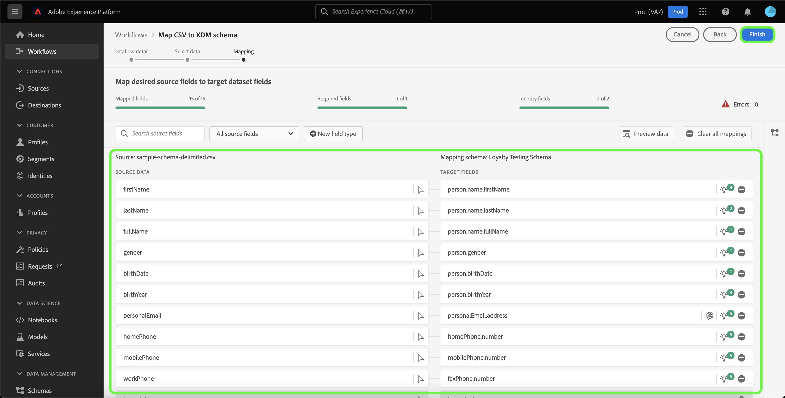

# Erstellen eines Quell-Connectors für den lokalen Datei-Upload über die Benutzeroberfläche

In diesem Tutorial werden die Schritte zum Erstellen eines Quell-Connectors für den lokalen Datei-Upload beschrieben, um mithilfe der Benutzeroberfläche lokale Dateien in Platform zu erfassen.

## Erste Schritte

Dieses Tutorial setzt ein Grundverständnis der folgenden Komponenten von Platform voraus:

* [[!DNL Experience Data Model (XDM)] System](../../../../../xdm/home.md): Das standardisierte Framework, mit dem Customer-Experience-Daten von Platform strukturiert werden.
   * [Grundlagen der Schemakomposition](../../../../../xdm/schema/composition.md): Machen Sie sich mit den grundlegenden Bausteinen von XDM-Schemas vertraut, einschließlich der wichtigsten Prinzipien und Best Practices bei der Schemaerstellung.
   * [Tutorial zum Schema-Editor](../../../../../xdm/tutorials/create-schema-ui.md): Erfahren Sie, wie Sie benutzerdefinierte Schemas mithilfe der Benutzeroberfläche des Schema-Editors erstellen können.
* [[!DNL Real-Time Customer Profile]](../../../../../profile/home.md): Bietet ein einheitliches Echtzeit-Kundenprofil, das auf aggregierten Daten aus verschiedenen Quellen basiert.

## Hochladen lokaler Dateien in Platform

Wählen Sie in der Platform-Benutzeroberfläche die Option **[!UICONTROL Quellen]** in der linken Navigationsleiste, um auf den Arbeitsbereich [!UICONTROL Quellen] zuzugreifen. Die [!UICONTROL Katalog] zeigt eine Vielzahl von Quellen an, für die Sie ein Konto erstellen können.

Sie können die gewünschte Kategorie aus dem Katalog auf der linken Bildschirmseite auswählen. Alternativ können Sie die gewünschte Quelle mithilfe der Suchoption finden.

Unter dem [!UICONTROL Lokales System] category, select **[!UICONTROL Lokaler Datei-Upload]** und wählen Sie **[!UICONTROL Daten hinzufügen]**.

### Verwenden eines vorhandenen Datensatzes

Die [!UICONTROL Datenflussdetails] -Seite können Sie auswählen, ob Sie Ihre CSV-Daten in einen vorhandenen Datensatz oder in einen neuen Datensatz aufnehmen möchten.

Um Ihre CSV-Daten in einen vorhandenen Datensatz einzufügen, wählen Sie **[!UICONTROL Vorhandener Datensatz]**. Sie können einen vorhandenen Datensatz entweder über die Option [!UICONTROL Erweiterte Suche] oder durch Scrollen durch die Liste der vorhandenen Datensätze im Dropdown-Menü abrufen.

Wenn Sie einen Datensatz ausgewählt haben, geben Sie einen Namen für Ihren Datenfluss und eine optionale Beschreibung an.

Während dieses Vorgangs können Sie auch die Optionen [!UICONTROL Fehlerdiagnose] und [!UICONTROL Partielle Aufnahme] aktivieren. [!UICONTROL Fehlerdiagnose] ermöglicht eine detaillierte Erstellung von Fehlermeldungen für alle fehlerhaften Datensätze, die in Ihrem Datenfluss auftreten, während [!UICONTROL Partielle Aufnahme] die Aufnahme von fehlerhaften Daten bis zu einem gewissen Schwellenwert, den Sie manuell definieren, ermöglicht. Weitere Informationen finden Sie in der [Übersicht zur partiellen Batch-Aufnahme](../../../../../ingestion/batch-ingestion/partial.md).

### Verwenden eines neuen Datensatzes

Um Ihre CSV-Daten in einen neuen Datensatz aufzunehmen, wählen Sie **[!UICONTROL Neuer Datensatz]** aus und geben Sie dann einen Namen für den Ausgabedatensatz und eine optionale Beschreibung an. Wählen Sie als Nächstes mithilfe der Option [!UICONTROL Erweiterte Suche] oder durch Scrollen durch die Liste der vorhandenen Schemas im Dropdown-Menü ein Schema zum Zuordnen aus.

Wenn Sie ein Schema ausgewählt haben, geben Sie einen Namen für Ihren Datenfluss und eine optionale Beschreibung an. Wenden Sie dann die Einstellungen [!UICONTROL Fehlerdiagnose] und [!UICONTROL Partielle Aufnahme] an, sofern Sie sie für Ihren Datenfluss benötigen. Wenn Sie fertig sind, klicken Sie auf die Schaltfläche **[!UICONTROL Weiter]**.

### Daten auswählen

Der Schritt [!UICONTROL Auswählen von Daten] wird angezeigt und bietet Ihnen eine Schnittstelle zum Hochladen Ihrer lokalen Dateien und zur Vorschau ihrer Struktur und Inhalte. Wählen Sie **[!UICONTROL Dateien auswählen]** aus, um eine CSV-Datei von Ihrem lokalen System hochzuladen. Alternativ können Sie die CSV-Datei, die Sie hochladen möchten, per Drag-and-Drop in das Bedienfeld [!UICONTROL Dateien per Drag-and-Drop verschieben] ziehen.

>[!TIP]
>
>Derzeit werden nur CSV-Dateien für den lokalen Datei-Upload unterstützt. Die maximale Dateigröße pro Datei beträgt 1 GB.

Nachdem Ihre Datei hochgeladen wurde, wird die Vorschau-Oberfläche aktualisiert, um Inhalt und Struktur der Datei anzuzeigen.

Je nach Datei können Sie Spaltentrennzeichen wie Tabulatoren, Kommas, senkrechte Striche oder ein benutzerdefiniertes Spaltentrennzeichen für die Quelldaten auswählen. Wählen Sie den Dropdown-Pfeil **[!UICONTROL Trennzeichen]** und dann das entsprechende Trennzeichen aus dem Menü aus.

Wenn Sie fertig sind, klicken Sie auf **[!UICONTROL Weiter]**.

## Zuordnung

Es erfolgt der Schritt der [!UICONTROL Zuordnung], in dem Ihnen eine Schnittstelle zum Zuordnen der Quellfelder aus Ihrem Quellschema zu den entsprechenden XDM-Zielfeldern im Zielschema bereitgestellt wird.

Je nach Bedarf können Sie wahlweise Felder direkt zuordnen oder mithilfe von Datenvorbereitungsfunktionen Quelldaten transformieren, um berechnete oder anderweitig ermittelte Werte abzuleiten. Eine ausführliche Anleitung zur Verwendung der Zuordnungsschnittstelle finden Sie im [Handbuch zur Datenvorbereitungs-Benutzeroberfläche](../../../../../data-prep/ui/mapping.md).

Sobald Ihre Zuordnungssätze fertig sind, wählen Sie **[!UICONTROL Beenden]** und lassen einige Momente zu, damit der neue Datenfluss erstellt wird.

## Überwachen der Datenaufnahme

Nachdem Ihre CSV-Datei zugeordnet und erstellt wurde, können Sie die über sie erfassten Daten mithilfe des Monitoring-Dashboards überwachen. Weitere Informationen finden Sie im Tutorial zu [Überwachen von Datenflüssen aus Quellen in der Benutzeroberfläche](../../../../../dataflows/ui/monitor-sources.md).

## Nächste Schritte

In diesem Tutorial haben Sie erfolgreich eine flache CSV-Datei einem XDM-Schema zugeordnet und in Platform aufgenommen. Diese Daten können jetzt von nachgelagerten [!DNL Platform]-Services wie [!DNL Real-Time Customer Profile] verwendet werden. Weitere Informationen finden Sie in der Übersicht von [[!DNL Real-Time Customer Profile]](../../../../../profile/home.md).
