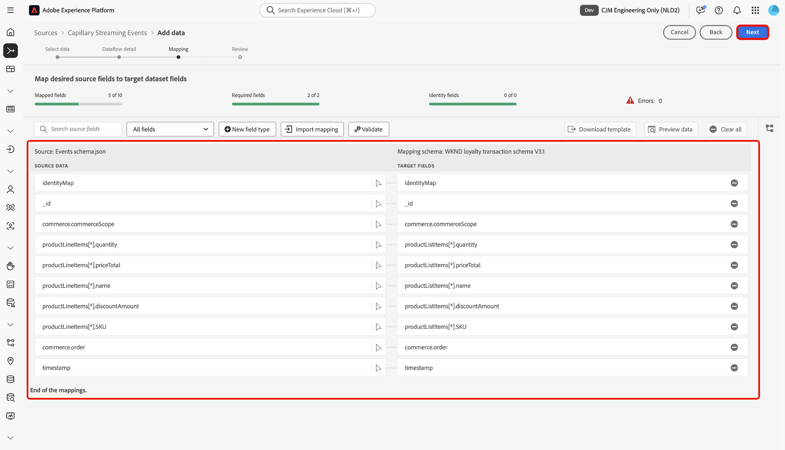

# Verbinden von [!DNL Capillary Streaming Events] mit Experience Platform über die Benutzeroberfläche

>[!AVAILABILITY]
>
>Die [!DNL Capillary Streaming Events]-Quelle befindet sich in der Beta-Phase. Weitere Informationen zur Verwendung von Beta[gekennzeichneten Quellen finden Sie ](../../../../home.md#terms-and-conditions) den „Nutzungsbedingungen“ in der Quellenübersicht .

Lesen Sie dieses Handbuch, um zu erfahren, wie Sie Ihre [!DNL Capillary]-Datenbank mithilfe des Arbeitsbereichs „Quellen“ in der Benutzeroberfläche von Experience Platform mit Adobe Experience Platform verbinden.

## Erste Schritte

Dieses Tutorial setzt ein Grundverständnis der folgenden Komponenten von Experience Platform voraus:

* [[!DNL Experience Data Model (XDM)] System](../../../../../xdm/home.md): Das standardisierte Framework, mit dem Experience Platform Kundenerlebnisdaten organisiert.
   * [Grundlagen der Schemakomposition](../../../../../xdm/schema/composition.md): Machen Sie sich mit den grundlegenden Bausteinen von XDM-Schemata vertraut, einschließlich der wichtigsten Prinzipien und Best Practices bei der Schemaerstellung.
   * [Tutorial zum Schema-Editor](../../../../../xdm/tutorials/create-schema-ui.md): Erfahren Sie, wie Sie benutzerdefinierte Schemata mithilfe der Benutzeroberfläche des Schema-Editors erstellen können.
* [[!DNL Real-Time Customer Profile]](../../../../../profile/home.md): Bietet ein einheitliches Echtzeit-Kundenprofil, das auf aggregierten Daten aus verschiedenen Quellen basiert.

## Navigieren im Quellkatalog

Wählen Sie in der Experience Platform-Benutzeroberfläche **[!UICONTROL Quellen]** in der linken Navigationsleiste aus, um auf den Arbeitsbereich *[!UICONTROL Quellen]* zuzugreifen. Wählen Sie die entsprechende Kategorie im Bedienfeld *[!UICONTROL Kategorien]* aus Alternativ können Sie die Suchleiste verwenden, um zur gewünschten Quelle zu navigieren.

Um [!DNL Capillary] zu verwenden, wählen Sie die Quellkarte **[!UICONTROL Kapillarstreaming-Ereignisse]** unter *[!UICONTROL Treue]* und dann **[!UICONTROL Daten hinzufügen]**.

>[!TIP]
>
>Quellen im Quellkatalog zeigen die Option **[!UICONTROL Einrichten]** an, wenn eine bestimmte Quelle noch kein authentifiziertes Konto hat. Nachdem ein authentifiziertes Konto erstellt wurde, ändert sich diese Option in **[!UICONTROL Daten hinzufügen]**.

## Daten auswählen

Verwenden Sie als Nächstes die *[!UICONTROL Daten auswählen]*-Schnittstelle, um eine JSON-Beispieldatei hochzuladen und Ihr Quellschema zu definieren. In diesem Schritt können Sie die Vorschau-Oberfläche verwenden, um die Dateistruktur der Payload anzuzeigen. Wenn Sie fertig sind, klicken Sie auf die Schaltfläche **[!UICONTROL Weiter]**.

## Datenflussdetails

Als Nächstes müssen Sie Informationen zu Ihrem Datensatz und Ihrem Datenfluss angeben.

### Datensatz-Details

Ein Datensatz ist ein Konstrukt zur Speicherung und Verwaltung einer Sammlung von Daten, in der Regel eine Tabelle, die ein Schema (Spalten) und Felder (Zeilen) enthält. Daten, die erfolgreich in Experience Platform aufgenommen werden, bleiben als Datensätze im Data Lake erhalten.

In diesem Schritt können Sie entweder einen vorhandenen Datensatz verwenden oder einen neuen Datensatz erstellen.

>[!NOTE]
>
>Unabhängig davon, ob Sie einen vorhandenen Datensatz verwenden oder einen neuen Datensatz erstellen, müssen Sie sicherstellen, dass Ihr Datensatz **für die Profilaufnahme aktiviert** ist.

+++Wählen Sie aus, um die Profilaufnahme, Fehlerdiagnose und partielle Aufnahme zu aktivieren.

Wenn Ihr Datensatz für das Echtzeit-Kundenprofil aktiviert ist, können Sie in diesem Schritt **[!UICONTROL Profildatensatz]** umschalten, um Ihre Daten für die Profilaufnahme zu aktivieren. Sie können diesen Schritt auch verwenden, um **[!UICONTROL Fehlerdiagnose]** und **[!UICONTROL Partielle Aufnahme]** zu aktivieren.

* **[!UICONTROL Fehlerdiagnose]**: Wählen Sie **[!UICONTROL Fehlerdiagnose]** aus, um die Quelle anzuweisen, Fehlerdiagnosen zu erstellen, auf die Sie später bei der Überwachung Ihrer Datensatzaktivität und des Datenflussstatus verweisen können.
* **[!UICONTROL Partielle Aufnahme]** Bei der partiellen Batch-Aufnahme werden Daten mit Fehlern bis zu einem bestimmten konfigurierbaren Schwellenwert aufgenommen. Mit dieser Funktion können Sie alle Ihre korrekten Daten erfolgreich in Experience Platform aufnehmen, während alle Ihre falschen Daten separat mit Informationen darüber, warum sie ungültig sind, in Batches erfasst werden.

+++

### Datenflussdetails

Nachdem Ihr Datensatz konfiguriert wurde, müssen Sie Details zu Ihrem Datenfluss angeben, einschließlich eines Namens, einer optionalen Beschreibung und Warnhinweiskonfigurationen.

| Datenflusskonfigurationen | Beschreibung |
| --- | --- |
| Datenflussname | Der Name des Datenflusses.  Standardmäßig wird dabei der Name der zu importierenden Datei verwendet. |
| Beschreibung | (Optional) Eine kurze Beschreibung Ihres Datenflusses. |
| Warnhinweise | Experience Platform kann ereignisbasierte Warnhinweise erstellen, die Benutzende abonnieren können. Diese Optionen ermöglichen einen laufenden Datenfluss zu diesen Triggern.  Weitere Informationen finden Sie unter [Warnhinweise - Übersicht](../../alerts.md) <ul><li>**Start der Ausführung des Quelldatenflusses**: Wählen Sie diesen Warnhinweis aus, um eine Benachrichtigung zu erhalten, wenn die Ausführung des Datenflusses beginnt.</li><li>**Erfolgreiche Ausführung des Quelldatenflusses**: Wählen Sie diesen Warnhinweis aus, um eine Benachrichtigung zu erhalten, wenn Ihr Datenfluss fehlerfrei endet.</li><li>**Fehler bei der Ausführung des Datenflusses an Quellen**: Wählen Sie diesen Warnhinweis aus, um eine Benachrichtigung zu erhalten, wenn die Ausführung des Datenflusses mit Fehlern endet.</li></ul> |

{style="table-layout:auto"}

## Zuordnung

Verwenden Sie die Zuordnungsschnittstelle, um Ihre Quelldaten den entsprechenden Schemafeldern zuzuordnen, bevor Sie Daten in Experience Platform aufnehmen. Weitere Informationen finden Sie im [Zuordnungshandbuch in der Benutzeroberfläche](../../../../../data-prep/ui/mapping.md).

>[!TIP]
>
>Sie können die [Ereignisse und Profilzuordnungen](../../../../images/tutorials/create/capillary/mappings.zip) für [!DNL Capillary] herunterladen und [die Dateien in die Datenvorbereitung ](../../../../../data-prep/ui/mapping.md#import-mapping), wenn Sie für die Zuordnung Ihrer Daten bereit sind.

## Überprüfung

Der Schritt *[!UICONTROL Überprüfen]* wird angezeigt, in dem Sie die Details Ihres Datenflusses überprüfen können, bevor er erstellt wird. Die Details lassen sich wie folgt kategorisieren:

* **[!UICONTROL Verbindung]**: Zeigt den Kontonamen, die Quellplattform und den Quellnamen an.
* **[!UICONTROL Datensatz- und Zuordnungsfelder zuweisen]**: Zeigt den Zieldatensatz und das Schema an, zu dem der Datensatz gehört.

Nachdem Sie bestätigt haben, dass die Details korrekt sind, wählen Sie **[!UICONTROL Beenden]**.

## Abrufen der Streaming-Endpunkt-URL

Bei der Erstellung der Verbindung wird die Seite mit den Quelldetails angezeigt. Auf dieser Seite werden Details zu Ihrer neu erstellten Verbindung angezeigt, einschließlich zuvor ausgeführter Datenflüsse, ID und Streaming-Endpunkt-URL.

