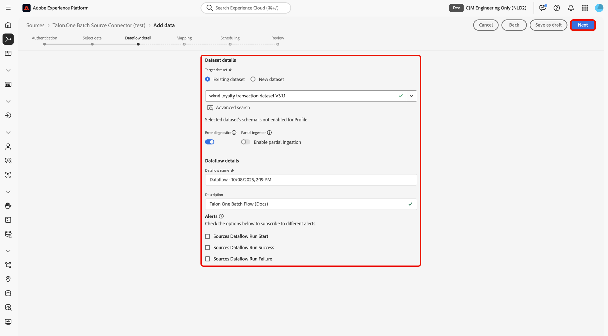
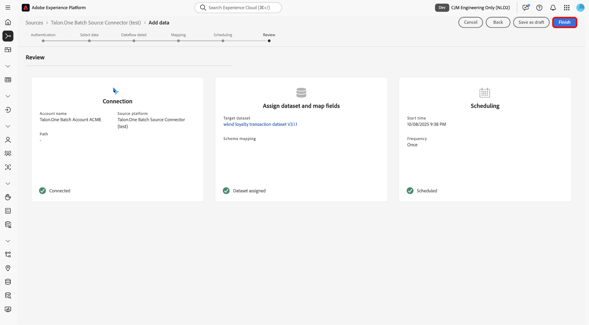

# Aufnehmen von Batch-Daten aus [!DNL Talon.One] in Experience Platform über die Benutzeroberfläche

>[!AVAILABILITY]
>
>Die [!DNL Talon.One]-Quelle befindet sich in der Beta-Phase. Weitere Informationen zur Verwendung von Beta[gekennzeichneten Quellen finden Sie ](../../../../home.md#terms-and-conditions) den „Nutzungsbedingungen“ in der Quellenübersicht .

Lesen Sie dieses Tutorial, um zu erfahren, wie Sie mithilfe des Arbeitsbereichs „Quellen“ in der Benutzeroberfläche Batch-Daten aus Ihrem [!DNL Talon.One]-Konto in Adobe Experience Platform aufnehmen.

## Erste Schritte

Dieses Tutorial setzt ein Grundverständnis der folgenden Komponenten von Experience Platform voraus:

* [[!DNL Experience Data Model (XDM)] System](../../../../../xdm/home.md): Das standardisierte Framework, mit dem Experience Platform Kundenerlebnisdaten organisiert.
   * [Grundlagen der Schemakomposition](../../../../../xdm/schema/composition.md): Machen Sie sich mit den grundlegenden Bausteinen von XDM-Schemata vertraut, einschließlich der wichtigsten Prinzipien und Best Practices bei der Schemaerstellung.
   * [Tutorial zum Schema-Editor](../../../../../xdm/tutorials/create-schema-ui.md): Erfahren Sie, wie Sie benutzerdefinierte Schemata mithilfe der Benutzeroberfläche des Schema-Editors erstellen können.
* [[!DNL Real-Time Customer Profile]](../../../../../profile/home.md): Bietet ein einheitliches Echtzeit-Kundenprofil, das auf aggregierten Daten aus verschiedenen Quellen basiert.

>[!IMPORTANT]
>
>Lesen Sie die [[!DNL Talon.One] Übersicht](../../../../connectors/loyalty/talon-one.md), um mehr über die erforderlichen Schritte zu erfahren, die Sie durchführen müssen, bevor Sie Ihr -Konto mit Experience Platform verbinden.

## Navigieren im Quellkatalog

Wählen Sie in der Experience Platform-Benutzeroberfläche **[!UICONTROL Quellen]** in der linken Navigationsleiste aus, um auf den Arbeitsbereich *[!UICONTROL Quellen]* zuzugreifen. Wählen Sie die entsprechende Kategorie im *[!UICONTROL Kategorien]* aus. Verwenden Sie alternativ die Suchleiste, um zu der spezifischen Quelle zu navigieren, die Sie verwenden möchten.

Um Daten aus [!DNL Talon.One] aufzunehmen, wählen Sie die Quellkarte **[!UICONTROL Talon.One Batch Source Connector]** unter *[!UICONTROL Treue]* und dann **[!UICONTROL Daten hinzufügen]**.

>[!TIP]
>
>Quellen im Quellkatalog zeigen die Option **[!UICONTROL Einrichten]** an, wenn eine bestimmte Quelle noch kein authentifiziertes Konto hat. Nachdem ein authentifiziertes Konto erstellt wurde, ändert sich diese Option in **[!UICONTROL Daten hinzufügen]**.

### Neues Konto erstellen

Um ein neues Konto für Ihre [!DNL Talon.One] zu erstellen, wählen Sie **[!UICONTROL Neues Konto]** und geben Sie einen Namen und eine optionale Beschreibung für Ihr Konto an. Geben Sie als Nächstes Ihre [!DNL Talon.One] Domain und Ihren [!UICONTROL Talon.One Management API-Schlüssel] an. Wenn Sie fertig sind, wählen **[!UICONTROL Mit Quelle verbinden]** und warten Sie einen Augenblick, bis Ihre Verbindung hergestellt ist.

### Vorhandenes Konto verwenden

Um ein vorhandenes Konto zu verwenden, wählen Sie **[!UICONTROL Vorhandenes Konto]** und wählen Sie das [!DNL Talon.One] Konto, das Sie verwenden möchten, über die Kontoschnittstelle aus.

## Daten auswählen

Geben Sie nach der Authentifizierung Werte für Ihre **applicationId** und **sessionType** an. In diesem Schritt können Sie die Vorschaufunktionen verwenden, um die Struktur Ihrer Daten zu überprüfen. Wenn Sie fertig sind, wählen Sie **[!UICONTROL Weiter]** aus, um fortzufahren.

## Konfigurieren von Datensatz- und Datenflussdetails

Als Nächstes müssen Sie Informationen zu Ihrem Datensatz und Ihrem Datenfluss angeben.

### Datensatz-Details

Ein Datensatz ist ein Konstrukt zur Datenspeicherung und -verwaltung, in dem Daten (in der Regel) in einer Tabelle erfasst werden, die ein Schema (Spalten/Felder) und Datensätze (Zeilen) enthält. Daten, die erfolgreich in Experience Platform aufgenommen werden, bleiben als Datensätze im Data Lake erhalten.

In diesem Schritt können Sie entweder einen vorhandenen Datensatz verwenden oder einen neuen Datensatz erstellen.

>[!NOTE]
>
>Unabhängig davon, ob Sie einen vorhandenen Datensatz verwenden oder einen neuen Datensatz erstellen, müssen Sie sicherstellen, dass Ihr Datensatz **für die Profilaufnahme aktiviert** ist.

+++Wählen Sie aus, um die Profilaufnahme, Fehlerdiagnose und partielle Aufnahme zu aktivieren.

Wenn Ihr Datensatz für das Echtzeit-Kundenprofil aktiviert ist, können Sie in diesem Schritt **[!UICONTROL Profildatensatz]** umschalten, um Ihre Daten für die Profilaufnahme zu aktivieren. Sie können diesen Schritt auch verwenden, um **[!UICONTROL Fehlerdiagnose]** und **[!UICONTROL Partielle Aufnahme]** zu aktivieren.

* **[!UICONTROL Fehlerdiagnose]**: Wählen Sie **[!UICONTROL Fehlerdiagnose]** aus, um die Quelle anzuweisen, Fehlerdiagnosen zu erstellen, auf die Sie später bei der Überwachung Ihrer Datensatzaktivität und des Datenflussstatus verweisen können.
* **[!UICONTROL Partielle Aufnahme]** Bei der partiellen Batch-Aufnahme werden Daten mit Fehlern bis zu einem bestimmten konfigurierbaren Schwellenwert aufgenommen. Mit dieser Funktion können Sie alle Ihre korrekten Daten erfolgreich in Experience Platform aufnehmen, während alle Ihre falschen Daten separat mit Informationen darüber, warum sie ungültig sind, in Batches erfasst werden.

+++

## Datenflussdetails

Nachdem Ihr Datensatz konfiguriert wurde, müssen Sie Details zu Ihrem Datenfluss angeben, einschließlich eines Namens, einer optionalen Beschreibung und Warnhinweiskonfigurationen.

| Datenflusskonfigurationen | Beschreibung |
| --- | --- |
| Datenflussname | Der Name des Datenflusses. Standardmäßig wird dabei der Name der zu importierenden Datei verwendet. |
| Beschreibung | (Optional) Eine kurze Beschreibung Ihres Datenflusses. |
| Warnhinweise | Experience Platform kann ereignisbasierte Warnhinweise erstellen, die Benutzende abonnieren können. Diese Optionen ermöglichen einen laufenden Datenfluss zu diesen Triggern.  Weitere Informationen finden Sie unter [Warnhinweise - Übersicht](../../alerts.md) <ul><li>**Start der Ausführung des Quelldatenflusses**: Wählen Sie diesen Warnhinweis aus, um eine Benachrichtigung zu erhalten, wenn die Ausführung des Datenflusses beginnt.</li><li>**Erfolgreiche Ausführung des Quelldatenflusses**: Wählen Sie diesen Warnhinweis aus, um eine Benachrichtigung zu erhalten, wenn Ihr Datenfluss fehlerfrei endet.</li><li>**Fehler bei der Ausführung des Datenflusses an Quellen**: Wählen Sie diesen Warnhinweis aus, um eine Benachrichtigung zu erhalten, wenn die Ausführung des Datenflusses mit Fehlern endet.</li></ul> |

{style="table-layout:auto"}

## Zuordnung

Nachdem Sie Ihre Datensatz- und Datenflussdetails konfiguriert haben, können Sie jetzt mit dem Zuordnen Ihrer Quelldatenfelder zu den entsprechenden XDM-Zielfeldern fortfahren. Verwenden Sie die Zuordnungsschnittstelle, um Ihre Quelldaten den entsprechenden Schemafeldern zuzuordnen, bevor Sie Daten in Experience Platform aufnehmen. Weitere Informationen finden Sie im [Zuordnungshandbuch in der Benutzeroberfläche](../../../../../data-prep/ui/mapping.md).

>[!IMPORTANT]
>
>Weitere Anleitungen zum Zuordnen Ihrer [!DNL Talon.One]-Quelldaten finden Sie in der [[!DNL Talon.One] Übersicht](../../../../connectors/loyalty/talon-one.md#mapping).

## Planen der Datenfluss-Aufnahme

Der [!UICONTROL Zeitplan] wird angezeigt. Verwenden Sie die -Benutzeroberfläche, um einen Aufnahmezeitplan zu konfigurieren, damit die ausgewählten Quelldaten automatisch mithilfe der konfigurierten Zuordnungen aufgenommen werden. Standardmäßig ist die Zeitplanung auf `Once` festgelegt. Um Ihre Aufnahmefrequenz anzupassen, wählen Sie **[!UICONTROL Häufigkeit]** und dann eine Option aus dem Dropdown-Menü aus.

>[!TIP]
>
>Intervall und Aufstockung sind während einer einmaligen Aufnahme nicht sichtbar.

Wenn Sie die Aufnahmefrequenz auf `Minute`, `Hour`, `Day` oder `Week` festlegen, müssen Sie ein Intervall festlegen, um zwischen den einzelnen Aufnahmen einen bestimmten Zeitrahmen festzulegen. Wenn beispielsweise die Aufnahmefrequenz auf `Day` und das Intervall auf `15` festgelegt ist, bedeutet dies, dass der Datenfluss alle 15 Tage Daten aufnehmen soll.

In diesem Schritt können Sie auch **Aufstockung“ aktivieren** eine Spalte für die inkrementelle Aufnahme von Daten definieren. Die Aufstockung wird verwendet, um historische Daten aufzunehmen, während die Spalte, die Sie für die inkrementelle Aufnahme definieren, es ermöglicht, neue Daten von vorhandenen Daten zu unterscheiden.

Weitere Informationen zur Planung von Konfigurationen finden Sie in der folgenden Tabelle.

| Konfiguration planen | Beschreibung |
| --- | --- |
| Häufigkeit | Konfigurieren Sie die Häufigkeit , um anzugeben, wie oft der Datenfluss ausgeführt werden soll. Sie können Ihre Häufigkeit auf Folgendes festlegen: <ul><li>**Einmal**: Legen Sie für die Häufigkeit `once` fest, um eine einmalige Aufnahme zu erstellen. Konfigurationen für Intervall und Aufstockung sind beim Erstellen eines einmaligen Aufnahme-Datenflusses nicht verfügbar. Standardmäßig ist die Zeitplanfrequenz auf einmal festgelegt.</li><li>**Minute**: Legen Sie für die Häufigkeit `minute` fest, um Ihren Datenfluss so zu planen, dass Daten pro Minute aufgenommen werden.</li><li>**Stunde**: Legen Sie für die Häufigkeit `hour` fest, um den Datenfluss zu planen und Daten stündlich aufzunehmen.</li><li>**Tag**: Legen Sie für Ihre Häufigkeit `day` fest, um Ihren Datenfluss so zu planen, dass Daten täglich aufgenommen werden.</li><li>**Woche**: Legen Sie für Ihre Häufigkeit `week` fest, um Ihren Datenfluss zu planen und Daten pro Woche aufzunehmen.</li></ul> |
| Intervall | Nachdem Sie eine Häufigkeit ausgewählt haben, können Sie die Intervalleinstellung konfigurieren, um den Zeitrahmen zwischen jeder Aufnahme festzulegen. Wenn Sie beispielsweise Ihre Häufigkeit auf „Tag“ festlegen und das Intervall auf 15 konfigurieren, wird Ihr Datenfluss alle 15 Tage ausgeführt. Das Intervall kann nicht auf null festgelegt werden. Der akzeptierte Mindestintervallwert für jede Häufigkeit ist wie folgt:<ul><li>**Einmal**: nicht zutreffend</li><li>**Minute**: 15</li><li>**Stunde**: 1</li><li>**Tag**: 1</li><li>**Woche**: 1</li></ul> |
| Startzeit | Der Zeitstempel für die projizierte Ausführung, dargestellt in UTC-Zeitzone. |
| Aufstockung | Die Aufstockung bestimmt, welche Daten anfänglich aufgenommen werden. Wenn die Aufstockung aktiviert ist, werden alle aktuellen Dateien im angegebenen Pfad während der ersten geplanten Aufnahme aufgenommen. Wenn die Aufstockung deaktiviert ist, werden nur die Dateien aufgenommen, die zwischen der ersten Aufnahme-Ausführung und der Startzeit geladen werden. Dateien, die vor der Startzeit geladen wurden, werden nicht aufgenommen. |

## Überprüfung

Der Schritt *[!UICONTROL Überprüfen]* wird angezeigt, in dem Sie die Details Ihres Datenflusses überprüfen können, bevor er erstellt wird. Die Details lassen sich wie folgt kategorisieren:

* **[!UICONTROL Verbindung]**: Zeigt den Kontonamen, die Quellplattform und den Quellnamen an.
* **[!UICONTROL Datensatz- und Zuordnungsfelder zuweisen]**: Zeigt den Zieldatensatz und das Schema an, zu dem der Datensatz gehört.

Nachdem Sie bestätigt haben, dass die Details korrekt sind, wählen Sie **[!UICONTROL Beenden]**.

## Überwachen Ihres Datenflusses

Nachdem Ihr Datenfluss hergestellt worden ist, können Sie Daten, die dadurch aufgenommen werden, überwachen, um Informationen zu Aufnahmegeschwindigkeiten, Erfolg und Fehlern zu erhalten. Weitere Informationen zum Überwachen von Datenflüssen finden Sie im Tutorial [Überwachen von Konten und Datenflüssen in der Benutzeroberfläche](../../../../../dataflows/ui/monitor-sources.md).