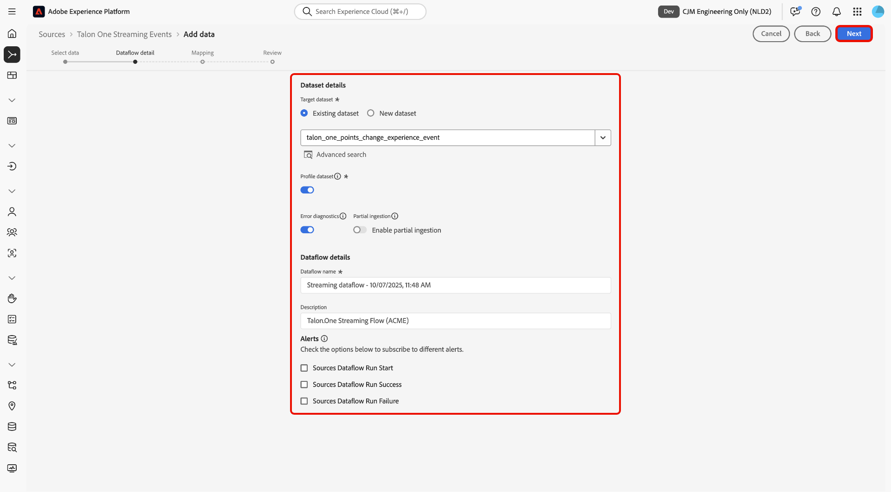

# Streamen von [!DNL Talon.One] an Experience Platform mithilfe der Benutzeroberfläche

>[!AVAILABILITY]
>
>Die [!DNL Talon.One]-Quelle befindet sich in der Beta-Phase. Weitere Informationen zur Verwendung von Beta[gekennzeichneten Quellen finden Sie ](../../../../home.md#terms-and-conditions) den „Nutzungsbedingungen“ in der Quellenübersicht .

Lesen Sie dieses Handbuch, um zu erfahren, wie Sie Ihre Daten mithilfe des Arbeitsbereichs „Quellen“ in der Benutzeroberfläche von [!DNL Talon.One] mit Adobe Experience Platform verbinden und streamen.

## Erste Schritte

Dieses Tutorial setzt ein Grundverständnis der folgenden Komponenten von Experience Platform voraus:

* [[!DNL Experience Data Model (XDM)] System](../../../../../xdm/home.md): Das standardisierte Framework, mit dem Experience Platform Kundenerlebnisdaten organisiert.
   * [Grundlagen der Schemakomposition](../../../../../xdm/schema/composition.md): Machen Sie sich mit den grundlegenden Bausteinen von XDM-Schemata vertraut, einschließlich der wichtigsten Prinzipien und Best Practices bei der Schemaerstellung.
   * [Tutorial zum Schema-Editor](../../../../../xdm/tutorials/create-schema-ui.md): Erfahren Sie, wie Sie benutzerdefinierte Schemata mithilfe der Benutzeroberfläche des Schema-Editors erstellen können.
* [[!DNL Real-Time Customer Profile]](../../../../../profile/home.md): Bietet ein einheitliches Echtzeit-Kundenprofil, das auf aggregierten Daten aus verschiedenen Quellen basiert.

>[!IMPORTANT]
>
>Lesen Sie die [[!DNL Talon.One] Übersicht](../../../../connectors/loyalty/talon-one.md), um mehr über die erforderlichen Schritte zu erfahren, die Sie durchführen müssen, bevor Sie Ihr -Konto mit Experience Platform verbinden.

## Navigieren im Quellkatalog

Wählen Sie in der Benutzeroberfläche von Experience Platform in der linken Navigationsleiste die Option **[!UICONTROL Sources]** , um auf den *[!UICONTROL Sources]*-Arbeitsbereich zuzugreifen. Wählen Sie die entsprechende Kategorie im *[!UICONTROL Categories]* aus. Verwenden Sie alternativ die Suchleiste, um zu der spezifischen Quelle zu navigieren, die Sie verwenden möchten.

Um Daten aus [!DNL Talon.One] zu streamen, wählen Sie die Karte **[!UICONTROL Talon.One Streaming Events]** unter *[!UICONTROL Loyalty]* und dann **[!UICONTROL Add data]** aus.

>[!TIP]
>
>Quellen im Quellkatalog zeigen die **[!UICONTROL Set up]** an, wenn eine bestimmte Quelle noch kein authentifiziertes Konto hat. Nachdem ein authentifiziertes Konto erstellt wurde, ändert sich diese Option in **[!UICONTROL Add data]**.

## Daten auswählen

Verwenden Sie als Nächstes die *[!UICONTROL Select data]*, um eine JSON-Beispieldatei hochzuladen und Ihr Quellschema zu definieren. In diesem Schritt können Sie die Vorschau-Oberfläche verwenden, um die Dateistruktur der Payload anzuzeigen. Wenn Sie fertig sind, wählen Sie **[!UICONTROL Next]** aus.

## Datenflussdetails

Als Nächstes müssen Sie Informationen zu Ihrem Datensatz und Ihrem Datenfluss angeben.

### Datensatzdetails

Ein Datensatz ist ein Konstrukt zur Datenspeicherung und -verwaltung, in dem Daten (in der Regel) in einer Tabelle erfasst werden, die ein Schema (Spalten/Felder) und Datensätze (Zeilen) enthält. Daten, die erfolgreich in Experience Platform aufgenommen werden, bleiben als Datensätze im Data Lake erhalten.

In diesem Schritt können Sie entweder einen vorhandenen Datensatz verwenden oder einen neuen Datensatz erstellen.

>[!NOTE]
>
>Unabhängig davon, ob Sie einen vorhandenen Datensatz verwenden oder einen neuen Datensatz erstellen, müssen Sie sicherstellen, dass Ihr Datensatz **für die Profilaufnahme aktiviert** ist.

+++Wählen Sie aus, um die Profilaufnahme, Fehlerdiagnose und partielle Aufnahme zu aktivieren.

Wenn Ihr Datensatz für das Echtzeit-Kundenprofil aktiviert ist, können Sie in diesem Schritt **[!UICONTROL Profile dataset]** umschalten, um Ihre Daten für die Profilaufnahme zu aktivieren. Sie können diesen Schritt auch verwenden, um **[!UICONTROL Error diagnostics]** und **[!UICONTROL Partial ingestion]** zu aktivieren.

* **[!UICONTROL Error diagnostics]**: Wählen Sie **[!UICONTROL Error diagnostics]** aus, um die Quelle anzuweisen, eine Fehlerdiagnose zu erstellen, auf die Sie später bei der Überwachung Ihrer Datensatzaktivität und des Datenflussstatus verweisen können.
* **[!UICONTROL Partial ingestion]**: Die partielle Batch-Aufnahme bietet die Möglichkeit, Daten mit Fehlern bis zu einem bestimmten konfigurierbaren Schwellenwert aufzunehmen. Mit dieser Funktion können Sie alle Ihre korrekten Daten erfolgreich in Experience Platform aufnehmen, während alle Ihre falschen Daten separat mit Informationen darüber, warum sie ungültig sind, in Batches erfasst werden.

+++

### Datenflussdetails

Nachdem Ihr Datensatz konfiguriert wurde, müssen Sie Details zu Ihrem Datenfluss angeben, einschließlich eines Namens, einer optionalen Beschreibung und Warnhinweiskonfigurationen.

| Datenflusskonfigurationen | Beschreibung |
| --- | --- |
| Datenflussname | Der Name des Datenflusses. Standardmäßig wird dabei der Name der zu importierenden Datei verwendet. |
| Beschreibung | (Optional) Eine kurze Beschreibung Ihres Datenflusses. |
| Warnhinweise | Experience Platform kann ereignisbasierte Warnhinweise erstellen, die Benutzende abonnieren können. Diese Optionen ermöglichen einen laufenden Datenfluss zu diesen Triggern.  Weitere Informationen finden Sie unter [Warnhinweise - Übersicht](../../alerts.md) <ul><li>**Start der Ausführung des Quelldatenflusses**: Wählen Sie diesen Warnhinweis aus, um eine Benachrichtigung zu erhalten, wenn die Ausführung des Datenflusses beginnt.</li><li>**Erfolgreiche Ausführung des Quelldatenflusses**: Wählen Sie diesen Warnhinweis aus, um eine Benachrichtigung zu erhalten, wenn Ihr Datenfluss fehlerfrei endet.</li><li>**Fehler bei der Ausführung des Datenflusses an Quellen**: Wählen Sie diesen Warnhinweis aus, um eine Benachrichtigung zu erhalten, wenn die Ausführung des Datenflusses mit Fehlern endet.</li></ul> |

{style="table-layout:auto"}

## Zuordnung

Verwenden Sie die Zuordnungsschnittstelle, um Ihre Quelldaten den entsprechenden Schemafeldern zuzuordnen, bevor Sie Daten in Experience Platform aufnehmen. Weitere Informationen finden Sie im [Zuordnungshandbuch in der Benutzeroberfläche](../../../../../data-prep/ui/mapping.md).

<!--
>[!TIP]
>
>You can download the [Events and Profile mappings](../../../../images/tutorials/create/capillary/mappings.zip) for [!DNL Capillary] and [import the files to Data Prep](../../../../../data-prep/ui/mapping.md#import-mapping) when you are ready to map your data.
-->

## Überprüfung

Der Schritt *[!UICONTROL Review]* wird angezeigt, in dem Sie die Details Ihres Datenflusses überprüfen können, bevor er erstellt wird. Die Details lassen sich wie folgt kategorisieren:

* **[!UICONTROL Connection]**: Zeigt den Kontonamen, die Quellplattform und den Quellnamen an.
* **[!UICONTROL Assign dataset and map fields]**: Zeigt den Zieldatensatz und das Schema an, zu dem der Datensatz gehört.

Nachdem Sie bestätigt haben, dass die Details korrekt sind, wählen Sie **[!UICONTROL Finish]** aus.

## Abrufen der Streaming-Endpunkt-URL

Bei der Erstellung der Verbindung wird die Seite mit den Quelldetails angezeigt. Auf dieser Seite werden Details zu Ihrer neu erstellten Verbindung angezeigt, einschließlich zuvor ausgeführter Datenflüsse, ID und Streaming-Endpunkt-URL.

## Überwachen Ihres Datenflusses

Nachdem Ihr Datenfluss hergestellt worden ist, können Sie Daten, die dadurch aufgenommen werden, überwachen, um Informationen zu Aufnahmegeschwindigkeiten, Erfolg und Fehlern zu erhalten. Weitere Informationen zum Überwachen von Datenflüssen finden Sie im Tutorial [Überwachen von Konten und Datenflüssen in der Benutzeroberfläche](../../monitor-streaming.md).

## Bekannte Einschränkungen

Um eine genaue Datenaufnahme zu gewährleisten, sollten Sie Daten von geänderten Treuepunkten des [!DNL Talon.One], von Stufenaktualisierungen und von Stufenherunterstufungsbenachrichtigungen an den Connector senden. Da die Benachrichtigung über geänderte Treuepunkte keine Stufeninformationen enthält, müssen Sie diese Benachrichtigungen an einen separaten Profildatensatz senden. Wenn Sie Punkte mit geänderten Daten mit Upgrade- oder Downgrade-Benachrichtigungen der Stufe im selben Datensatz kombinieren, gehen Stufeninformationen verloren oder werden mit Nullwerten überschrieben. Benachrichtigungen über Stufen-Upgrades und -Downgrades können denselben Datensatz verwenden, da beide Stufendetails enthalten. Nach der Aufnahme aktualisieren die Profilzusammenführungsregeln automatisch das zusammengeführte Profil, um die neuesten Punkte und Stufeninformationen widerzuspiegeln.