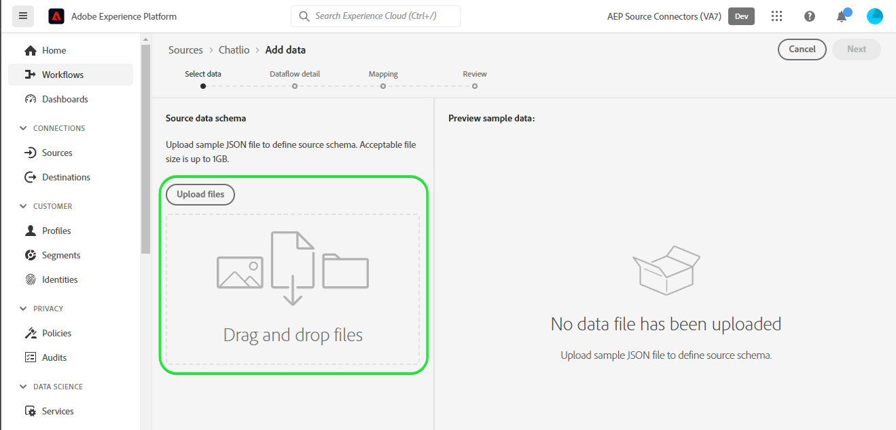
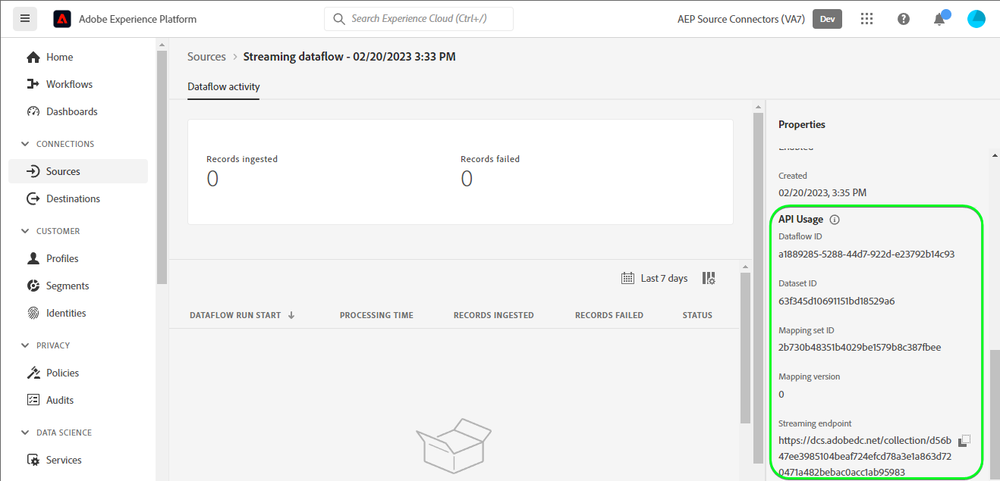

# Erstellen eines Quell-Connectors für [!DNL Chatlio] in der Benutzeroberfläche

>[!NOTE]
>
>Die [!DNL Chatlio]-Quelle befindet sich in der Beta-Phase. Weitere Informationen zur Verwendung von Beta-beschrifteten Quellen finden Sie in der [Quellenübersicht](../../../../home.md#terms-and-conditions) .

In diesem Tutorial werden die Schritte zum Erstellen einer 0-Quell-Verbindung mithilfe der Adobe Experience Platform-Benutzeroberfläche beschrieben.[!DNL Chatlio]

## Erste Schritte {#getting-started}

Dieses Tutorial setzt ein Grundverständnis der folgenden Komponenten von Experience Platform voraus:

* [[!DNL Experience Data Model (XDM)] System](../../../../../xdm/home.md): Das standardisierte Framework, mit dem [!DNL Experience Platform] Kundenerlebnisdaten organisiert.
   * [Grundlagen der Schemakomposition](../../../../../xdm/schema/composition.md): Machen Sie sich mit den grundlegenden Bausteinen von XDM-Schemata vertraut, einschließlich der wichtigsten Prinzipien und Best Practices bei der Schemaerstellung.
   * [Tutorial zum Schema-Editor](../../../../../xdm/tutorials/create-schema-ui.md): Erfahren Sie, wie Sie benutzerdefinierte Schemata mithilfe der Benutzeroberfläche des Schema-Editors erstellen können.
* [[!DNL Real-Time Customer Profile]](../../../../../profile/home.md): Bietet ein einheitliches Echtzeit-Kundenprofil, das auf aggregierten Daten aus verschiedenen Quellen basiert.

## Voraussetzungen {#prerequisites}

Im folgenden Abschnitt finden Sie Informationen zu den Voraussetzungen, die erfüllt sein müssen, bevor Sie eine [!DNL Chatlio]-Quellverbindung erstellen können.

### Beispiel-JSON zum Definieren des Quellschemas für [!DNL Chatlio] {#prerequisites-json-schema}

Bevor Sie eine [!DNL Chatlio]-Quellverbindung erstellen, müssen Sie ein Quellschema angeben. Sie können die JSON unten verwenden.

```
{
  "visitor": {
    "email": "test@example.com",
    "UUID": "2d3f4260-2235-903b-0a82-a23d326cc257"
  },
   "message": "Hi",
  "channelId": "C04J7M7LCMQ",
  "slackChannelName": "aep",
  "slackChannelId": "C04JVR71WKS"
}
```

### Erstellen eines Platform-Schemas für [!DNL Chatlio] {#create-platform-schema}

Sie müssen außerdem sicherstellen, dass Sie ein Platform-Schema erstellen, das für Ihre Quelle verwendet werden soll. Umfassende Schritte zum Erstellen eines Schemas finden Sie im Tutorial zum Erstellen eines Platform-Schemas](../../../../../xdm/schema/composition.md) .[


## Verbinden Ihres [!DNL Chatlio]-Kontos {#connect-account}

Wählen Sie in der Platform-Benutzeroberfläche im linken Navigationsbereich die Option **[!UICONTROL Quellen]** aus, um auf den Arbeitsbereich [!UICONTROL Quellen] zuzugreifen und einen Quellkatalog anzuzeigen, der unter Experience Platform verfügbar ist.

Verwenden Sie das Menü *[!UICONTROL Kategorien]* , um Quellen nach Kategorie zu filtern. Geben Sie alternativ einen Quellnamen in die Suchleiste ein, um eine bestimmte Quelle aus dem Katalog zu finden.

Wechseln Sie zur Kategorie [!UICONTROL Marketing-Automatisierung] , um die Quellkarte [!DNL Chatlio] anzuzeigen. Wählen Sie zunächst **[!UICONTROL Daten hinzufügen]** aus.


## Daten auswählen {#select-data}

Der Schritt **[!UICONTROL Daten auswählen]** wird angezeigt und bietet eine Oberfläche zur Auswahl der Daten, die Sie an Platform übermitteln möchten.

* Der linke Teil der Benutzeroberfläche ist ein Browser, mit dem Sie die verfügbaren Datenströme in Ihrem Konto anzeigen können.
* Im rechten Bereich der Benutzeroberfläche können Sie eine Vorschau von bis zu 100 Zeilen mit Daten aus einer JSON-Datei anzeigen.

Wählen Sie **[!UICONTROL Dateien hochladen]** aus, um eine JSON-Datei von Ihrem lokalen System hochzuladen. Alternativ können Sie die JSON-Datei, die Sie hochladen möchten, per Drag-and-Drop in den Bereich [!UICONTROL Dateien ziehen und ablegen] ziehen.



Nach dem Hochladen Ihrer Datei wird die Vorschau-Oberfläche aktualisiert, um eine Vorschau des hochgeladenen Schemas anzuzeigen. Über die Vorschau-Oberfläche können Sie den Inhalt und die Struktur einer Datei überprüfen. Sie können auch das Dienstprogramm [!UICONTROL Suchfeld] verwenden, um auf bestimmte Elemente innerhalb Ihres Schemas zuzugreifen.

Wenn Sie fertig sind, klicken Sie auf die Schaltfläche **[!UICONTROL Weiter]**.


## Datenflussdetails {#dataflow-detail}

Der Schritt **Datenfluss-Detail** wird angezeigt und bietet Ihnen Optionen zur Verwendung eines vorhandenen Datensatzes oder zur Einrichtung eines neuen Datensatzes für Ihren Datenfluss sowie die Möglichkeit, einen Namen und eine Beschreibung für Ihren Datenfluss anzugeben. In diesem Schritt können Sie auch Einstellungen für die Profilerfassung, Fehlerdiagnose, partielle Erfassung und Warnhinweise konfigurieren.

Wenn Sie fertig sind, klicken Sie auf die Schaltfläche **[!UICONTROL Weiter]**.


## Zuordnung {#mapping}

Es erfolgt der Schritt der [!UICONTROL Zuordnung], in dem Ihnen eine Schnittstelle zum Zuordnen der Quellfelder aus Ihrem Quellschema zu den entsprechenden XDM-Zielfeldern im Zielschema bereitgestellt wird.

Platform bietet intelligente Empfehlungen für automatisch zugeordnete Felder, die auf dem ausgewählten Zielschema oder Datensatz basieren. Sie können die Zuordnungsregeln manuell an Ihre Anwendungsfälle anpassen. Je nach Bedarf können Sie wahlweise Felder direkt zuordnen oder mithilfe von Datenvorbereitungsfunktionen Quelldaten transformieren, um berechnete oder anderweitig ermittelte Werte abzuleiten. Umfassende Schritte zur Verwendung der Zuordnungsoberfläche und der berechneten Felder finden Sie im Handbuch [Data Prep UI guide](../../../../../data-prep/ui/mapping.md).

Die unten aufgeführten Zuordnungen sind obligatorisch und sollten eingerichtet werden, bevor Sie mit der Phase [!UICONTROL Überprüfen] fortfahren.

| Zielfeld | Beschreibung |
| --- | --- |
| `UUID` | Die [!DNL Chatlio]-Kennung für das Ereignis. |

Nachdem die Quelldaten erfolgreich zugeordnet wurden, wählen Sie **[!UICONTROL Weiter]** aus.


## Überprüfung {#review}

Der Schritt **[!UICONTROL Überprüfung]** wird angezeigt, sodass Sie Ihren neuen Datenfluss überprüfen können, bevor er hergestellt wird. Die Details lassen sich wie folgt kategorisieren:

* **[!UICONTROL Verbindung]**: Zeigt den Quelltyp, den relevanten Pfad der ausgewählten Quelldatei und die Anzahl der Spalten innerhalb dieser Quelldatei an.
* **[!UICONTROL Datensatz- und Zuordnungsfelder zuweisen]**: Zeigt an, in welchen Datensatz die Quelldaten aufgenommen werden, einschließlich des Schemas, dem der Datensatz entspricht.

Nachdem Sie Ihren Datenfluss überprüft haben, klicken Sie auf **[!UICONTROL Beenden]** und gewähren Sie etwas Zeit für die Erstellung des Datenflusses.


## Abrufen der Streaming-Endpunkt-URL {#get-streaming-endpoint-url}

Mit dem erstellten Streaming-Datenfluss können Sie jetzt Ihre Streaming-Endpunkt-URL abrufen. Dieser Endpunkt wird zum Abonnieren Ihres Webhooks verwendet, sodass Ihre Streaming-Quelle mit Experience Platform kommunizieren kann.

Um die URL zu erstellen, die zum Konfigurieren des Webhooks auf [!DNL Chatlio] verwendet wird, müssen Sie Folgendes abrufen:

* **[!UICONTROL Datenfluss-ID]**
* **[!UICONTROL Streaming-Endpunkt]**

Um Ihre **[!UICONTROL Datenfluss-ID]** und Ihren **[!UICONTROL Streaming-Endpunkt]** abzurufen, rufen Sie die Seite [!UICONTROL Datenfluss-Aktivität] des soeben erstellten Datenflusses auf und kopieren Sie die Details aus dem unteren Bereich des Bereichs [!UICONTROL Eigenschaften] .



Nachdem Sie Ihren Streaming-Endpunkt und Ihre Datenfluss-ID abgerufen haben, erstellen Sie eine URL basierend auf dem folgenden Muster: ```{STREAMING_ENDPOINT}?x-adobe-flow-id={DATAFLOW_ID}```. Beispielsweise könnte eine konstruierte Webhook-URL wie folgt aussehen: ``https://dcs.adobedc.net/collection/d56b47ee3985104beaf724efcd78a3e1a863d720471a482bebac0acc1ab95983``

## Webhook in [!DNL Chatlio] einrichten {#set-up-webhook}

Nachdem Sie Ihre Webhook-URL erstellt haben, können Sie Ihren Webhook jetzt über die Benutzeroberfläche von [!DNL Chatlio] einrichten.

Melden Sie sich bei Ihrem [[!DNL Chatlio]](https://chatlio.com/) -Konto an und befolgen Sie [das Handbuch zur Einrichtung und Installation](https://chatlio.com/docs/setup/) , um ein Widget zu erstellen.

Nachdem ein Widget erstellt wurde, navigieren Sie zur Einstellungsseite des Widgets, um Ihre Webhook-URL zu diesem Widget hinzuzufügen.


Wählen Sie anschließend die Registerkarte **[!DNL Behavior]** aus und fügen Sie Ihre Webhook-URL zum Feld *[!DNL Webhook when a new conversation starts]* und allen anderen Webhook-Ereignisfeldern hinzu, die Sie abonnieren möchten.


>[!TIP]
>
>Sie können für Ihren [!DNL Chatlio] -Webhook eine Vielzahl verschiedener Ereignisse abonnieren. Weiterführende Informationen zu den verschiedenen Ereignissen finden Sie in der Dokumentation zu [[!DNL Chatlio] Ereignissen](https://chatlio.com/docs/webhooks/).

## Nächste Schritte {#next-steps}

In diesem Tutorial haben Sie erfolgreich einen Streaming-Datenfluss konfiguriert, um Ihre [!DNL Chatlio] -Daten an Experience Platform zu übertragen. Informationen zum Überwachen der erfassten Daten finden Sie im Handbuch zum [Überwachen von Streaming-Datenflüssen mithilfe der Platform-Benutzeroberfläche](../../monitor-streaming.md).

## Zusätzliche Ressourcen {#additional-resources}

Die folgenden Abschnitte enthalten zusätzliche Ressourcen, auf die Sie bei Verwendung der [!DNL Chatlio]-Quelle verweisen können.

### Validierung {#validation}

Gehen Sie wie folgt vor, um zu überprüfen, ob Sie die Quelle korrekt eingerichtet haben und [!DNL Chatlio] Nachrichten erfasst werden:

* Sie können die Seite [!DNL Chatlio] **[!UICONTROL Berichte]** > **[!UICONTROL Chat-Verlauf]** überprüfen, um die von [!DNL Chatlio] erfassten Ereignisse zu identifizieren.


* Wählen Sie in der Platform-Benutzeroberfläche im Quellkatalog neben dem Kartenmenü [!DNL Chatlio] die Option **[!UICONTROL Datenflüsse anzeigen]** aus. Wählen Sie als Nächstes **[!UICONTROL Vorschau des Datensatzes anzeigen]** aus, um die Daten zu überprüfen, die für die Webhooks erfasst wurden, die Sie in [!DNL Chatlio] konfiguriert haben.


Weitere Informationen zu [!DNL Chatlio] finden Sie in der [[!DNL Chatlio] Dokumentation](https://chatlio.com/docs/) und in den [FAQ](https://chatlio.com/pricing/#FAQ).
