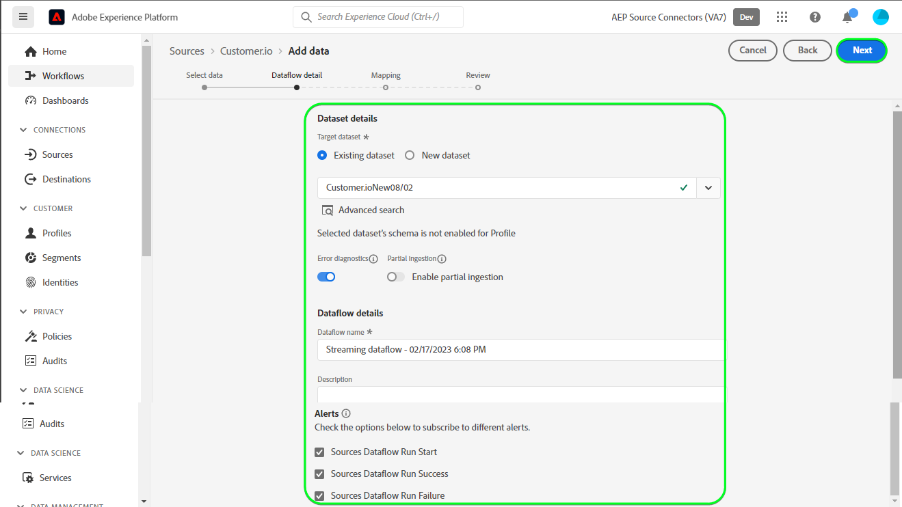
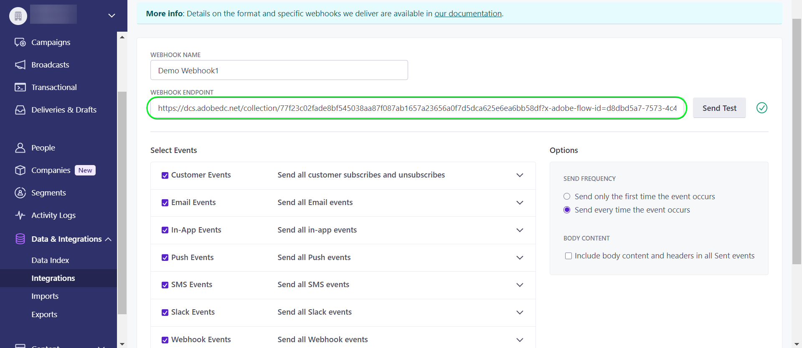

# Erstellen Sie eine [!DNL Customer.io] Quellverbindung und Datenfluss in der Benutzeroberfläche

>[!NOTE]
>
>Die [!DNL Customer.io]-Quelle befindet sich in der Beta-Phase. Bitte lesen Sie die [Quellen - Übersicht](../../../../home.md#terms-and-conditions) für weitere Informationen zur Verwendung von Beta-beschrifteten Quellen.

In diesem Tutorial werden Schritte zum Erstellen eines [!DNL Customer.io] Quellverbindung und Datenfluss über die Adobe Experience Platform-Benutzeroberfläche.

## Erste Schritte {#getting-started}

Dieses Tutorial setzt ein Grundverständnis der folgenden Komponenten von Experience Platform voraus:

* [[!DNL Experience Data Model (XDM)] System](../../../../../xdm/home.md): Das standardisierte Framework, mit dem [!DNL Experience Platform] Kundenerlebnisdaten organisiert.
   * [Grundlagen der Schemakomposition](../../../../../xdm/schema/composition.md): Machen Sie sich mit den grundlegenden Bausteinen von XDM-Schemas vertraut, einschließlich der wichtigsten Prinzipien und Best Practices bei der Schemaerstellung.
   * [Tutorial zum Schema-Editor](../../../../../xdm/tutorials/create-schema-ui.md): Erfahren Sie, wie Sie benutzerdefinierte Schemas mithilfe der Benutzeroberfläche des Schema-Editors erstellen können.
* [[!DNL Real-Time Customer Profile]](../../../../../profile/home.md): Bietet ein einheitliches Echtzeit-Kundenprofil, das auf aggregierten Daten aus verschiedenen Quellen basiert.

## Voraussetzungen {#prerequisites}

Im folgenden Abschnitt finden Sie Informationen zu Voraussetzungen, die erfüllt sein müssen, bevor Sie eine [!DNL Customer.io] Quellverbindung.

### JSON-Beispieldatei zum Definieren des Quellschemas für [!DNL Customer.io] {#prerequisites-json-schema}

Vor der Erstellung [!DNL Customer.io] Quellverbindung verwenden, müssen Sie ein Quellschema angeben. Sie können die folgende JSON verwenden.

```
{
  "event_id": "01E4C4CT6YDC7Y5M7FE1GWWPQJ",
  "object_type": "customer",
  "metric": "subscribed",
  "timestamp": 1613063089,
  "data": {
    "customer_id": "42",
    "email_address": "test@example.com",
    "identifiers": {
      "id": "42",
      "email": "test@example.com",
      "cio_id": "d9c106000001"
    }
  }
}
```

### Erstellen eines Platform-Schemas für [!DNL Customer.io] {#create-platform-schema}

Sie müssen außerdem sicherstellen, dass Sie ein Platform-Schema erstellen, das für Ihre Quelle verwendet werden soll. Siehe Tutorial zu [Erstellen eines Platform-Schemas](../../../../../xdm/schema/composition.md) für umfassende Schritte zum Erstellen eines Schemas.


## Verbinden Ihres [!DNL Customer.io]-Kontos {#connect-account}

Wählen Sie in der Platform-Benutzeroberfläche die Option **[!UICONTROL Quellen]** über die linke Navigationsleiste auf [!UICONTROL Quellen] Arbeitsbereich und sehen Sie sich einen in Experience Platform verfügbaren Quellkatalog an.

Verwenden Sie die *[!UICONTROL Kategorien]* Menü zum Filtern von Quellen nach Kategorie. Geben Sie alternativ einen Quellnamen in die Suchleiste ein, um eine bestimmte Quelle aus dem Katalog zu finden.

Navigieren Sie zu [!UICONTROL Marketing-Automatisierung] -Kategorie, die angezeigt werden soll [!DNL Customer.io] Quellkarte. Wählen Sie zunächst **[!UICONTROL Daten hinzufügen]**.


## Daten auswählen {#select-data}

Die **[!UICONTROL Daten auswählen]** angezeigt, um eine Oberfläche zur Auswahl der Daten bereitzustellen, die Sie an Platform übermitteln möchten.

* Der linke Teil der Benutzeroberfläche ist ein Browser, mit dem Sie die verfügbaren Datenströme in Ihrem Konto anzeigen können.
* Im rechten Bereich der Benutzeroberfläche können Sie eine Vorschau von bis zu 100 Zeilen mit Daten aus einer JSON-Datei anzeigen.

Auswählen **[!UICONTROL Dateien hochladen]** , um eine JSON-Datei von Ihrem lokalen System hochzuladen. Alternativ können Sie die JSON-Datei, die Sie hochladen möchten, per Drag-and-Drop in die [!UICONTROL Dateien per Drag &amp; Drop verschieben] Bereich.


Nach dem Hochladen Ihrer Datei wird die Vorschau-Oberfläche aktualisiert, um eine Vorschau des hochgeladenen Schemas anzuzeigen. Über die Vorschau-Oberfläche können Sie den Inhalt und die Struktur einer Datei überprüfen. Sie können auch die [!UICONTROL Suchfeld] -Dienstprogramm zum Zugreifen auf bestimmte Elemente aus Ihrem Schema.

Wenn Sie fertig sind, klicken Sie auf die Schaltfläche **[!UICONTROL Weiter]**.


## Datenflussdetails {#dataflow-detail}

Die **Datenflussdetails** -Schritt angezeigt, der Ihnen Optionen zur Verwendung eines vorhandenen Datensatzes oder zur Einrichtung eines neuen Datensatzes für Ihren Datenfluss sowie die Möglichkeit bietet, einen Namen und eine Beschreibung für Ihren Datenfluss bereitzustellen. In diesem Schritt können Sie auch Einstellungen für die Profilerfassung, Fehlerdiagnose, partielle Erfassung und Warnhinweise konfigurieren.

Wenn Sie fertig sind, klicken Sie auf die Schaltfläche **[!UICONTROL Weiter]**.



## Zuordnung {#mapping}

Es erfolgt der Schritt der [!UICONTROL Zuordnung], in dem Ihnen eine Schnittstelle zum Zuordnen der Quellfelder aus Ihrem Quellschema zu den entsprechenden XDM-Zielfeldern im Zielschema bereitgestellt wird.

Platform bietet intelligente Empfehlungen für automatisch zugeordnete Felder, die auf dem von Ihnen ausgewählten Zielschema oder Datensatz basieren. Sie können die Zuordnungsregeln manuell an Ihre Anwendungsfälle anpassen. Je nach Bedarf können Sie wahlweise Felder direkt zuordnen oder mithilfe von Datenvorbereitungsfunktionen Quelldaten transformieren, um berechnete oder anderweitig ermittelte Werte abzuleiten. Umfassende Schritte zur Verwendung der Mapper-Oberfläche und der berechneten Felder finden Sie im Abschnitt [Handbuch zur Datenvorbereitung-Benutzeroberfläche](../../../../../data-prep/ui/mapping.md).

Alle unten aufgeführten Zuordnungen sind obligatorisch und sollten eingerichtet werden, bevor Sie mit dem [!UICONTROL Überprüfen] Bühne.

| Zielfeld | Beschreibung |
| --- | --- |
| `object_type` | Objekttyp, siehe [!DNL Customer.io] [events](https://customer.io/docs/webhooks/#events) Dokumentation für die unterstützten Typen. |
| `id` | Die Kennung des Objekts. |
| `email` | Die mit dem Objekt verknüpfte E-Mail-Adresse. |
| `event_id` | Die eindeutige Kennung des Ereignisses. |
| `cio_id` | Die [!DNL Customer.io] Kennung für das Ereignis. |
| `metric` | dem Ereignistyp. Weitere Informationen finden Sie im Abschnitt [!DNL Customer.io] [events](https://customer.io/docs/webhooks/#events) Dokumentation für unterstützte Typen. |
| `timestamp` | Der Zeitstempel, zu dem das Ereignis aufgetreten ist. |

>[!IMPORTANT]
>
>Nicht zuordnen `cio_id` beim Ausführen [!DNL Customer.io] Webhook im `test mode` da keine verknüpften Felder von gesendet werden [!DNL Customer.io].

Nachdem die Quelldaten erfolgreich zugeordnet wurden, wählen Sie **[!UICONTROL Nächste]**.


## Überprüfung {#review}

Der Schritt **[!UICONTROL Überprüfung]** wird angezeigt, sodass Sie Ihren neuen Datenfluss überprüfen können, bevor er hergestellt wird. Die Details lassen sich wie folgt kategorisieren:

* **[!UICONTROL Verbindung]**: Zeigt den Quelltyp, den relevanten Pfad der ausgewählten Quelldatei und die Anzahl der Spalten innerhalb dieser Quelldatei an.
* **[!UICONTROL Datensatz- und Zuordnungsfelder zuweisen]**: Zeigt an, in welchen Datensatz die Quelldaten aufgenommen werden, einschließlich des Schemas, dem der Datensatz entspricht.

Nachdem Sie Ihren Datenfluss überprüft haben, klicken Sie auf **[!UICONTROL Beenden]** und gewähren Sie etwas Zeit für die Erstellung des Datenflusses.


## Abrufen der Streaming-Endpunkt-URL {#get-streaming-endpoint}

Mit dem erstellten Streaming-Datenfluss können Sie jetzt Ihre Streaming-Endpunkt-URL abrufen. Dieser Endpunkt wird zum Abonnieren Ihres Webhooks verwendet, sodass Ihre Streaming-Quelle mit Experience Platform kommunizieren kann.

Um die URL zu erstellen, mit der der Webhook konfiguriert wird [!DNL Customer.io] Sie müssen Folgendes abrufen:

* **[!UICONTROL Dataflow-ID]**
* **[!UICONTROL Streaming-Endpunkt]**

So rufen Sie Ihre **[!UICONTROL Dataflow-ID]** und **[!UICONTROL Streaming-Endpunkt]**, navigieren Sie zu [!UICONTROL Datenfluss-Aktivität] Seite des soeben erstellten Datenflusses und kopieren Sie die Details vom unteren Rand des [!UICONTROL Eigenschaften] Bereich.


Nachdem Sie Ihren Streaming-Endpunkt und Ihre Datenfluss-ID abgerufen haben, erstellen Sie eine URL basierend auf dem folgenden Muster: ```{STREAMING_ENDPOINT}?x-adobe-flow-id={DATAFLOW_ID}```. Beispielsweise könnte eine konstruierte Webhook-URL wie folgt aussehen: ``https://dcs.adobedc.net/collection/febc116d22ba0ea2868e9c93b199375302afb8a589617700991bb8f3f0341ad7?x-adobe-flow-id=439b3fc4-3042-4a3a-b5e0-a494898d3fb0``

## Reporting-Webhook einrichten in [!DNL Customer.io] {#set-up-webhook}

Nachdem Sie Ihre Webhook-URL erstellt haben, können Sie jetzt Ihren Berichterstellungs-Webhook mithilfe der [!DNL Customer.io] -Benutzeroberfläche. Anweisungen zum Einrichten von Reporting-Webhooks finden Sie im Abschnitt [[!DNL Customer.io] Handbuch](https://customer.io/docs/webhooks/#setup) über die Einrichtung von Webhooks.

Im [!DNL Customer.io] Benutzeroberfläche, geben Sie Ihre [Webhook-URL](#get-streaming-endpoint-url) im [!DNL WEBHOOK ENDPOINT] -Feld.



>[!TIP]
>
>Sie können für Ihren Berichterstellungs-Webhook eine Vielzahl verschiedener Ereignisse abonnieren. Die Nachricht jedes Ereignisses wird in Platform erfasst, wenn eine [!DNL Customer.io] die Kriterien für den Trigger des Aktionsereignisses erfüllt sind. Weitere Informationen zu den verschiedenen Veranstaltungen finden Sie im Abschnitt [[!DNL Customer.io] Ereignisdokumentation](https://customer.io/docs/webhooks/#events).

## Nächste Schritte {#next-steps}

In diesem Tutorial haben Sie erfolgreich einen Streaming-Datenfluss konfiguriert, um Ihre [!DNL Customer.io] Daten in die Experience Platform. Informationen zum Überwachen der erfassten Daten finden Sie im Handbuch unter [Überwachen von Streaming-Datenflüssen mithilfe der Platform-Benutzeroberfläche](../../monitor-streaming.md).

## Zusätzliche Ressourcen {#additional-resources}

Die folgenden Abschnitte enthalten zusätzliche Ressourcen, auf die Sie bei der Verwendung der [!DNL Customer.io] -Quelle.

### Leitplanken {#guardrails}

Informationen zu Limits finden Sie im Abschnitt [[!DNL Customer.io] Seite mit Zeitüberschreitungen und Fehlern](https://customer.io/docs/webhooks/#timeouts-and-failures).

### Validierung {#validation}

Überprüfen, ob Sie die Quelle richtig eingerichtet haben und [!DNL Customer.io] -Nachrichten werden erfasst, führen Sie die folgenden Schritte aus:

* Sie können die [!DNL Customer.io] **[!UICONTROL Aktivitätsprotokolle]** Seite, um die Ereignisse zu identifizieren, von denen [!DNL Customer.io].


* Wählen Sie in der Platform-Benutzeroberfläche die Option **[!UICONTROL Datenflüsse anzeigen]** neben dem [!DNL Customer.io] Kartenmenü im Quellkatalog. Wählen Sie als Nächstes **[!UICONTROL Vorschau des Datensatzes anzeigen]** , um die Daten zu überprüfen, die für die Ereignisse erfasst wurden, die Sie in [!DNL Customer.io].


