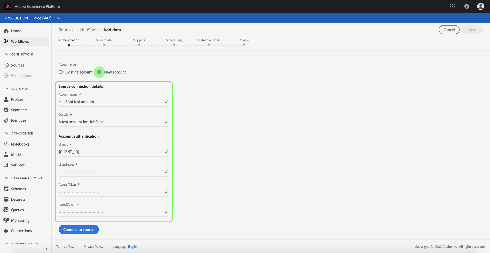

# Erstellen eines Quell-Connectors für [!DNL HubSpot] in der Benutzeroberfläche

Source-Connectoren in Adobe Experience Platform bieten die Möglichkeit, extern bezogene Daten planmäßig zu erfassen. In diesem Tutorial finden Sie die Schritte zum Erstellen eines [!DNL HubSpot]-Quell-Connectors mithilfe der [!DNL Platform]-Benutzeroberfläche.

## Erste Schritte

Dieses Tutorial setzt ein Grundverständnis der folgenden Komponenten von Adobe Experience Platform voraus:

* [[!DNL Experience Data Model (XDM)] System](../../../../../xdm/home.md): Das standardisierte Framework, mit dem [!DNL Experience Platform] Kundenerlebnisdaten organisiert.
   * [Grundlagen der Schemakomposition](../../../../../xdm/schema/composition.md): Machen Sie sich mit den grundlegenden Bausteinen von XDM-Schemata vertraut, einschließlich der wichtigsten Prinzipien und Best Practices bei der Schemaerstellung.
   * [Tutorial zum Schema-Editor](../../../../../xdm/tutorials/create-schema-ui.md): Erfahren Sie, wie Sie benutzerdefinierte Schemata mithilfe der Benutzeroberfläche des Schema-Editors erstellen können.
* [[!DNL Real-Time Customer Profile]](../../../../../profile/home.md): Bietet ein einheitliches Echtzeit-Kundenprofil, das auf aggregierten Daten aus verschiedenen Quellen basiert.

Wenn Sie bereits über eine [!DNL HubSpot] -Verbindung verfügen, können Sie den Rest dieses Dokuments überspringen und mit dem Tutorial zum Konfigurieren eines Datenflusses [ fortfahren.](../../dataflow/marketing-automation.md)

### Sammeln erforderlicher Anmeldeinformationen

Um auf Ihr [!DNL HubSpot] -Konto für [!DNL Platform] zuzugreifen, müssen Sie die folgenden Werte angeben:

| Anmeldedaten | Beschreibung |
| ---------- | ----------- |
| `clientId` | Die mit Ihrer [!DNL HubSpot] -Anwendung verknüpfte Client-ID. |
| `clientSecret` | Das Client-Geheimnis, das Ihrer [!DNL HubSpot]-Anwendung zugeordnet ist. |
| `accessToken` | Das Zugriffstoken, das beim erstmaligen Authentifizieren Ihrer OAuth-Integration erhalten wurde. |
| `refreshToken` | Das Aktualisierungstoken, das beim erstmaligen Authentifizieren Ihrer OAuth-Integration erhalten wurde. |

Weitere Informationen zu den ersten Schritten finden Sie in diesem [[!DNL HubSpot] Dokument](https://developers.hubspot.com/docs/methods/oauth2/oauth2-overview).

## Verbinden Ihres [!DNL HubSpot]-Kontos

Nachdem Sie die erforderlichen Anmeldedaten erfasst haben, können Sie die folgenden Schritte ausführen, um Ihr [!DNL HubSpot]-Konto mit [!DNL Platform] zu verknüpfen.

Melden Sie sich bei [Adobe Experience Platform](https://platform.adobe.com) an und wählen Sie dann in der linken Navigationsleiste **[!UICONTROL Quellen]** aus, um auf den Arbeitsbereich **[!UICONTROL Quellen]** zuzugreifen. Der Bildschirm **[!UICONTROL Katalog]** zeigt eine Vielzahl von Quellen an, mit denen Sie ein Konto erstellen können.

Sie können die gewünschte Kategorie aus dem Katalog auf der linken Bildschirmseite auswählen. Alternativ können Sie die gewünschte Quelle mithilfe der Suchoption finden.

Wählen Sie unter der Kategorie **[!UICONTROL Marketing-Automatisierung]** die Option **[!UICONTROL HubSpot]** aus. Wenn Sie diesen Connector zum ersten Mal verwenden, wählen Sie **[!UICONTROL Konfigurieren]** aus. Klicken Sie andernfalls auf **[!UICONTROL Daten hinzufügen]** , um einen neuen [!DNL HubSpot]-Connector zu erstellen.

Die Seite **[!UICONTROL Verbindung zu HubSpot herstellen]** wird angezeigt. Auf dieser Seite können Sie entweder neue oder vorhandene Anmeldedaten verwenden.

### Neues Konto

Wenn Sie neue Anmeldeinformationen verwenden, wählen Sie **[!UICONTROL Neues Konto]** aus. Geben Sie im angezeigten Formular einen Namen, eine optionale Beschreibung und Ihre [!DNL HubSpot]-Anmeldedaten ein. Wenn Sie fertig sind, wählen Sie **[!UICONTROL Verbinden]** und lassen Sie dann etwas Zeit, bis die neue Verbindung hergestellt ist.

### Vorhandenes Konto

Um ein vorhandenes Konto zu verbinden, wählen Sie das [!DNL HubSpot]-Konto aus, mit dem Sie eine Verbindung herstellen möchten, und klicken Sie dann auf **[!UICONTROL Weiter]** , um fortzufahren.

## Nächste Schritte

Mithilfe dieses Tutorials haben Sie eine Verbindung zu Ihrem [!DNL HubSpot]-Konto hergestellt. Sie können jetzt mit dem nächsten Tutorial fortfahren und einen Datenfluss [konfigurieren, um Systemdaten aus der Marketing-Automatisierung in  [!DNL Platform]](../../dataflow/marketing-automation.md) zu integrieren.
