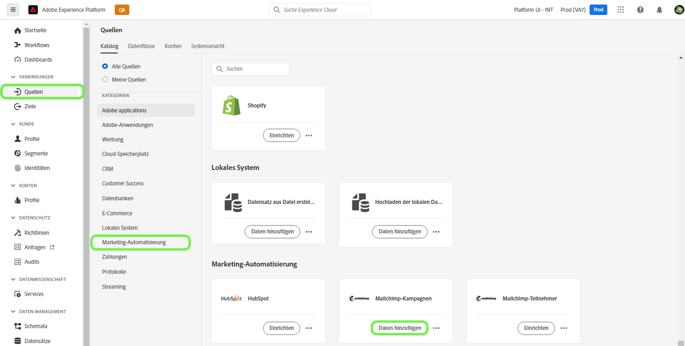
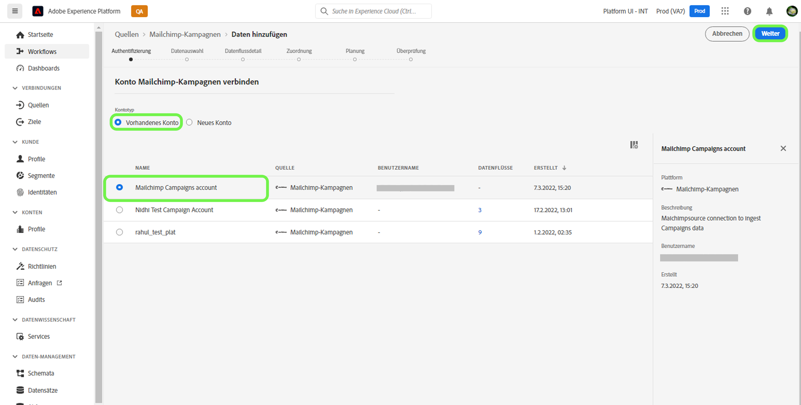
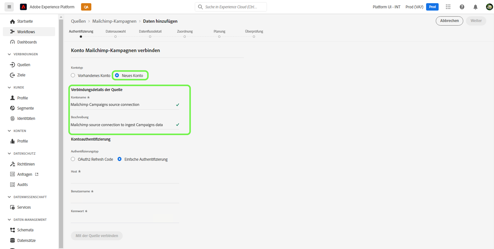
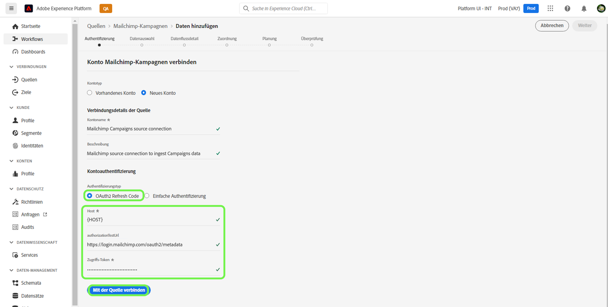
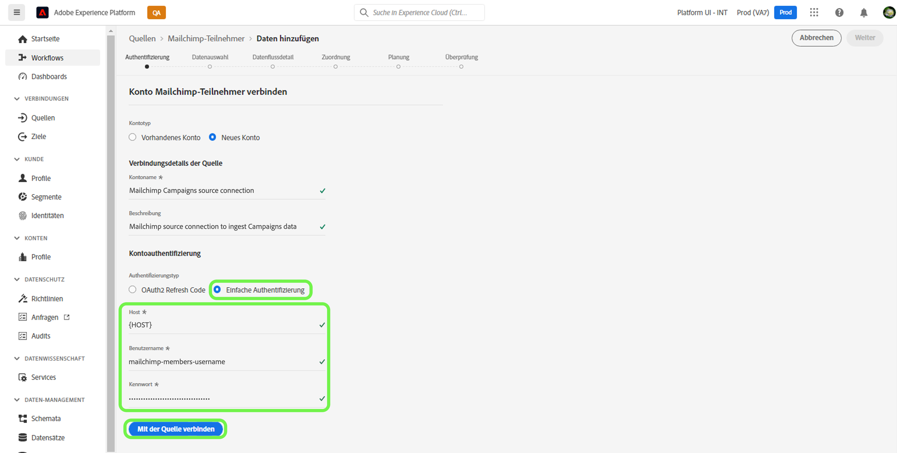
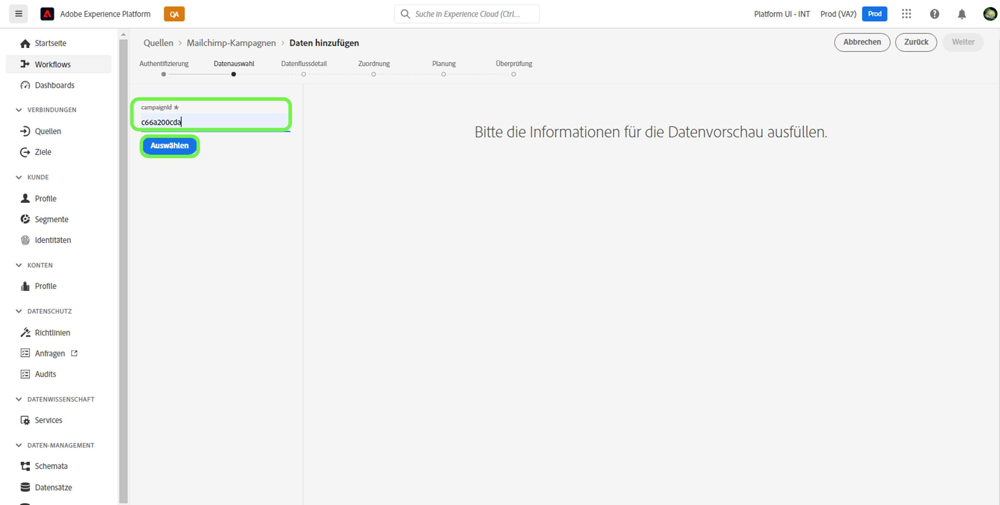
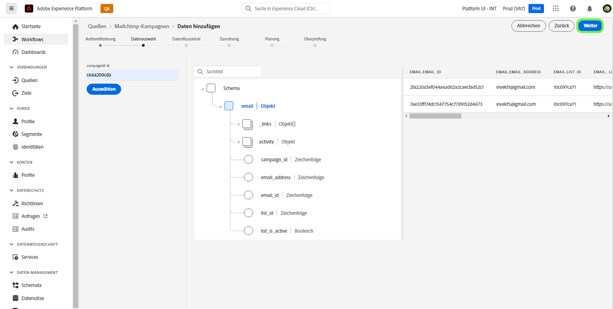

# Erstellen einer [!DNL Mailchimp Campaigns]-Quellverbindung mithilfe der Platform-Benutzeroberfläche

In diesem Tutorial werden Schritte zum Erstellen eines [!DNL Mailchimp]-Quell-Connectors erläutert, um [!DNL Mailchimp Campaigns]-Daten über die Benutzeroberfläche in Adobe Experience Platform aufzunehmen.

## Erste Schritte

Dieses Handbuch setzt ein Verständnis der folgenden Komponenten von Adobe Experience Platform voraus:

* [Quellen](../../../../home.md): Platform ermöglicht das Aufnehmen von Daten aus verschiedenen Quellen und bietet Ihnen die Möglichkeit, eingehende Daten mithilfe von [!DNL Platform]-Services zu strukturieren, zu kennzeichnen und anzureichern.
* [Sandboxes](../../../../../sandboxes/home.md): Platform bietet virtuelle Sandboxes, die eine einzelne Platform-Instanz in separate virtuelle Umgebungen unterteilen, damit Sie Programme für digitale Erlebnisse entwickeln und weiterentwickeln können.

## Sammeln erforderlicher Anmeldeinformationen

Um Ihre [!DNL Mailchimp Campaigns]-Daten in Platform einzubringen, müssen Sie zunächst die Authentifizierungsdaten angeben, die Ihrem [!DNL Mailchimp]-Konto entsprechen.

Die [!DNL Mailchimp Campaigns]-Quelle unterstützt sowohl OAuth 2-Aktualisierungs-Code als auch die einfache Authentifizierung. Weitere Informationen zu diesen Authentifizierungstypen finden Sie in den Tabellen unten.

### OAuth 2-Aktualisierungs-Code

| Anmeldeinformationen | Beschreibung |
| --- | --- |
| Domain | Die Stamm-URL, die für die Verbindung mit der MailChimp-API verwendet wird. Das Format für die Stamm-URL lautet `https://{DC}.api.mailchimp.com`, wobei `{DC}` das Rechenzentrum darstellt, das Ihrem Konto entspricht. |
| URL für den Autorisierungstest | Die URL für den Autorisierungstest wird verwendet, um Anmeldeinformationen beim Herstellen einer Verbindung von [!DNL Mailchimp] mit Platform zu überprüfen. Wenn dies nicht angegeben wird, werden die Anmeldeinformationen stattdessen während des Erstellungsschritts der Quellverbindung automatisch überprüft. |
| Zugriffs-Token | Das entsprechende Zugriffs-Token, das zum Authentifizieren Ihrer Quelle verwendet wird. Dies ist für die OAuth-basierte Authentifizierung erforderlich. |

Weitere Informationen zur Verwendung von OAuth 2 zum Authentifizieren Ihres [!DNL Mailchimp]-Kontos für Platform finden Sie in diesem [[!DNL Mailchimp] Dokument zur Verwendung von OAuth 2](https://mailchimp.com/developer/marketing/guides/access-user-data-oauth-2/).

### Einfache Authentifizierung

| Anmeldeinformationen | Beschreibung |
| --- | --- |
| Domäne | Die Stamm-URL, die für die Verbindung mit der MailChimp-API verwendet wird. Das Format für die Stamm-URL lautet `https://{DC}.api.mailchimp.com`, wobei `{DC}` das Rechenzentrum darstellt, das Ihrem Konto entspricht. |
| Benutzername | Der Benutzername, der Ihrem MailChimp-Konto entspricht. Dies ist für die einfache Authentifizierung erforderlich. |
| Passwort | Das Passwort, das Ihrem MailChimp-Konto entspricht. Dies ist für die einfache Authentifizierung erforderlich. |

## Verbinden Ihres [!DNL Mailchimp Campaigns]-Kontos mit Platform

Wählen Sie in der Platform-Benutzeroberfläche die Option **[!UICONTROL Quellen]** in der linken Navigationsleiste, um auf den Arbeitsbereich [!UICONTROL Quellen] zuzugreifen. Die [!UICONTROL Katalog] zeigt eine Vielzahl von Quellen an, mit denen Sie ein Konto erstellen können.

Sie können die gewünschte Kategorie aus dem Katalog auf der linken Bildschirmseite auswählen. Alternativ können Sie die gewünschte Quelle mithilfe der Suchoption finden.

Wählen Sie in der Kategorie [!UICONTROL Marketing-Automatisierung] die Option **[!UICONTROL Mailchimp-Kampagne]** und anschließend **[!UICONTROL Daten hinzufügen]**.

Die Seite **[!UICONTROL Mailchimp-Kampagnenkonto verbinden]** wird angezeigt. Auf dieser Seite können Sie auswählen, ob Sie auf ein vorhandenes Konto zugreifen oder ein neues Konto erstellen möchten.

### Vorhandenes Konto

Um ein vorhandenes Konto zu verwenden, wählen Sie das [!DNL Mailchimp Campaigns]-Konto, mit dem Sie einen neuen Datenfluss erstellen möchten, und klicken Sie dann auf **[!UICONTROL Weiter]**, um fortzufahren.

### Neues Konto

Wenn Sie ein neues Konto erstellen, wählen Sie **[!UICONTROL Neues Konto]** und geben Sie dann einen Namen und eine Beschreibung für Ihre [!DNL Mailchimp Campaigns]-Quellverbindungsdetails an.

#### Authentifizieren mit OAuth 2

Um OAuth 2 zu verwenden, wählen Sie [!UICONTROL OAuth 2-Aktualisierungscode], geben Sie Werte für Ihre Domäne, die URL für den Autorisierungstest und das Zugriffstoken an und wählen Sie dann **[!UICONTROL Verbindung mit Quelle herstellen]**. Warten Sie einige Augenblicke, bis Ihre Anmeldeinformationen validiert wurden, und wählen Sie dann **[!UICONTROL Weiter]** aus, um fortzufahren.

#### Authentifizieren mit Standardauthentifizierung

Um die einfache Authentifizierung zu verwenden, wählen Sie [!UICONTROL Grundlegende Authentifizierung], geben Sie Werte für Ihre Domäne, Ihren Benutzernamen und Ihr Kennwort ein und wählen Sie **[!UICONTROL Verbindung mit Quelle herstellen]**. Warten Sie einige Augenblicke, bis Ihre Anmeldeinformationen validiert wurden, und wählen Sie dann **[!UICONTROL Weiter]** aus, um fortzufahren.

### Auswählen von [!DNL Mailchimp Campaigns]-Daten

Nachdem Ihre Quelle authentifiziert wurde, müssen Sie die `campaignId` angeben, die Ihrem [!DNL Mailchimp Campaigns]-Konto entspricht.

Geben Sie auf der Seite [!UICONTROL Daten auswählen] Ihre `campaignId` ein und wählen Sie **[!UICONTROL Erkunden]** aus.

Die Seite wird in eine interaktive Schemastruktur aktualisiert, in der Sie die Hierarchie Ihrer Daten analysieren und untersuchen können. Wählen Sie **[!UICONTROL Weiter]** aus, um fortzufahren.

## Nächste Schritte

Nachdem Sie Ihr [!DNL Mailchimp]-Konto authentifiziert und Ihre [!DNL Mailchimp Campaigns]-Daten ausgewählt haben, können Sie nun mit der Erstellung eines Datenflusses beginnen, um Ihre Daten in Platform zu übertragen. Ausführliche Anweisungen zum Erstellen eines Datenflusses finden Sie in der Dokumentation zum [Erstellen eines Datenflusses, um Daten zur Marketing-Automatisierung in Platform zu übertragen](../../dataflow/marketing-automation.md).
