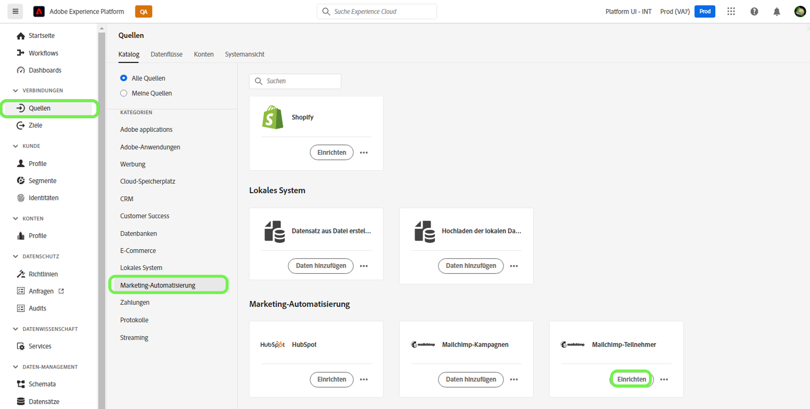
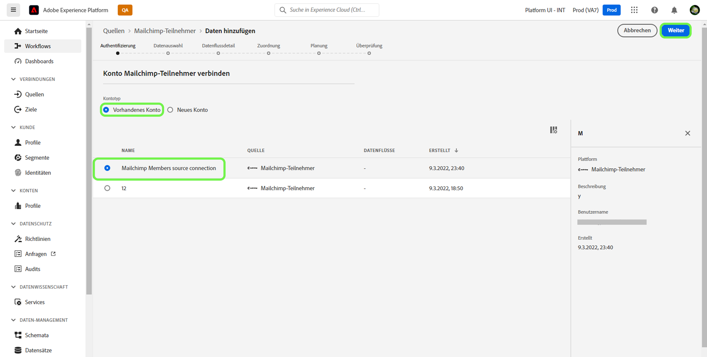
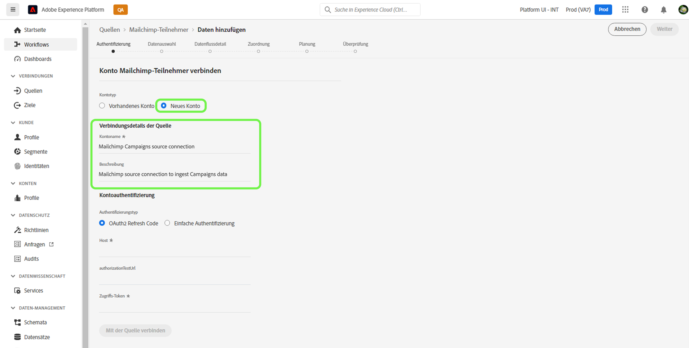
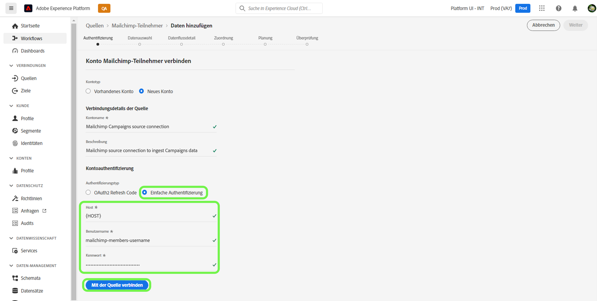
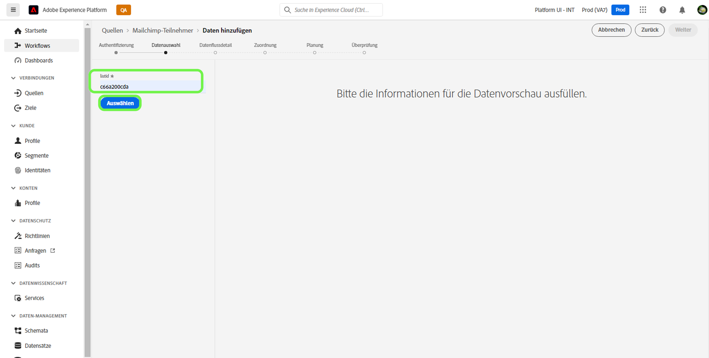
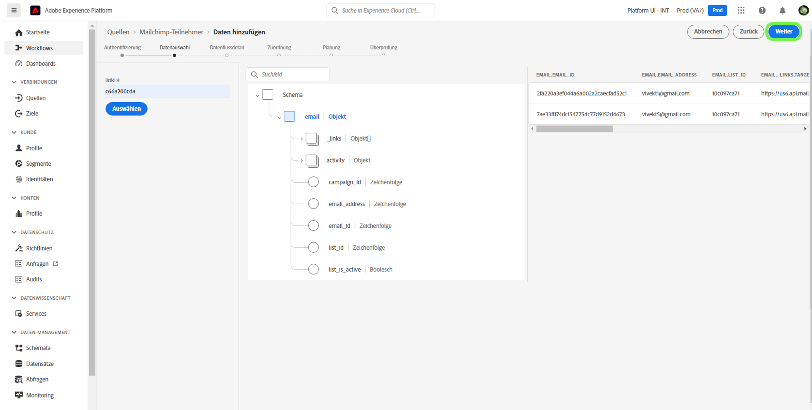

# Erstellen Sie eine [!DNL Mailchimp Members] Quellverbindung über die Platform-Benutzeroberfläche

In diesem Tutorial werden Schritte zum Erstellen eines [!DNL Mailchimp] Quell-Connector zur Aufnahme [!DNL Mailchimp Members] Daten an Adobe Experience Platform über die Benutzeroberfläche.

## Erste Schritte

Dieses Handbuch setzt ein Verständnis der folgenden Komponenten von Adobe Experience Platform voraus:

* [Quellen](../../../../home.md): Platform ermöglicht die Erfassung von Daten aus verschiedenen Quellen und bietet Ihnen gleichzeitig die Möglichkeit, eingehende Daten zu strukturieren, zu beschriften und zu erweitern, indem [!DNL Platform] Dienste.
* [Sandboxes](../../../../../sandboxes/home.md): Platform bietet virtuelle Sandboxes, die eine einzelne Platform-Instanz in separate virtuelle Umgebungen aufteilen, um die Entwicklung und Weiterentwicklung von Programmen für digitale Erlebnisse zu erleichtern.

## Erforderliche Anmeldedaten sammeln

Um Ihre [!DNL Mailchimp Members] Daten an Platform übermitteln, müssen Sie zunächst die entsprechenden Authentifizierungsberechtigungen angeben, die Ihrer [!DNL Mailchimp] -Konto.

Die [!DNL Mailchimp Members] -Quelle unterstützt sowohl OAuth 2-Aktualisierungscode als auch einfache Authentifizierung. Weitere Informationen zu diesen Authentifizierungstypen finden Sie in den Tabellen unten.

### OAuth 2-Aktualisierungscode

| Anmeldeinformationen | Beschreibung |
| --- | --- |
| Host | Die Stamm-URL, die für die Verbindung mit der MailChimp-API verwendet wird. Das Format für die Stamm-URL lautet `https://{DC}.api.mailchimp.com`, wobei `{DC}` stellt das Rechenzentrum dar, das Ihrem Konto entspricht. |
| Autorisierungstest-URL | Die URL für den Autorisierungstest wird verwendet, um Anmeldeinformationen beim Herstellen einer Verbindung zu überprüfen. [!DNL Mailchimp] auf Platform. Wenn dies nicht angegeben wird, werden die Anmeldeinformationen stattdessen während des Erstellungsschritts der Quellverbindung automatisch überprüft. |
| Zugriffstoken | Das entsprechende Zugriffs-Token, das zum Authentifizieren Ihrer Quelle verwendet wird. Dies ist für die OAuth-basierte Authentifizierung erforderlich. |

Weitere Informationen zur Verwendung von OAuth 2 zum Authentifizieren Ihrer [!DNL Mailchimp] -Konto für Platform erstellen, siehe dies [[!DNL Mailchimp] Dokument zur Verwendung von OAuth 2](https://mailchimp.com/developer/marketing/guides/access-user-data-oauth-2/).

### Grundlegende Authentifizierung

| Anmeldeinformationen | Beschreibung |
| --- | --- |
| Host | Die Stamm-URL, die für die Verbindung mit der MailChimp-API verwendet wird. Das Format für die Stamm-URL lautet `https://{DC}.api.mailchimp.com`, wobei `{DC}` stellt das Rechenzentrum dar, das Ihrem Konto entspricht. |
| Benutzername | Der Benutzername, der Ihrem MailChimp-Konto entspricht. Dies ist für die einfache Authentifizierung erforderlich. |
| Passwort | Das Passwort, das Ihrem MailChimp-Konto entspricht. Dies ist für die einfache Authentifizierung erforderlich. |

## Verbinden Sie Ihre [!DNL Mailchimp Members] Konto bei Platform

Wählen Sie in der Platform-Benutzeroberfläche die Option **[!UICONTROL Quellen]** über die linke Navigationsleiste, um auf die [!UICONTROL Quellen] Arbeitsbereich. Die [!UICONTROL Katalog] zeigt eine Vielzahl von Quellen an, mit denen Sie ein Konto erstellen können.

Sie können die gewünschte Kategorie aus dem Katalog auf der linken Bildschirmseite auswählen. Alternativ können Sie die gewünschte Quelle mithilfe der Suchoption finden.

Unter dem [!UICONTROL Marketing-Automatisierung] category, select **[!UICONTROL Mailchimp Campaign]** und wählen Sie **[!UICONTROL Daten hinzufügen]**.

Die **[!UICONTROL Mailchimp-Kampagnenkonto verbinden]** angezeigt. Auf dieser Seite können Sie auswählen, ob Sie auf ein vorhandenes Konto zugreifen oder ein neues Konto erstellen möchten.

### Vorhandenes Konto

Um ein vorhandenes Konto zu verwenden, wählen Sie die [!DNL Mailchimp Members] Konto, mit dem Sie einen neuen Datenfluss erstellen möchten, wählen Sie **[!UICONTROL Nächste]** um fortzufahren.

### Neues Konto

Wenn Sie ein neues Konto erstellen, wählen Sie **[!UICONTROL Neues Konto]** und geben Sie dann einen Namen und eine Beschreibung für Ihre [!DNL Mailchimp Members] Quellverbindungsdetails.

#### Authentifizieren mit OAuth 2

Um OAuth 2 zu verwenden, wählen Sie [!UICONTROL OAuth 2-Aktualisierungscode], geben Sie Werte für Ihren Host an, geben Sie die URL des Autorisierungstests an und klicken Sie auf **[!UICONTROL Verbindung mit Quelle herstellen]**. Lassen Sie einige Augenblicke zu, bis Ihre Anmeldeinformationen validiert sind, und wählen Sie dann **[!UICONTROL Nächste]** um fortzufahren.

#### Authentifizierung mit einfacher Authentifizierung

Um die einfache Authentifizierung zu verwenden, wählen Sie [!UICONTROL Grundlegende Authentifizierung], geben Sie Werte für Ihren Host, Ihren Benutzernamen und Ihr Kennwort ein und wählen Sie **[!UICONTROL Verbindung mit Quelle herstellen]**. Lassen Sie einige Augenblicke zu, bis Ihre Anmeldeinformationen validiert sind, und wählen Sie dann **[!UICONTROL Nächste]** um fortzufahren.

### Auswählen [!DNL Mailchimp Members] data

Nachdem Ihre Quelle authentifiziert wurde, müssen Sie die `listId` , die Ihrer [!DNL Mailchimp Members] -Konto.

Im [!UICONTROL Daten auswählen] Seite, geben Sie Ihre `listId` und wählen Sie **[!UICONTROL Erkunden]**.

Die Seite wird in eine interaktive Schemastruktur aktualisiert, in der Sie die Hierarchie Ihrer Daten untersuchen und untersuchen können. Auswählen **[!UICONTROL Nächste]** um fortzufahren.

## Nächste Schritte

Mit [!DNL Mailchimp] -Konto authentifiziert und Ihre [!DNL Mailchimp Members] -Daten ausgewählt haben, können Sie jetzt mit der Erstellung eines Datenflusses beginnen, um Ihre Daten an Platform zu bringen. Ausführliche Anweisungen zum Erstellen eines Datenflusses finden Sie in der Dokumentation unter [Erstellen eines Datenflusses, um Daten zur Marketing-Automatisierung an Platform zu bringen](../../dataflow/marketing-automation.md).
