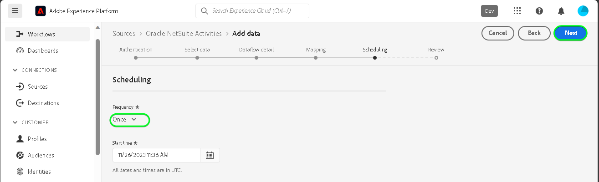

# Erstellen eines Quell-Connectors für [!DNL Oracle NetSuite Activities] in der Benutzeroberfläche

>[!NOTE]
>
>Die [!DNL Oracle NetSuite Activities]-Quelle befindet sich in der Beta-Phase. Siehe [Quellen - Übersicht](../../../../home.md#terms-and-conditions) für weitere Informationen zur Verwendung von Beta-beschrifteten Quellen.

Lesen Sie das folgende Tutorial , um zu erfahren, wie Sie Ereignisdaten aus Ihrem [!DNL Oracle NetSuite Activities] -Konto in der -Benutzeroberfläche zu Adobe Experience Platform hinzufügen.

## Erste Schritte {#getting-started}

Dieses Tutorial setzt ein Grundverständnis der folgenden Komponenten von Experience Platform voraus:

* [[!DNL Experience Data Model (XDM)] System](../../../../../xdm/home.md): Das standardisierte Framework, mit dem [!DNL Experience Platform] Kundenerlebnisdaten organisiert.
   * [Grundlagen der Schemakomposition](../../../../../xdm/schema/composition.md): Machen Sie sich mit den grundlegenden Bausteinen von XDM-Schemas vertraut, einschließlich der wichtigsten Prinzipien und Best Practices bei der Schemaerstellung.
   * [Tutorial zum Schema-Editor](../../../../../xdm/tutorials/create-schema-ui.md): Erfahren Sie, wie Sie benutzerdefinierte Schemas mithilfe der Benutzeroberfläche des Schema-Editors erstellen können.
* [[!DNL Real-Time Customer Profile]](../../../../../profile/home.md): Bietet ein einheitliches Echtzeit-Kundenprofil, das auf aggregierten Daten aus verschiedenen Quellen basiert.

Wenn Sie bereits über ein gültiges [!DNL Oracle NetSuite]-Konto verfügen, können Sie den Rest dieses Dokuments überspringen und mit dem Tutorial zum [Konfigurieren eines Datenflusses](../../dataflow/marketing-automation.md) fortfahren.

>[!TIP]
>
>Lesen Sie die [[!DNL Oracle NetSuite] Übersicht](../../../../connectors/marketing-automation/oracle-netsuite.md) für Informationen zum Abrufen Ihrer Authentifizierungsberechtigungen.

## Verbinden Ihres [!DNL Oracle NetSuite]-Kontos {#connect-account}

Wählen Sie in der Platform-Benutzeroberfläche in der linken Navigationsleiste die Option **[!UICONTROL Quellen]**, um auf den Arbeitsbereich [!UICONTROL Quellen] zuzugreifen. Sie können die gewünschte Kategorie aus dem Katalog auf der linken Bildschirmseite auswählen. Alternativ können Sie die gewünschte Quelle mithilfe der Suchoption finden.

Unter dem *Marketing-Automatisierung* category, select **[!DNL Oracle NetSuite Activities]** und wählen Sie **[!UICONTROL Daten hinzufügen]**.

Die **[!UICONTROL Oracle NetSuite Activities-Konto verbinden]** angezeigt. Auf dieser Seite können Sie entweder neue oder vorhandene Anmeldedaten verwenden.

>[!IMPORTANT]
>
>Das Aktualisierungs-Token läuft nach sieben Tagen ab. Sobald Ihr Token abläuft, müssen Sie ein Konto auf dem Experience Platform mit Ihrem aktualisierten Token erstellen. Wenn Sie kein neues Konto mit Ihrem aktualisierten Token erstellen, wird möglicherweise die folgende Fehlermeldung angezeigt: `The request could not be processed. Error from flow provider: The request could not be processed. Rest call failed with client error, status code 401 Unauthorized, please check your activity settings.`

### Vorhandenes Konto {#existing-account}

Um ein vorhandenes Konto zu verwenden, wählen Sie das [!DNL Oracle NetSuite Activities]-Konto, mit dem Sie einen neuen Datenfluss erstellen möchten, und klicken Sie dann auf **[!UICONTROL Weiter]**, um fortzufahren.

### Neues Konto {#new-account}

Wenn Sie ein neues Konto erstellen, wählen Sie **[!UICONTROL Neues Konto]** und geben Sie dann einen Namen, eine optionale Beschreibung und Ihre Anmeldeinformationen ein. Wenn Sie fertig sind, wählen Sie **[!UICONTROL Mit Quelle verbinden]** und warten Sie, bis die neue Verbindung hergestellt ist.

## Nächste Schritte {#next-steps}

Mithilfe dieses Tutorials haben Sie eine Verbindung zu Ihrem [!DNL Oracle NetSuite Activities]-Konto hergestellt. Sie können jetzt mit dem nächsten Tutorial fortfahren und einen [Datenfluss konfigurieren, um Daten in Platform zu importieren](../../dataflow/marketing-automation.md).

## Zusätzliche Ressourcen {#additional-resources}

Die folgenden Abschnitte enthalten zusätzliche Ressourcen, auf die Sie bei der Verwendung der Variablen [!DNL Oracle NetSuite Activities] -Quelle.

### Zuordnung {#mapping}

Platform bietet intelligente Empfehlungen für automatisch zugeordnete Felder, die auf dem ausgewählten Zielschema oder Datensatz basieren. Sie können die Zuordnungsregeln manuell an Ihre Anwendungsfälle anpassen. Je nach Bedarf können Sie wahlweise Felder direkt zuordnen oder mithilfe von Datenvorbereitungsfunktionen Quelldaten transformieren, um berechnete oder anderweitig ermittelte Werte abzuleiten. Umfassende Schritte zur Verwendung der Mapper-Oberfläche und der berechneten Felder finden Sie im Abschnitt [Handbuch zur Datenvorbereitung-Benutzeroberfläche](../../../../../data-prep/ui/mapping.md).

>[!NOTE]
>
>Die angezeigten Felder hängen von den Abonnements ab, die Ihre [!DNL Oracle NetSuite] -Konto Zugriff hat. Wenn Sie beispielsweise keinen Zugriff auf die Rechnungsstellung haben, werden die entsprechenden Felder nicht angezeigt.

### Planung {#scheduling}

Bei der Planung Ihrer [!DNL Oracle NetSuite Activities] Datenfluss zur Erfassung müssen Sie die folgende Häufigkeits- und Intervallkonfiguration auswählen:

| Häufigkeit | Intervall |
| --- | --- |
| `Once` | 1 |

Beim Abrufen von Daten wird die [!DNL Oracle NetSuite] antwortet mit dem Datum der letzten Änderung oder Erstellung als Datumsformat anstelle eines Zeitstempels. Daher ist die Planung auf einen Tag beschränkt.

Nachdem Sie die Werte für Ihren Zeitplan angegeben haben, wählen Sie **[!UICONTROL Nächste]**.

