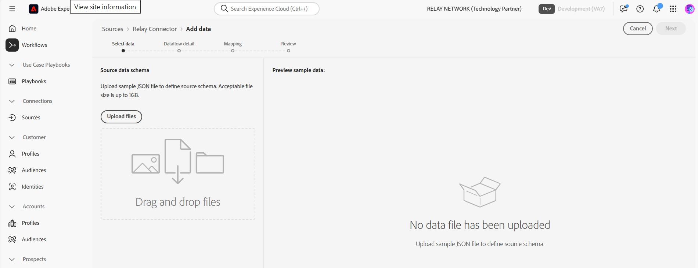

# Verbinden von Relay mit Experience Platform über die Benutzeroberfläche

>[!NOTE]
>
>Die [!DNL Relay Connector]-Quelle befindet sich in der Beta-Phase. Weitere Informationen zur Verwendung von Beta[gekennzeichneten Quellen finden Sie &#x200B;](../../../../home.md#terms-and-conditions) „Quellen - Übersicht“.

Mit [!DNL Relay Connector] können Sie Ihren Kunden personalisierte Erlebnisse zu den wichtigsten Zeitpunkten im Journey bereitstellen und so engere Beziehungen aufbauen sowie die Kundentreue und den Wert steigern, indem Sie eine eingehende Verbindung erstellen, um Ereignisse aus Ihrer [!DNL Relay Network]-Integration in Adobe Experience Platform zu streamen.

Lesen Sie dieses Handbuch, um zu erfahren, wie Sie die [!DNL Relay Connector] im Arbeitsbereich „Quellen“ der Experience Platform-Benutzeroberfläche verwenden.

>[!IMPORTANT]
>
>Diese Dokumentationsseite wird vom *[!DNL Relay Network]*-Team gepflegt. Bei Fragen oder Aktualisierungsanfragen wenden Sie sich bitte direkt unter *[[!DNL Relay Network]](https://www.relaynetwork.com/) oder per E-Mail an [info@relaynetwork.com](mailto:info@relaynetwork.com)*.

## [!DNL Relay Connector] verbinden

Wählen Sie in der Experience Platform-Benutzeroberfläche **[!UICONTROL Quellen]** in der linken Navigationsleiste aus, um auf den Arbeitsbereich [!UICONTROL Quellen] zuzugreifen. Der [!UICONTROL Katalog] zeigt eine Vielzahl von Quellen an, mit denen Sie ein Konto erstellen können. Sie können die entsprechende Kategorie aus dem Katalog auf der linken Bildschirmseite auswählen oder die Suchoption verwenden, um eine bestimmte Quelle zu finden.

Wählen Sie unter *[!UICONTROL Kategorie]* Marketing-Automatisierung“ die Karte [!DNL Relay Connector] und anschließend **[!UICONTROL Daten hinzufügen]** aus.

>[!TIP]
>
>Wenn kein authentifiziertes Konto vorhanden ist, wird für Quellen im **[!UICONTROL die Option]** Einrichten“ angezeigt. Nach der Authentifizierung eines Kontos ändert sich diese Option in **[!UICONTROL Daten hinzufügen]**.

### Daten auswählen

Die Schnittstelle **[!UICONTROL Connect Relay Connector source]** wird angezeigt. Verwenden Sie die Schnittstelle *[!UICONTROL Daten auswählen]* um das Quelldatenschema zu durchsuchen oder anzugeben. Alternativ können Sie eine JSON-Beispieldatei hochladen, um das Quellschema zu definieren.

>[!NOTE]
>
>Die zulässige Dateigröße beträgt bis zu 1 GB.

Nachdem die Daten hochgeladen wurden, können Sie den Abschnitt [!UICONTROL Vorschau der Beispieldaten] verwenden, um eine Vorschau der Daten anzuzeigen.

### Datenflussdetails

Verwenden Sie anschließend die Schnittstelle *[!UICONTROL Datenflussdetails]*, um einen **Namen** und eine **optionale Beschreibung** für Ihren Datenfluss bereitzustellen. Wählen Sie außerdem den **[!UICONTROL Zieldatensatz]** aus, den Sie verwenden möchten. Sie können entweder einen neuen Datensatz erstellen oder einen vorhandenen Datensatz verwenden.

### Zuordnung

Sie können Ihre Quellfelder mithilfe der Funktion zur automatischen Zuordnung, die Felder basierend auf ihren Namen zuordnet, XDM-Schemafeldern zuordnen oder benutzerdefinierte Zuordnungen erstellen, um die Kontrolle zu verbessern. Bei Bedarf können Sie auch Umwandlungen wie Verkettung, Formatierung oder Umbenennung anwenden, um sicherzustellen, dass Ihre Daten perfekt in das Zielschema passen. Weitere Informationen zur Zuordnung finden Sie im [Handbuch zur Datenvorbereitungs-Benutzeroberfläche](../../../../../data-prep/ui/mapping.md).

>[!TIP]
>
>Details zu den Ereignistypen und Datenwerten, die Relay an Ihre Quelle sendet, finden Sie in der Dokumentation [[!DNL Relay Network] Push-Ereignisse](https://docs.relaynetwork.com/docs/push-events) . Diese Informationen helfen Ihnen, Ihr **Erlebnisereignisschema“** zu gestalten.

### Überprüfung

Überprüfen Sie abschließend alle Konfigurationen, einschließlich Ihrer **Quelle, Datensatz und Zuordnungen**. Wenn Sie fertig sind, wählen **Beenden**, um den Datenfluss zu erstellen.

### Abrufen der Streaming-Endpunkt-URL

Nachdem Sie den Datenfluss erstellt haben, finden Sie die *Streaming-Endpunkt* URL) und andere zugehörige Details im Abschnitt **Eigenschaften** auf der rechten Seite der Datenflussseite.

Verwenden Sie diese Werte, um den Webhook in der **Relay-Konsole“**. Detaillierte Anweisungen zum Konfigurieren der Push-Benachrichtigung finden Sie in der Relay-Dokumentation: [Konfigurieren der Push-API](https://docs.relaynetwork.com/docs/configuring-the-push-api).

## Zusätzliche Ressourcen

* [Erstellen einer neuen Verbindungsspezifikation mithilfe der Flow Service-API](https://experienceleague.adobe.com/de/docs/experience-platform/sources/sdk/streaming-sdk/create)
* [Verbinden Sie sich über die Benutzeroberfläche mit Ihrer Quelle](https://experienceleague.adobe.com/de/docs/experience-platform/sources/sdk/streaming-sdk/submit#test-your-source-using-the-ui)
