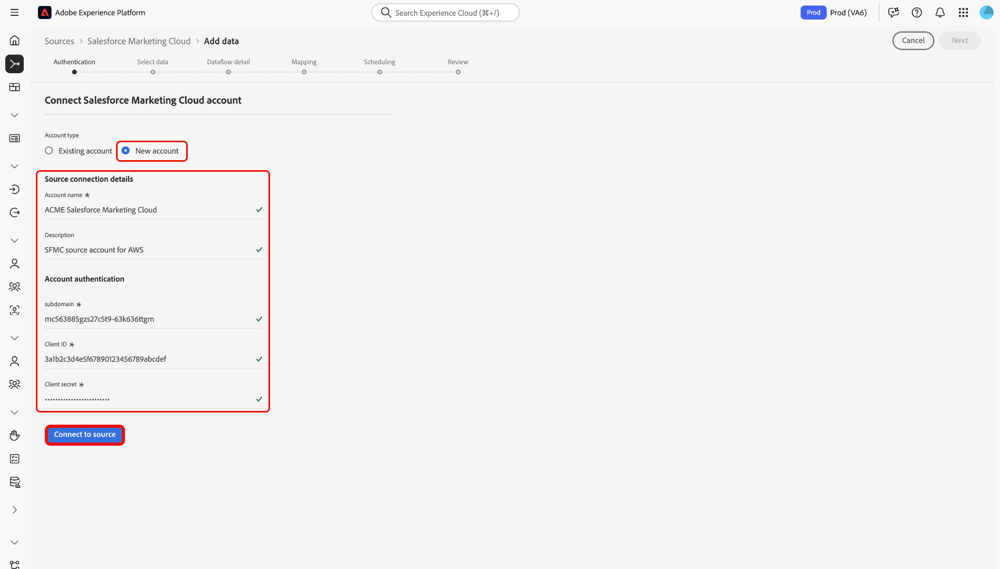

# Verbinden Ihres [!DNL Salesforce Marketing Cloud] über die Benutzeroberfläche mit Experience Platform

>[!WARNING]
>
>Die [!DNL Salesforce Marketing Cloud] wird im Januar 2026 eingestellt. Eine neue Quelle wird noch in diesem Jahr als Alternative veröffentlicht. Nach der Veröffentlichung der neuen Quelle müssen Sie die Migration zur neuen Quelle planen, indem Sie neue Kontoverbindungen und Datenflüsse vor Ende Januar 2026 erstellen.

Lesen Sie dieses Handbuch, um zu erfahren, wie Sie Ihr [!DNL Salesforce Marketing Cloud]-Konto mithilfe des Arbeitsbereichs „Quellen“ in der Benutzeroberfläche von Experience Platform mit Adobe Experience Platform verbinden.

## Erste Schritte

Dieses Tutorial setzt ein Grundverständnis der folgenden Komponenten von Experience Platform voraus:

* [[!DNL Experience Data Model (XDM)] System](../../../../../xdm/home.md): Das standardisierte Framework, mit dem [!DNL Experience Platform] Kundenerlebnisdaten organisiert.
   * [Grundlagen der Schemakomposition](../../../../../xdm/schema/composition.md): Machen Sie sich mit den grundlegenden Bausteinen von XDM-Schemata vertraut, einschließlich der wichtigsten Prinzipien und Best Practices bei der Schemaerstellung.
   * [Tutorial zum Schema-Editor](../../../../../xdm/tutorials/create-schema-ui.md): Erfahren Sie, wie Sie benutzerdefinierte Schemata mithilfe der Benutzeroberfläche des Schema-Editors erstellen können.
* [[!DNL Real-Time Customer Profile]](../../../../../profile/home.md): Bietet ein einheitliches Echtzeit-Kundenprofil, das auf aggregierten Daten aus verschiedenen Quellen basiert.

Wenn Sie bereits über ein [!DNL Salesforce Marketing Cloud]-Konto verfügen, können Sie den Rest dieses Dokuments überspringen und mit dem Tutorial zum [Übertragen von Daten zur Marketing-Automatisierung in Experience Platform mithilfe der Benutzeroberfläche“ ](../../dataflow/marketing-automation.md).

### Sammeln erforderlicher Anmeldedaten

Informationen zur Authentifizierung [[!DNL Salesforce Marketing Cloud]  Sie in ](../../../../connectors/marketing-automation/salesforce-marketing-cloud.md#prerequisites)Übersicht“.

## Navigieren im Quellkatalog

>[!IMPORTANT]
>
>Die Aufnahme benutzerdefinierter Objekte wird von der [!DNL Salesforce Marketing Cloud] derzeit nicht unterstützt.

Wählen Sie in der Experience Platform-Benutzeroberfläche **[!UICONTROL Quellen]** in der linken Navigationsleiste aus, um auf den Arbeitsbereich *[!UICONTROL Quellen]* zuzugreifen. Wählen Sie eine Kategorie aus oder verwenden Sie die Suchleiste, um Ihre Quelle zu finden.

Um eine Verbindung zu [!DNL Salesforce Marketing Cloud] herzustellen, wechseln Sie zur Kategorie *[!UICONTROL Marketing-]*&quot;, wählen Sie die Quellkarte **[!UICONTROL Salesforce Marketing Cloud]** und dann **[!UICONTROL Einrichten]** aus.

>[!TIP]
>
>Quellen im Quellkatalog zeigen die Option **[!UICONTROL Einrichten]** an, wenn eine bestimmte Quelle noch kein authentifiziertes Konto hat. Nachdem ein authentifiziertes Konto erstellt wurde, ändert sich diese Option in **[!UICONTROL Daten hinzufügen]**.

## Vorhandenes Konto verwenden {#existing}

Um ein vorhandenes Konto zu verwenden, wählen Sie **[!UICONTROL Vorhandenes Konto]** und dann das [!DNL Salesforce Marketing Cloud] Konto aus, das Sie verwenden möchten.

## Neues Konto erstellen {#new}

Sie können die [!DNL Salesforce Marketing Cloud]-Quelle verwenden, um eine Verbindung zu Experience Platform on [!DNL Azure] oder [!DNL Amazon Web Services] (AWS) herzustellen.

### Verbinden mit Experience Platform auf [!DNL Azure] {#azure}

Um eine Verbindung zu Experience Platform auf [!DNL Azure] herzustellen, geben Sie einen Kontonamen, eine optionale Beschreibung und Ihre [Anmeldeinformationen zur Kontoauthentifizierung](../../../../connectors/marketing-automation/salesforce-marketing-cloud.md#azure) an. Wenn Sie fertig sind, wählen **[!UICONTROL Mit Quelle verbinden]** und warten Sie einige Augenblicke, bis die Verbindung hergestellt ist.

### Verbinden mit Experience Platform auf Amazon Web Services (AWS) {#aws}

>[!AVAILABILITY]
>
>Dieser Abschnitt gilt für Implementierungen von Experience Platform, die auf Amazon Web Services (AWS) ausgeführt werden. Experience Platform, das auf AWS ausgeführt wird, steht derzeit einer begrenzten Anzahl von Kunden zur Verfügung. Weitere Informationen zur unterstützten Experience Platform-Infrastruktur finden Sie in der Übersicht zur [Experience Platform Multi-Cloud](../../../../../landing/multi-cloud.md).

Um eine Verbindung zu Experience Platform on [!DNL AWS] herzustellen, stellen Sie sicher, dass Sie sich in einer VA6-Sandbox befinden und einen Kontonamen, eine optionale Beschreibung und Ihre [Anmeldeinformationen zur Kontoauthentifizierung“ ](../../../../connectors/marketing-automation/salesforce-marketing-cloud.md#aws). Wenn Sie fertig sind, wählen **[!UICONTROL Mit Quelle verbinden]** und warten Sie einige Augenblicke, bis die Verbindung hergestellt ist.

## Erstellen eines Datenflusses für [!DNL Salesforce Marketing Cloud] Daten

Nachdem Sie Ihre [!DNL Salesforce Marketing Cloud] erfolgreich verbunden haben , können Sie jetzt [einen Datenfluss erstellen und Daten von Ihrem Marketing-Automatisierungsanbieter in Experience Platform aufnehmen](../../dataflow/marketing-automation.md).
