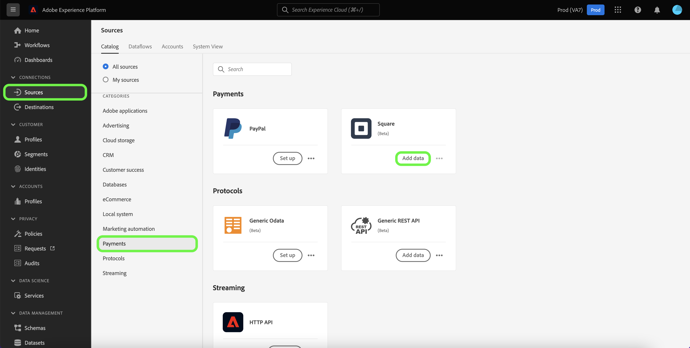

# Erstellen eines Quell-Connectors für [!DNL Square] in der Benutzeroberfläche

In diesem Tutorial werden Schritte zum Erstellen eines [!DNL Square] Quell-Connector über die Platform-Benutzeroberfläche.

## Erste Schritte

Dieses Tutorial setzt ein Grundverständnis der folgenden Komponenten von Adobe Experience Platform voraus:

* [[!DNL Experience Data Model (XDM)] System](../../../../../xdm/home.md): Das standardisierte Framework, mit dem [!DNL Experience Platform] Kundenerlebnisdaten organisiert.
   * [Grundlagen der Schemakomposition](../../../../../xdm/schema/composition.md): Machen Sie sich mit den grundlegenden Bausteinen von XDM-Schemas vertraut, einschließlich der wichtigsten Prinzipien und Best Practices bei der Schemaerstellung.
   * [Tutorial zum Schema-Editor](../../../../../xdm/tutorials/create-schema-ui.md): Erfahren Sie, wie Sie benutzerdefinierte Schemas mithilfe der Benutzeroberfläche des Schema-Editors erstellen können.
* [[!DNL Real-time Customer Profile]](../../../../../profile/home.md): Bietet ein einheitliches Echtzeit-Kundenprofil, das auf aggregierten Daten aus verschiedenen Quellen basiert.

### Sammeln erforderlicher Anmeldeinformationen

Um auf Ihre [!DNL Square] -Kontoplattform müssen Sie die folgenden Werte angeben:

| Anmeldedaten | Beschreibung |
| --- | --- |
| Host | Die URL der [!DNL Square] -Instanz. |
| Client-ID | Die mit Ihrer [!DNL Square] -Konto. |
| Client-Geheimnis | Das Client-Geheimnis, das mit Ihrem [!DNL Square] -Konto. |
| Zugriffstoken | Das Zugriffstoken wird verwendet, um Ihre [!DNL Square] Konto mit OAuth 2.0-Authentifizierung. Das Zugriffstoken kann abgerufen werden über [!DNL Square]. |
| Aktualisierungstoken | Das Aktualisierungstoken wird verwendet, um neue Zugriffstoken zu generieren, sobald Ihr aktuelles Zugriffstoken abläuft. Das Aktualisierungstoken kann abgerufen werden von [!DNL Square]. |

Weitere Informationen zu diesen Anmeldedaten und zum Abrufen dieser Anmeldedaten finden Sie im Abschnitt [[!DNL Square] Dokumentation zu OAuth](https://developer.squareup.com/docs/oauth-api/receive-and-manage-tokens).

Nachdem Sie die erforderlichen Anmeldeinformationen zusammen haben, können Sie die folgenden Schritte ausführen, um Ihr [!DNL Square]-Konto mit Platform zu verknüpfen.

## Verbinden Sie Ihr [!DNL Square]-Konto

Wählen Sie in der Platform-Benutzeroberfläche in der linken Navigationsleiste die Option **[!UICONTROL Quellen]**, um auf den Arbeitsbereich [!UICONTROL Quellen] zuzugreifen. Die [!UICONTROL Katalog] zeigt eine Vielzahl von Quellen an, mit denen Sie ein Konto erstellen können.

Sie können die gewünschte Kategorie aus dem Katalog auf der linken Bildschirmseite auswählen. Alternativ können Sie die gewünschte Quelle mithilfe der Suchoption finden.

Unter dem [!UICONTROL Zahlungen] category, select **[!UICONTROL Quadrat]** und wählen Sie **[!UICONTROL Daten hinzufügen]**.

Die **[!UICONTROL Mit Quadrat verbinden]** angezeigt. Auf dieser Seite können Sie entweder neue oder vorhandene Anmeldedaten verwenden.

### Vorhandenes Konto

Um ein vorhandenes Konto zu verwenden, wählen Sie das [!DNL Square]-Konto, mit dem Sie einen neuen Datenfluss erstellen möchten, und klicken Sie dann auf **[!UICONTROL Weiter]**, um fortzufahren.

### Neues Konto

Wenn Sie ein neues Konto erstellen, wählen Sie **[!UICONTROL Neues Konto]** und geben Sie dann einen Namen, eine optionale Beschreibung und die entsprechenden Werte für Ihre [!DNL Square] Anmeldedaten. Wenn Sie fertig sind, wählen Sie **[!UICONTROL Mit Quelle verbinden]** und warten Sie, bis die neue Verbindung hergestellt ist.

## Nächste Schritte

In diesem Tutorial haben Sie sich authentifiziert und eine Quellverbindung zwischen Ihrer [!DNL Square] -Konto und -Plattform. Sie können jetzt mit dem nächsten Tutorial fortfahren und [Erstellen eines Datenflusses, um Zahlungsdaten in Platform zu importieren](../../dataflow/payments.md).
