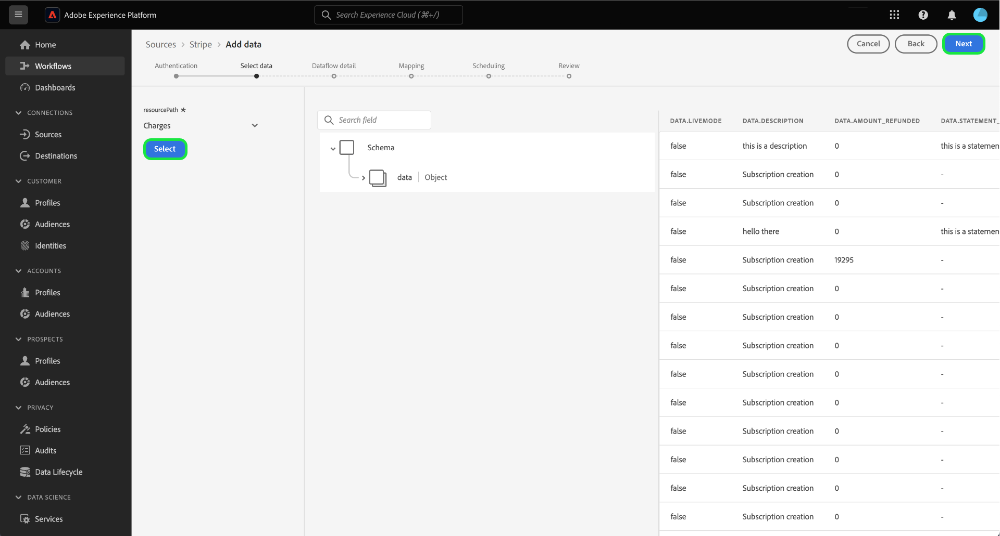

# Zahlungsdaten von Ihrer [!DNL Stripe] Konto für Experience Platform über die Benutzeroberfläche

>[!NOTE]
>
>Die [!DNL Stripe]-Quelle befindet sich in der Beta-Phase. Lesen Sie die [Bedingungen](../../../../home.md#terms-and-conditions) in der Quellenübersicht für weitere Informationen zur Verwendung von Beta-beschrifteten Quellen.

In diesem Tutorial erfahren Sie, wie Sie Zahlungsdaten aus Ihrem [!DNL Stripe] -Konto in der -Benutzeroberfläche zu Adobe Experience Platform hinzugefügt.

## Erste Schritte

Dieses Tutorial setzt ein Grundverständnis der folgenden Komponenten von Experience Platform voraus:

* [[!DNL Experience Data Model (XDM)] System](../../../../../xdm/home.md): Das standardisierte Framework, mit dem [!DNL Experience Platform] Kundenerlebnisdaten organisiert.
   * [Grundlagen der Schemakomposition](../../../../../xdm/schema/composition.md): Machen Sie sich mit den grundlegenden Bausteinen von XDM-Schemata vertraut, einschließlich der wichtigsten Prinzipien und Best Practices bei der Schemaerstellung.
   * [Tutorial zum Schema-Editor](../../../../../xdm/tutorials/create-schema-ui.md): Erfahren Sie, wie Sie benutzerdefinierte Schemata mithilfe der Benutzeroberfläche des Schema-Editors erstellen können.
* [[!DNL Real-Time Customer Profile]](../../../../../profile/home.md): Bietet ein einheitliches Echtzeit-Kundenprofil, das auf aggregierten Daten aus verschiedenen Quellen basiert.

### Authentifizierung

Lesen Sie die [[!DNL Stripe] Übersicht](../../../../connectors/payments/stripe.md) für Informationen zum Abrufen Ihrer Authentifizierungsberechtigungen.

## Verbinden Ihres [!DNL Stripe]-Kontos {#connect}

Wählen Sie in der Platform-Benutzeroberfläche in der linken Navigationsleiste die Option **[!UICONTROL Quellen]**, um auf den Arbeitsbereich [!UICONTROL Quellen] zuzugreifen. Sie können die gewünschte Kategorie aus dem Katalog auf der linken Bildschirmseite auswählen. Alternativ können Sie die gewünschte Quelle mithilfe der Suchoption finden.

Unter dem *Zahlungen* category, select **[!DNL Stripe]** und wählen Sie **[!UICONTROL Einrichten]**.

>[!TIP]
>
>Quellen im Quellkatalog zeigen die **[!UICONTROL Einrichten]** -Option, wenn eine bestimmte Quelle noch kein authentifiziertes Konto hat. Sobald ein authentifiziertes Konto existiert, wird diese Option in **[!UICONTROL Daten hinzufügen]**.

Die **[!UICONTROL Stripe-Konto verbinden]** angezeigt. Auf dieser Seite können Sie entweder neue oder vorhandene Anmeldedaten verwenden.

>[!BEGINTABS]

>[!TAB Neues Konto erstellen]

Um ein neues Konto zu erstellen, wählen Sie **[!UICONTROL Neues Konto]** und geben Sie einen Namen, eine optionale Beschreibung und Ihre Anmeldeinformationen ein.

Wenn Sie fertig sind, wählen Sie **[!UICONTROL Mit Quelle verbinden]** und warten Sie, bis die neue Verbindung hergestellt ist.

| Anmeldedaten | Beschreibung |
| --- | --- |
| Zugriffstoken | Ihre [!DNL Stripe] Zugriffstoken. Informationen zum Abrufen Ihres Zugriffstokens finden Sie in der [[!DNL Stripe] Authentifizierungshandbuch](../../../../connectors/payments/stripe.md). |

>[!TAB Vorhandenes Konto verwenden]

Um ein vorhandenes Konto zu verwenden, wählen Sie **[!UICONTROL Vorhandenes Konto]** und wählen Sie dann das Konto aus, das Sie verwenden möchten, aus dem vorhandenen Kontokatalog.

Klicken Sie auf **[!UICONTROL Weiter]**, um fortzufahren.

>[!ENDTABS]

## Daten auswählen {#select-data}

Nachdem Sie nun Zugriff auf Ihr Konto haben, müssen Sie den entsprechenden Pfad zum [!DNL Stripe] -Daten, die Sie erfassen möchten. Auswählen **[!UICONTROL Ressourcenpfad]** und wählen Sie dann den Endpunkt aus, aus dem Sie Daten erfassen möchten. Die verfügbaren [!DNL Stripe] Endpunkte sind:

* Gebühren
* Abonnements
* Erstattungen
* Bilanztransaktionen
* Kunden
* Preise

Sobald der Endpunkt ausgewählt ist, wird die Benutzeroberfläche in einen Vorschaubildschirm aktualisiert und zeigt die Datenstruktur der [!DNL Stripe] -Endpunkt, den Sie ausgewählt haben. Klicken Sie auf **[!UICONTROL Weiter]**, um fortzufahren.

## Bereitstellen von Datensatz- und Datenflussdetails {#provide-dataset-and-dataflow-details}

Als Nächstes müssen Sie Informationen zu Ihrem Datensatz und Ihrem Datenfluss angeben.

### Datensatzdetails {#dataset-details}

Ein Datensatz ist ein Konstrukt zur Datenspeicherung und -verwaltung, in dem Daten (in der Regel) in einer Tabelle erfasst werden, die ein Schema (Spalten) und Felder (Zeilen) beinhaltet. Daten, die erfolgreich in Experience Platform aufgenommen wurden, werden im Data Lake als Datensätze gespeichert. In diesem Schritt können Sie einen neuen Datensatz erstellen oder einen vorhandenen Datensatz verwenden.

>[!BEGINTABS]

>[!TAB Verwenden eines neuen Datensatzes]

Um einen neuen Datensatz zu verwenden, wählen Sie **[!UICONTROL Neuer Datensatz]** und geben Sie dann einen Namen und eine optionale Beschreibung für Ihren Datensatz an. Sie müssen auch ein Experience-Datenmodell (XDM)-Schema auswählen, dem Ihr Datensatz entspricht.

| Neue Datensatzdetails | Beschreibung |
| --- | --- |
| Name des Ausgabedatensatzes | Der Name Ihres neuen Datensatzes. |
| Beschreibung | (Optional) Eine kurze Erläuterung des neuen Datensatzes. |
| Schema | Eine Dropdown-Liste mit Schemas, die in Ihrer Organisation vorhanden sind. Sie können auch ein eigenes Schema vor dem Quellkonfigurationsprozess erstellen. Weitere Informationen finden Sie im Handbuch unter [Erstellen eines XDM-Schemas in der Benutzeroberfläche](../../../../../xdm/tutorials/create-schema-ui.md). |

>[!TAB Verwenden eines vorhandenen Datensatzes]

Wenn Sie bereits über einen vorhandenen Datensatz verfügen, wählen Sie **[!UICONTROL Vorhandener Datensatz]** und verwenden Sie dann **[!UICONTROL Erweiterte Suche]** -Option, um ein Fenster aller Datensätze in Ihrer Organisation anzuzeigen, einschließlich der entsprechenden Details, z. B. ob sie für die Erfassung in Echtzeit-Kundenprofil aktiviert sind oder nicht.

>[!ENDTABS]

++ + Wählen Sie Schritte aus, um die Profilaufnahme, Fehlerdiagnose und partielle Erfassung zu aktivieren.

Wenn Ihr Datensatz für das Echtzeit-Kundenprofil aktiviert ist, können Sie während dieses Schritts **[!UICONTROL Profildatensatz]** , um Ihre Daten für die Profilaufnahme zu aktivieren. Sie können diesen Schritt auch verwenden, um **[!UICONTROL Fehlerdiagnose]** und **[!UICONTROL Partielle Erfassung]**.

* **[!UICONTROL Fehlerdiagnose]**: Auswählen **[!UICONTROL Fehlerdiagnose]** , um die Quelle anzuweisen, eine Fehlerdiagnose zu erstellen, die Sie später bei der Überwachung Ihrer Datensatzaktivität und des Datenflussstatus referenzieren können.
* **[!UICONTROL Partielle Erfassung]**: Partielle Batch-Erfassung ist die Möglichkeit, Daten mit Fehlern bis zu einem bestimmten konfigurierbaren Schwellenwert zu erfassen. Mit dieser Funktion können Sie alle Ihre präzisen Daten erfolgreich in Experience Platform erfassen, während all Ihre falschen Daten separat mit Informationen darüber gestapelt werden, warum sie ungültig sind.

+++

### Datenflussdetails {#dataflow-details}

Nachdem Ihr Datensatz konfiguriert wurde, müssen Sie Details zu Ihrem Datenfluss angeben, einschließlich eines Namens, einer optionalen Beschreibung und Warnhinweiskonfigurationen.

| Datenflusskonfigurationen | Beschreibung |
| --- | --- |
| Dataflow-Name | Der Name des Datenflusses.  Standardmäßig wird dabei der Name der Datei verwendet, die importiert wird. |
| Beschreibung | (Optional) Eine kurze Beschreibung Ihres Datenflusses. |
| Warnhinweise | Experience Platform kann ereignisbasierte Warnhinweise erstellen, die Benutzer abonnieren können. Diese Optionen erfordern alle einen laufenden Datenfluss, um sie Trigger.  Weitere Informationen finden Sie im Abschnitt [Warnungen - Übersicht](../../alerts.md) <ul><li>**Start des Datenflusses für Quellen**: Wählen Sie diesen Warnhinweis aus, um eine Benachrichtigung zu erhalten, wenn der Start des Datenflusses beginnt.</li><li>**Quellen-Datenfluss erfolgreich ausgeführt**: Wählen Sie diese Warnung aus, um eine Benachrichtigung zu erhalten, wenn Ihr Datenfluss ohne Fehler endet.</li><li>**Fehler beim Ausführen des Datenflusses für Quellen**: Wählen Sie diesen Warnhinweis aus, um eine Benachrichtigung zu erhalten, wenn Ihr Datenfluss mit Fehlern endet.</li></ul> |

Wählen Sie zum Abschluss **[!UICONTROL Nächste]** um fortzufahren.

## Felder einem XDM-Schema zuordnen {#mapping}

Der Schritt **[!UICONTROL Zuordnung]** wird angezeigt. Verwenden Sie die Zuordnungsschnittstelle, um Ihre Quelldaten den entsprechenden Schemafeldern zuzuordnen, bevor Sie diese Daten in Experience Platform aufnehmen. Eine ausführliche Anleitung zur Verwendung der Zuordnungsschnittstelle finden Sie im [Handbuch zur Datenvorbereitung-Benutzeroberfläche](../../../../../data-prep/ui/mapping.md) für weitere Informationen.

## Konfigurieren des Aufnahmezeitplans {#scheduling}

Verwenden Sie anschließend die Planungsschnittstelle, um einen Erfassungszeitplan für Ihren Datenfluss zu erstellen.

Wählen Sie das Dropdown-Menü &quot;Häufigkeit&quot;aus, um die Erfassungsfrequenz Ihres Datenflusses zu konfigurieren.

Sie können auch das Kalendersymbol auswählen und einen Popup-Kalender verwenden, um die Startzeit der Aufnahme zu konfigurieren.

| Planungskonfiguration | Beschreibung |
| --- | --- |
| Häufigkeit | Konfigurieren Sie die Häufigkeit, mit der der Datenfluss ausgeführt werden soll. Sie können die Häufigkeit wie folgt einstellen: <ul><li>**Einmal**: Setzen Sie Ihre Häufigkeit auf `once` , um eine einmalige Erfassung zu erstellen. Konfigurationen für Intervall und Aufstockung sind beim Erstellen eines einmaligen Erfassungsdataflods nicht verfügbar. Standardmäßig ist die Planung auf einmal eingestellt.</li><li>**Minute**: Setzen Sie Ihre Häufigkeit auf `minute` , um Ihren Datenfluss so zu planen, dass Daten pro Minute erfasst werden.</li><li>**Stunde**:Setzen Sie Ihre Häufigkeit auf `hour` , um den Datenfluss so zu planen, dass Daten pro Stunde erfasst werden.</li><li>**Tag**: Setzen Sie Ihre Häufigkeit auf `day` , um Ihren Datenfluss so zu planen, dass Daten täglich erfasst werden.</li><li>**Woche**: Setzen Sie Ihre Häufigkeit auf `week` , um Ihren Datenfluss so zu planen, dass Daten pro Woche erfasst werden.</li></ul> |
| Intervall | Nachdem Sie eine Frequenz ausgewählt haben, können Sie die Intervalleinstellung konfigurieren, um den Zeitrahmen zwischen jeder Aufnahme festzulegen. Wenn Sie beispielsweise Ihre Häufigkeit auf &quot;Tag&quot;festlegen und das Intervall auf 15 konfigurieren, wird Ihr Datenfluss alle 15 Tage ausgeführt. **Hinweis**: Sie können das Intervall nicht auf null festlegen. |
| Startzeit | Der Zeitstempel für die projizierte Ausführung, dargestellt in UTC-Zeitzone. |
| Aufstockung | Die Aufstockung bestimmt, welche Daten ursprünglich erfasst werden. Wenn die Aufstockung aktiviert ist, werden alle aktuellen Dateien im angegebenen Pfad während der ersten geplanten Erfassung erfasst. Wenn die Aufstockung deaktiviert ist, werden nur die Dateien erfasst, die zwischen der ersten Ausführung der Aufnahme und der Startzeit geladen werden. Dateien, die vor der Startzeit geladen wurden, werden nicht erfasst. |

Nachdem Sie den Aufnahmezeitplan Ihres Datenflusses konfiguriert haben, wählen Sie **[!UICONTROL Nächste]**.

## Überprüfen des Datenflusses

Der letzte Schritt im Erstellungsprozess des Datenflusses besteht darin, Ihren Datenfluss zu überprüfen, bevor er ausgeführt wird. Verwenden Sie die **[!UICONTROL Überprüfen]** Schritt , um die Details Ihres neuen Datenflusses zu überprüfen, bevor er ausgeführt wird. Details werden in die folgenden Kategorien eingeteilt:

* **Verbindung**: Zeigt den Quelltyp, den relevanten Pfad der ausgewählten Quelldatei und die Anzahl der Spalten in dieser Quelldatei an.
* **Datensatz- und Zuordnungsfelder zuweisen**: Zeigt an, in welchen Datensatz die Quelldaten aufgenommen werden, einschließlich des Schemas, dem der Datensatz entspricht.
* **Planung**: Zeigt den aktiven Zeitraum, die Häufigkeit und das Intervall des Aufnahmezeitplans an.

Nachdem Sie Ihren Datenfluss überprüft haben, klicken Sie auf **[!UICONTROL Beenden]** und gewähren Sie etwas Zeit für die Erstellung des Datenflusses.

## Nächste Schritte

In diesem Tutorial haben Sie erfolgreich einen Datenfluss erstellt, um Zahlungsdaten von Ihrem [!DNL Stripe] -Quelle zu Experience Platform. Weitere Ressourcen finden Sie in der unten beschriebenen Dokumentation.

### Überwachen Ihres Datenflusses

Nachdem Ihr Datenfluss erstellt wurde, können Sie die erfassten Daten überwachen, um Informationen zu Erfassungsraten, Erfolg und Fehlern anzuzeigen. Weitere Informationen zum Überwachen des Datenflusses finden Sie im Tutorial zu [Überwachen von Konten und Datenflüssen in der Benutzeroberfläche](../../../../../dataflows/ui/monitor-sources.md).

### Aktualisieren des Datenflusses

Um Konfigurationen für die Planung, Zuordnung und allgemeine Informationen Ihrer Datenflüsse zu aktualisieren, besuchen Sie das Tutorial zu [Aktualisieren von Datenflüssen für Quellen in der Benutzeroberfläche](../../update-dataflows.md).

### Löschen des Datenflusses

Datenflüsse, die nicht mehr erforderlich sind oder nicht korrekt erstellt wurden, können Sie löschen, indem Sie dazu die Funktion **[!UICONTROL Löschen]** im Arbeitsbereich **[!UICONTROL Datenflüsse]** verwenden. Weitere Informationen zum Löschen von Datenflüssen finden Sie im Tutorial zu [Löschen von Datenflüssen in der Benutzeroberfläche](../../delete.md).
