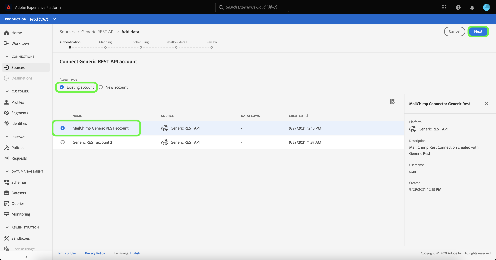

# Erstellen eines Quell-Connectors für [!DNL Generic REST API] in der Benutzeroberfläche

>[!NOTE]
>
> Die [!DNL Generic REST API]-Quelle befindet sich in der Beta-Phase. Siehe [Quellen - Übersicht](../../../../home.md#terms-and-conditions) Weitere Informationen zur Verwendung von Beta-gekennzeichneten Connectoren.

In diesem Tutorial werden Schritte zum Erstellen eines [!DNL Generic REST API] Quell-Connector über die Adobe Experience Platform-Benutzeroberfläche.

## Erste Schritte

Dieses Tutorial setzt ein Grundverständnis der folgenden Komponenten von Platform voraus:

* [Quellen](../../../../home.md): Experience Platform ermöglicht die Aufnahme von Daten aus verschiedenen Quellen und bietet Ihnen die Möglichkeit, die eingehenden Daten mithilfe von Platform-Services zu strukturieren, zu kennzeichnen und anzureichern.
* [Sandboxes](../../../../../sandboxes/home.md): Experience Platform bietet virtuelle Sandboxes, die eine einzelne Platform-Instanz in separate virtuelle Umgebungen unterteilen, damit Sie Programme für digitale Erlebnisse entwickeln und weiterentwickeln können.

### Sammeln erforderlicher Anmeldeinformationen

Um auf Ihre [!DNL Generic REST API] -Konto auf Platform verwenden, müssen Sie gültige Anmeldeinformationen für den Authentifizierungstyp Ihrer Wahl angeben. Die generische REST-API unterstützt sowohl OAuth 2-Aktualisierungscode als auch einfache Authentifizierung. In den folgenden Tabellen finden Sie Informationen zu den Anmeldeinformationen für die beiden unterstützten Authentifizierungstypen.

#### OAuth 2-Aktualisierungscode

| Anmeldedaten | Beschreibung |
| --- | --- |
| Host | Die Host-URL der Quelle, an die Sie Ihre Anfrage richten. Dieser Wert ist erforderlich und kann nicht mit der Außerkraftsetzung von Anforderungsparametern umgangen werden. |
| URL für den Autorisierungstest | (Optional) Die URL für den Autorisierungstest wird verwendet, um Anmeldeinformationen beim Erstellen einer Basisverbindung zu überprüfen. Wenn die Anmeldeinformationen nicht angegeben sind, werden sie stattdessen während des Erstellungsschritts der Quellverbindung automatisch überprüft. |
| Client-ID | (Optional) Die mit Ihrem Benutzerkonto verknüpfte Client-ID. |
| Client-Geheimnis | (Optional) Das mit Ihrem Benutzerkonto verknüpfte Client-Geheimnis. |
| Zugriffstoken | Die primäre Authentifizierungsberechtigung für den Zugriff auf Ihre Anwendung. Das Zugriffstoken stellt die Autorisierung Ihrer Anwendung dar, um auf bestimmte Aspekte der Daten eines Benutzers zuzugreifen. Dieser Wert ist erforderlich und kann nicht mit der Außerkraftsetzung von Anforderungsparametern umgangen werden. |
| Aktualisierungstoken | (Optional) Ein Token, mit dem ein neues Zugriffstoken generiert wird, wenn das Zugriffstoken abgelaufen ist. |
| Zugriffstoken-URL | (Optional) Der URL-Endpunkt, der zum Abrufen Ihres Zugriffstokens verwendet wird. |
| Außerkraftsetzen von Anforderungsparametern | (Optional) Eine Eigenschaft, mit der Sie angeben können, welche Berechtigungsparameter überschrieben werden sollen. |

#### Einfache Authentifizierung

| Anmeldedaten | Beschreibung |
| --- | --- |
| Host | Die Host-URL der Quelle, an die Sie Ihre Anfrage richten. |
| Benutzername | Der Benutzername, der Ihrem Benutzerkonto entspricht. |
| Kennwort | Das Kennwort, das Ihrem Benutzerkonto entspricht. |

## Generisches REST-API-Konto verbinden

Wählen Sie in der Platform-Benutzeroberfläche in der linken Navigationsleiste die Option **[!UICONTROL Quellen]**, um auf den Arbeitsbereich [!UICONTROL Quellen] zuzugreifen. Der Bildschirm [!UICONTROL Katalog] zeigt eine Vielzahl von Quellen an, mit denen Sie ein Konto erstellen können.

Sie können die gewünschte Kategorie aus dem Katalog auf der linken Bildschirmseite auswählen. Alternativ können Sie die gewünschte Quelle mithilfe der Suchleiste finden.

Unter dem [!UICONTROL Protokolle] category, select **[!UICONTROL Generische REST-API]** und wählen Sie **[!UICONTROL Daten hinzufügen]**.

Die **[!UICONTROL Verbindung zur generischen REST-API herstellen]** angezeigt. Auf dieser Seite können Sie entweder neue oder vorhandene Anmeldedaten verwenden.

### Vorhandenes Konto

Um ein vorhandenes Konto zu verbinden, wählen Sie das generische REST-API-Konto aus, mit dem Sie eine Verbindung herstellen möchten, und klicken Sie dann auf **[!UICONTROL Nächste]** um fortzufahren.

### Neues Konto

Wenn Sie ein neues Konto erstellen, wählen Sie **[!UICONTROL Neues Konto]** und geben Sie dann einen Namen und eine Optionsbeschreibung für Ihre neue [!DNL Generic REST API] -Konto.

#### Authentifizieren mit OAuth 2 Code aktualisieren

[!DNL Generic REST API] unterstützt sowohl OAuth 2-Aktualisierungscode als auch einfache Authentifizierung. Um sich mit einer OAuth2-Authentifizierung zu authentifizieren, wählen Sie **[!UICONTROL OAuth2RefreshCode]**, geben Sie Ihre OAuth 2-Anmeldeinformationen ein und wählen Sie dann **[!UICONTROL Verbindung mit Quelle herstellen]**.

#### Authentifizieren mit Standardauthentifizierung

Um die einfache Authentifizierung zu verwenden, wählen Sie **[!UICONTROL Grundlegende Authentifizierung]**, geben Sie Ihren Host, Benutzernamen und Ihr Kennwort ein und wählen Sie **[!UICONTROL Verbindung mit Quelle herstellen]**.

## Nächste Schritte

In diesem Tutorial haben Sie eine Verbindung zu Ihrem generischen REST-API-Konto hergestellt. Sie können jetzt mit dem nächsten Tutorial fortfahren und einen [Datenfluss konfigurieren, um Daten in Platform zu importieren](../../dataflow/protocols.md).
