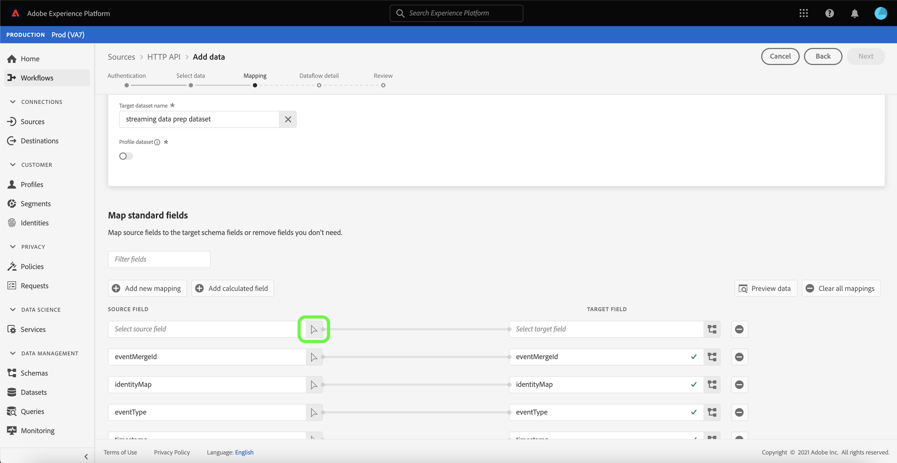

# Erstellen Sie eine [!DNL HTTP API] Streaming-Verbindung über die Benutzeroberfläche

In diesem Tutorial werden Schritte zum Erstellen einer Streaming-Quell-Verbindung mit dem [!UICONTROL Quellen] Arbeitsbereich.

## Erste Schritte

Dieses Tutorial setzt ein Grundverständnis der folgenden Komponenten von Adobe Experience Platform voraus:

- [[!DNL Experience Data Model (XDM)] System](../../../../../xdm/home.md): Der standardisierte Rahmen, durch den [!DNL Experience Platform] organisiert Kundenerlebnisdaten.
   - [Grundlagen der Schemakomposition](../../../../../xdm/schema/composition.md): Machen Sie sich mit den Grundbausteinen von XDM-Schemas sowie den zentralen Konzepten und Best Practices rund um die Erstellung von Schemas vertraut.
   - [Tutorial zum Schema Editor](../../../../../xdm/tutorials/create-schema-ui.md): Erfahren Sie, wie Sie benutzerdefinierte Schemas mithilfe der Benutzeroberfläche des Schema-Editors erstellen.
- [[!DNL Real-time Customer Profile]](../../../../../profile/home.md): Bietet ein einheitliches Echtzeit-Kundenprofil, das auf aggregierten Daten aus verschiedenen Quellen basiert.

## Aufbauen einer Streaming-Verbindung

Wählen Sie in der Platform-Benutzeroberfläche die Option **[!UICONTROL Quellen]** über die linke Navigationsleiste auf [!UICONTROL Quellen] Arbeitsbereich. Die [!UICONTROL Katalog] zeigt eine Vielzahl von Quellen an, mit denen Sie ein Konto erstellen können.

Sie können die gewünschte Kategorie aus dem Katalog auf der linken Bildschirmseite auswählen. Alternativ können Sie die gewünschte Quelle mithilfe der Suchoption finden.

Unter dem **[!UICONTROL Streaming]** category, select **[!UICONTROL HTTP-API]** und wählen Sie **[!UICONTROL Daten hinzufügen]**.

Die **[!UICONTROL HTTP-API-Konto verbinden]** angezeigt. Auf dieser Seite können Sie entweder neue oder vorhandene Anmeldedaten verwenden.

### Vorhandenes Konto

Um ein vorhandenes Konto zu verwenden, wählen Sie das HTTP-API-Konto aus, mit dem Sie einen neuen Datenfluss erstellen möchten, und klicken Sie dann auf **[!UICONTROL Nächste]** um fortzufahren.

### Neues Konto

Wenn Sie ein neues Konto erstellen, wählen Sie **[!UICONTROL Neues Konto]**. Geben Sie im angezeigten Formular einen Kontonamen und eine optionale Beschreibung ein. Sie erhalten außerdem die Möglichkeit, die folgenden Konfigurationseigenschaften anzugeben:

- **[!UICONTROL Authentifizierung]:** Diese Eigenschaft bestimmt, ob für die Streaming-Verbindung eine Authentifizierung erforderlich ist. Authentifizierung stellt sicher, dass Daten aus vertrauenswürdigen Quellen erfasst werden. Wenn Sie es mit persönlich identifizierbaren Informationen (PII) zu tun haben, sollte diese Eigenschaft aktiviert sein. Standardmäßig ist diese Eigenschaft deaktiviert.
- **[!UICONTROL XDM-kompatibel]:** Diese Eigenschaft gibt an, ob diese Streaming-Verbindung Ereignisse sendet, die mit XDM-Schemas kompatibel sind. Standardmäßig ist diese Eigenschaft deaktiviert.

Wenn Sie fertig sind, wählen Sie **[!UICONTROL Verbindung mit Quelle herstellen]** und wählen Sie **[!UICONTROL Nächste]** um fortzufahren.

## Daten auswählen

Nach der Erstellung der HTTP-API-Verbindung muss die **[!UICONTROL Daten auswählen]** angezeigt, und erhalten Sie eine Oberfläche zum Hochladen und Anzeigen einer Vorschau Ihrer Daten.

Auswählen **[!UICONTROL Dateien hochladen]** , um Ihre Daten hochzuladen. Alternativ können Sie Ihre Daten per Drag-and-Drop in die [!UICONTROL Dateien per Drag &amp; Drop verschieben] -Abschnitt der -Oberfläche.

Nach dem Hochladen Ihrer Daten können Sie die rechte Seite der Benutzeroberfläche verwenden, um eine Vorschau Ihrer Dateihierarchie anzuzeigen. Auswählen **[!UICONTROL Nächste]** um fortzufahren.

## Zuordnen von Datenfeldern zu einem XDM-Schema

Die [!UICONTROL Zuordnung] -Schritt angezeigt und stellt eine Schnittstelle zum Zuordnen der Quelldaten zu einem Platform-Datensatz bereit.

Parquet-Dateien müssen XDM-konform sein und erfordern keine manuelle Konfiguration der Zuordnung. Bei CSV-Dateien ist es erforderlich, die Zuordnung explizit zu konfigurieren. Sie können jedoch festlegen, welche Quelldatenfelder zugeordnet werden sollen. JSON-Dateien, die als XDM-Beschwerde gekennzeichnet sind, erfordern keine manuelle Konfiguration. Wenn es jedoch nicht als XDM-kompatibel markiert ist, müssen Sie die Zuordnung explizit konfigurieren.

Wählen Sie einen Datensatz für eingehende Daten aus, die in aufgenommen werden sollen. Sie können entweder einen vorhandenen Datensatz verwenden oder einen neuen erstellen.

### Neuen Datensatz erstellen

Um einen neuen Datensatz zu erstellen, wählen Sie **[!UICONTROL Neuer Datensatz]**. Geben Sie im angezeigten Formular den Namen, eine optionale Beschreibung sowie das Zielschema für den Datensatz an. Wenn Sie eine [!DNL Profile]-aktiviertes Schema können Sie festlegen, ob der Datensatz auch [!DNL Profile]-enabled.

### Vorhandenen Datensatz verwenden

Um einen vorhandenen Datensatz zu verwenden, wählen Sie **[!UICONTROL Vorhandener Datensatz]**. Wählen Sie im angezeigten Formular den Datensatz aus, den Sie verwenden möchten. Nachdem Sie einen Datensatz ausgewählt haben, können Sie auswählen, ob der Datensatz [!DNL Profile]-enabled.

### Standardfelder zuordnen

Je nach Bedarf können Sie Felder direkt zuordnen oder mithilfe von Datenvorbereitungsfunktionen Quelldaten transformieren, um berechnete oder berechnete Werte abzuleiten. Umfassende Schritte zur Verwendung der Mapper-Oberfläche und der berechneten Felder finden Sie im Abschnitt [Handbuch zur Datenvorbereitung-Benutzeroberfläche](../../../../../data-prep/ui/mapping.md).

Um ein neues Quellfeld hinzuzufügen, wählen Sie **[!UICONTROL Neues Mapping hinzufügen]**.

Eine neue Quell- und Zielfeldpaarung wird angezeigt. Um ein neues Quellfeld hinzuzufügen, wählen Sie das Pfeilsymbol neben dem [!UICONTROL Quellfeld auswählen] Eingabefelder.

Die [!UICONTROL Attribute auswählen] können Sie Ihre Dateihierarchie untersuchen und ein bestimmtes Quellfeld auswählen, das einem Ziel-XDM-Feld zugeordnet werden soll. Nachdem Sie das Quellfeld ausgewählt haben, das Sie zuordnen möchten, wählen Sie **[!UICONTROL Auswählen]** um fortzufahren.

Wenn ein Quellfeld ausgewählt ist, können Sie jetzt das entsprechende Ziel-XDM-Feld identifizieren, das zugeordnet werden soll. Wählen Sie das Schemensymbol unter dem Abschnitt Zielfeld aus.

Die [!UICONTROL Zuordnen des Quellfelds zum Zielfeld] -Fenster angezeigt, in dem Sie eine Benutzeroberfläche zum Erkunden des Schemas Ihres Zieldatensatzes erhalten. Wählen Sie das Zielfeld aus, das Ihrem Quellfeld entspricht, und wählen Sie dann **[!UICONTROL Auswählen]** um fortzufahren.

Sobald Ihre Quellfelder allen entsprechenden Ziel-XDM-Feldern zugeordnet sind, wählen Sie **[!UICONTROL Nächste]**

## Datenflussdetails

Die **[!UICONTROL Datenflussdetails]** angezeigt. Auf dieser Seite können Sie Details zum erstellten Datenfluss angeben, indem Sie einen Namen und eine optionale Beschreibung angeben.

Nachdem Sie Details für den Datenfluss angegeben haben, wählen Sie **[!UICONTROL Nächste]**.

## Überprüfung

Die **[!UICONTROL Überprüfen]** angezeigt, sodass Sie die Details Ihres Datenflusses vor der Erstellung überprüfen können. Details sind in den folgenden Kategorien gruppiert:

- **[!UICONTROL Verbindung]**: Zeigt den Kontonamen, die Quellplattform und den Quellnamen an.
- **[!UICONTROL Datensatz- und Zuordnungsfelder zuweisen]**: Zeigt den Zieldatensatz und das Schema an, dem der Datensatz entspricht.

Nachdem Sie bestätigt haben, dass die Details korrekt sind, wählen Sie **[!UICONTROL Beenden]**.

## Abrufen der Streaming-Endpunkt-URL

Nach der Erstellung der Verbindung wird die Detailseite der Quellen angezeigt. Auf dieser Seite finden Sie Details zu Ihrer neu erstellten Verbindung, einschließlich zuvor ausgeführter Datenflüsse, ID und Streaming-Endpunkt-URL.

## Nächste Schritte

In diesem Tutorial haben Sie eine Streaming-HTTP-Verbindung erstellt, über die Sie mithilfe des Streaming-Endpunkts auf eine Vielzahl von [!DNL Data Ingestion] APIs. Anweisungen zum Erstellen einer Streaming-Verbindung in der API finden Sie in der [Anleitung zum Erstellen einer Streaming-Verbindung](../../../api/create/streaming/http.md).

Informationen zum Streamen von Daten an Platform finden Sie im Tutorial zu [Streaming von Zeitreihendaten](../../../../../ingestion/tutorials/streaming-time-series-data.md) oder das Tutorial zu [Streaming von Datensatzdaten](../../../../../ingestion/tutorials/streaming-record-data.md).
