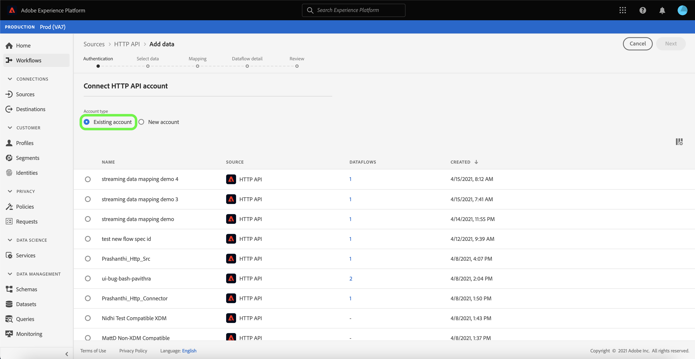

# Erstellen einer [!DNL HTTP API]-Streaming-Verbindung über die Benutzeroberfläche

In diesem Tutorial werden Schritte zum Erstellen einer Streaming-Quellverbindung mithilfe des Arbeitsbereichs [!UICONTROL Quellen] beschrieben.

## Erste Schritte

Dieses Tutorial setzt ein Grundverständnis der folgenden Komponenten von Adobe Experience Platform voraus:

- [[!DNL Experience Data Model (XDM)] System](../../../../../xdm/home.md): Das standardisierte Framework, mit dem [!DNL Experience Platform] Kundenerlebnisdaten organisiert.
   - [Grundlagen der Schemakomposition](../../../../../xdm/schema/composition.md): Machen Sie sich mit den grundlegenden Bausteinen von XDM-Schemata vertraut, einschließlich der wichtigsten Prinzipien und Best Practices bei der Schemaerstellung.
   - [Tutorial zum Schema-Editor](../../../../../xdm/tutorials/create-schema-ui.md): Erfahren Sie, wie Sie benutzerdefinierte Schemata mithilfe der Benutzeroberfläche des Schema-Editors erstellen können.
- [[!DNL Real-Time Customer Profile]](../../../../../profile/home.md): Bietet ein einheitliches Echtzeit-Kundenprofil, das auf aggregierten Daten aus verschiedenen Quellen basiert.

## Aufbauen einer Streaming-Verbindung

Wählen Sie in der Platform-Benutzeroberfläche in der linken Navigationsleiste die Option **[!UICONTROL Quellen]**, um auf den Arbeitsbereich [!UICONTROL Quellen] zuzugreifen. Der Bildschirm [!UICONTROL Katalog] zeigt eine Vielzahl von Quellen an, mit denen Sie ein Konto erstellen können.

Sie können die gewünschte Kategorie aus dem Katalog auf der linken Bildschirmseite auswählen. Alternativ können Sie die gewünschte Quelle mithilfe der Suchoption finden.

Wählen Sie unter der Kategorie **[!UICONTROL Streaming]** die Option **[!UICONTROL HTTP-API]** und dann **[!UICONTROL Daten hinzufügen]** aus.

Die Seite **[!UICONTROL HTTP-API-Konto verbinden]** wird angezeigt. Auf dieser Seite können Sie entweder neue oder vorhandene Anmeldedaten verwenden.

### Vorhandenes Konto

Um ein vorhandenes Konto zu verwenden, wählen Sie das HTTP-API-Konto, mit dem Sie einen neuen Datenfluss erstellen möchten, und klicken Sie dann auf **[!UICONTROL Weiter]** , um fortzufahren.

### Neues Konto

Wenn Sie ein neues Konto erstellen, wählen Sie **[!UICONTROL Neues Konto]**. Geben Sie im angezeigten Formular einen Kontonamen und eine optionale Beschreibung ein. Sie erhalten außerdem die Möglichkeit, die folgenden Konfigurationseigenschaften anzugeben:

- **[!UICONTROL Authentifizierung]:** Diese Eigenschaft bestimmt, ob für die Streaming-Verbindung eine Authentifizierung erforderlich ist. Authentifizierung stellt sicher, dass Daten aus vertrauenswürdigen Quellen erfasst werden. Wenn Sie es mit persönlich identifizierbaren Informationen (PII) zu tun haben, sollte diese Eigenschaft aktiviert sein. Standardmäßig ist diese Eigenschaft deaktiviert.
- **[!UICONTROL XDM-kompatibel]:** Diese Eigenschaft gibt an, ob diese Streaming-Verbindung Ereignisse sendet, die mit XDM-Schemas kompatibel sind. Standardmäßig ist diese Eigenschaft deaktiviert.

Wählen Sie abschließend **[!UICONTROL Mit Quelle verbinden]** und dann **[!UICONTROL Weiter]** aus, um fortzufahren.

## Daten auswählen

Nach Erstellung der HTTP-API-Verbindung wird der Schritt **[!UICONTROL Daten auswählen]** angezeigt, der Ihnen eine Benutzeroberfläche zum Hochladen und Anzeigen einer Vorschau Ihrer Daten bereitstellt.

Wählen Sie **[!UICONTROL Dateien hochladen]** aus, um Ihre Daten hochzuladen. Alternativ können Sie Ihre Daten per Drag-and-Drop in den Abschnitt [!UICONTROL Dateien ziehen und ablegen] der Benutzeroberfläche ziehen.

Nach dem Hochladen Ihrer Daten können Sie die rechte Seite der Benutzeroberfläche verwenden, um eine Vorschau Ihrer Dateihierarchie anzuzeigen. Klicken Sie auf **[!UICONTROL Weiter]**, um fortzufahren.

## Zuordnen von Datenfeldern zu einem XDM-Schema

Der Schritt [!UICONTROL Zuordnung] wird angezeigt und bietet eine Schnittstelle zum Zuordnen der Quelldaten zu einem Platform-Datensatz.

Die Quelle [!DNL HTTP API] unterstützt die Erfassung von JSON-Dateien. JSON-Dateien erfordern keine manuelle Konfiguration, wenn sie als XDM-Beschwerde gekennzeichnet sind. Andernfalls müssen Sie die Zuordnung explizit konfigurieren.

Wählen Sie einen Datensatz aus, in den eingehende Daten aufgenommen werden sollen. Sie können entweder einen vorhandenen Datensatz verwenden oder einen neuen erstellen.

### Erstellen eines neuen Datensatzes

Um einen neuen Datensatz zu erstellen, wählen Sie **[!UICONTROL Neuer Datensatz]** aus. Geben Sie im angezeigten Formular den Namen, eine optionale Beschreibung sowie das Zielschema für den Datensatz an. Wenn Sie ein für [!DNL Profile] aktiviertes Schema auswählen, können Sie festlegen, ob der Datensatz auch für [!DNL Profile] aktiviert sein soll.

### Verwenden eines vorhandenen Datensatzes

Um einen vorhandenen Datensatz zu verwenden, wählen Sie **[!UICONTROL Vorhandenen Datensatz]** aus. Wählen Sie im angezeigten Formular den Datensatz aus, den Sie verwenden möchten. Nachdem Sie einen Datensatz ausgewählt haben, können Sie auswählen, ob der Datensatz [!DNL Profile]-fähig sein soll.

### Standardfelder zuordnen

Je nach Bedarf können Sie wahlweise Felder direkt zuordnen oder mithilfe von Datenvorbereitungsfunktionen Quelldaten transformieren, um berechnete oder anderweitig ermittelte Werte abzuleiten. Umfassende Schritte zur Verwendung der Zuordnungsoberfläche und der berechneten Felder finden Sie im Handbuch [Data Prep UI guide](../../../../../data-prep/ui/mapping.md).

Um ein neues Quellfeld hinzuzufügen, wählen Sie **[!UICONTROL Neue Zuordnung hinzufügen]**.

Eine neue Quell- und Zielfeldpaarung wird angezeigt. Um ein neues Quellfeld hinzuzufügen, wählen Sie das Pfeilsymbol neben der EingabebLeiste [!UICONTROL Quellfeld auswählen] aus.

Im Bedienfeld [!UICONTROL Attribute auswählen] können Sie Ihre Dateihierarchie untersuchen und ein bestimmtes Quellfeld auswählen, das einem Ziel-XDM-Feld zugeordnet werden soll. Nachdem Sie das Quellfeld ausgewählt haben, das Sie zuordnen möchten, wählen Sie **[!UICONTROL Auswählen]** aus, um fortzufahren.

Wenn ein Quellfeld ausgewählt ist, können Sie jetzt das entsprechende Ziel-XDM-Feld identifizieren, das zugeordnet werden soll. Wählen Sie das Schemensymbol unter dem Abschnitt Zielfeld aus.

Das Fenster [!UICONTROL Quellfeld dem Zielfeld zuordnen] wird angezeigt und bietet eine Benutzeroberfläche zum Erkunden des Schemas Ihres Zieldatensatzes. Wählen Sie das Zielfeld aus, das Ihrem Quellfeld entspricht, und wählen Sie dann **[!UICONTROL Auswählen]** aus, um fortzufahren.

Nachdem alle Quellfelder den entsprechenden XDM-Zielfeldern zugeordnet sind, wählen Sie **[!UICONTROL Weiter]** aus.

## Datenflussdetails

Der Schritt **[!UICONTROL Datenfluss-Detail]** wird angezeigt. Auf dieser Seite können Sie Details zum erstellten Datenfluss angeben, indem Sie einen Namen und eine optionale Beschreibung angeben.

Nachdem Sie Details für den Datenfluss angegeben haben, wählen Sie **[!UICONTROL Weiter]** aus.

## Überprüfung

Der Schritt **[!UICONTROL Überprüfen]** wird angezeigt, mit dem Sie die Details Ihres Datenflusses überprüfen können, bevor er erstellt wird. Details sind in den folgenden Kategorien gruppiert:

- **[!UICONTROL Verbindung]**: Zeigt den Kontonamen, die Quellplattform und den Quellnamen an.
- **[!UICONTROL Datensatz- und Zuordnungsfelder zuweisen]**: Zeigt den Zieldatensatz und das Schema an, dem der Datensatz entspricht.

Nachdem Sie bestätigt haben, dass die Details korrekt sind, wählen Sie **[!UICONTROL Beenden]** aus.

## Abrufen der Streaming-Endpunkt-URL

Nach der Erstellung der Verbindung wird die Detailseite der Quellen angezeigt. Auf dieser Seite finden Sie Details zu Ihrer neu erstellten Verbindung, einschließlich zuvor ausgeführter Datenflüsse, ID und Streaming-Endpunkt-URL.

## Nächste Schritte

In diesem Tutorial haben Sie eine Streaming-HTTP-Verbindung erstellt, über die Sie über den Streaming-Endpunkt auf verschiedene [!DNL Data Ingestion] -APIs zugreifen können. Anweisungen zum Erstellen einer Streaming-Verbindung in der API finden Sie in der [Anleitung zum Erstellen einer Streaming-Verbindung](../../../api/create/streaming/http.md).

Informationen zum Streamen von Daten an Platform finden Sie entweder im Tutorial zum Streaming von Zeitreihendaten ](../../../../../ingestion/tutorials/streaming-time-series-data.md) oder im Tutorial zum Streaming von Datensatzdaten mit [ .
